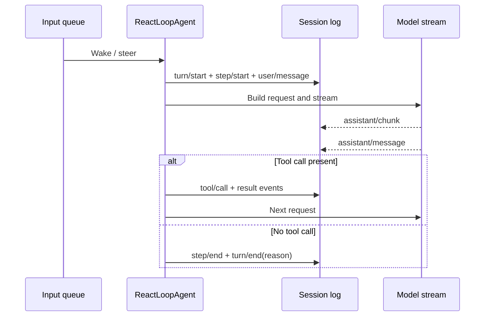

# C02 Run 生命周期证据：DeepSeek Harness

## 元数据

- 维度 ID：C02
- 维度名称：Run 生命周期
- 分析对象：DeepSeek Harness（dsh）
- 版本 / commit：`b150a551b8d465e31e418e1b2eaf5e79bbb7d28e`
- 访问日期：2026-08-22

## 结论摘要

DeepSeek Harness 用 `ReactLoopAgent` 驱动一个基于日志的生命周期：唤醒输入建立 running phase，回合边界写入 `turn/start`；每个 step 声明输入、组装上下文、流式请求，并把 `assistant/chunk` 与组装后的 `assistant/message` 追加到 Session。发现工具调用时按模型顺序调度执行并写回结果；turn 最终以 completed、blocked、aborted、error、max-tokens 或 interrupted 结束。

## 证据列表

| # | 声明 | 类型 | 文件路径 | 行号 | 说明 |
| --- | --- | --- | --- | --- | --- |
| E1 | 默认 Agent driver 从 Session log 派生每次请求，并管理 queued turns 与 step-boundary input。 | 已验证 | `packages/core/agent-loop/src/agent.ts` | L1-L8、L63-L97 | 模块与类定义。 |
| E2 | follow-up 进入 next-turn，steer/inject 进入 next-step；唤醒可启动或延迟驱动。 | 已验证 | `packages/core/agent-loop/src/agent.ts` | L113-L132、L164-L193 | Inbox target 与 wakeDriver。 |
| E3 | 每个 turn 先写 `turn/start`，随后逐个 step 写入边界事件和用户消息。 | 已验证 | `packages/core/agent-loop/src/agent.ts` | L245-L293 | turn() 主循环。 |
| E4 | step 流式接收 chunk 并逐块 append；完成后组装并 append assistant message。 | 已验证 | `packages/core/agent-loop/src/agent.ts` | L332-L418 | step() 实现。 |
| E5 | 组装后的 assistant message 写入 `assistant/message`；其中 tool-call 交给 `executeToolCalls`，结果决定是否继续。 | 已验证 | `packages/core/agent-loop/src/agent.ts` | L392-L418 | assistant message 写入点和分支条件。 |
| E6 | turn finally 写 `turn/end`；reason 可为 completed、blocked、aborted、error、max-tokens 或 interrupted。 | 已验证 | `packages/core/agent-loop/src/agent.ts`; `packages/core/session/src/types.ts` | L302-L323; L155-L177 | 类型定义与写入点一致。 |

## 流程图（可选）

来源 commit：`b150a55`。

## 开放问题

1. CLI boot 到 `AgentLoop` service 的完整装配链路仍需架构章节确认。
2. 工具调度器的并行约束与审批点属于 M-04 / M-06。

## 下一步

用同一套 turn/end reason 分析状态模型。
