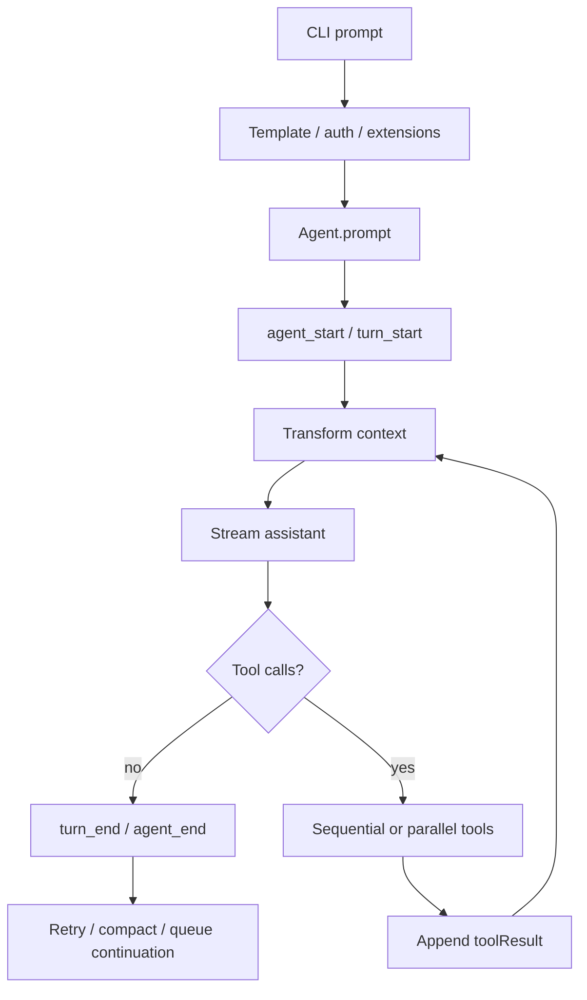

# C02 Run 生命周期证据：Pi

## 元数据

- 维度 ID：C02
- 维度名称：Run 生命周期
- 分析对象：Pi
- 版本 / commit：`c49906ec77788625aacbdc53ebca6fbe65bd20f5`
- 访问日期：2026-08-22

## 结论摘要

Pi 的 coding-agent CLI 将 prompt 预处理为消息数组后交给通用 `Agent.prompt`；通用 loop 发出 agent_start 和 turn_start，流式更新 assistant message，执行顺序或并行工具调用，然后发出 turn_end 和 agent_end。coding-agent 的 `AgentSession` 订阅这些事件，在 message_end 时把用户、助手和工具结果写入 `SessionManager`，并在运行结束后处理重试、压缩或队列续跑。

## 证据列表

| # | 声明 | 类型 | 文件路径 | 行号 | 说明 |
| --- | --- | --- | --- | --- | --- |
| E1 | CLI 主路径把参数转换成 `createAgentSession()` options，SDK 承担主要装配。 | 已验证 | `packages/coding-agent/src/main.ts`; `packages/coding-agent/src/core/sdk.ts` | L1-L6; L386-L404 | 入口注释与创建点。 |
| E2 | `AgentSession.prompt` 处理命令、模板、流式排队、模型鉴权和扩展预处理，再调用 `_runAgentPrompt`。 | 已验证 | `packages/coding-agent/src/core/agent-session.ts` | L1127-L1284 | 函数体与预处理分支。 |
| E3 | `_runAgentPrompt` 调用 `agent.prompt(messages)`，结束后按需 retry、compact 或 continue。 | 已验证 | `packages/coding-agent/src/core/agent-session.ts` | L1074-L1116 | post-run 决策循环。 |
| E4 | 通用 loop 新 prompt 时发出 agent_start、turn_start 和用户 message 事件。 | 已验证 | `packages/agent/src/agent-loop.ts` | L95-L118 | runAgentLoop。 |
| E5 | loop 应用 context transform，转换成 LLM 消息，流式更新 partial message 并发出 message_end。 | 已验证 | `packages/agent/src/agent-loop.ts` | L281-L372 | streamAssistantResponse。 |
| E6 | 有 tool-call 时选择 sequential 或 parallel execution；结果全部 terminate 时停止内层循环。 | 已验证 | `packages/agent/src/agent-loop.ts` | L202-L222、L408-L584 | 分支与批量终止规则。 |
| E7 | error 或 aborted 会发出 turn_end 和 agent_end；正常外层循环也会以 agent_end 收尾。 | 已验证 | `packages/agent/src/agent-loop.ts` | L196-L200、L262-L275 | 终止分支。 |
| E8 | `AgentSession` 在 message_end 时把 custom/user/assistant/toolResult 消息写入 SessionManager。 | 已验证 | `packages/coding-agent/src/core/agent-session.ts` | L650-L669 | persistence handler。 |
| E9 | 核心 `Agent.prompt` 归一化消息后进入 `runPromptMessages`。 | 已验证 | `packages/agent/src/agent.ts` | L347-L358 | prompt 重载与调用链。 |
| E10 | `runPromptMessages` 通过生命周期包装调用通用 `runAgentLoop`。 | 已验证 | `packages/agent/src/agent.ts` | L409-L423 | 上下文、配置、事件与信号组装。 |

## 流程图（可选）

来源 commit：`c49906e`。

## 开放问题

1. server 路径的 `AgentHarness` 生命周期与 CLI 主路径的差异需要在框架章节单独展开。
2. 自动重试的具体退避与副作用控制属于 M-08。

## 下一步

比较 Pi 的 SessionManager 条目与其他两家状态模型。
