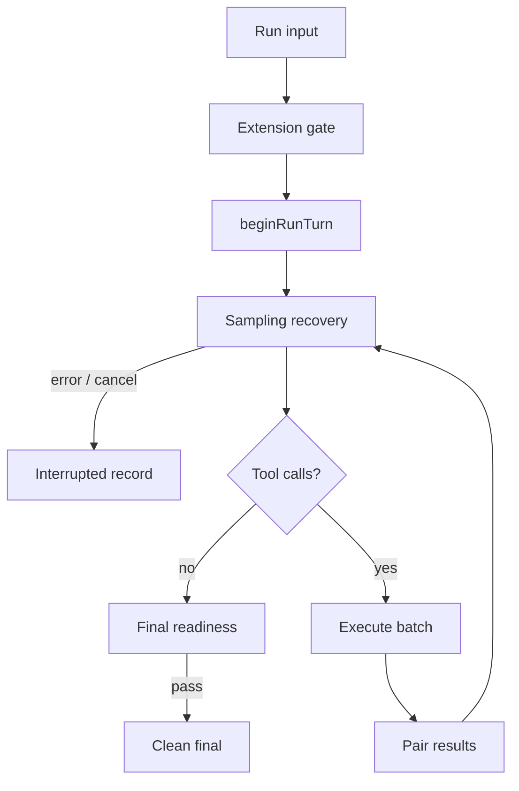

# C02 Run 生命周期证据：Reasonix

## 元数据

- 维度 ID：C02
- 维度名称：Run 生命周期
- 分析对象：Reasonix
- 版本 / commit：`aa82b2f94f3dbfccad544ac858c482533e00327f`
- 访问日期：2026-08-22

## 结论摘要

Reasonix 的 `Agent.Run(ctx, input)` 显式开启一次回合：先执行扩展拦截和回合状态重置，再追加用户消息并进入工具循环。每个循环轮次消费 steering 输入、冻结请求形状并流式采样；无工具调用时处理最终响应，有工具调用时执行批次、写入成对结果并继续循环。错误、预算上限和就绪检查会产生可恢复暂停或返回错误。

## 证据列表

| # | 声明 | 类型 | 文件路径 | 行号 | 说明 |
| --- | --- | --- | --- | --- | --- |
| E1 | `Run` 追加用户输入，驱动工具循环直到最终答案、取消或 Provider 错误。 | 已验证 | `internal/agent/agent.go`; `internal/agent/run_loop.go` | L1234-L1306; L243-L338 | 方法注释和调用链。 |
| E2 | 回合开始前执行扩展拦截。 | 已验证 | `internal/agent/agent.go` | L1282-L1290 | `interceptAgentStart` 可提前中止。 |
| E3 | `beginRunTurn` 重置每回合宿主状态、分类投递约束并追加用户消息。 | 已验证 | `internal/agent/run_loop.go` | L121-L240 | 注释、`a.turn = turnRuntime{}` 与 `conversation.Add`。 |
| E4 | 工具循环消费 steering、捕获 schema 前缀形状并启动采样恢复流程。 | 已验证 | `internal/agent/run_loop.go` | L245-L278 | 循环体直接展示顺序。 |
| E5 | 干净的采样尝试才提交 assistant 消息；失败尝试不写会话、不执行工具。 | 已验证 | `internal/agent/run_loop.go` | L301-L317; L340-L344 | 提交边界注释与恢复函数说明。 |
| E6 | 无工具时走 final response；空回答可重试，就绪不足可产生 `FinalReadinessError`，预算耗尽进入 grace pause。 | 已验证 | `internal/agent/run_loop.go` | L519-L609 | 分支与错误类型。 |
| E7 | 有工具时执行批次、保存稳定有界结果，并在取消后仍保存成对历史。 | 已验证 | `internal/agent/run_loop.go` | L612-L668 | `executeBatch`、消息保存与取消分支。 |
| E8 | `executeBatch` 的实现在独立文件中，负责批量执行工具调用。 | 已验证 | `internal/agent/execute_batch.go` | L88-L88 | 函数声明。 |

## 流程图（可选）

来源 commit：`aa82b2f`。

## 开放问题

1. `executeBatch` 内部的并发、审批和沙箱行为属于 M-04 及后续章节。
2. Controller 层 checkpoint 格式与恢复语义需要 M-10 展开。

## 下一步

将本维度结论映射到 C03 状态模型。
