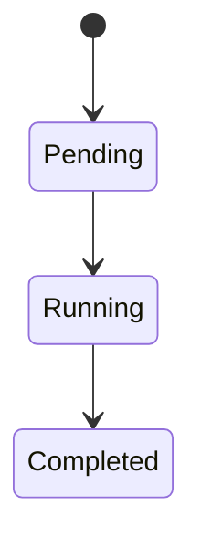

# C 证据索引模板

## 元数据

- 维度 ID：C__（替换为 C01-C25）
- 维度名称：
- 分析对象：Reasonix / DeepSeek Harness / Pi（选择其一或全部）
- 版本 / commit：（从对比账本目标清单复制）
- 访问日期：YYYY-MM-DD

## 结论摘要

用一到三句话总结本维度下该框架的行为。

## 证据列表

| # | 声明 | 类型 | 文件路径 | 行号 | 说明 |
| --- | --- | --- | --- | --- | --- |
| E1 | （该框架在此维度下做了什么） | 已验证 / 推断 / 未验证 | `path/to/file.ts` 或 `path/to/file.go` | L10-L25 | 关键函数名、类名或配置字段。 |
| E2 | ... | ... | ... | ... | ... |

## 流程图或状态图（可选）

如果本维度涉及流程或状态迁移，附 Mermaid 图并标注来源 commit。

````markdown

````

## 与其他框架的初步对比（可选）

| 框架 | 实现方式 | 关键差异 |
| --- | --- | --- |
| Reasonix | ... | ... |
| DeepSeek Harness | ... | ... |
| Pi | ... | ... |

## 开放问题

1. 需要更多源码阅读才能确认的行为。
2. 需要实验验证的假设。

## 下一步

下一个要分析的相关维度或框架。
