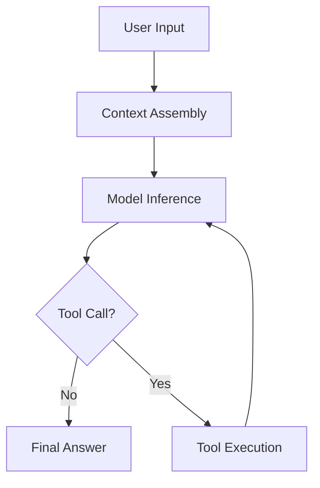

# 教材写作流水线

## 状态

- 版本：v0.3
- 日期：2026-08-23
- 适用范围：`tutorial/<locale>/` 下的公开教材

## 目标

每章都要同时做到三件事：

1. 内容翔实：把机制讲透，而不是只给结论摘要；读者应能沿着正文复现推理过程。
2. 深入浅出：先让初学者理解直觉和主线，再进入状态、失败分支、源码与工程取舍。
3. 条理清晰：用学习契约、分层标题、图、表格和证据链组织所有细节。

## 三阶段流程

### Draft

作者先完成内容骨架：

- 要回答的问题。
- 上一章遗留问题和本章驱动问题。
- 本章保护的核心不变量。
- 理想模型。
- 关键流程图或类图。
- 框架实现证据。
- 常见误解和坑。
- 每个关键概念的完整解释路径：定义、动机、正常流程、边界条件、失败后果。
- 面试追问。

Draft 阶段采用「问题清单展开法」：对每个机制至少追问并准备回答：

1. 它解决什么矛盾？没有它会发生什么？
2. 正常路径中数据如何流动？谁在什么时候读写字段？
3. 有哪些输入形态、配置组合和环境差异？
4. 失败时哪些状态会损坏？错误如何暴露给模型、用户和维护者？
5. 为什么常见实现会出错？
6. 三家框架分别用什么结构解决这个矛盾？
7. 这个设计在什么条件下变差？

这些问题不要求全部出现在正文，但缺失的问题必须能解释原因：要么属于后续章节，要么与本章无关。不允许因为「篇幅长」而跳过关键分支。

Draft 允许粗糙，但事实声明必须标注 `已验证`、`推断` 或 `未验证`。

### Polish 阶段

主 Agent 在 Polish 阶段负责语言和可读性，不新增事实。

#### 输入

- Draft Markdown。
- 本章目标读者和前置知识。
- 术语表。
- 既有图和代码证据。

加载项目级 Skill：`docs/skills/tutorial-tech-writing/SKILL.md`。它是出版级润色的统一入口；下面的规则是最低标准，两者冲突时以更严格的约束为准。

#### 任务

1. 为每节写一句明确的「这节解决什么问题」，但不把整节压成摘要。
2. 删除装饰、重复和空泛过渡；保留解释动机、边界、失败后果的句子。
3. 长段落按主题分段；连续叙述优先于强行列表化，步骤和对照才用列表或表格。
4. 保证初学者能按顺序读懂，并在抽象处获得例子或类比。
5. 保证有经验程序员能快速找到实现细节，并获得足够的上下文而不是孤立的结论。
6. 统一术语和代码标识。
7. 检查图、标题、列表和代码块顺序是否自然。
8. 检查开头是否回答上一章遗留的问题，结尾是否留下下一章要解决的问题。
9. 检查反例、故障模式、因果链、源码证据和代码片段是否满足质量门禁。
10. 对每个抽象概念执行「三层解释」：先用一句话给直觉，再用正常流程说明机制，最后用失败或反例说明约束为什么存在。

#### 输出接口

```yaml
polish:
  agent: main-agent
  date: YYYY-MM-DD
  verdict: pass | needs-changes
  summary: 一句话说明改了什么。
  readability_checks:
    beginner_clarity: pass
    expert_depth: pass
    conciseness: pass
    completeness: pass
    approachability: pass
    terminology: pass
    structure: pass
    progression: pass
    depth_contract: pass
```

#### 验收标准

进入 Polish 前，章节必须满足深度与递进门禁：

1. 开头明确承接上一章遗留问题，说明本章为什么现在出现。
2. 至少声明一个本章要保护的核心不变量。
3. 至少写出 3 个明确反例或故障模式。
4. 至少写出一条完整因果链；因果链必须覆盖触发条件、内部状态变化和可观察结果。
5. 不允许只写「框架支持某能力」；必须说明数据如何流动、状态由谁持有、失败走哪条分支。
6. 框架行为绑定固定 commit 和尽量精确的 `path:line`。
7. 关键框架行为至少有一个注释化源码片段或等价伪代码。
8. 结尾把本章无法解决的矛盾交给下一章。

Polish 通过还要求：

- 初学者不需要外部上下文也能理解主线，并且知道下一步该读哪里。
- 有经验程序员能找到源码入口和工程取舍，也能看到这些取舍背后的失败场景。
- 关键机制不是只给一句结论，而是完整覆盖动机、流程、边界、失败和恢复。
- 没有连续三句以上表达同一个意思。
- 每个抽象概念都有例子、图或代码锚点。
- 深入浅出指表达方式，不是删减内容；不允许为了显得专业而牺牲清晰度，也不允许为了简短牺牲完整性。
- 长度只服从信息必要性：不设行数上限，也不为了压缩删除状态分支、失败路径、源码证据和工程取舍。

#### 中文写作标准

以下规则适用于所有公开教材的润色阶段：

1. **短句服务节奏，不为压缩而压缩。** 一句话只表达一个意思；复杂因果可以拆成多句逐步推进，但不能删掉中间环节。
2. **用主动语态。** 写「Harness 组装上下文」，不写「上下文被 Harness 所组装」。
3. **用具体名词。** 写「工具调用请求」，不写「工具调用意图」。写「返回错误信息」，不写「暴露错误信号」。但描述模型提议时，「意图」是准确的技术词，应保留。
4. **避免翻译腔。** 不写「看它的决策输入与输出」，改写为「它接收目标和历史记录，输出下一步动作」。
5. **术语首次出现给英文原文，后续只用中文名。** 例如首次写「线束（Harness）」，后续只写「线束」。不要反复混用「Agent」和「智能体」。
6. **类比贴近日常经验。** 不要用工程隐喻解释另一个工程概念。类比必须说明失效边界，然后立刻回到精确机制。
7. **深入浅出的顺序是「直觉 → 精确 → 边界」。** 先让读者愿意继续读，再把模糊说法替换成字段、状态和调用链。
8. **段落承担解释，列表承担枚举。** 因果关系、设计动机和失败分析优先用连贯段落；并列项、检查项和矩阵才用列表或表格。

### Implementation Review 阶段

主 Agent 在 Implementation Review 阶段负责事实和偏差，不负责文风。

#### 输入

- Polish 后的 Markdown。
- 相关框架仓库、版本和 commit。
- 源码路径、文档、实验输出或运行结果。

#### 任务

1. 核对每条框架行为描述是否有源码或实验证据。
2. 核对文件路径、符号名、配置名、命令和版本。
3. 核对图中的状态、分支和调用顺序是否与实现一致。
4. 区分理想设计、协议约定、默认行为和可选配置。
5. 找出过度概括、把示例当保证、把旧版本当当前版本的问题。
6. 标记必须改成 `未验证` 或需要实验的声明。
7. 核对深度与递进门禁：上一章问题、核心不变量、反例数量、因果链、失败分支和下一章交接是否成立。
8. 如果一节同时覆盖理论和三家框架源码对照，确认是否应该将框架对照拆为独立小节或折叠块。

#### 输出接口

```yaml
implementation_review:
  agent: main-agent
  date: YYYY-MM-DD
  verdict: pass | needs-changes
  evidence_version: 仓库或实验版本
  summary: 一句话说明核对范围和结论。
  findings:
    - claim: 被检查的句子或图。
      status: verified | corrected | unverified
      evidence: 文件路径、行号、命令或实验结果。
      correction: 如有偏差，写出正确表述。
```

#### 验收标准

- 没有一条框架行为描述缺少证据。
- 图与代码路径、状态和顺序一致。
- 理想模型与真实实现明确分离。
- 未验证内容不会伪装成结论。
- 内容长度不设固定上限；只按读者路径分层，并删除无信息量的重复。
- 理论和框架源码对照不同时塞在同一节中；如果必须共存则明确标注「进阶选读」。

## Front Matter 接口

公开章节在原有字段外追加：

```yaml
review:
  polish:
    agent: polish-agent
    date: YYYY-MM-DD
    verdict: pass
    summary: 已压缩冗余并统一双读者结构。
  implementation:
    agent: implementation-review-agent
    date: YYYY-MM-DD
    verdict: pass
    evidence_version: 本地快照 commit
    summary: 已核对理论模型与源码入口。
```

Draft 阶段可以先写：

```yaml
review:
  polish:
    agent: pending
  implementation:
    agent: pending
```

只有两个字段都为 `pass`，`content_status` 才能改成 `published`。

## 双读者结构

每章推荐顺序：

1. **上一章遗留问题**：说明为什么现在讲这个主题。
2. **本章解决什么矛盾**：用一句话给出结论。
3. **核心不变量**：列出正常和失败时都不能破坏的约束。
4. **理想模型图**：不绑定框架的流程图、类图或状态图。
5. **初学者主线**：用最少概念讲清直觉和正常路径。
6. **机制深拆**：完整展开输入、状态、所有权、边界条件、失败和恢复。
7. **反例与故障模式**：展示常见做法为什么出错。
8. **实现视角**：代码入口、数据结构、协议和工程取舍。
9. **框架对照**：Reasonix、DeepSeek Harness、Pi 分别怎么做。
10. **实现精妙之处**：解释设计收益及其成立条件。
11. **自检与面试追问**：检查是否真正理解。
12. **交给下一章的问题**：维持课程递进关系。

初学者可以重点读 1-5 和 7；有经验程序员应重点读 3-12。章节可以合并相邻标题，但不能省略学习契约要求的实质内容。

## 配图标准

### 必须配图的情况

1. 有三个以上阶段或组件的流程。
2. 状态会迁移。
3. 多个角色或模块交互。
4. 理想设计和框架实现有差异。
5. 类、协议或数据结构之间有稳定关系。

### 图类型

| 图类型 | 用途 |
| --- | --- |
| Flowchart | Run Loop、请求处理、工具执行。 |
| State diagram | Run、Tool Call、Approval 的状态迁移。 |
| Sequence diagram | 用户、Harness、模型、工具、存储之间的时序。 |
| Class diagram | Session、Event、Tool、Result 的结构关系。 |

### Mermaid 规则

1. 使用 fenced code block，语言标记为 `mermaid`。
2. 每张图只表达一个主题。
3. 图中节点数量控制在可读范围内。
4. 图必须有标题或上下文说明。
5. 理想模型图不使用具体框架专有类名。
6. 框架实现图必须标注仓库、版本或 commit。

示例：

````markdown

````

## 理想设计 vs 框架实现

理论章节先写理想模型，再写真实实现：

```markdown
## 理想模型

描述不绑定框架的职责、状态和约束。

## 框架实现

| 框架 | 实现方式 | 证据 | 状态 |
| --- | --- | --- | --- |
| Reasonix | ... | path:line @ commit | 已验证 |
```

禁止把理想模型直接写成某家框架的事实。

## 部署检查阶段

每次提交推送后，由主 Agent 负责验证线上站点是否正确更新。

### 职责

1. 检查 GitHub Actions 最新 run 是否 `completed` 且 `conclusion == success`。
2. 检查根路径 HTTP 200。
3. 检查新增或修改的页面路由 HTTP 200。
4. 检查页面 HTML 中包含预期的标题、Mermaid `<div>` 或关键内容片段。
5. 如果部署失败，记录 Actions URL、失败步骤、日志摘要和下一步修复建议。

### 输出接口

```yaml
deploy_check:
  agent: main-agent
  date: YYYY-MM-DD
  commit: git SHA
  workflow_status: success | failure | in_progress
  checks:
    - path: /
      status: 200
    - path: /zh-CN/00-overview/
      status: 200
      contains: "Agent Harness 学习指南"
  verdict: pass | fail
  notes: 可选补充说明。
```

### 验收标准

- 所有检查路径返回 HTTP 200。
- 页面内容包含本次变更的关键标记（标题、图表或文本片段）。
- 如果失败，必须在会话记录中写明根因和修复动作，不允许静默忽略。

## 单执行者模式

Goal 模式只使用主 Agent 一个执行者。不得创建 Subagent 或并行子任务；Draft、Polish、Implementation Review、部署检查和进度同步都由主 Agent 按顺序完成。这样消除模型调用链差异，也让失败点可定位。

每小节的执行流程：

```text
作者（主 Agent）撰写 Draft
→ 主 Agent 执行 Polish 阶段
→ 主 Agent 做轻量自检：事实标记、源码锚点、链接、图和格式
→ 主 Agent 提交并推送（最小改动）
→ 推送后主 Agent 验证构建、推送和页面可达
→ 主 Agent 更新进度表和会话记录
→ 进入下一小节
```

在「批量草稿模式」下，Implementation Review 不逐节执行。每节必须保留 `review.implementation.verdict: pending`，并把待核对的源码锚点、命令或实验写入 `pending_review` 清单。全部章节完成初稿后，主 Agent 先按清单执行完整事实审查，再允许任何章节改成 `published`。这个模式只降低节奏，不降低发布门槛。

阶段边界仍然分离：Polish 只处理语言清晰度、结构和术语；Implementation Review 只处理源码证据、版本和行为一致性；部署检查只验证构建成功、URL 可达和内容上线。

## 框架深拆标准

Reasonix、DeepSeek Harness 和 Pi 的框架章节面向有经验工程师，必须超过概念对照的深度。

### 必备结构

1. **定位与部署形态**：说明进程边界、入口、用户界面和适用场景。
2. **架构分层**：用 Mermaid 画出模块关系，标注每个模块的职责和数据流。
3. **核心类型**：列出 Run、Turn、Message、Event、Tool、Session 等关键结构，解释字段为什么存在。
4. **调用链**：从 CLI、服务或客户端入口追踪到模型请求、工具执行和事件发布，写出文件路径与符号名。
5. **状态与持久化**：说明谁拥有状态、何时写入、如何恢复，以及事务或一致性边界。
6. **工具链路**：覆盖 Schema、校验、审批、执行、结果规范化、失败和取消。
7. **扩展点**：列出模型、工具、Hook、传输、存储和策略的替换位置。
8. **设计取舍**：解释该实现为什么这样选，代价是什么。
9. **可迁移模式**：提炼读者自己实现 Harness 时可以复用的规则。

### 技术解释要求

1. 每条框架行为绑定 `path/to/file.ts:line` 和快照 commit。
2. 不只写「它支持某能力」，要说明数据如何流动、状态由谁持有、失败时走哪条分支。
3. 对关键分支给出伪代码或精简源码片段，片段必须标注文件位置。
4. 理想模型、协议约定、默认行为和可选配置分开表述。
5. 每章至少两张图：架构图加 Run、工具或状态时序图。
6. 每章至少一个「如果自己实现，容易踩的坑」清单。
7. 每个精妙设计必须说明收益、代价、替代方案和成立条件。

### 深度与可读性

翔实是默认目标，简洁是表达手段。初学者主线要容易跟读，但不用行数衡量深度。实现细节、调用链、数据结构和源码片段放在「进阶选读」。每个抽象概念必须有具体例子；每个设计取舍必须说明收益、代价和替代方案。内容只在重复、装饰或脱离本章问题时删减，不在状态迁移、失败分支和证据链上压缩。
