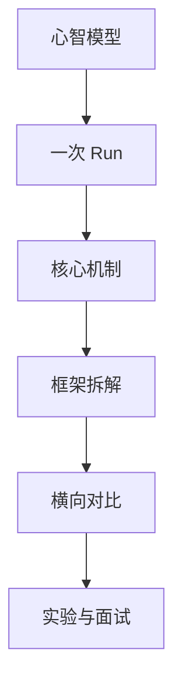

# Agent Harness 学习指南

本教程面向想理解 Agent Harness 内部机制的工程师。它不把 Agent 当作黑盒，而是拆开看一次任务如何从用户输入变成模型请求、工具调用、审批、持久化、流式输出和最终结果。

## 学习路线

## 章节导航

- [教材目录](./TOC.md) — 全部章节的路径、依赖和状态。
- [术语表](./09-glossary/glossary.md) — 中英对照术语定义。

1. **建立心智模型**：区分模型、Agent、Harness、Runtime、工具、应用和基础设施。
2. **理解一次 Run**：从输入、上下文组装、工具执行、事件流到恢复与结束。
3. **拆解主流实现**：用同一套维度分析 Reasonix、DeepSeek Harness 和 Pi。
4. **横向对比机制**：比较上下文策略、工具协议、审批、沙箱、并发、持久化和可观测性。
5. **做实验**：用最小案例复现上下文膨胀、重试副作用、取消恢复和审批失败等问题。
6. **准备面试**：把机制理解转化为架构设计、故障排查和系统设计能力。

## 你会学到什么

- Agent Harness 到底负责什么，哪些职责不属于模型。
- 一次 Agent Run 的状态如何迁移，哪些状态必须持久化。
- 工具如何声明、校验、调用、返回结果，副作用如何控制。
- 上下文为什么会膨胀，如何裁剪、压缩和保留关键证据。
- 流式事件、审批请求、取消和恢复如何组合成可靠交互。
- 多 Agent、子任务和工作区隔离的常见设计模式。

## 当前状态

教程正在从源码分析和工程实验中逐步整理。第一版会优先发布简体中文内容；英文版通过语言目录预留，不阻塞中文更新。
