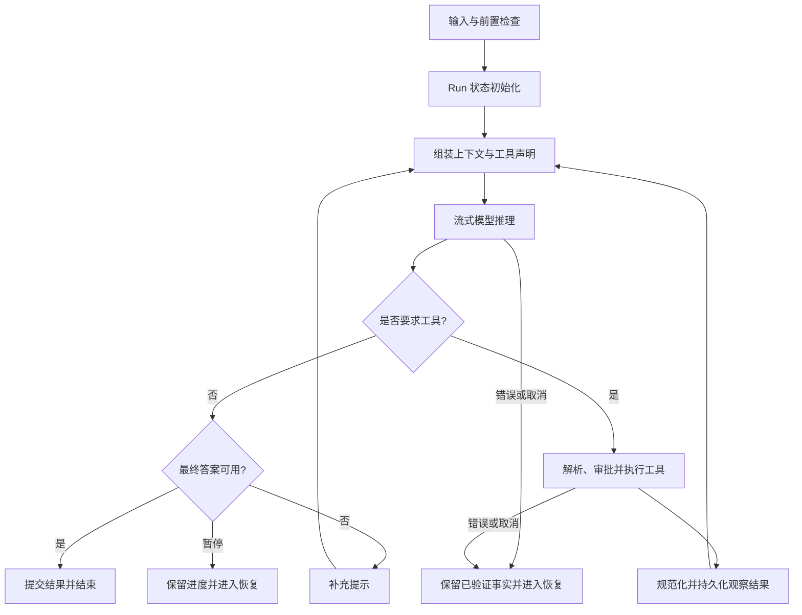
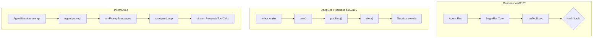

# 一次 Agent Run 的完整生命周期

## 一句话结论

一次 Run 不是“调一次模型”，而是一个受控循环。它先准备输入和约束，再组装上下文并流式生成候选动作。没有工具调用时，系统校验并交付最终答案；有工具调用时，系统执行工具、记录观察结果，再回到模型，直到完成、暂停、取消或出错。

## 理想模型

理想生命周期有六类职责：

1. **准备**：校验用户输入、凭据、目标约束和扩展钩子。
2. **初始化**：建立 Run 编号、预算、权限、追踪范围和可恢复事实。
3. **请求**：把系统提示（system prompt）、历史、文件、工具声明（Tool Schema）和新输入组织成模型请求。
4. **推理**：流式接收文本、推理内容和工具调用意图。
5. **分支**：无工具则走向最终答案；有工具则校验、审批、执行并回填结果。
6. **收束**：区分成功、业务未就绪、预算暂停、用户取消、系统错误和输出截断，并决定能否继续。

## 小白解释

把 Run 想成一次带助手的任务交接。你给出任务后，助手先确认能做，再带上资料和工具清单开始工作。

它可能先查文件、改代码或跑测试；每一步都要把结果记回任务板。只有当它认为可以交付时才停下来。

中途没电、被打断、超过预算或缺少关键信息时，任务板必须告诉你已经完成了什么、下一步从哪里继续。

关键区别是：

- **一次请求**只是一问一答。
- **一次 Run**包含多轮模型请求、工具观察和状态更新；具体框架可能把一次 Run 称作一个 turn，也可能在一个 turn 下继续分 step。
- **一个 Session**可以包含多次 Run，用于跨交互保留历史。

## 机制拆解

### 输入与 Run 初始化

线束先判断这次输入是新任务、中途引导（steering）还是后续任务（follow-up）。随后建立回合边界和本轮状态：目标、预算、权限、追踪 ID、扩展上下文和已有恢复信息。

### 模型请求与流式推理

模型请求通常包括系统提示、对话历史、项目上下文、工具声明和新的用户消息。流式阶段不能只更新界面：部分输出和工具参数要累积成完整助手消息（assistant message），使用量和停止原因（stop reason）也要归因到当前回合。

### 工具分支

模型输出的工具调用只是意图。理想线束必须解析参数、检查工具是否存在、校验工具声明、应用权限和隔离策略，再执行副作用。成功与失败都要形成稳定的工具结果；结果过大、畸形或危险时，应返回模型可理解且系统可审计的错误。

三家实现都会做其中一部分，但检查点不同：Pi 在通用循环中查找工具、校验参数并允许宿主钩子阻断；DeepSeek Harness 的注册层处理解析、未知工具和前置策略，具体工具执行时校验声明；Reasonix 在智能体层处理未知工具和门控，具体工具再解析参数并检查写路径。统一沙箱策略是 M-07 的主题，本章不断言三家等价。

### 终止原因

| 结果 | 判断信号 | 典型处理 |
| --- | --- | --- |
| 成功完成 | 无未决工具调用，最终答案通过校验。 | 提交输出、结算用量、释放资源。 |
| 业务未就绪 | 理想模型要求目标缺少验收、审查、签名或动作证据时暂停；本节快照中已在 Reasonix 的最终就绪检查中验证。 | 返回缺失项，允许补证后续跑。 |
| 预算暂停 | 理想模型在达到步数、token、时间或费用限制时暂停；本节快照中已在 Reasonix 的步数与任务预算中验证。 | 保存摘要和进度，等待用户继续。 |
| 用户取消 | Abort signal 触发。 | 保留已成对的历史，停止未授权副作用。 |
| 系统错误 | 网络、模型服务（Provider）、解析或存储失败。 | 区分可重试与不可重试，避免重复副作用。 |
| 输出截断 | 停止原因为长度上限。 | 不执行可疑截断参数，要求重发完整调用。 |

### 恢复主线

恢复不等于从头再来。理想做法是把“已完成工作”和“未完成意图”分开：用户消息、助手尝试、成对工具结果、审批决策和检查点先持久化；失败后按幂等性决定重试、跳过、回滚或请示。本章只验证了其中一部分：Pi 在消息结束时写会话条目，DeepSeek Harness 用追加式会话日志记录边界与结果，Reasonix 保留成对工具历史和恢复记录。审批决策与检查点的完整持久化协议留待 M-06 和 M-10。

## 实现视角

三个固定快照显示同一条理想主线会被不同包边界吸收。

### Reasonix

- **主链路**：运行入口 `Agent.Run` → 扩展拦截（extension gate）→ 初始化 `beginRunTurn` → 工具循环 `runToolLoop` → 采样恢复（sampling recovery）→ 最终响应或工具轮。
- **特点**：Run 状态 `turnRuntime` 每次重置；干净采样尝试才提交助手消息；工具结果保持稳定有界形式；取消后仍保存成对工具历史。
- **证据**：`internal/agent/agent.go:1239`、`internal/agent/run_loop.go:125`、`internal/agent/run_loop.go:245`、`internal/agent/run_loop.go:340`、`internal/agent/run_loop.go:519`、`internal/agent/run_loop.go:616`；commit `aa82b2f`。

### DeepSeek Harness

- **主链路**：收件箱唤醒（inbox wake）→ 驱动器 `ReactLoopAgent.kick` → 回合 `turn` → 步前处理 `preStep` → 步执行 `step` → 模型流 → 可选工具执行 `executeToolCalls` → `turn/end`。
- **特点**：`turn/start`、`step/start`、`user/message`、`assistant/chunk`、`assistant/message`、`tool/call`、`step/end` 和 `turn/end` 都写入 Session 日志；后续任务与中途引导分别落在 `next-turn` 和 `next-step` 队列。
- **证据**：`packages/core/agent-loop/src/agent.ts:113`、`:172`、`:210`、`:246`、`:332`、`:400`、`:414`；`packages/core/session/src/types.ts:155`；commit `b150a55`。

### Pi

- **CLI 主链路**：宿主入口 `AgentSession.prompt` → 模板扩展、鉴权、扩展预处理 → 核心 `Agent.prompt` → 消息运行 `runPromptMessages` → 生命周期包装 `runWithLifecycle` → 循环 `runAgentLoop` → 流式推理与工具执行 → `turn_end` / `agent_end` → 重试、压缩或续跑。
- **特点**：通用 agent 包负责循环；coding-agent 包负责编码工具、会话管理和扩展。`message_end` 时把 custom、user、assistant 和 toolResult 消息交给 `SessionManager`。
- **证据**：`packages/coding-agent/src/core/agent-session.ts:1074`、`:1127`、`:621`；`packages/agent/src/agent.ts:350`、`:409`；`packages/agent/src/agent-loop.ts:95`、`:155`、`:281`、`:411`；commit `c49906e`。

图中只画进入核心循环的主链路，不含完整终止与恢复分支。Reasonix 把 Run 治理集中在 Go 结构体内；DeepSeek Harness 让日志事件成为生命周期骨架；Pi 用通用循环加宿主事件订阅分离核心与编码场景。

## 常见坑

- **只看最终回复，不看中间事实。** 工具调用、审批和失败结果同样是 Run 的产物；丢失它们会让调试和恢复失真。
- **把流式界面当成状态源。** 页面刷新后消失的部分输出不能替代持久化的助手消息。
- **执行截断的工具参数。** 输出达到 token 上限时，看似合法的 JSON 可能不完整；应拒绝执行并让模型重发。
- **取消后丢弃所有历史。** 用户取消不代表前面的读取或已提交副作用不存在；应保留成对记录并标记中断。
- **混淆错误重试和任务重启。** 无副作用的请求可重试；已写文件或外部操作必须先考虑幂等、补偿或审批。

## 自检与面试追问

1. 这次输入为什么开启了新 Run，而不是并入上一个 Run？
2. 哪些事实必须在模型响应前持久化？哪些只需在干净尝试后才提交？
3. 工具调用被拒绝时，模型收到什么、用户看到什么、日志记录什么？
4. 如果 Run 在第三次工具调用后崩溃，系统能否证明前两次已经完成？
5. 同一个“停止”是成功、预算暂停、用户取消还是不可重试错误？

## 相关页面

- [上一节：Agent、Harness 与 Runtime 的边界](./agent-vs-harness.md)
- [教材目录](../TOC.md)
- [术语表](../../zh-CN/09-glossary/glossary.md)
