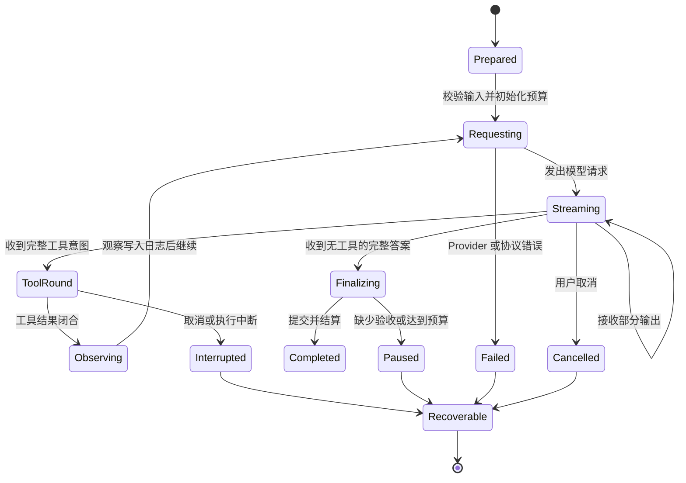
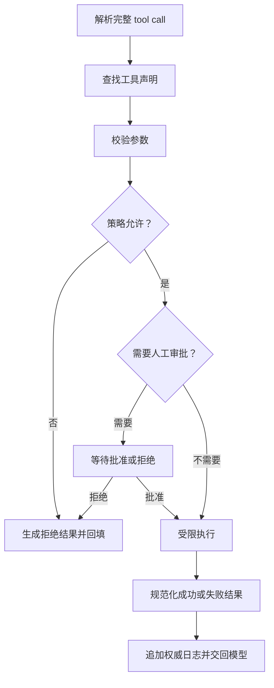

## 上一章遗留问题

上一章把决策权交给 Agent，把控制权交给 Harness。留下的问题是：一次任务从哪里开始？什么时候可以暂停、恢复或终止？如果模型正在流式输出、工具正在执行，系统此刻处于什么状态？

「调用模型」本身回答不了这些问题。一次请求可能成功返回文本，也可能中途断开；一个工具可能已经改了文件，但结果还没回到模型。Run 就是为这些不确定时刻建立边界的机制。

## 本章解决什么矛盾

核心矛盾是「连续的执行过程」与「离散的可审计事实」之间不能直接画等号。

- 用户希望看到流式输出、进度提示和中间观察。
- 系统却必须决定哪些内容已经足够可信，可以作为权威状态保存。
- 模型和工具随时可能失败或被取消，但已经发生的外部副作用不会随之消失。

因此，Run 的本质不是「多调几次模型」，而是一个带状态机的受控循环：准备输入，组装上下文，流式推理，分支到最终答案或工具执行，把闭合事实写入权威日志，再决定继续、暂停或终止。

## 核心不变量

本章建立两条不变量：

1. **部分输出不得提前变成权威事实。** 流式 chunk 可以更新界面；只有完整消息通过校验并提交后，才能进入模型历史和持久日志。
2. **取消后已发生副作用仍必须可追溯。** 用户停止的是后续动作，不是已经发生的读写。成对记录、审批事件和部分结果都不能被丢弃。

下一章讲 Session 时会依赖第一条：权威日志为什么不能混入未完成投影。M-10 讲 Checkpoint 时会依赖第二条：为什么只有闭合事实能进入恢复点。

## 理想模型



图中每个迁移都要回答三个问题：谁触发迁移？迁移前哪些字段有效？迁移后哪些事实必须落盘？如果一张生命周期图没有回答这些问题，它通常只是流程装饰。

## 初学者主线

可以把 Run 想象成一次有任务板的委托：

1. 你把目标交给助手，助手先确认目标和限制。
2. 助手带上资料和工具清单开始工作，可能一边阅读一边草拟方案。
3. 草稿是给人看的；只有定稿才贴上任务板。
4. 如果需要查资料、改文件或跑测试，助手提出申请，管理员批准后执行，并把结果记回任务板。
5. 任务完成、被叫停、缺少材料或超过预算时，任务板都要说明已完成什么、什么还没做、下一步从哪里继续。

三个词的边界也在这里：

- **一次请求**是发给模型的单个 HTTP 调用。
- **一次 Run**是从接受输入到进入终态的受控循环，可能包含多次请求和多轮工具。
- **一个 Session**跨越多次 Run，保留跨任务的历史和身份。

不同框架的用词不完全一致：有的把一次交互叫 turn，有的在 turn 下再分 step。读源码时不要被名字迷惑，要看谁维护计数器、谁写开始 / 结束事件。

## 机制深拆

### 准备阶段

Harness 先判断输入的类型：新任务、当前 Run 内的中途引导（steering），还是当前任务结束后的 follow-up。这个判断必须在进入循环前完成，因为它决定新输入加入哪条队列、开启哪个回合边界。

准备阶段至少要确定：

1. 目标和约束是否可解析；
2. 模型凭据和路由是否可用；
3. 本次允许使用哪些工具；
4. 步数、token、时间或费用预算是多少；
5. 是否存在可恢复的前置状态。

这些信息有些属于 Run，有些属于 Session。混淆归属会让恢复时无法判断哪些配置应该延续，哪些只对本次运行生效。

### 请求与流式推理

模型请求通常由五类内容组成：系统提示、对话历史、项目上下文、工具声明和新输入。流式阶段接收 text chunk、推理内容和工具参数片段。

关键规则是把三种东西分开处理：

| 内容 | 流式期间可以做什么 | 何时成为权威事实 |
| --- | --- | --- |
| 文本增量 | 更新界面草稿。 | 完整 assistant message 通过校验后提交。 |
| 使用量和停止原因 | 暂时累计。 | 与完整消息一起归因到当前 turn。 |
| 工具调用参数 | 只累积，不执行。 | JSON 完整且 Schema 校验通过后才进入审批。 |

如果界面直接把 chunk 当作最终消息，刷新后就可能消失；如果截断的工具参数被执行，看似合法的 JSON 可能已经缺尾。

### 工具分支

模型给出完整工具意图后，Harness 至少要做六件事：



成功结果和失败结果都必须闭合。所谓闭合，是指模型可见的 `tool result` 与权威日志中的记录指向同一次调用，并且包含稳定的错误分类。大结果可以先截断，但必须说明截断发生；危险操作被拒绝时，拒绝原因也要成为模型可见观察。

### 终止原因

「结束」不是一个状态，而是一族语义不同的终态：

| 结果 | 判断信号 | 正确处理 | 常见错误 |
| --- | --- | --- | --- |
| 成功完成 | 无未决工具，最终答案通过校验。 | 提交输出，结算用量，释放资源。 | 把 UI 停止渲染当成业务成功。 |
| 业务未就绪 | 目标缺少验收、审查或必要证据。 | 保留已完成工作，列出缺失项。 | 直接标记失败，丢失可续跑上下文。 |
| 预算暂停 | 达到步数、token、时间或费用限制。 | 进入暂停态，记录剩余目标。 | 静默截断任务，让用户误以为完成。 |
| 用户取消 | Abort signal 或用户命令。 | 停止新副作用，保留已发生记录。 | 删除全部现场，导致无法审计。 |
| 系统错误 | Provider、协议或内部异常。 | 分类可重试与不可重试，保留现场。 | 所有异常都自动重启。 |
| 输出截断 | 停止原因为长度上限。 | 拒绝可疑截断参数，要求重发。 | 执行半截 JSON。 |

### 失败与恢复主线

失败后的第一件事不是重试，而是区分三类事实：

1. **已闭合事实**：完整消息、成对工具结果、审批决定。它们可以直接复用。
2. **未闭合投影**：流式 chunk、正在拼装的参数。它们应丢弃或重新收集。
3. **已发生但未确认的副作用**：文件已写入、进程已启动、外部 API 可能已收到请求。必须查询、补偿或显式请示。

恢复不等于从头再来，也不等于盲目重放最后一条消息。本章只确立原则；具体检查点格式、租约和环境指纹由 M-10 和 M-11 展开。

### 反例与故障模式

**反例 1：把流式界面当状态源。**

前端不断显示生成的代码，用户以为内容已保存。页面刷新或连接断开后文字消失。原因是 chunk 只更新了内存投影，从未形成 `message_end` 后的持久条目。

**反例 2：执行长度截断的工具参数。**

模型响应到达 token 上限，工具参数的最后一个引号缺失。程序没有检查 `max-tokens`，直接 `JSON.parse` 后竟然解析出一段近似对象，于是删除了错误目录。正确做法是：只要停止原因表明截断，就不进入执行路径。

**反例 3：把取消当成撤销。**

用户在第三次写入后点「停止」。Harness 清空界面和内存状态，却没有保留前两次写入的成对记录。之后审计无法回答「到底改过哪些文件」。取消只阻止第 4 次，不否定前三次。

**反例 4：所有错误都自动重启。**

Provider 返回 429 时重试合理；工具返回「权限不足」时重启只会重复撞墙。更糟的是外部下单接口超时：客户端没收到响应不代表服务端没创建订单。无差别重启会把一次任务变成两笔订单。

**反例 5：把 turn 计数当业务进度。**

系统显示「turn 12 / 20」，看起来接近完成。实际上模型在前十轮反复读取同一个文件。turn 是调度边界，不是目标完成度。进度必须来自目标、验收标准和闭合副作用，而不是循环次数。

### 一条完整因果链

以「工具执行中用户取消」为例：

1. **触发条件**：第二个工具正在写文件时，用户点击停止，Abort signal 触发。
2. **控制面行为**：不再启动第三个工具；正在执行的调用按其取消语义结束。
3. **状态变化**：第一个工具结果已闭合并落盘；第二个工具若已产生部分写入，则记录为未确认副作用。
4. **可观察结果**：UI 显示「已停止」；日志保留完整调用序列、取消原因和两个工具的不同结局。
5. **后续影响**：恢复流程可以先对账第二个工具，再决定继续、回滚或请示，而不是假装第二次调用不存在。

如果把取消实现成「清空数组、关闭窗口」，第 3 到第 5 步全部失真：模型下次看到的历史缺一段，用户以为没有改动，审计也找不到中断点。

## 设计取舍

| 方案 | 收益 | 代价 | 适用条件 |
| --- | --- | --- | --- |
| 显式状态机 + 权威日志 | 可恢复、可审计、可测试 | 需要设计 schema 和迁移策略 | 会产生副作用或多步长任务 |
| 单函数 while 循环 | 实现快，容易理解 | 中断后没有可靠起点 | 只读原型或一次性脚本 |
| 全部事件实时入库 | 最大程度保留细节 | 写入放大，敏感数据治理复杂 | 强审计或调试环境 |
| 只保存最终结果 | 存储省 | 无法解释过程，也无法安全恢复 | 低价值一次性问答 |

如果你从零实现，建议按这个顺序推进：

1. 先定义 Run 开始 / 结束事件和一个单调递增标识。
2. 再保证 assistant message 和 tool result 成对提交。
3. 然后接入取消信号，并规定取消后哪些记录保留。
4. 最后扩展预算暂停、业务未就绪和恢复检查。

每一步都让一种原本说不清的时刻变得可解释。

## 框架实现对照

三家用不同包结构吸收同一条主线：Reasonix 把治理集中在 Go Agent 内部；DeepSeek Harness 用持久 Session 事件作为骨架；Pi 用通用循环加宿主装配分离核心与 Coding 场景。

### Reasonix

`Agent.Run` 是入口。它会递增 run 序号，获取工作区租约，注册后台证据和交付检查点的 defer，然后调用 `beginRunTurn`（`internal/agent/agent.go:1239-1305 @ aa82b2f`）。

```go
// internal/agent/run_loop.go:125 @ aa82b2f
func (a *Agent) beginRunTurn(ctx context.Context, input string) (rawInput string, state *turnRuntime) {
        // A fresh user turn starts from zeroed per-turn host state.
        a.turn = turnRuntime{}
}
```

注释明确区分两层状态：`turnRuntime` 每个 user turn 重置；checkpoint、scope 和 failure budget 属于跨 turn 的 `taskRuntime`（`run_loop.go:129-131`）。

主循环在 `runToolLoop`：每个 step 先消费 steering 并持久化，再取工具 Schema，随后进入采样轮（`run_loop.go:245-278`）。`streamWithSamplingRecovery` 冻结 Provider 请求，最多尝试固定次数；失败尝试不写 Session 状态，也不执行工具，只有干净终端才提交（`:340-352`）。最终响应由 `handleFinalResponse` 处理恢复暂停、空回复、steering 排水和压缩；工具轮由 `handleToolRound` 处理（`:519-525`、`:616`）。

取消时的细节尤其值得借鉴：工具批先执行并存储结果；如果 context 已取消，函数在保存成对 tool message 后才返回错误（`:643-667`）。也就是说，Reasonix 明确选择「取消不丢已闭合结果」。

### DeepSeek Harness

DeepSeek Harness 的生命周期几乎就是事件序列。`send()` 判断唤醒输入是否能加入当前活动；如果活动已 abort，就把消息改投 `next-turn`（`packages/core/agent-loop/src/agent.ts:113-120 @ b150a55`）。`kick()` 循环调用 `turn()`，退出时把 phase 归位为 idle，并在必要时唤醒下一个驱动器（`:210-224`）。

```ts
// packages/core/agent-loop/src/agent.ts:246-255 @ b150a55
private async turn(): Promise<boolean> {
  const turn = phase.turn + 1;
  this.session.append('turn/start', { turn });
}
```

`step()` 在每次迭代前检查 abort signal，构建请求并流式接收；完整 assistant message 连同 usage 和 chunk 序列追加为 `assistant/message`（`:332-409`）。如果没有 tool call，返回 `completed`；否则执行 `executeToolCalls`，根据是否有结论决定继续（`:414-421`）。

终止原因被建模成稳定 sum type：`completed`、`aborted`、`blocked`、`error`、`max-tokens`，还有专门给崩溃孤儿用的 `interrupted`——它由持久化后端在重载时补写，循环本身不会发出（`packages/core/session/src/types.ts:155-173`）。这让「进程崩溃前的历史仍然有效」成为一等概念。

### Pi

Pi 的通用 `Agent` 用 `activeRun` 管理 Run。`prompt()` 在已有活动时抛错，并提示使用 `steer()` 或 `followUp()`；`abort()` 只是触发当前 `AbortController`（`packages/agent/src/agent.ts:350-358`、`:318-321 @ c49906e`）。

```ts
// packages/agent/src/agent.ts:486-508 @ c49906e
private async runWithLifecycle(executor: (signal: AbortSignal) => Promise<void>): Promise<void> {
  const abortController = new AbortController();
  this.activeRun = { promise, resolve, abortController };
  try {
    await executor(abortController.signal);
  } catch (error) {
    await this.handleRunFailure(error, abortController.signal.aborted);
  } finally {
    this.finishRun();
  }
}
```

失败也会走完事件链：`handleRunFailure` 构造 `stopReason: "aborted"` 或 `"error"` 的 failure message，依次发出 `message_start`、`message_end`、`turn_end` 和 `agent_end`（`:511-526`）。这样订阅者不需要为异常单独猜一套状态。

Coding 层在 `processEvents` 里统一持久化：`message_end` 时把 custom、user、assistant 和 toolResult 消息交给 Session Manager；其他类型由各自路径保存（`packages/coding-agent/src/core/agent-session.ts:651-669`）。通用循环负责推进，领域层负责把闭合消息落到会话。

### 对照表

| 维度 | Reasonix | DeepSeek Harness | Pi |
| --- | --- | --- | --- |
| Run 入口 | `Agent.Run` → `beginRunTurn` → `runToolLoop` | Inbox wake → `kick()` → `turn()` → `step()` | `prompt()` → `runWithLifecycle` → `runAgentLoop` |
| 边界命名 | user turn / step / sampling attempt | turn / step | prompt run / loop turn / message |
| 权威记录 | Session conversation 成对工具历史 | Session append 事件日志 | `message_end` 后由 Session Manager 保存 |
| 取消处理 | 保存工具结果后再返回 ctx 错误 | abort signal + `turn/end.aborted` | failure message 走完整事件链 |
| 特色 | 干净采样尝试才提交；跨 turn 任务状态分离 | `interrupted` 表示崩溃孤儿 turn | 失败也发出标准生命周期事件 |

## 实现精妙之处

**Reasonix：失败尝试不污染权威历史。**

`streamWithSamplingRecovery` 在发起前冻结请求，只有干净终端才提交 assistant message 和工具执行（`run_loop.go:340-352`）。这避免了一个常见事故：第一次畸形响应已经写入日志并触发半个工具，第二次重试又叠加新的历史。代价是实现复杂——请求冻结、attempt 计数和恢复预算都要显式管理。

**DeepSeek Harness：连崩溃也有名字。**

`TurnEndReasonMap` 增加 `interrupted`，由持久化后端在重载时给 crash orphan 补终态（`types.ts:169-173`）。系统不假装崩溃没有发生，也不把孤儿 turn 永远留在 running。代价是持久化层必须能识别孤儿并安全补写；一旦做错，恢复语义会比普通错误更混乱。

**Pi：失败也遵守事件契约。**

`handleRunFailure` 不是简单抛错，而是构造 failure message 并依次发出四类生命周期事件（`agent.ts:511-526`）。订阅者可以用同一套逻辑处理正常结束和异常结束。代价是调用方必须理解「failure message 也是消息」，否则可能把它再次送入模型上下文造成误导。

## 自检与面试追问

基础自检：

1. 这次输入为什么开启新 Run，而不是并入上一个 Run？判断依据在哪个状态字段？
2. 流式 chunk、完整 assistant message、工具结果三者分别在什么时候可以进入权威状态？
3. 工具调用被拒绝时，模型收到什么、用户看到什么、日志记录什么？
4. Run 在第三次工具调用中崩溃，系统能否证明前两次已完成？
5. 同一个「停止」可能是哪几种终态？分别如何影响恢复？

面试追问：

1. 设计一个支持中途引导的 Run 循环时，steering 应该改变当前请求还是排队到下一步？两种选择的缓存和数据一致性代价是什么？
2. 如果 Provider 超时但你不知道服务端是否已执行外部副作用，Harness 应该怎么记录和恢复？
3. 为什么「turn 数量达到上限」和「任务失败」必须建模成不同终态？
4. 如何在不保存全部流式 chunk 的前提下，仍然调试一次畸形响应？

## 交给下一章的问题

本章解决了单次 Run 的边界，但新的问题随即出现：Run 结束后，哪些事实可以进入下一次？哪些只是本次的用户界面投影？多次 Run 如何共享同一个 Session 身份？

[下一章](./session-and-state.md)讨论 Session、Turn 与状态模型，把「一次运行的权威历史」扩展成「跨运行的事实来源」。

## 相关页面

- [上一节：Agent、Harness 与 Runtime 的边界](./agent-vs-harness.md)
- [教材目录](../TOC.md)
- [术语表](../09-glossary/glossary.md)
