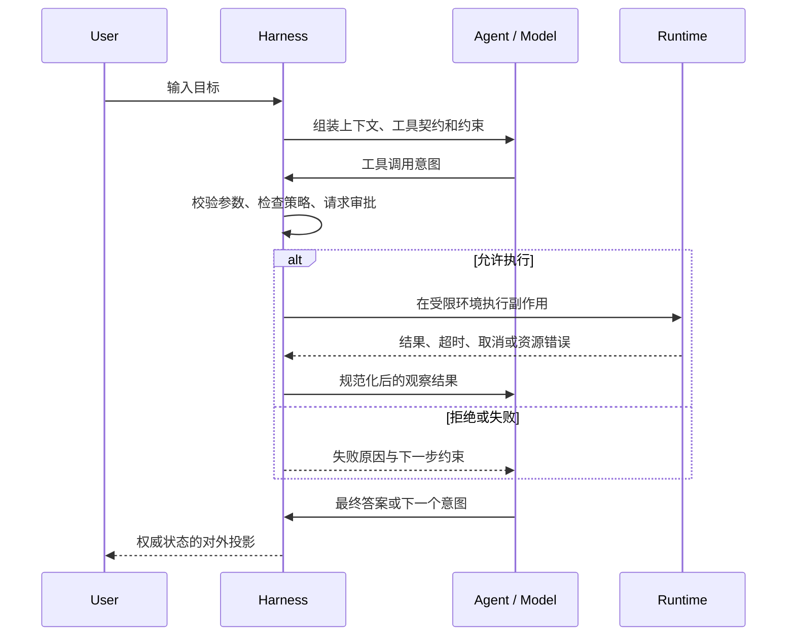
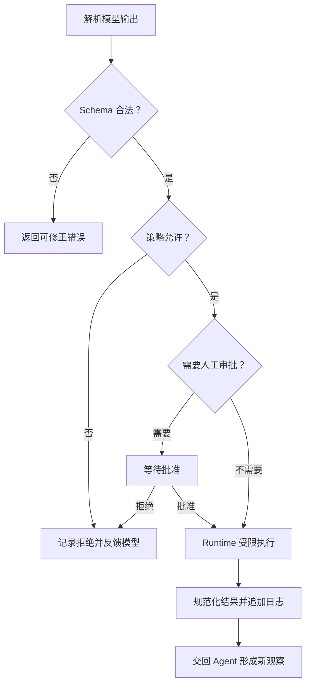

# Agent、Harness 与 Runtime 的边界

## 上一章遗留问题

这是第一章第一节。读者带着一个常见误解进入本书：「只要有一个调用模型的循环，就得到了 Agent」。这个说法只描述了推理循环，没有回答三个工程问题：

1. 谁决定下一步动作？
2. 谁保证动作只在被允许的边界内发生？
3. 谁保存事实，让系统在失败后仍能解释发生过什么？

本章先建立职责边界，后续章节才能继续讨论 Run 状态由谁迁移、事件由谁发布、工具副作用由谁审批。

## 本章解决什么矛盾

核心矛盾是「模型会提出下一步」与「系统必须受控地执行下一步」之间的张力。

- 如果把决策和执行混在一个不可审计的循环里，一次错误工具调用就会直接改变文件、进程或外部服务。
- 如果为了安全把所有逻辑都塞进静态策略，系统又会失去根据观察结果调整行动的能力。

因此，理想设计不是给三层各起一个目录名，而是把**决策权、控制权和资源承载**分开：

| 层 | 核心问题 | 拥有什么 |
| --- | --- | --- |
| 智能体（Agent） | 下一步做什么？ | 任务目标、局部判断、动作意图 |
| 线束（Harness） | 如何安全可靠地做？ | 上下文组装、校验、审批、工具分发、状态、事件、恢复 |
| 运行时（Runtime） | 在哪里跑？ | 进程、文件系统、网络、时钟、隔离和资源限制 |

## 核心不变量

本章建立两条不变量：

1. **未授权副作用不得执行。** 模型可以提议调用工具，但真正执行前必须经过 Harness 的校验、授权和分发。
2. **权威事实必须有明确所有者。** 用户消息、模型输出、工具结果、审批决定和状态迁移都要有可追踪来源；UI 或内存中的临时投影不能替代权威日志。

后面章节会反复检查：Context 是权威日志的投影，事件是状态变化的投影，Checkpoint 只能包含闭合事实。如果这一章没有区分决策者、控制面和承载环境，这些后续不变量就无法落地。

## 理想模型



图中的关键点不是箭头数量，而是所有副作用都经过 Harness 这个控制面。Runtime 不理解任务目标；Agent 不能因为「知道某个工具」就直接越过控制面。

## 初学者主线

把系统想象成一个受控实验室：

1. **Agent 像实验设计师**：根据目标和已有证据，提出下一步实验。
2. **Harness 像实验室管理员**：确认申请、准备材料、检查防护、记录日志，并把结果交回设计师。
3. **Runtime 像实验室设施**：提供水电、通风和仪器，但不知道这次实验要证明什么。

一个只有「发 prompt、收文本」的程序是模型客户端。它缺少至少四类 Harness 能力：

1. 工具契约和参数校验。
2. 权限、审批和沙箱边界。
3. 权威状态与事件记录。
4. 失败分类、重试、取消和恢复。

这四项不是可选插件。只要程序会修改文件、执行命令、访问网络或多步推进任务，它们就会决定系统是否可信。

## 机制深拆

### 决策输入与动作输出

Agent 的输入通常包括目标、历史观察、可用工具契约和运行约束。它的输出不是「已经完成的动作」，而是结构化意图，例如 `tool_call`、最终答案或结束信号。

这个区别很重要：

```text
模型输出：{"tool":"write_file","path":"/tmp/a.txt","content":"hi"}
系统事实：还没有写入任何文件
```

只有 Harness 校验参数、获得授权并交给 Runtime 后，「写入」才从意图变成副作用。之后还要把工具结果写回权威日志，模型下一轮看到的才是已发生的观察。

### 控制面的最小闭环

一次受控工具调用至少经过六个阶段：



这条链保护了本章的核心不变量。任何一个环节缺失，都会产生下面这类故障。

### 反例与故障模式

**反例 1：把模型客户端当 Agent。**

程序直接把用户文本发给模型，再把回复展示出来。看起来能对话，但没有权威日志和副作用控制。一旦加入「帮我删掉临时文件」的工具，模型输出会被当作命令执行；拒绝原因也不会成为模型可见事实，下一轮仍可能重复危险提议。

**反例 2：按包名判断安全边界。**

某模块叫 `runtime`，维护者便以为它天然负责隔离。但如果文件路径归上层拼接、网络客户端由工具层创建，这个名字不能阻止越权访问。判断边界要看四个问题：谁能发起副作用、谁校验参数、谁持有凭证、谁限制进程和网络。

**反例 3：把 UI 当成 Harness。**

前端弹窗显示「是否允许执行」，但后端工具没有再次校验。攻击者绕过界面直接调用服务端接口后，审批被跳过。UI 只是控制面的一种投影；真正的审批必须在执行路径上生效。

**反例 4：本地 CLI 直接改成多租户服务。**

本地版本可以让 Session 绑定当前工作目录和用户身份。服务化后，如果没有把会话所有权、文件根、凭证范围和并发租约移入 Harness，两个请求可能共享同一工作区：一个任务的清理操作会删除另一个任务的中间产物。

### 一条完整因果链

以「模型要求写入仓库外文件」为例：

1. **触发条件**：模型输出 `write_file`，目标路径指向工作区外。
2. **控制面检查**：Harness 解析 Schema，发现路径合法但超出允许根。
3. **状态变化**：不产生文件副作用；审批或拒绝事件进入权威日志。
4. **可观察结果**：模型收到明确的越界错误；用户界面显示该次尝试被拒绝。
5. **后续影响**：模型可以在下一轮选择工作区内路径，而不是误以为写入成功。

如果第 3 步只把错误打印到终端，不写入模型可见观察和持久日志，就会出现两类事故：模型重复尝试相同路径；事后审计无法解释为什么某些文件没有被修改。

## 设计取舍

| 方案 | 收益 | 代价 | 适用条件 |
| --- | --- | --- | --- |
| 三层职责分离 | 可测试、可审计、便于替换 Runtime 和模型 | 需要定义稳定接口和更多状态管理 | 会产生副作用或多轮长任务 |
| 单体脚本 | 启动快、代码少 | 权限、恢复和观测容易遗漏 | 只读演示或无副作用原型 |
| 把策略全部放在模型 prompt | 改动快，无需额外服务 | prompt 注入和模型漂移可能绕过约束 | 只作为纵深防御的一层 |
| 把所有控制放在 Runtime | 隔离强 | 缺少任务级上下文，难以解释业务意图 | 与 Harness 策略配合使用 |

分离不是为了增加层数，而是为了让每个失败都有明确责任点：意图错误回到 Agent，授权错误回到 Harness，资源错误来自 Runtime。

## 框架实现对照

三家项目都证明：这些边界是**逻辑职责**，不一定等于目录名或包名。同一个包可能同时承担 Agent 循环和部分 Harness 能力；关键是看装配关系和状态所有权。

### Reasonix

Reasonix 的 `Agent` 明确聚合 Provider、工具 Registry 和 Session，并由 `Run` 驱动一次任务：

```go
// internal/agent/agent.go:280-288 @ aa82b2f
type Agent struct {
        agentConfig
        svc agentServices
        sess sessionRuntime
}

// internal/agent/agent.go:1239 @ aa82b2f
func (a *Agent) Run(ctx context.Context, input string) (runErr error) {
        // ... append input, acquire workspace lease,
        // then return a.runToolLoop(ctx, state)
}
```

`svc` 是注入进来的协作服务，`sess` 是一次会话拥有的运行时状态。`Run` 注释说明它会追加用户输入并驱动工具循环，直到得到最终答案、上下文取消或 Provider 出错（`internal/agent/agent.go:1234-1238`）。

装配点在 `internal/boot/runtime.go:96` 的 `BuildRuntime`。CLI/TUI、桌面和 ACP 前端可以复用这套装配，例如 `internal/cli/acp.go:96` 和仓库根目录下的 `desktop/tab_controller_boot.go:13`。这说明「Runtime」在这里不是纯操作系统概念，而是启动期组合出的 Provider、工具、Session 和宿主适配集合。

### DeepSeek Harness

DeepSeek Harness 把 Agent 定义为绑定 Session 身份的公共句柄：

```ts
// packages/core/agent/src/runtime-types.ts:64-74 @ b150a55
export interface Agent {
  readonly id: SessionId;
  readonly options: AgentOptions;
  readonly session: Session;
  readonly inbox: Inbox;
  readonly status: AgentStatus;
}
```

注释直接指出：`session` 的 log 是 durable source of truth；`inbox` 是 durable pending work 的 Agent 投影；`status` 在每次 `agent/status` 迁移时镜像更新（`runtime-types.ts:69-74`）。

具体驱动者是 `ReactLoopAgent`。构造函数接收 `id`、`options` 和 `session`，从 Session 事件里找最后一个 `turn/start` 初始化 phase，并创建 Inbox 和事件分发器（`packages/core/agent-loop/src/agent.ts:80-97`）。工厂服务 `AgentLoop` 通过依赖注入拿到 `agents`、`sessions`、`llm`、`tools` 和 `systemPrompt`，再创建 `ReactLoopAgent` 并把它放入作用域（`packages/core/agent-loop/src/index.ts:296-297`、`:549-563`）。

这个设计的精妙之处是把「权威事实」和「运行中投影」分开：Agent 可以有内存中的 phase 和 Inbox 投影，但恢复语义回溯到持久 Session 日志。

### Pi

Pi 分成通用 `packages/agent` 和领域侧 `packages/coding-agent`。通用 `Agent` 自己声明为低层循环的有状态包装：

```ts
// packages/agent/src/agent.ts:167-181 @ c49906e
export class Agent {
  private _state: MutableAgentState;
  public convertToLlm: (...) => Message[] | Promise<Message[]>;
  public transformContext?: (...) => Promise<AgentMessage[]>;
  public streamFunction: StreamFn;
  public beforeToolCall?: (...) => Promise<BeforeToolCallResult | undefined>;
  public afterToolCall?: (...) => Promise<AfterToolCallResult | undefined>;
}
```

Coding SDK 在 `createAgentSession` 中注入模型流函数、扩展上下文转换、重试设置、Session ID 和 steering / follow-up 模式（`packages/coding-agent/src/core/sdk.ts:304-370`）。随后用 Session Manager、Settings Manager、cwd、自定义工具和 Extension Runner 创建 `AgentSession`（`sdk.ts:386-400`）。

工具控制面通过回调挂到通用 Agent 上：`AgentSession._installAgentToolHooks()` 设置 `beforeToolCall`，读取当时的 `_extensionRunner` 并发出 `tool_call` 事件；扩展失败会阻断执行（`core/agent-session.ts:484-504`）。默认激活的基础工具是 `read`、`bash`、`edit`、`write`，再按配置过滤（`sdk.ts:254-261`）。

这个分层的收益是通用循环不绑定 Coding 领域；代价是真实控制面分散在 `AgentOptions`、`AgentSession`、Extension Runner 和 Session Manager 之间，读代码时必须沿装配线追。

### 对照表

| 维度 | Reasonix | DeepSeek Harness | Pi |
| --- | --- | --- | --- |
| Agent 主体 | `internal/agent.Agent` 聚合 Provider、Registry、Session | `ReactLoopAgent implements Agent` | `packages/agent.Agent` 有状态包装 |
| 权威状态 | Session / 服务协作层共同支撑 | Session 日志是 durable source of truth | Session Manager 记录，Agent 内存态可恢复 |
| 工具控制 | `ToolHooks.PreToolUse` 可阻断调用 | Agent Loop 注入 tools 服务 | `beforeToolCall` 转 Extension Runner |
| 宿主装配 | CLI、Desktop、ACP 进入 Boot Runtime | CLI 只是应用入口，核心服务拆包 | SDK / Server / TUI 各自组装 Session |
| 主要启发 | 启动期统一装配，宿主差异留在边缘 | 先固定持久身份和日志，再做运行投影 | 通用循环与领域 SDK 解耦 |

## 实现精妙之处

**Reasonix：构造期权限不同于交互模式。**

`planMode` 是协作开关，而 `readOnlyExecution` 是构造期防御，生命周期内持续验证代理调用；两者都不替换 permission 或 sandbox 边界（`internal/agent/agent.go:300-308`）。`mutationDependencyBarrier` 还会在第一个持久写入失败或被阻断后，防止后续代理调用靠声明 `ReadOnly()` 绕过屏障（`:310-315`）。它承认一个现实：模型可见的能力标签不能单独作为安全事实。

代价是状态机更复杂。普通读者不能只看「Plan Mode」理解权限；实现者也要区分交互偏好、构造期能力和跨调用的屏障。

**DeepSeek Harness：先固定身份，再谈驱动。**

`Agent.id` 与 Session 共享同一个 `SessionId`；`ReactLoopAgent` 从 Session 日志派生 last turn，并把 Inbox 作为 durable work 的投影（`runtime-types.ts:64-76`、`agent.ts:87-96`）。这让取消、恢复和审计可以先锚定到同一条权威历史，而不是散落在多个内存对象里。

代价是对 Session 写入顺序和 schema 演化要求高。日志一旦含糊，Agent 投影和恢复行为都会失去依据。

**Pi：用回调把领域策略插进通用循环。**

通用 `Agent` 暴露 `beforeToolCall` 和 `afterToolCall`；Coding 侧把它们接到 Extension Runner。回调每次读取当前 runner，因此扩展热替换后不需要重新安装 hook（`agent-session.ts:476-504`）。这种设计让通用包保持小接口，领域包负责策略。

代价是控制流不再集中在一个文件。排查「谁拒绝了工具」时，必须知道通用回调、扩展包装器和 Session 层各自的顺序。

## 自检与面试追问

基础自检：

1. 用户输入进入系统后，第一个拥有状态的层是谁？它持久化了哪些最小事实？
2. 工具调用被拒绝时，谁通知模型、谁写审计日志、谁阻止副作用？
3. 同一个 Agent 从本地 CLI 移到多租户服务后，哪些职责应留在 Harness，哪些交给 Runtime？
4. 一个包名叫 `runtime` 是否足以证明它是本章定义的 Runtime？

面试追问：

1. 设计一个 Coding Agent 时，你会把「生成 patch」「应用 patch」「运行测试」「上传 artifact」分别放进哪一层？每一步的失败如何反馈？
2. 为什么「模型承诺不会删除文件」不能作为安全控制？
3. 如果审批服务暂时不可用，系统应该 fail open 还是 fail closed？两种选择分别破坏哪些不变量？
4. 你如何在代码评审中快速发现「UI 审批」没有落到执行路径？

## 交给下一章的问题

本章确定了职责边界，但没有展开一次 Run 内部的完整状态机：

- 什么时候算 Run 开始？
- 模型流式输出进行到一半时，系统处于什么状态？
- 工具循环何时结束？
- 取消、失败和最终答案如何改变权威状态？

[下一章](./agent-run-lifecycle.md)把这些边界问题变成一次 Agent Run 的完整生命周期。

## 相关页面

- [教材目录](../TOC.md)
- [术语表](../09-glossary/glossary.md)
