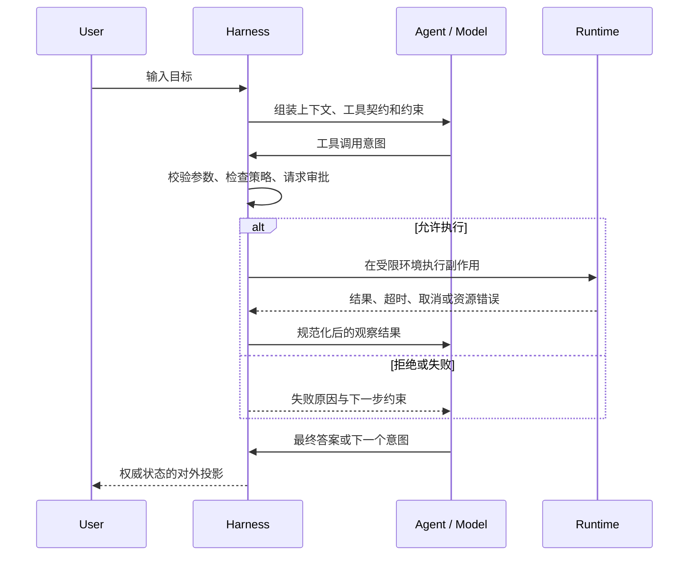
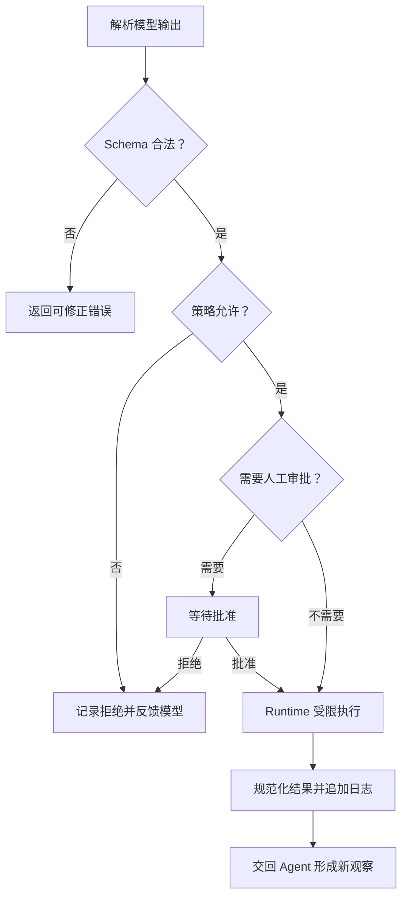

# Agent、Harness 与 Runtime 的边界

## 上一章遗留问题

很多人第一次实现 Agent 时，都会从一个看似成立的判断出发：只要让模型不断调用工具，就得到了一个 Agent。这个循环确实能跑起来，但它回避了三个更麻烦的问题：

1. 谁决定下一步动作？
2. 谁保证动作只在被允许的边界内发生？
3. 谁保存事实，让系统在失败后仍能解释发生过什么？

这三个问题分别指向状态、控制面和审计。本章先把职责边界讲清楚；后面讨论 Run 生命周期时，才能准确回答状态由谁迁移、事件由谁发布、副作用由谁审批。

## 本章解决什么矛盾

真正的张力在这里：模型擅长根据上下文提出下一步，系统却必须保证每一步都落在允许的边界内。

- 如果决策和执行挤在同一个不可审计的循环里，一次错误调用就可能直接改动文件、进程或外部服务。
- 反过来，如果把所有行为都锁死在静态规则里，系统又失去了根据观察调整行动的能力。

所以理想设计不是给三层各起几个目录，而是把三种能力拆开：有人负责决定，有人负责约束和记录，有人提供真实资源。

| 层 | 核心问题 | 拥有什么 |
| --- | --- | --- |
| 智能体（Agent） | 下一步做什么？ | 任务目标、局部判断、动作意图 |
| 线束（Harness） | 如何安全可靠地做？ | 上下文组装、校验、审批、工具分发、状态、事件、恢复 |
| 运行时（Runtime） | 在哪里跑？ | 进程、文件系统、网络、时钟、隔离和资源限制 |

## 核心不变量

本章建立两条不变量：

1. **未授权副作用不得执行。** 模型可以提议调用工具；在 Harness 校验、授权并分发之前，这只是一个意图。
2. **权威事实必须有明确所有者。** 用户消息、模型输出、工具结果、审批决定和状态迁移都要能追溯到来源。界面显示的内容和内存里的临时状态，都不能替代权威日志。

后面章节会反复回到这两条：Context 是权威日志的投影，事件是状态变化的投影，Checkpoint 只能包含闭合事实。如果没有先把决策者、控制面和承载环境分开，这些说法很容易变成口号。

## 理想模型



这张图的关键不是箭头数量，而是所有副作用都要穿过中间那个控制面。Runtime 不需要理解任务目标；Agent 也不能因为「模型知道某个工具」，就绕过校验直接执行。

## 初学者主线

可以把这套系统想象成一个受控实验室。

Agent 是实验设计师：根据目标和已有证据，提出下一步该做什么实验。Harness 是实验室管理员：确认申请、准备材料、检查防护、记录过程，再把结果交回设计师。Runtime 是实验室设施：提供水电、通风和仪器，但并不关心这次实验想证明什么。

按照这个标准，「发 prompt、收文本」的程序只是模型客户端。它至少缺四类 Harness 能力：

1. 工具契约和参数校验。
2. 权限、审批和沙箱边界。
3. 权威状态与事件记录。
4. 失败分类、重试、取消和恢复。

这四项不是可以以后再补的插件。程序一旦要修改文件、执行命令、访问网络，或者连续多步推进任务，它们就直接决定了系统能不能被信任。

## 机制深拆

### 决策输入与动作输出

Agent 的输入通常包括目标、历史观察、可用工具契约和运行约束。它的输出不是「已经完成的动作」，而是结构化意图，例如 `tool_call`、最终答案或结束信号。

这里有一个容易忽略的区别：

```text
模型输出：{"tool":"write_file","path":"/tmp/a.txt","content":"hi"}
系统事实：还没有写入任何文件
```

只有 Harness 校验参数、拿到授权并交给 Runtime 后，这次「写入」才从意图变成真正发生的副作用。工具结果随后还要写回权威日志；下一轮模型看到的，才是已经发生的观察，而不是它自己刚才的想象。

### 控制面的最小闭环

一次受控工具调用至少经过六个阶段：



这条链看起来繁琐，但每个环节都在保护前面的核心不变量。少掉任何一环，就可能出现下面这些事故。

### 反例与故障模式

**反例 1：把模型客户端当 Agent。**

程序直接把用户文本发给模型，再把回复展示出来。它能对话，却没有权威日志，也没有副作用边界。一旦加入「帮我删掉临时文件」这样的工具，模型输出的删除意图很容易被当成命令执行；如果执行被拒绝，拒绝原因也不会回到模型可见的观察里，下一轮它可能继续提出同样的危险请求。

**反例 2：按包名判断安全边界。**

某个模块叫 `runtime`，维护者便默认它天然负责隔离。可如果文件路径其实由上层拼接、网络客户端由工具层创建，这个名字挡不住任何越权访问。判断边界时，与其看名字，不如追问四个事实：谁能发起副作用？谁校验参数？谁持有凭证？谁限制进程和网络？

**反例 3：把 UI 当成 Harness。**

前端弹出「是否允许执行」，用户点了确认；后端工具却没有再做检查。攻击者只要绕过界面直接调用接口，审批就被完全跳过。UI 只是控制面的一个投影，真正的审批必须长在执行路径上。

**反例 4：本地 CLI 直接改成多租户服务。**

本地 CLI 可以放心地让 Session 绑定当前目录和当前用户。一旦搬进多租户服务，假设仍然成立吗？如果没有把会话所有权、文件根、凭证范围和并发租约交给 Harness 管理，两个请求可能共享同一个工作区。这时一个任务的清理操作，足以删除另一个任务的中间产物。

### 一条完整因果链

以「模型要求写入仓库外文件」为例：

1. **触发条件**：模型输出 `write_file`，目标路径指向工作区外。
2. **控制面检查**：Harness 解析 Schema，发现路径合法但超出允许根。
3. **状态变化**：不产生文件副作用；审批或拒绝事件进入权威日志。
4. **可观察结果**：模型收到明确的越界错误；用户界面显示该次尝试被拒绝。
5. **后续影响**：模型可以在下一轮选择工作区内路径，而不是误以为写入成功。

假如第 3 步只把错误打印到终端，既没有写进模型可见观察，也没有持久保存，事故会分两路发生：模型下一轮继续尝试同一条路径；事后审计则无法解释为什么某些文件没有被修改。

## 设计取舍

| 方案 | 收益 | 代价 | 适用条件 |
| --- | --- | --- | --- |
| 三层职责分离 | 可测试、可审计、便于替换 Runtime 和模型 | 需要定义稳定接口和更多状态管理 | 会产生副作用或多轮长任务 |
| 单体脚本 | 启动快、代码少 | 权限、恢复和观测容易遗漏 | 只读演示或无副作用原型 |
| 把策略全部放在模型 prompt | 改动快，无需额外服务 | prompt 注入和模型漂移可能绕过约束 | 只作为纵深防御的一层 |
| 把所有控制放在 Runtime | 隔离强 | 缺少任务级上下文，难以解释业务意图 | 与 Harness 策略配合使用 |

分离不是为了增加层数，而是为了让每个失败都有明确责任点：意图错误回到 Agent，授权错误回到 Harness，资源错误来自 Runtime。

## 框架实现对照

三家项目给出了同一个提醒：这些边界首先是逻辑职责，不一定等于目录名或包名。同一个包完全可以同时装下 Agent 循环和一部分 Harness 能力；关键是追装配关系，看清状态归谁所有。

### Reasonix

Reasonix 的 `Agent` 明确聚合 Provider、工具 Registry 和 Session，并由 `Run` 驱动一次任务：

```go
// internal/agent/agent.go:280-288 @ aa82b2f
type Agent struct {
        agentConfig
        svc agentServices
        sess sessionRuntime
}

// internal/agent/agent.go:1239 @ aa82b2f
func (a *Agent) Run(ctx context.Context, input string) (runErr error) {
        // ... append input, acquire workspace lease,
        // then return a.runToolLoop(ctx, state)
}
```

`svc` 是注入进来的协作服务集合；`sess` 则属于一次会话的运行状态。`Run` 上方的注释写得很清楚：它会追加用户输入，然后驱动工具循环，直到得到最终答案、上下文取消或 Provider 出错（`internal/agent/agent.go:1234-1238`）。

装配入口是 `internal/boot/runtime.go:96` 的 `BuildRuntime`。CLI/TUI、桌面和 ACP 前端都能复用这套装配，例如 `internal/cli/acp.go:96` 与仓库根下的 `desktop/tab_controller_boot.go:13`。所以这里的「Runtime」不是狭义的操作系统运行时，而是启动期组合出来的 Provider、工具、Session 和宿主适配集合。

### DeepSeek Harness

DeepSeek Harness 把 Agent 定义为绑定 Session 身份的公共句柄：

```ts
// packages/core/agent/src/runtime-types.ts:64-74 @ b150a55
export interface Agent {
  readonly id: SessionId;
  readonly options: AgentOptions;
  readonly session: Session;
  readonly inbox: Inbox;
  readonly status: AgentStatus;
}
```

源码注释说得很直白：`session` 的 log 是 durable source of truth；`inbox` 只是 durable pending work 在 Agent 侧的投影；`status` 则随每次 `agent/status` 迁移同步更新（`runtime-types.ts:69-74`）。

真正驱动流程的是 `ReactLoopAgent`。它的构造函数接收 `id`、`options` 和 `session`，先从 Session 事件里找到最后一个 `turn/start` 来初始化 phase，再创建 Inbox 和事件分发器（`packages/core/agent-loop/src/agent.ts:80-97`）。外层的工厂服务 `AgentLoop` 通过依赖注入拿到 `agents`、`sessions`、`llm`、`tools` 和 `systemPrompt`，然后创建 `ReactLoopAgent` 并放入作用域（`packages/core/agent-loop/src/index.ts:296-297`、`:549-563`）。

这个设计的好处在于，它把「权威事实」和「运行中投影」明确分开：Agent 手里有内存中的 phase 和 Inbox 投影，可一旦要谈恢复，语义仍要回到持久 Session 日志。

### Pi

Pi 把通用能力和领域能力分成两层：通用循环放在 `packages/agent`，Coding 场景放在 `packages/coding-agent`。通用 `Agent` 的定位也很清楚——低层循环之上的有状态包装：

```ts
// packages/agent/src/agent.ts:167-181 @ c49906e
export class Agent {
  private _state: MutableAgentState;
  public convertToLlm: (...) => Message[] | Promise<Message[]>;
  public transformContext?: (...) => Promise<AgentMessage[]>;
  public streamFunction: StreamFn;
  public beforeToolCall?: (...) => Promise<BeforeToolCallResult | undefined>;
  public afterToolCall?: (...) => Promise<AfterToolCallResult | undefined>;
}
```

Coding SDK 在 `createAgentSession` 里注入模型流函数、扩展上下文转换、重试设置、Session ID 以及 steering / follow-up 模式（`packages/coding-agent/src/core/sdk.ts:304-370`）。随后再用 Session Manager、Settings Manager、cwd、自定义工具和 Extension Runner 组出 `AgentSession`（`sdk.ts:386-400`）。

工具控制面通过回调挂到通用 Agent 上：`AgentSession._installAgentToolHooks()` 设置 `beforeToolCall`，每次读取当时的 `_extensionRunner` 并发出 `tool_call` 事件；扩展失败会阻断执行（`core/agent-session.ts:484-504`）。默认激活的基础工具是 `read`、`bash`、`edit`、`write`，最后再按配置过滤（`sdk.ts:254-261`）。

这样分层，通用循环不必绑定 Coding 领域；代价是真正的控制面分散在 `AgentOptions`、`AgentSession`、Extension Runner 和 Session Manager 之间。读代码时，必须沿着装配线一路追下去。

### 对照表

| 维度 | Reasonix | DeepSeek Harness | Pi |
| --- | --- | --- | --- |
| Agent 主体 | `internal/agent.Agent` 聚合 Provider、Registry、Session | `ReactLoopAgent implements Agent` | `packages/agent.Agent` 有状态包装 |
| 权威状态 | Session / 服务协作层共同支撑 | Session 日志是 durable source of truth | Session Manager 记录，Agent 内存态可恢复 |
| 工具控制 | `ToolHooks.PreToolUse` 可阻断调用 | Agent Loop 注入 tools 服务 | `beforeToolCall` 转 Extension Runner |
| 宿主装配 | CLI、Desktop、ACP 进入 Boot Runtime | CLI 只是应用入口，核心服务拆包 | SDK / Server / TUI 各自组装 Session |
| 主要启发 | 启动期统一装配，宿主差异留在边缘 | 先固定持久身份和日志，再做运行投影 | 通用循环与领域 SDK 解耦 |

## 实现精妙之处

**Reasonix：构造期权限不同于交互模式。**

Reasonix 把两种容易混淆的「只读」分开了。`planMode` 是协作开关；`readOnlyExecution` 则是构造期防御，在 Agent 的生命周期里持续验证代理调用。两者都不会取代 permission 或 sandbox 边界（`internal/agent/agent.go:300-308`）。更谨慎的是 `mutationDependencyBarrier`：一旦本批工具中第一个持久写入失败或被阻断，它就防止后续调用靠声明 `ReadOnly()` 绕过屏障（`:310-315`）。这个设计承认了一个现实——模型可见的能力标签，不能单独当成安全事实。

代价也很明显：权限状态机变得更复杂。读者不能只看「Plan Mode」理解权限；实现者也要同时区分交互偏好、构造期能力和跨调用的屏障。

**DeepSeek Harness：先固定身份，再谈驱动。**

DeepSeek Harness 选择先固定身份，再谈驱动。`Agent.id` 与 Session 共享同一个 `SessionId`；`ReactLoopAgent` 从 Session 日志派生 last turn，并把 Inbox 当作 durable work 的投影（`runtime-types.ts:64-76`、`agent.ts:87-96`）。于是取消、恢复和审计都能先锚定到同一条权威历史，而不是散落在几个内存对象里。

这个选择把压力转给了 Session 层：写入顺序和 schema 演化都必须非常严谨。日志一旦含糊，Agent 投影和恢复行为都会失去依据。

**Pi：用回调把领域策略插进通用循环。**

Pi 用一组小回调把领域策略插进通用循环。通用 `Agent` 暴露 `beforeToolCall` 和 `afterToolCall`；Coding 侧把它们接到 Extension Runner。由于回调每次都读取当前 runner，扩展热替换后不需要重装 hook（`agent-session.ts:476-504`）。通用包得以保持小接口，策略则留给领域包。

代价是控制流不再集中在一处。排查「谁拒绝了工具」时，必须弄清通用回调、扩展包装器和 Session 层各自的先后关系。

## 自检与面试追问

基础自检：

1. 用户输入进入系统后，第一个拥有状态的层是谁？它持久化了哪些最小事实？
2. 工具调用被拒绝时，谁通知模型、谁写审计日志、谁阻止副作用？
3. 同一个 Agent 从本地 CLI 移到多租户服务后，哪些职责应留在 Harness，哪些交给 Runtime？
4. 一个包名叫 `runtime` 是否足以证明它是本章定义的 Runtime？

面试追问：

1. 设计一个 Coding Agent 时，你会把「生成 patch」「应用 patch」「运行测试」「上传 artifact」分别放进哪一层？每一步的失败如何反馈？
2. 为什么「模型承诺不会删除文件」不能作为安全控制？
3. 如果审批服务暂时不可用，系统应该 fail open 还是 fail closed？两种选择分别破坏哪些不变量？
4. 你如何在代码评审中快速发现「UI 审批」没有落到执行路径？

## 交给下一章的问题

到这里，职责边界已经清楚；但一次 Run 内部的状态机还没有展开：

- 什么时候算 Run 开始？
- 模型流式输出进行到一半时，系统处于什么状态？
- 工具循环何时结束？
- 取消、失败和最终答案如何改变权威状态？

[下一章](./agent-run-lifecycle.md)把这些边界问题变成一次 Agent Run 的完整生命周期。

## 相关页面

- [教材目录](../TOC.md)
- [术语表](../09-glossary/glossary.md)
