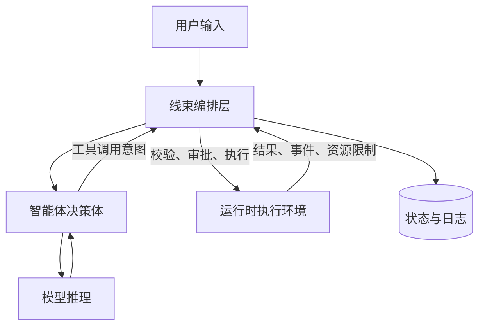
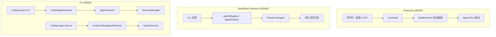

# Agent、Harness 与 Runtime 的边界

## 一句话结论

智能体决定“下一步做什么”，线束保证“能安全、可靠地做”，运行时提供“在哪里跑”；三者可以合并成一个进程或包，但职责不应混为一谈。

## 理想模型

**智能体（Agent）** 是任务决策体：看它的决策输入与输出——目标、历史、观察结果、下一步动作或结束信号。模型是最常用的推理内核，但策略、记忆和子任务组织也会影响决策。

**线束（Harness）** 是工程编排层：看它在一次动作前后补齐了哪些系统能力——组装上下文、约束输出、解析工具调用、检查权限、执行副作用、处理失败、维护状态和发布事件。

**运行时（Runtime）** 是承载环境：看它的资源和隔离边界——进程或服务、文件系统、网络、时钟、并发原语和资源限制。它可以被线束选择、适配甚至替换，但本身不理解业务目标。

## 直觉类比

把智能体想成司机：根据目的地和路况决定转弯、停车或继续开。线束是车辆的控制系统：油门、刹车、仪表、安全带和导航接口。运行时是道路和车辆运行环境：有路才能行驶，也有限速和天气约束。

对应到软件：智能体做任务决策，线束做约束、校验和编排，运行时提供进程、文件和网络等承载能力。

## 机制拆解

| 边界问题 | 智能体的责任 | 线束的责任 | 运行时的责任 |
| --- | --- | --- | --- |
| 选择动作 | 结合目标和观察结果给出下一步。 | 把候选工具、约束和历史组织成可用输入。 | 提供计算和网络资源。 |
| 执行副作用 | 发起工具调用意图。 | 校验参数、审批、分发和记录结果。 | 实际访问进程、文件和网络。 |
| 维护状态 | 保持完成任务所需的局部判断。 | 持久化回合、事件、检查点和恢复依据。 | 提供存储、锁和崩溃恢复原语。 |
| 处理异常 | 选择重试、改道或放弃。 | 分类错误、限制重试、回滚可回滚部分并通知用户。 | 暴露超时、取消和资源错误。 |

两个容易混淆的点：

1. **智能体不是只有模型。** 一个系统若只是把 prompt 发给模型并展示文本，通常只是模型客户端；加入工具、状态、策略和多步循环后才更接近智能体。
2. **线束不是运行时的别名。** 线束会使用运行时，但它关心的是任务编排；运行时关心的是资源和隔离。

## 框架实现视角

以下面向有经验读者，说明同一逻辑边界在真实项目中的装配方式；初学者可先读“常见坑”。三家快照都证明边界是逻辑分层，不一定等于目录或包名一一对应。

### Reasonix

- **装配方式**：本地引擎承接核心智能体和线束能力；CLI/TUI、桌面和 ACP 前端通过启动装配进入同一 Controller。
- **关键符号**：`Agent` 聚合 Provider、工具 Registry 和 Session，并由 `Run` 驱动；`boot.BuildRuntime` 和 `boot.Build` 是组装点。
- **证据**：`internal/agent/agent.go:280`、`internal/boot/runtime.go:96`、`internal/cli/acp.go:96`、`desktop/tab_controller_boot.go:13`；commit `aa82b2f`。

### DeepSeek Harness

- **装配方式**：核心拆出 `dsh-agent`、`dsh-agent-loop`、`dsh-session` 和 CLI 应用；CLI 只是一类交互与启动入口。
- **关键符号**：`Agent` 接口绑定 Session 身份；`ReactLoopAgent` 从持久会话日志派生请求；`AgentLoop` 服务负责创建该驱动。
- **证据**：`packages/core/agent/src/runtime-types.ts:64`、`packages/core/agent-loop/src/agent.ts:64`、`packages/core/agent-loop/src/index.ts:295`、`apps/cli/package.json`；commit `b150a55`。

### Pi

- **装配方式**：通用 `agent` 包提供循环、lane、会话上下文和执行环境抽象；`coding-agent` 包按宿主分成两条装配线。
- **关键符号**：CLI 主路径经 `createAgentSession` 创建 `AgentSession`，聚合 `Agent`、`SessionManager` 和 `SettingsManager`；server 路径经 `createCodingAgentHarness` 创建通用包中的 `AgentHarness`。
- **证据**：`packages/agent/src/harness/types.ts:303`、`packages/coding-agent/src/core/sdk.ts:386`、`packages/coding-agent/src/core/agent-session.ts:310`、`packages/coding-agent/src/server/create-harness.ts:80`；commit `c49906e`。

图中箭头表示主要装配方向，不代表每章都会展开的全部事件流。Reasonix 的 Controller 同时承担控制面职责；DeepSeek Harness 让持久会话日志成为智能体驱动的关键依赖；Pi 的 CLI 与 server 使用不同的上层装配。

## 常见坑

- **按名字猜职责。** 有的项目叫 Agent，却包含完整 Harness；有的叫 Runtime，实际是编排服务。这也解释了为什么不能只看包名判断边界。
- **把 UI 当成线束全部。** UI 只是交互前端；真正的线束还必须处理后端状态、权限、错误和恢复。
- **把模型能力当系统能力。** 模型可能“知道”某个工具，但没有 Schema 注册、参数校验和执行边界，调用不会安全发生。
- **忽略宿主差异。** 同一线束放进 CLI、Web 服务或桌面应用时，进程生命周期、权限和持久化约束都会改变设计取舍。

判断一个系统的边界时，不要从名字出发，而要看四件事：决策输入来自哪里、状态归谁所有、副作用在哪里被允许执行、资源和隔离由谁限制。

## 自检问题

1. 用户输入进入系统后，第一个拥有状态的层是谁？它持久化了哪些最小事实？
2. 某个工具调用被拒绝时，谁通知模型、谁写审计日志、谁阻止副作用？
3. 如果把同一个智能体从本地 CLI 移到多租户服务，哪些职责应留在线束，哪些交给运行时？
4. 一个包名叫 `runtime` 是否足以证明它是本章定义的运行时？还需要看什么？

## 相关页面

- [教材目录](../TOC.md)
- [术语表](../../zh-CN/09-glossary/glossary.md)
