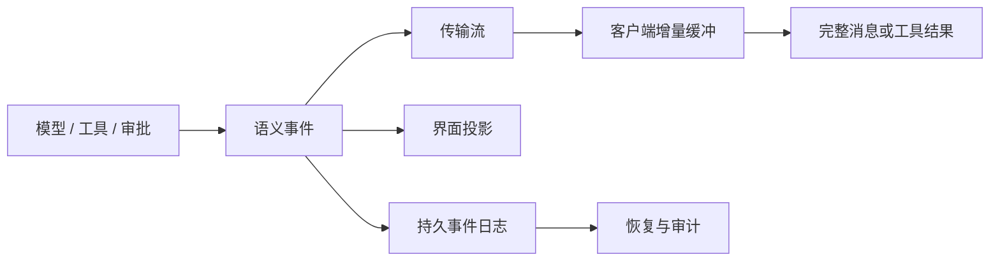

# 事件模型与流式输出

## 一句话结论

流式输出只是事件的一种投影。线束需要先定义稳定的事件类型和顺序，再决定哪些事件进入模型历史、界面和持久日志；否则刷新、取消或崩溃恢复时，会把临时增量误当成已完成事实。

## 理想模型

事件不是一段任意文本，而是带有类型、归属、顺序和生命周期的结构化记录。理想事件至少回答四个问题：

| 问题 | 典型字段或约定 | 为什么重要 |
| --- | --- | --- |
| 发生了什么 | `message_start`、`text_delta`、`tool_call`、`tool_result`、`message_end` | 区分草稿、意图、观察和终态 |
| 属于哪个边界 | Session、Turn、Run、Step、Message、调用编号 | 避免并发流互相串扰 |
| 顺序如何确定 | 单调序号、时间戳、分区键或因果链 | 支持重放、去重和乱序处理 |
| 是否已经提交 | `draft`、`committed`、`failed`、`cancelled` | 决定能否进入历史和恢复 |

## 小白解释

把模型流式输出想成会议记录员逐句念草稿。念出来的每个词都方便听众跟上，但不能马上写进正式纪要；记录员宣布这段完成后，内容才成为正式结论。

工具调用也像会议里的提案。模型说“我要读文件”时，这只是提案；线束批准、执行并返回结果后，提案和结果才一起进入档案。中途暂停时，档案里应保留已确认的提案、结果和暂停原因，而不是只留下没念完的半句话。

## 机制拆解

### 事件类型

最小事件集覆盖四类：生命周期事件说明开始、结束、暂停和取消；内容事件携带文本、推理片段或结构化输出；工具事件把调用意图、审批、执行和结果分开；错误事件说明原因、可重试性和后续入口。

事件粒度过粗，界面就无法展示进度；粒度过细，客户端要自己拼接业务含义。实用做法是以消息和工具调用为一级边界，在边界内保留增量片段，并在边界关闭时发布完整摘要或终态。

### 顺序与归属

同一回合内的事件应能排成因果链。序号比时间戳更稳定，因为系统时钟可能回拨；跨进程或跨设备时，还需要会话和回合编号隔离任务。客户端收到乱序或重复事件时，应按序号去重，不能把重放事件再次写进历史。

### 流式与提交

传输层可能使用 SSE、WebSocket 或本地回调，但它们只负责投递。线束在发送端累积 `text_delta`，直到形成完整助手消息；工具调用则等待参数闭合、校验、审批和执行完成后，与结果一起提交。界面可以实时渲染草稿，持久层只应写入已确认边界。

### 失败、取消和恢复

失败事件必须说明边界停在哪里。流式中断可以保留稳定前缀并标记 `interrupted`；工具失败应把错误作为观察结果返回；用户取消要关闭当前回合，并记录已发生的副作用。恢复时，系统从持久事件日志重放已提交事实，重新打开未闭合边界；已渲染但未提交的界面内容应丢弃或标记为不可信。

## 框架对照

下表只建立初稿证据索引；具体行为和路径将在批量 Implementation Review 中核对：

| 框架 | 事件与流式实现 | 关键锚点 |
| --- | --- | --- |
| Reasonix `aa82b2f` | 会话与运行过程产生模型、工具和状态变化；持久化与订阅入口待核对。 | `internal/agent/session.go`、`internal/agent/agent.go`、`internal/agent/run.go` |
| DeepSeek Harness `b150a55` | agent-loop 组织模型、工具和会话事件；前端消费路径待核对。 | `packages/core/agent-loop/src`、`packages/core/session/src`、`apps/cli/src` |
| Pi `c49906e` | 通用 agent 包暴露会话事件；`message_end` 和 `entry_added` 与持久化的关系待核对。 | `packages/agent/src`、`packages/coding-agent/src/core/agent-session.ts`、`packages/coding-agent/src/core/session-manager.ts` |

## 常见坑

- **把增量当事实。** 屏幕上出现的文本不等于完整消息；只有边界关闭并提交后才能进入可靠历史。
- **只记录成功。** 丢失失败工具结果会让模型重复错误动作，也让审计者无法理解重试原因。
- **让 UI 直接定义状态。** 界面是投影，不是权威日志；刷新或重连时必须能从事件源重建。
- **忽略取消语义。** 取消不是清空；已执行命令、已写入文件和已收到结果仍需保留。
- **混用传输与语义。** SSE 断开不代表任务失败，本地回调完成也不代表事件已持久化。

## 自检问题

1. `text_delta`、完整助手消息和持久事件日志分别属于哪一层？
2. 两个并发工具调用的结果如何归属到正确的调用边界？
3. 客户端重连后，应从哪里恢复界面，哪些内容必须重新请求？
4. 工具失败和用户取消分别应生成什么终态事件？

## 相关页面

- [教材目录](../TOC.md)
- [一次 Agent Run 的完整生命周期](./agent-run-lifecycle.md)
- [Session、Turn 与状态模型](./session-and-state.md)
- [术语表](../09-glossary/glossary.md)
