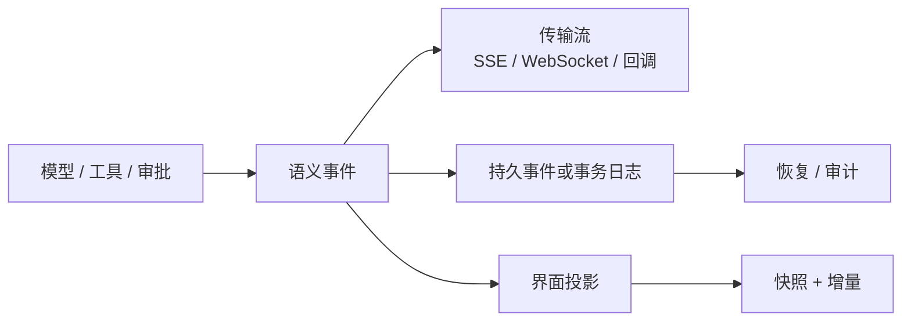
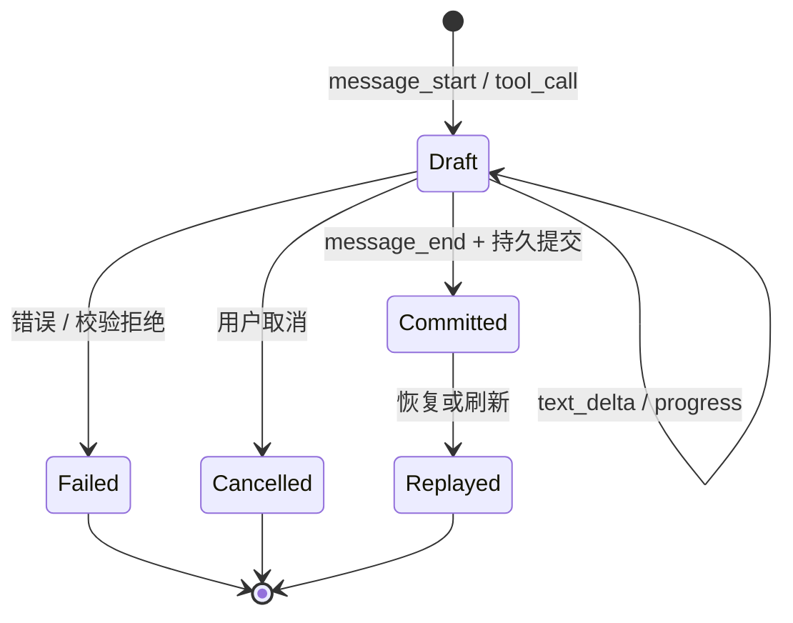

## 一句话结论

流式输出不是状态。线束必须先定义带归属和终态的事件边界，再决定哪些内容只给界面看、哪些进入模型历史、哪些等待持久化确认；否则刷新、取消或崩溃恢复时，会把半截文本误当成已完成事实。

:::note
本章要回答的核心问题：**哪些中间状态可以广播？什么时候才能成为 Session 的一部分？取消后已经发生的副作用去哪里？**
:::

## 上一章遗留问题

C-03 把 Session 定为权威事实集合，把 Turn 作为因果分段，并强调未闭合工具调用不能作为恢复依据。但执行过程天然充满中间状态：模型逐字输出，长命令不断打印日志，审批在等待用户，客户端可能随时断开。本章要回答：哪些中间状态可以广播？什么时候才能成为 Session 的一部分？取消后已经发生的副作用去哪里？

## 本章解决什么矛盾

低延迟要求尽快展示 `text_delta` 和工具进度；可靠性要求只有完整消息、闭合参数、审批决定和工具结果才影响下一次推理。两者不能靠"先显示再补一条删除"解决：外部副作用无法删除，崩溃后的读者也无法知道哪段草稿曾被承诺过。因此事件系统必须在同一个设计里同时提供**实时性**和**提交点**，而不是让 UI 自己猜测。

## 核心不变量

1. **可排序**：同一会话内的事件必须能重建因果顺序。序号、分区键或父子引用至少要有一种稳定机制。
2. **可归属**：每个增量、调用和结果都能关联到 Turn、Step、Message 或工具调用 ID。
3. **有生命周期**：`start / update / end` 必须能关闭边界；失败和取消也是显式终态，不是静默消失。
4. **草稿与事实分层**：未完成增量可以渲染，但不能单独成为权威历史；只有提交事件或持久化记录能改变恢复依据。
5. **副作用不可伪装**：工具已经开始时，取消不能假装没有发生；必须有错误、跳过或部分结果作为后续观察。

这些不变量的失效边界不同：单机回调通常靠程序内互斥保证顺序；网络流还可能重复和乱序；跨进程持久化还要处理 torn write、旧 schema 和多写入者。所以"收到事件"不等于"顺序正确"，更不等于"已经落盘"。

:::tip
"收到事件"不等于"顺序正确"，更不等于"已经落盘"。三个层次需要分别验证：**排序正确 → 归属正确 → 持久化确认**。
:::

## 理想模型

理想事件至少回答四个问题：

| 问题 | 典型字段或约定 | 为什么重要 |
| --- | --- | --- |
| 发生了什么 | `message_start`、增量、`tool_call`、`tool_result`、`end` | 区分草稿、意图、观察和终态 |
| 属于哪个边界 | Session、Turn、Step、Message、调用编号 | 避免并发流互相串扰 |
| 顺序如何确定 | 连续 seq、revision、父子链、模型顺序槽位 | 支持重放、去重和乱序处理 |
| 是否已经提交 | 过程事件 vs durable 事件；事务边界或 fsync 点 | 决定能否进入历史和恢复 |

注意图里的两个提交箭头并不相同：本地内存中的 `Committed` 只表示语义边界关闭；跨进程恢复还需要持久层确认。理想实现会把这两个阶段分开命名，或者用 `entry_added` 这类 durable 事件表达后者。

## 初学者主线

把模型输出想成会议记录员逐句念草稿。听众可以实时听见（界面投影），但正式纪要只在记录员宣布这段完成后写入（语义提交）。如果会议记录还要归档（持久化），档案管理员盖章之后才算可查询事实。

:::note
工具调用则像会议提案。模型说"我要读文件"只是**提案**；线束校验、批准并执行后，提案、决定和结果一起进入**档案**。
:::

中途暂停时不能撕掉提案页，而要写明"提案已存在、执行被跳过"，否则下一轮模型会缺少关键观察。

### 增量、边界和投影

最小事件集覆盖四类：

- **生命周期**：Run、Turn、Step 的开始和结束；
- **内容**：文本、思考片段、结构化块；
- **工具**：意图、审批、执行进度、结果；
- **异常**：超时、协议错误、取消、部分副作用。

粒度过粗，界面无法显示进度；粒度过细，客户端要自己拼接业务含义。实用做法是以消息和工具调用为一级边界，在边界内保留增量，并在边界关闭时发布完整摘要或 durable 记录。

### 顺序与并发归属

同一回合内的事件应能排成因果链。时间戳可能回拨，单调序号更适合做主排序；父子 ID 则回答“这个结果属于哪个调用”。并行工具不能按完成时间直接覆盖彼此：正确做法通常是先保留模型给出的调用顺序，允许执行乱序完成，再把结果按稳定槽位或 `callId` 归还。

### 流式与提交

SSE、WebSocket 或本地回调只负责投递。发送端累积 `text_delta`，直到形成完整助手消息；工具调用等待参数闭合、校验、审批和执行完成后，与结果一起提交。界面可以实时渲染草稿，但刷新时应先拿快照，再应用快照之后的有序增量；不能把断线前的最后一块文本当作最终答案。

## 机制深拆

### 1. 三条流经常被混成一个名字

- **Provider stream**：provider 返回的原始 delta，例如文本块、工具参数块、usage。
- **Agent semantic event**：线束加工后的生命周期事件，带有 Turn/Step/调用 ID。
- **Durable record/event**：进入权威日志、数据库事务或 JSONL 文件的记录。

三者可以同名，也可以合并实现，但失效方式完全不同。Provider 断开是上游输入中断；语义事件丢失是订阅者问题；durable 记录损坏则是恢复问题。把它们混在一起，最容易写出"UI 收到了就当成功"的代码。

:::caution
把它们混在一起，最容易写出"UI 收到了就当成功"的代码。三类事件的失效方式完全不同：

| 流 | 断开含义 | 恢复策略 |
| --- | --- | --- |
| Provider stream | 上游输入中断 | 重试请求 |
| Agent semantic event | 订阅者丢失 | 重放语义事件 |
| Durable record | 持久化损坏 | 从权威日志恢复 |
| | | |
:::

直觉上，这是快递的"运输轨迹""签收单""入库台账"。精确机制是：运输轨迹可丢，签收单证明交付，入库台账决定库存。失效边界是：只记轨迹会在仓库失火后不知道有哪些货；只等入库又会失去实时追踪价值。

### 2. 提交点的三种常见位置

1. **边界关闭即提交**：适合无副作用的纯文本；`message_end` 后即可加入历史。
2. **聚合后提交**：多个 chunk 先组装成 message，再携带 chunk seq 列表写入一条完整记录，方便 UI 复原因果关系。
3. **事务确认后发布 durable 事件**：响应、分类状态和 usage 在一个事务中落盘，然后才发出 `entry_added`；这是最强的“可查询”信号。

第三种最安全，但也把延迟推到事务之后。若 UI 只需要草稿，应继续消费过程事件；若要做账务、恢复或权限判断，必须等待 durable 事件。

:::note
选择提交点的经验法则：

1. **纯文本** → 边界关闭即提交
2. **UI 需要复原** → 聚合后提交
3. **账务/恢复/权限** → 事务确认后发布 durable 事件
:::

### 3. 取消、失败和部分副作用

取消要分三个时刻：

- **尚未派发**：可以为未开始的工具调用写入"aborted before dispatch"结果，保持模型可见的配对关系。
- **正在执行**：向进程发送中止信号后，仍要等待其退出，并把错误或部分输出作为观察返回。
- **已经产生副作用**：文件已改、命令已跑、外部 API 已调用时，取消不能回滚所有现实；必须留下事实和原因，供人工检查或补偿动作使用。

:::danger
取消不能假装没有发生。文件已改、命令已跑、外部 API 已调用时，必须留下事实和原因，供人工检查或补偿动作使用。
:::

失败也一样：流中断可能留下有效前缀，协议错误可能让整次请求不可信，权限拒绝则应生成明确的错误结果。恢复时从权威日志重放已提交记录；丢失的草稿本来就不是 entry，就不应该被合成出来。

## 反例与故障模式

1. **把 `text_delta` 写进 Session**
   - 触发：UI 直接把屏幕文本同步到状态库。
   - 因果：断线后最后一块 delta 被当成完整答案；恢复时模型读到残句，用户看到假完成。
   - 正确边界：delta 只进草稿缓冲，`message_end` 或持久提交后才改变权威历史。
2. **只记录成功的工具结果**
   - 触发：catch 分支只上报日志，不写 `tool_result`。
   - 因果：下一轮上下文缺少失败观察，模型重复同一命令；审计者也不知道重试原因。
   - 正确边界：错误也必须是结果事件，并标注可重试性和错误码。
3. **按完成顺序提交并行结果**
   - 触发：三个工具同时执行，第二个先结束。
   - 因果：结果与调用错位，后续模型把 B 结果当作 A 的观察。
   - 正确边界：保留模型顺序槽位或 `callId -> result` 引用；执行可乱序，提交关系不可乱。
4. **用 SSE 断开判断任务失败**
   - 触发：浏览器刷新导致连接关闭。
   - 因果：前端显示失败，服务端 Run 实际仍在执行并写入文件。
   - 正确边界：传输断开触发重连和快照，只有 Run 终态事件才改变任务状态。
5. **崩溃后静默截断损坏尾部**
   - 触发：torn JSONL 记录后面还有完整记录。
   - 因果：直接截断会永久丢失完好轮次；盲目读取又会把垃圾字节注入历史。
   - 正确边界：先保存坏尾证据，再截到最后一个可验证记录；未知 schema 不能删。
6. **让监听器反向修改执行状态**
   - 触发：某个插件在事件处理器里修改共享对象。
   - 因果：订阅顺序改变行为，重放和测试不稳定。
   - 正确边界：普通事件是被动通知；只有 hook 才能拦截或改写，并且要在固定阶段执行。

## 一条完整因果链

以一次被取消的并行工具批次为例：

1. 模型在一个 Step 中输出三个 tool call；线束先把完整 assistant message 提交为事实。
2. 三个调用获得稳定顺序和 `callId`，随后并发派发；A 开始执行，B 尚未派发，C 已经写了半个文件。
3. 用户取消。线束不能清空事件队列：B 得到“dispatch 前中止”的错误结果；A 等待进程退出并返回部分输出；C 的文件改动无法凭空消失，于是错误结果说明副作用已发生。
4. 每个结果通过 `callId` 关联原调用，并按模型顺序或稳定引用写回。
5. Turn 以 cancelled 结束。重启后权威日志重放出完整 assistant message 和三条错误/部分结果，模型不会以为三个调用从未存在。
6. 用户据此选择修复 C 造成的文件差异，或让模型重新发起 B。

这条链满足核心不变量：顺序来自模型槽位，归属来自调用 ID，副作用没有被抹掉，草稿和事实也没有混淆。

## 设计取舍

| 方案 | 收益 | 代价 | 适用条件 |
| --- | --- | --- | --- |
| 只发粗粒度终态 | 存储小、实现简单 | 无法显示打字和长命令进度 | 批处理或对延迟不敏感的后台任务 |
| 全量保存 raw chunks | 可精确重放 UI | 日志膨胀，敏感内容面扩大 | 需要调试 provider 协议或精确复原交互 |
| 聚合后只存完整消息 | 权威历史紧凑 | 丢失原始协议细节，难以诊断流故障 | 生产会话为主，调试另开遥测 |
| 边界关闭立即发布 durable 事件 | 消费端逻辑简单 | 单条大事务可能增加延迟 | 消息较小且一致性优先 |
| 事务提交后再发布 `entry_added` | “可查询”语义最强 | UI 要同时消费过程流和 durable 流 | 有恢复、计费、审批或多客户端需求 |

迁移路径通常是三步：先给现有回调加类型和边界字段；再分离 UI 投影与权威记录；最后把关键提交包进事务并用 durable 事件通知订阅者。不要试图一步替换所有 UI，否则很难定位是传输问题还是提交语义变化。

## 框架实现对照

以下路径均绑定仓库固定快照；行号在当前 `external/` 工作树中核对。

| 框架 | 事件与流式实现 | 关键锚点 |
| --- | --- | --- |
| Reasonix `aa82b2f` | 类型化 Sink 解耦“发生了什么”与“如何显示”；`Sync` 保证并发 Emit 串行；run loop 会缓冲可疑流直到可重放；Session 另有 append/replace JSONL 与受限重放。 | `internal/event/event.go:21-61`、`internal/event/sync.go:10-35`、`internal/agent/run_loop.go:71-96`、`internal/agent/session_events.go:92-103,711-783` |
| DeepSeek Harness `b150a55` | Session event 是 append-only 来源，连续 seq 连 raw chunk 也保留；chunk 组装成 assistant message 并携带 source seqs；并行工具按模型顺序提交，取消时补 skipped result。 | `packages/core/session/src/types.ts:230-436`、`packages/core/session/src/known-event-types.ts:19-68`、`packages/core/agent-loop/src/agent.ts:339-409`、`packages/core/agent-loop/src/tool-calls.ts:145-159,237-288` |
| Pi `c49906e` | 核心 Agent 发布 message/tool 生命周期；coding-agent 在 `message_end` 后追加 SessionManager entry；harness 层用 snapshot + buffer 重连，`entry_added` 才代表 durable 可查询。 | `packages/agent/src/types.ts:420-443`、`packages/coding-agent/src/core/agent-session.ts:398-400,621-692`、`packages/coding-agent/src/core/session-manager.ts:1020-1067`、`packages/agent/docs/harness.md:2272-2329,2442-2450` |

### Reasonix：类型化 Sink 与另一套会话日志

Reasonix 明确把运行事件定义为 typed stream：`Reasoning` 和 `Text` 是 delta，`Message` 是完整答案，`ToolDispatch/ToolResult` 是工具边界，`TurnDone` 总是回合最后一个事件（`external/DeepSeek-Reasonix/internal/event/event.go:24-61`）。这解决了旧版 io.Writer 让前端解析 ANSI 前缀的问题。`Sync` 用互斥量串行化后台任务与当前 turn 的 Emit（`external/DeepSeek-Reasonix/internal/event/sync.go:10-35`），否则 SSE writer 或 TUI channel 很容易遇到交错写。

它还展示了“延迟显示”的保守策略：missing reasoning recovery 会先缓冲 `ToolDispatch`、`ToolResult`、`Text` 和 `Message`，直到 reasoning 证明这次 turn 可以重放（`external/DeepSeek-Reasonix/internal/agent/run_loop.go:79-95`）。代价是正常流也可能短暂失去实时性；收益是避免把不可重放的推测输出暴露给用户。

这套 UI Sink 不等于 Session 持久事件。Session 使用 schema version 1 的 `append` / `replace` JSONL 记录，携带 revision、base revision、message index、digest、writer id 和时间（`external/DeepSeek-Reasonix/internal/agent/session_events.go:92-103`）。写入走 O_APPEND，replace 事件强制 fsync（`external/DeepSeek-Reasonix/internal/agent/session_events.go:711-783`）；重放有字节、记录数、消息数和集合项上限（`external/DeepSeek-Reasonix/internal/agent/session_events.go:25-42`）。超过安全预算时不允许退回旧 checkpoint，因为事件日志可能有更新轮次（`external/DeepSeek-Reasonix/internal/agent/session_events.go:45-48`）。

### DeepSeek Harness：连续 seq 与 chunk 因果链

DeepSeek Harness 把 SessionEventMap 定义为 merge-extensible、append-only 的来源；消息历史由它派生，连 token 级 `assistant/chunk` 也占用连续 seq（`external/deepseek-harness/packages/core/session/src/types.ts:230-266`）。`turn/start` 可能因拒绝、空输入或取消而没有 step（`external/deepseek-harness/packages/core/session/src/types.ts:236-252`），这提醒我们生命周期开始不代表工作必然发生。

Agent loop 每收到一个 stream chunk 就 append 到 session，收集其 seq，再用 assembler 组装完整 assistant message；正常完成或中断时都把 `sourceEventSeqs: chunkSeqs` 写入 message（`external/deepseek-harness/packages/core/agent-loop/src/agent.ts:343-368,400-409`）。这样 UI 能回答“这条完整消息由哪些原始 chunk 组成”，而不用在恢复时重放不可靠的网络流。

并行工具的规则尤其清晰：调度器按模型顺序维护 contiguous slots，只有前面槽位完成后才 commit 对应结果（`external/deepseek-harness/packages/core/agent-loop/src/tool-calls.ts:145-159`）；执行本身可以在池中并发。取消时，未 dispatch 的调用也会得到 `tool/call` 与错误 `tool/result` 配对（`external/deepseek-harness/packages/core/agent-loop/src/tool-calls.ts:237-258`）；正常结果用 `sourceEventSeqs: [callSeq]` 显式引用调用事件（`external/deepseek-harness/packages/core/agent-loop/src/tool-calls.ts:267-288`）。

### Pi：过程事件、entry 提交与重连快照

Pi 的核心 AgentEvent 区分 `message_start/update/end` 与 `tool_execution_start/update/end`（`external/pi/packages/agent/src/types.ts:420-443`）。Agent loop 在 provider stream 中更新 partial message，并在 done/error 时替换为 final message 后发布 `message_end`（`external/pi/packages/agent/src/agent-loop.ts:314-371`）。因此 coding-agent 可以把订阅点作为持久化入口：构造时始终订阅 Agent 事件（`external/pi/packages/coding-agent/src/core/agent-session.ts:398-400`），在 `message_end` 后把 user、assistant 或 toolResult 追加进 SessionManager（`external/pi/packages/coding-agent/src/core/agent-session.ts:650-668`）。

SessionManager 先批量 flush 未写 entries，再逐行 append JSONL；每条 entry 维护 id、parentId、timestamp，并把 leaf 推进到新 entry（`external/pi/packages/coding-agent/src/core/session-manager.ts:1020-1067`）。这让消息形成树状历史，而不是扁平数组。

harness 层进一步区分过程与 durable：`watch()` 原子地取快照并开始缓冲，`start()` 先按序 flush 缓冲，再进入实时投递（`external/pi/packages/agent/src/harness/events.ts:75-101`）。文档规定 `streamingMessage` 不属于 transcript，`message_end` 只是替换草稿，匹配的 `entry_added` 才把它加入 transcript；durable-fact 事件在提交后触发，`entry_added` means queryable（`external/pi/packages/agent/docs/harness.md:2316-2329`）。流式响应的标准顺序是 message lifecycle → 原子提交 → `entry_added` → usage（`external/pi/packages/agent/docs/harness.md:2442-2450`）。coding-agent 扩展 API 的 `appendEntry` 也是先写入 SessionManager，再发出 `entry_appended`（`external/pi/packages/coding-agent/src/core/agent-session.ts:2510-2515`），与该原则一致。

## 实现精妙之处

1. **Reasonix 的 wire-stable Kind 注释**：新枚举追加在末尾，避免改变已有数值导致线上消费者误解。收益是兼容旧 sink；代价是枚举顺序不再表达概念分组。
2. **DeepSeek Harness 的 chunk seq 引用**：完整消息携带生成它的 raw chunk 序列，兼顾紧凑历史与可追溯 UI。成立前提是 seq 连续且随权威日志持久化。
3. **Pi 的 watch 快照 + 缓冲**：订阅前的事件不丢，订阅瞬间也不会出现“先收到增量、后收到旧快照”的倒置。失效边界是永不 start 的 watcher 会无限缓冲。
4. **Reasonix 的受限重放**：不用单一字节上限防炸，而是同时限制解码后的记录、消息和集合项数量。代价是实现更复杂；收益是恶意或损坏的 compact JSON 不会绕过预算。
5. **Pi 把 `entry_added` 当唯一 durable 证明**：abort/overflow 分类可能在 `message_end` 后规范化最终响应，所以只有提交事件才是权威。UI 若提前根据 `message_end` 做计费或审计，就会拿到过期值。

## 自检与面试追问

1. Provider delta、语义事件和 durable entry 分别解决什么问题？如果把三者合并成一个 channel，会在哪种故障下出错？
2. 为什么并行工具可以乱序完成，但结果提交通常要回到稳定顺序？何时允许按完成顺序？
3. 一个 `message_end` 之后、`entry_added` 之前发生崩溃，UI 应显示什么？为什么不能把 final message 合成进 transcript？
4. 用户取消一个已经写文件的 shell 命令时，事件日志最少要保留哪些信息，才能支持下一轮推理和事后审计？
5. 如果事件 schema 由新版本写入、旧版本读取，什么情况可以忽略，什么情况必须拒绝？请结合 ignorable marker、schema version 和未知事件类型说明。
6. 设计一个移动端弱网重连协议：快照、seq、缓冲、去重和幂等提交分别放在哪一层？

## 交给下一章的问题

现在我们知道事件如何变成可靠事实。但不是所有事实都应该原样进入下一次模型请求：系统提示、长期记忆、工具手册、最近错误和压缩摘要会竞争有限 context window。M-01 要回答 Context 组装的来源、优先级、引用关系和裁剪策略。

## 相关页面

- [教材目录](../TOC.md)
- [一次 Agent Run 的完整生命周期](./agent-run-lifecycle.md)
- [Session、Turn 与状态模型](./session-and-state.md)
- [Context 组装与分层](../02-harness-mechanics/context-assembly.md)
- [术语表](../09-glossary/glossary.md)
