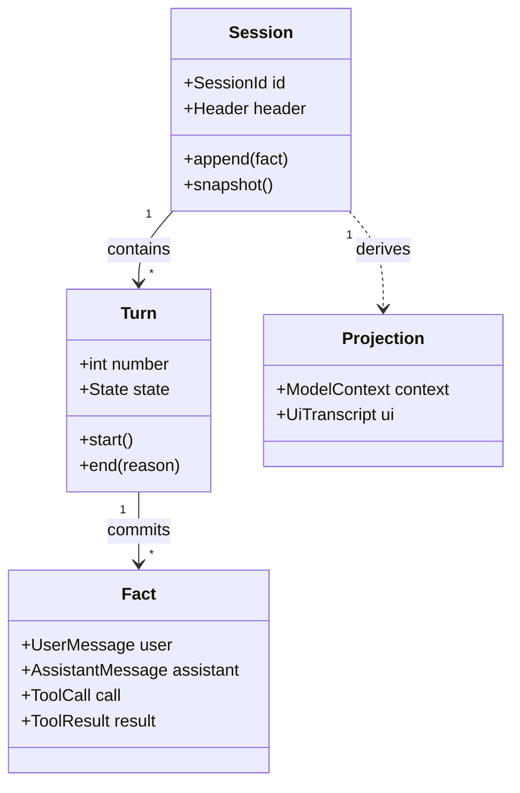

# Session、Turn 与状态模型

## 上一章遗留问题

C-02 解决了单次 Run 的边界：什么时候开始、如何分支、取消后保留什么。但 Run 一结束，新问题立刻出现——下一次请求应该相信什么？

- 屏幕上的对话看起来完整，刷新后却可能消失。
- 日志里有流式片段、失败尝试和工具结果；它们都能进入下一次模型请求吗？
- 进程崩溃后重启，系统从哪条记录开始继续？

这些问题都属于本章：Session 是跨 Run 的权威历史容器，Turn 是其中的执行边界，而状态模型的职责是把「真正发生过的事实」与「临时投影」分开。

## 本章解决什么矛盾

核心矛盾是：同一个系统里存在三种对历史的看法，但只能有一种权威来源。

| 视角 | 典型内容 | 特点 |
| --- | --- | --- |
| 模型上下文 | system prompt、历史消息、工具结果 | 受窗口限制，可压缩或改写 |
| 用户界面 | 流式草稿、按钮状态、错误提示 | 强调即时性，随时可能重置 |
| 权威日志 | 提交后的输入、输出、工具结果、审批事件 | 追加优先，用于恢复和审计 |

如果把三者混在一起，会产生两类事故：界面草稿被当成已发生事实；或者压缩后的上下文被当成完整审计记录。因此，Session 不是「聊天记录数组」，而是有明确写入协议的状态容器。

## 核心不变量

1. **权威事实只能有单一来源。** 同一条工具结果不能同时由 UI 缓存、内存数组和磁盘文件各自宣称有效。
2. **未闭合记录不能作为恢复依据。** 流式 chunk、没有结果配对的 tool call、崩溃前未补终态的 turn，都不能直接进入恢复点。

这两条会直接支撑后续章节：Context 组装只能从权威日志派生投影；事件模型要保证观察者不改变权威顺序；Checkpoint 只能包含闭合事实。

## 理想模型



要点有三条：

1. Fact 由 Turn 提交后归属 Session；没有提交动作的只是候选数据。
2. Projection 从 Session 派生，可以重建，也可以丢弃。
3. 压缩、折叠和摘要改变的是投影，不应该悄悄销毁原始权威日志，除非系统显式声明这是一次破坏性维护。

## 初学者主线

把 Session 想象成项目档案室：

- 每次委托任务是一个 Turn。任务开始时登记，结束时写明完成、取消还是失败。
- 助手的白板草稿、屏幕上的打字效果都是投影。档案室只收定稿和有回执的申请单。
- 工具调用像外出办事的申请；必须有对应的结果回执才能归档。只归档申请、丢失回执，后面的人就分不清事情是否办成。

「发 prompt、收回复」的程序可以只有一个内存数组。但只要满足下面任一条件，就需要真正的 Session 模型：

1. 任务跨多个交互；
2. 会执行工具；
3. 进程可能崩溃；
4. 多个界面需要看到同一份历史；
5. 需要审计谁在何时批准了什么。

这个档案室类比也有失效边界：真实档案室的纸张不会自己变化，而软件 Session 的投影可能被压缩、折叠甚至重写。所以关键不是「存下来」，而是区分哪种存储是权威，哪种存储只是视图。

## 机制深拆

### 边界与身份

Session 至少要回答五个身份问题：

1. 它属于哪个工作目录或租户？
2. 它从哪个父 Session 分叉而来？
3. 子 Agent 的递归深度是多少？
4. 恢复时应使用哪组工具和提示组合？
5. 存储格式版本是什么？

这些字段如果只放在进程内存里，重启后会全部失真。子 Agent 的深度尤其典型：如果只在运行时计数，恢复后一个本该受限的孩子会被误当成顶层任务。

### Turn 与 Step

Turn 回答「这次用户意图从哪里开始、在哪里结束」。Step 通常回答「为了推进这个意图，做了第几次模型调用加工具批」。

```text
Session
└── Turn 12
    ├── step/start {turn: 12, step: 0}
    ├── user/message
    ├── assistant/message（含 2 个 tool call）
    ├── tool/result × 2
    ├── step/end
    └── turn/end {reason: completed}
```

不要用模型请求数当业务进度。一个 Turn 可能只有一次请求，也可能经历十几次 step。命名差异也不重要：Reasonix 的 user turn / step、DeepSeek Harness 的 turn / step、Pi 的 prompt run / loop turn 表达的都是同类边界。

### 提交点与闭合规则

状态模型最重要的设计决策是「什么时候算提交」：

| 记录 | 提交条件 | 不能提交时的处理 |
| --- | --- | --- |
| 用户输入 | 通过校验并进入权威日志。 | 不开启依赖它的 turn。 |
| 助手输出 | 完整消息通过校验，停止原因明确。 | 只保留为流式投影。 |
| 工具调用 | 与最终结果成对，成功或失败都算闭合。 | 标记 dangling，等待修复或补偿。 |
| 审批决定 | 决策者、时间和原因可追溯。 | 未决审批不能伪装成通过。 |

失败路径也要遵守同样纪律：流式中断只保留稳定前缀；崩溃后的孤儿 turn 要么补一个明确的 `interrupted` 终态，要么拒绝静默跳过；损坏日志可以修复，但必须保留「曾经修复过」的可观测痕迹。

### 并发写入

Session 的写入者应该尽量唯一。如果允许多个 goroutine、插件或控制器同时追加，就必须回答：

1. 谁拥有锁？
2. 两个进程同时保存时，谁赢？
3. 落后的一方会不会把新历史覆盖成旧版本？

常见方案有三类：单写者队列、文件锁加 CAS 基线，以及事件溯源的 append-only 写入口。选择哪一种，取决于部署形态是单进程 CLI、桌面应用，还是多实例服务。

### 反例与故障模式

**反例 1：UI 数组就是数据库。**

前端把 `messages` 推进 React state，后端没有独立日志。刷新页面后历史消失；两个标签页显示不同内容；崩溃后无法证明助手说过某句话。

**反例 2：只保存成功的工具结果。**

失败的工具调用被丢弃，只留成功记录。恢复时模型看不到失败尝试，重复提出相同请求；审计也无法解释为什么某些操作没有生效。

**反例 3：压缩时覆盖原始日志。**

为了让上下文变短，程序直接把旧消息从唯一存储里删掉。之后用户要求「回到压缩前的版本」或排查当时的工具返回值，都没有证据可用。

**反例 4：并发保存互相覆盖。**

桌面端和后台同步进程都持有自己的 Session 副本。后台先写入新消息，桌面端随后用旧快照整体覆盖文件，最近几条事实凭空消失。

**反例 5：崩溃后静默截断。**

加载器发现最后一条 JSON 不完整，于是直接丢掉尾部并正常启动。用户不知道有一段历史被删除；下一次请求基于残缺历史继续执行。

### 一条完整因果链

以「崩溃发生在工具调用之后、结果落盘之前」为例：

1. **触发条件**：进程在执行写文件工具后、序列化结果前崩溃。
2. **磁盘事实**：tool call 已在日志中，但没有配对 result；当前 turn 没有 end 记录。
3. **恢复检查**：加载器发现 dangling tool call 和孤儿 turn。
4. **正确行为**：不把它当作已完成事实；查询副作用或生成明确的占位失败结果，并把孤儿 turn 补为 `interrupted`。
5. **后续影响**：模型下一轮能看到「这次调用结果未知」，而不是误以为没有调用过。

如果第 4 步直接删除 dangling call，模型会重复执行写文件；如果假装它成功，又会掩盖未知状态。状态模型的价值就在这种时刻体现。

## 设计取舍

| 方案 | 收益 | 代价 | 适用条件 |
| --- | --- | --- | --- |
| 内存消息数组 | 实现最简单 | 无法恢复、无法多端一致 | 无状态一次性问答 |
| 快照 JSON 文件 | 易读易调试 | 并发覆盖风险高，增量历史难追踪 | 单进程原型 |
| 追加事件日志 | 可审计、可重建投影、可处理崩溃 | 需要 schema 版本和 replay 逻辑 | 生产级 Harness |
| 树状 entry 图 | 支持分支、合并和父子关系 | 导航和压缩策略更复杂 | 需要会话分支的产品 |

从零实现的迁移路径：

1. 先固定 Session ID 和 append-only 写入口，哪怕暂时只写本地 JSONL。
2. 给每类事实定义提交条件和 schema 版本。
3. 再实现投影函数：模型上下文和 UI 都从日志派生。
4. 最后加入锁、CAS 或租约，解决第二个写者出现后的覆盖问题。

## 框架实现对照

三家的差异不是「有没有 Session」，而是选择了不同的权威结构：Reasonix 以受锁保护的消息历史加 CAS 保存为中心；DeepSeek Harness 以带版本的事件溯源为中心；Pi 以树状 JSONL entry 图为中心。

### Reasonix

`Session` 结构体明确列出并发和恢复所需的字段：`mu sync.RWMutex` 保护 `Messages`；`version` 随追加递增；`rewriteVersion` 记录压缩 / 折叠等重写；`persistedRewriteVersion` 必须与同一个 Session 的保存历史比较（`internal/agent/session.go:19-31 @ aa82b2f`）。

```go
// internal/agent/session.go:89-95 @ aa82b2f
func (s *Session) Add(m provider.Message) {
        s.mu.Lock()
        defer s.mu.Unlock()
        s.Messages = append(s.Messages, m)
        s.version++
}
```

注释还规定：run-loop goroutine 内的直接读取可以无锁，因为它与自己串行；跨 goroutine 读取要走 Snapshot（`:15-18`）。

保存协议分成多种意图：普通 `SaveSnapshot` 不能隐藏磁盘上更新的 transcript；`SaveRewrite` 只允许仍持有基线的 Session 执行 rewind、compaction 这类有意重写；`SaveRewriteCompact` 用于红action 等破坏性维护（`save.go:190-219`）。保存前还会拿路径锁和文件锁（`:230-244`）。`LoadSession` 则先取锁，再加载消息；如果发现空工具名、悬挂 tool call 或半截 JSON 参数，会规范化修复，标记 `normalizedDirty`，并保留修复前的 raw transcript 供快照比对（`save.go:1442-1499`）。

精妙之处在于：Reasonix 把「修复」本身变成可观测状态，而不是让用户无感地换一份看似正常的历史。代价是 Session 结构体承担了锁、版本、恢复分支、raw view 和权限授权等多重职责，复杂度集中。

### DeepSeek Harness

DeepSeek Harness 把 Session 建模成事件溯源。`SessionHeader` 保存在事件日志外，包含格式版本、ID、创建时间、cwd、父 Session、seedLength、subagent origin、delegationDepth 和 agentPreset（`packages/core/session/src/types.ts:61-99 @ b150a55`）。注释解释了为什么要持久化 delegation depth 和 preset：递归预算要在重启后存活；恢复到不同工具组合会让历史无法继续执行。

格式版本策略也写在常量旁：只有 header 结构、event envelope、核心事件语义或 surface 机制变化才 bump 主版本；新增普通事件靠每个事件的 `ignorable` 保护词汇增长（`:40-56`）。

`SessionEventMap` 定义了 `turn/start`、`turn/end`、`step/start`、`step/end` 等边界事件；`turn/end` 携带稳定的 `TurnEndReason`（`:236-256`）。模型可见历史不是直接存的数组，而是通过 SurfaceManager 从事件日志派生；append 时先做 surface 校验，失败不会部分污染内存视图（`session/src/index.ts:427-434`、`:530-534`）。

精妙之处是「权威事件」与「派生 surface」分离：压缩和折叠可以作用于投影，事件日志仍能回答发生过什么。代价是实现者必须理解 surface op、sourceEventSeqs 和 ignorable 这些额外概念。

### Pi

Pi Coding Agent 的 Session Manager 使用 JSONL 中的树状 entry。每个 entry 有 `id`、`parentId` 和时间戳；`_appendEntry` 更新内存索引和 leaf，然后 `_persist` 追加一行（`packages/coding-agent/src/core/session-manager.ts:1044-1067 @ c49906e`）。

```ts
// packages/coding-agent/src/core/session-manager.ts:1057-1067 @ c49906e
appendMessage(message: Message | CustomMessage | BashExecutionMessage): string {
  const entry: SessionMessageEntry = {
    type: "message",
    id: generateId(this.byId),
    parentId: this.leafId,
    timestamp: new Date().toISOString(),
    message,
  };
  this._appendEntry(entry);
  return entry.id;
}
```

首次落盘采用批量 flush；之后每次追加一行（`:1029-1041`）。文档进一步区分两类事件：`message_end` 只是过程终点，可以在 entry 插入前发生；`entry_added` 在 durable commit 之后触发，表示这条记录已经可查询（`packages/agent/docs/harness.md:2320-2329`）。

精妙之处在于树状 parent 链天然支持分支和「从某个 leaf 继续」的产品能力；同时用 `entry_added` 明确 durable 边界，避免把 UI 生命周期事件当成持久化证据。代价是读取者必须能沿 parent 链重建线性 transcript，压缩和分支策略也要处理图而不是简单数组。

### 对照表

| 维度 | Reasonix | DeepSeek Harness | Pi |
| --- | --- | --- | --- |
| 权威结构 | 锁保护的消息历史 + event log / checkpoint | 追加事件日志 + 派生 surface | 树状 JSONL entry 图 |
| 身份元数据 | Session 字段与 sidecar 元数据 | `SessionHeader` 显式持久化 | entry 图 + SessionManager 文件 |
| Turn / Step | run-loop 维护 user turn / step | `turn/*` 与 `step/*` 事件 | prompt run / loop turn / message_end |
| 压缩语义 | rewrite version + SaveRewrite 协议 | surface fold / replace | compaction summary entry |
| 崩溃处理 | LoadSession 修复并标记 dirty / damaged | 重载补 `interrupted` 终态 | 只承认 `entry_added` 后的事实 |
| 主要启发 | 修复要可观测，保存要有意图 | 先设计事件与版本，再派生视图 | durable 事件与 UI 事件分层 |

## 实现精妙之处

**Reasonix：CAS 保存防止落后者回滚未来。**

`SaveSnapshot` 的注释强调「不能隐藏磁盘上更新的 transcript」，`SaveRewrite` 只在 Session 仍持有当前基线时允许重写（`save.go:200-212`）。这解决了桌面端和后台同步互相覆盖的经典问题。代价是保存路径要管理 digest、revision、recovery branch 和 raw view。

**DeepSeek Harness：把兼容性问题前置成版本规则。**

`SESSION_FORMAT_VERSION` 注释给出清晰判断标准：旧 runtime 是否还能语义正确地读新日志；「解析不报错」不算正确（`types.ts:40-47`）。新增事件默认 ignorable，避免每个小功能都迫使全链路迁移。代价是作者必须认真区分结构性变化和词汇增长。

**Pi：用 `entry_added` 切开过程终点与持久终点。**

`message_end` 可以驱动 UI，但只有 `entry_added` 表示可查询的 durable fact（`harness.md:2329`）。这个命名上的区分让订阅者不必猜测「看到了事件是否等于能恢复」。代价是事件消费者要多理解一层生命周期，产品代码也不能偷懒地把两者混用。

## 自检与面试追问

基础自检：

1. 你的系统里，哪份数据是权威日志？模型上下文和 UI 分别怎么从它派生？
2. 一条工具调用在什么条件下算闭合？
3. 压缩摘要后，原始日志去哪了？
4. 如果两个进程同时保存 Session，你的方案如何决定胜者？
5. 加载损坏日志时，系统会静默截断、拒绝启动，还是修复并留下痕迹？

面试追问：

1. 设计一个支持会话 fork 的存储格式时，你会选事件溯源还是树状 entry？两种方案如何表达「继承前缀」？
2. 为什么「delegation depth」必须放进持久 header，而不能只在运行时计数？
3. 如果要求删除某段敏感内容且磁盘上不可恢复，追加式日志需要额外做什么？
4. 如何向初学者解释 `message_end` 与 `entry_added` 的区别？
5. 你如何在代码评审中发现「UI 投影正在悄悄变成权威状态」？

## 交给下一章的问题

现在有了权威日志和投影的边界，但新问题是：状态变化如何被外部世界及时知道？

- 谁发布事件？事件顺序以谁的写入序为准？
- UI 的流式更新和持久事件的投递有什么区别？
- 观察者能不能阻塞或修改权威流程？

[下一章](./events-and-streaming.md)讨论事件模型与流式输出。

## 相关页面

- [上一节：一次 Agent Run 的完整生命周期](./agent-run-lifecycle.md)
- [教材目录](../TOC.md)
- [术语表](../09-glossary/glossary.md)
