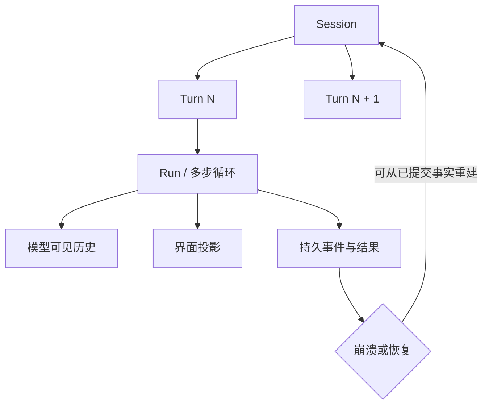

# Session、Turn 与状态模型

## 一句话结论

会话（Session）是跨越多次交互的持久容器；回合（Turn）是一次用户输入到一次响应的边界。线束（Harness）必须把「模型可见历史」「界面状态」和「恢复所需的持久事实」分开。否则流式中断、取消或崩溃会让三者互相污染。

## 理想模型

会话回答「这段工作属于哪条连续上下文」。回合回答「这次用户输入到哪里结束」。运行（Run）或多步循环回答「为完成这个回合执行了多少次推理、工具调用和审批」。三者可以嵌套，但边界必须显式。

状态有四类职责：

| 状态类型 | 典型内容 | 主要用途 | 是否应直接给模型 |
| --- | --- | --- | --- |
| 身份与配置 | Session ID、工作目录、权限、预算 | 隔离、审计和恢复 | 通常不整体暴露 |
| 对话历史 | 用户、助手、工具结果 | 组装下一次模型请求 | 是，经筛选后 |
| 过程状态 | 流式片段、当前步骤、待执行调用 | 渲染和控制生命周期 | 否 |
| 持久事实 | 已提交事件、工具结果、审批决定 | 审计、重放和断点恢复 | 选择性进入上下文 |

关键约束是提交点。未完成的助手草稿可以更新界面。只有完整消息，或成对的工具调用与结果成为持久事实后，才能作为可靠恢复依据。取消也不等于清空：已执行的副作用和已收到的观察仍要保留，并标记中断原因。

## 小白解释

把会话想成一个项目档案夹。每个回合是一次「你提出请求、助手交付回应」的对话。助手中间可能多次思考和使用工具，这些内部动作组成运行。

屏幕上逐渐出现的字像白板上的草稿。刷新页面后草稿可能消失；档案夹里的正式记录才是后续工作的依据。好的线束会规定什么时候把白板内容誊写进档案夹。

如果任务中途停电，系统不应假装什么都没发生。它应保留已完成步骤、失败原因和下一步入口，让新进程接着旧档案继续。

## 机制拆解

### 边界划分

一个 Session 可以包含多个 Turn。一个 Turn 可能触发零次或多次模型请求。存在工具循环时，多次请求共同服务同一个用户意图。不同框架对 `Run`、`Turn` 和 `Step` 的命名不同。教材先保留理想边界，再在框架对照中说明命名差异。

### 状态更新

回合开始时，线束记录输入来源、回合编号、约束和预算。模型输出时，线束先累积流式片段，再形成完整消息。如果消息包含工具调用，线束应把调用与结果配对保存；只保存成功结果会造成审计缺口。

### 提交与恢复

持久层至少要能区分三类记录：已确认的用户输入、完整的助手输出，以及成对的工具调用与结果。恢复时，系统按顺序重放这些记录，重建模型可见上下文。界面草稿和临时运行时数据可以丢弃。

### 失败分支

- **流式中断**：保留已经稳定的前缀，并标记 `interrupted`。
- **工具失败**：保存失败结果，让模型和审计者都能看到原因。
- **用户取消**：关闭当前 Turn，但不清除已发生的事实。
- **进程崩溃**：加载端识别未闭合边界，补齐安全的中止标记或拒绝静默跳过。

## 框架对照

下表是初稿证据索引，统一 Implementation Review 将逐项核对路径和行为：

| 框架 | Session 与状态实现 | Turn / Step 表达 | 关键锚点 |
| --- | --- | --- | --- |
| Reasonix `aa82b2f` | `internal/agent/session.go` 定义带锁的 `Messages`、版本、持久化和修复字段；`Save` 与 `LoadSession` 支持事件日志、兼容 JSONL、损坏修复和规范化。 | 用户回合由 `beginRunTurn` 初始化；工具循环中的 step 继续扩展同一回合历史。每用户回合创建 checkpoint。 | `internal/agent/run_loop.go:125`、`:245`、`:616`；`docs/CHECKPOINTS.zh-CN.md:26` |
| DeepSeek Harness `b150a55` | Session 是仅追加事件源；LLM 消息由有序 surface 派生。事件带单调 `seq`、时间、可选 `ignorable` 标记和 source 引用。 | 循环写入 `turn/start`、`turn/end`、`step/start`、`step/end`；中止原因包括 completed、aborted、blocked、error、max-tokens 和 interrupted。 | `packages/core/session/src/types.ts:61`、`:155`、`:236`；`packages/core/agent-loop/src/agent.ts:255`、`:279`、`:319` |
| Pi `c49906e` | 编码代理在 `message_end` 后把 user、assistant、toolResult 和 custom 消息交给 `SessionManager`；底层会话状态校验父子链，JSONL 存储以 header 加追加行表达。 | Agent 事件使用 `turn_start` / `turn_end`；文档强调 `message_end` 只是过程终点，`entry_added` 才证明 durable entry 可查询。 | `packages/coding-agent/src/core/agent-session.ts:650`；`packages/coding-agent/src/core/session-manager.ts:1039`；`packages/agent/docs/harness.md:2329` |

三家的共同点是：都把跨交互历史放进可持久化 Session，都在回合内维护多步执行。差异在于 Reasonix 以消息历史和 sidecar checkpoint 为中心，DeepSeek Harness 以事件溯源和派生 surface 为中心，Pi 把编码代理事件桥接到树状 JSONL 会话。

## 常见坑

- **把 UI 当真源。** 流式文本只是投影；刷新后必须还能从 Session 重建。
- **混淆 Turn 与模型请求。** 一个 Turn 可能包含多个 step，不能按请求数统计用户回合。
- **只保存最终答案。** 工具调用、失败和审批同样是恢复所需事实。
- **让并发写入共享历史。** Session 应有唯一提交者或明确锁协议。
- **崩溃后静默截断。** 未闭合的 turn 或缺失的工具结果必须被修复、标记或拒绝。

## 自检与面试追问

1. 这次输入为什么开启新 Turn，而不是并入上一个 Turn？
2. 哪些状态可以在进程重启后丢弃？哪些必须持久化？
3. 助手流式输出中断时，系统应保留多少前缀，如何防止它伪装成完整回复？
4. 工具调用已执行但结果未落盘时，恢复逻辑应重试、补偿还是标记未知？
5. 如果三家框架术语不同，你会用什么不变量比较它们的 Session 模型？

## 相关页面

- [上一节：一次 Agent Run 的完整生命周期](./agent-run-lifecycle.md)
- [术语表](../09-glossary/glossary.md)
- 下一节：事件模型与流式输出（待撰写）
- [教材目录](../TOC.md)
