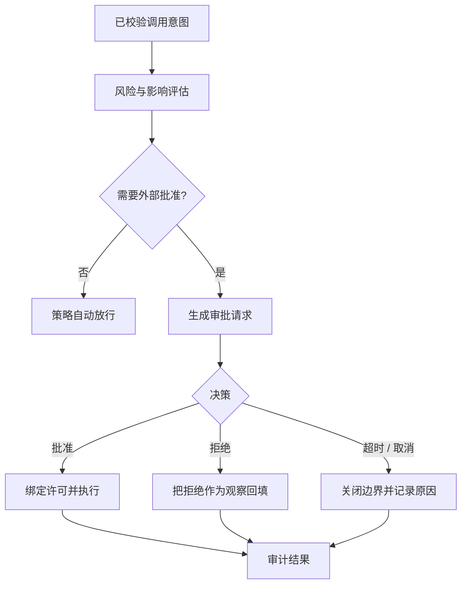

# 审批模型

## 一句话结论

审批是在副作用发生前插入的可问责决策点。它不是弹窗装饰，而要回答五个问题：谁有权批准、看到什么证据、允许哪个确切动作、拒绝后如何继续、决定如何进入审计。缺少任何一项，用户要么被无意义打断，要么在不知情时授权危险操作。

## 理想模型

审批决策至少有五种终态：

| 状态 | 含义 | 对 Run 的影响 |
| --- | --- | --- |
| 批准 | 允许本次或限定范围内的调用。 | 绑定决策 ID 后进入执行器。 |
| 有条件批准 | 只允许修改后的参数或资源范围。 | 线束（Harness）必须重新校验，不能直接改写意图。 |
| 拒绝 | 不执行当前动作。 | 返回稳定观察，让模型选择替代方案。 |
| 撤销 / 过期 | 决策在执行前失效。 | 重新发起审批或终止分支。 |
| 无法决策 | 用户离线、服务错误或权限不明。 | 默认失败关闭（fail closed）。 |

## 小白解释

审批像装修前的物业确认。你不能只问“能不能施工”，还要说明哪一天、哪个房间、是否动承重墙、垃圾怎么运走。物业批准的是这份具体方案，不是永久允许你拆任何墙。

如果住户拒绝，装修队要把“不能动这面墙”记下来，再提出绕线方案；不能假装没人回答就继续开工。审批单也要保存，方便以后查责。

## 机制拆解

### 审批对象

审批对象不应只是工具名。同一个 `write_file` 工具，创建临时日志和覆盖部署配置的风险完全不同。理想请求包含工具、规范化参数、目标资源、差异预览、风险级别、来源回合和过期时间。这样审批者能判断真实影响，而不是凭名字猜测。

### 风险分级与策略

常见输入包括：是否写文件、写入路径是否在工作区、是否联网、是否安装依赖、能否执行任意命令、影响面是单文件还是仓库、是否有补偿方式。策略可以先自动放行低风险只读操作，把难逆或外部可见动作交给人工；企业环境还可按角色、项目和时间窗口限制。

### 请求投影

给用户的界面应显示关键证据：命令、文件 diff、目标 URL、受影响资源、预算和不可撤回性。长输出要折叠，但不能隐藏关键变化。机器可读的原始审批请求和用户看到的投影都应保存，便于区分“信息不足”和“用户拒绝”。

### 拒绝与替代路径

拒绝必须成为模型可见观察，而不是静默吞掉。返回内容应包括稳定分类、用户可选提示和约束摘要，例如“只能读取 `src/`”。模型可以修改方案重新申请；重复越权则应升级暂停或交给人类接管。

### 并发、超时和审计

多个待审批项要有顺序和归属，避免批准 A 却误放行 B。审批请求应有过期时间和取消信号。每条审计记录至少包含决策者、决策时间、原始意图、显示投影、决策结果、绑定范围和后续执行结果。

## 框架对照

下表只建立初稿证据索引，具体行为由批量 Implementation Review 核对：

| 框架 | 审批线索 | 关键锚点 |
| --- | --- | --- |
| Reasonix `aa82b2f` | Agent 层存在未知工具和门控逻辑；Run 循环维护工具分支。 | `internal/agent/run_loop.go`、`internal/tools` |
| DeepSeek Harness `b150a55` | 注册层应用前置策略；具体工具执行前仍有声明校验。 | `packages/core/agent-loop/src`、工具注册相关 package |
| Pi `c49906e` | 通用循环查找并校验工具，宿主钩子可阻断调用。 | `packages/agent/src`、`packages/coding-agent/src/core/agent-session.ts` |

## 常见坑

- **按工具名一刀切。** 低风险读和高风险写被混在同一规则里，安全性和体验都会变差。
- **只展示自然语言摘要。** “更新配置”掩盖了删除字段或开放公网的真实变化。
- **批准后无限期有效。** 环境或参数改变时应要求重新授权。
- **拒绝不回传。** 模型不知道失败原因，会重复申请或选择更危险绕路。
- **默认放行未知。** 权限不明、审批服务异常或参数漂移时必须失败关闭。

## 自检问题

1. 同一个工具在哪些条件下应从自动放行变成人工审批？
2. 用户批准“查看 `/tmp/a.log`”后，能否复用该决定读取 `/etc/passwd`？为什么？
3. 拒绝观察应包含哪些字段才能支持下一步修正？
4. 审批服务和执行器之间如何避免竞态？

## 相关页面

- [教材目录](../TOC.md)
- [Tool Schema 与调用协议](./tool-schema.md)
- [Tool 执行与副作用](./tool-execution.md)
- [术语表](../09-glossary/glossary.md)
