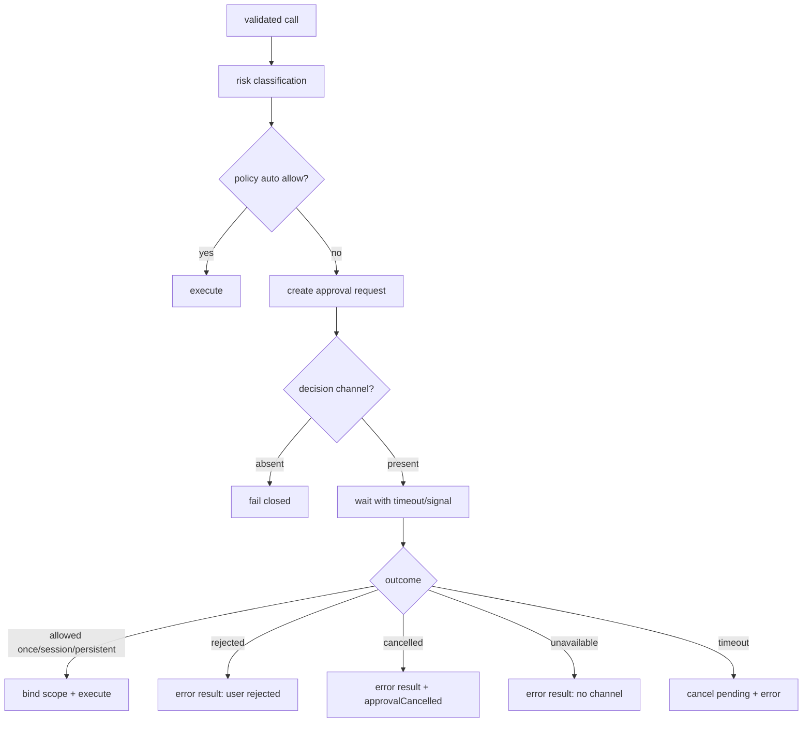
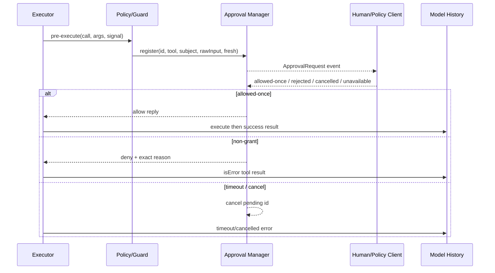

## 一句话结论

审批是在副作用发生前插入的可问责决策点：请求必须携带确切工具输入和风险证据；策略可以先自动放行低风险操作；人工/fresh 决策不能被自动模式吞掉；批准只覆盖声明范围；拒绝、取消和审批通道不可用都要变成带原因的 error result。没有可用决策者时，正确答案是失败关闭。

## 上一章遗留问题

M-05 让结果可信，但有些动作一旦执行就无法用“结果说明”弥补：删除分支、发布包、扩展写目录、修改受保护配置。M-06 回答：谁在哪个阶段决定？等待用户时 Run 如何阻塞与取消？“不允许”如何回到模型？

## 本章解决什么矛盾

每次写文件都弹窗会让自动化不可用；完全不问又会把不可逆操作交给概率性模型。审批系统必须在三个维度同时收敛：

1. **风险粒度**：按工具名太粗，需要结合 subject/args/paths/diff；
2. **授权范围**：once/session/persistent/task-scoped 各有失效条件；
3. **失败语义**：无 UI、超时、取消、服务卸载都不能默认允许。

Reasonix 用 approval manager 和 fresh/human 标记解决自动模式与关键确认冲突；DeepSeek Harness 把 ask 映射为 allowed-once/rejected/cancelled/unavailable 四种结果；Pi 用 before-call hook 的 block/reason/terminate 提供宿主策略接缝。

## 核心不变量

1. **未决即不执行**：审批返回前，目标副作用不得开始；已开始的无关副作用另行记录。
2. **决策绑定请求**：ID 关联 tool/subject/rawInput/reason；不能批准 A 放行 B。
3. **范围显式**：allow_once、allow_session、allow_persistent 或 task grant 必须区分，过期后重新询问。
4. **fresh 不可自动放行**：标记 requireHuman/fresh 的决策不会被 auto/yolo drain，hook allow 意见也被忽略。
5. **非授权终态可见**：rejected/cancelled/unavailable/timeout 都生成稳定 error observation，并保留审计差异。
6. **deny 可组合**：任何 guard/policy 可以拒绝；没有任何机制能 force-allow 另一个层已经拒绝的调用。

失效边界在于异步世界：用户看到卡片后 session 可能切换，approval 服务可能卸载，context 可能先取消。实现必须在 resolve 时再次校验 pending 状态，而不是相信旧 ID 永远有效。

## 理想模型



| 终态 | 用户语义 | 模型可见 | 审计要点 |
| --- | --- | --- | --- |
| allow_once | 只允许这一次 | 正常继续 | 决策者、时间、rawInput |
| allow_session | 本次会话同类请求可自动 | 正常继续 | scope key、subject 规则 |
| allow_persistent | 写入权限规则 | 正常继续 | 规则文件、来源 |
| task grant | 当前任务内限定操作 | 正常继续 | task ID、exact target |
| rejected | 人明确说不行 | “user rejected ...” | 原始投影与 reason |
| cancelled | 用户/上游取消等待 | cancellation reason | approvalCancelled=true |
| unavailable | 无审批通道 | distinct unavailable reason | 服务状态 |
| timeout | headless 防挂起 | timeout error | pending cancel |



## 初学者主线

把审批当装修许可：

- 申请单写明房间、日期、是否动承重墙（tool + args + diff）；
- 物业有小事故免报备清单（policy auto allow）；
- 拆承重墙必须业主签字（fresh human）；
- 批准只对这张图纸有效（scope）；
- 物业下班时不能替业主签字（unavailable → deny）；
- 业主拒签后施工队要把原因带回设计会（model-visible rejection）。

### 什么该问人

优先人工的信号：

- 难逆或外部可见副作用；
- workspace 外写入、扩权、受保护配置；
- 自动重试后的新 mutation；
- 与原计划 risk/scope 变化的 recovery 动作；
- opaque bash/MCP 无法证明只读；
- 连续 blocked 后仍尝试类似调用。

### 什么可以自动放行

满足全部条件才考虑：

- 静态或 invocation-level 可证只读；
- 资源在允许 root 内；
- 无外部可见副作用；
- 有成本/时间上限；
- 策略规则来自可信配置而非模型文本。

## 机制深拆

### 1. 请求对象的最小字段

```text
id             决策关联键
tool           canonical tool name
subject        目标资源/命令摘要
reason         为什么需要审批
raw_input      exact structured args
diff/preview   文件前后像、URL、影响面
fresh          是否必须当前人类决策
kind           tool / plan / recovery / write_access
scope_hint     once/session/persistent/task
expires_at     headless 超时
signal         取消传播
```

只有工具名会诱导“记住允许 write_file”这种危险泛化。

### 2. 授权范围与缓存失效

- **once**：本次 callId 执行完即失效；
- **session**：绑定会话与 subject 规则，session 切换不继承；
- **persistent**：写入权限配置，应可审查、撤销；
- **task grant**：绑定任务目标和精确操作，任务结束失效；
- **plan execution window**：计划批准后的临时窗口，回合结束关闭。

任何环境变化——cwd、workspace root、目标文件 hash、策略版本——都应使旧 grant 不再匹配。

### 3. 等待期间的并发控制

多个 prompt 要有队列顺序；同一 subject 的新请求可能在等待中已被 session grant 覆盖，因此从队列取出后要 re-check。前端重连时应 replay 未决 prompts；queued 但尚未显示的 ask 不能被误认为已展示。取消路径要 clear pending，但被阻塞的 waiter 通常靠 ctx 解除。

### 4. Hook 与策略的权力边界

普通 policy hook 可以 deny；某些框架允许 hook auto-allow，但 fresh-human 决策必须忽略其 allow。这样插件无法替用户批准拆墙，而拒绝始终安全。

### 5. 拒绝观察的设计

最小内容：

```text
is_error=true
classification=rejected | cancelled | unavailable | timeout
human_reason（可选）
constraint_summary（例如只能读 src/）
next_action_hint（修改方案 / 请求扩权 / 停止）
audit_id
```

不要把完整内部堆栈给模型；也不要只说 “failed”，否则它会重试同样动作。

## 反例与故障模式

1. **按工具名记忆授权**
   - 触发：用户允许一次 `bash`，系统记住所有 bash。
   - 因果：下一次命令删除目录。
   - 正确边界：subject/rawInput 参与规则；opaque bash 默认不持久化。
2. **auto 模式吞掉 fresh 卡片**
   - 触发：用户切到 yolo 时，屏幕上还挂着 write-access approval。
   - 因果：关键扩权被自动放行。
   - 正确边界：fresh/requireHuman 不参与 auto-drain。
3. **审批服务缺失默认允许**
   - 触发：headless 环境没有 approval provider。
   - 因果：本应询问的动作静默执行。
   - 正确边界：degrade to deny，并返回 unavailable reason。
4. **批准 A 放行 B**
   - 触发：两个同 subject prompt 并发，UI 返回 ID 错绑。
   - 因果：错误命令执行，审计无法解释。
   - 正确边界：pending map 按 ID resolve；promptMu 内 re-check。
5. **hook 替用户 allow**
   - 触发：第三方插件对 PermissionRequest 返回 true。
   - 因果：绕过人类确认。
   - 正确边界：hook allow 对 fresh/requireHuman 无效；deny 始终生效。
6. **拒绝静默丢失**
   - 触发：UI 直接关闭弹窗，循环继续下一工具。
   - 因果：assistant call 没有配对 result，模型重复申请。
   - 正确边界：cancel 也生成 error result，保持 batch 完整。
7. **timeout 后仍执行**
   - 触发：等待 goroutine 泄漏，reply 很晚到达。
   - 因果：用户以为已放弃，动作却发生。
   - 正确边界：cancel pending；晚到 reply 不触发副作用。
8. **session 切换后回答旧卡**
   - 触发：reconnected frontend 看到上一 session 的 recovery card。
   - 因果：授权作用于错误上下文。
   - 正确边界：rotation 清理特定 kind，snapshot replay 绑定当前会话。

## 一条完整因果链

假设 Agent 要扩展写目录到 `/Users/me/archive`：

1. `write_file` 参数结构合法，但 confine 发现路径在 writable roots 外且命中 write_access 流程。
2. Controller 构造 `Approval`：Kind=write_access、Fresh=true、RawInput=原始 JSON、payload 包含 directories/display directories/justification/PersistAllowed。
3. `registerWriteAccess` 创建 pending，标记 fresh+requireHuman，即使当前是 yolo 也不 auto-drain。
4. Sink 发出 ApprovalRequest；交互端显示将新增哪些目录，而不是只显示工具名。
5. 用户选择“仅本次允许”。Controller 将 outcome 记录为 allow_once，并通过 reply channel 返回 allow。
6. 执行器获得授权，confineWrite 通过；文件写入成功，workspace mutation receipt 记录路径。
7. 下一次请求 `/Users/me/other` 时旧授权不匹配，重新进入审批。
8. 若用户当时拒绝，则 outcome=deny 进入 decision receipt，模型收到 “blocked by user” 类观察，转而请求把输出写到工作区。

这条链的关键是：授权范围、人类终局权和审计记录在同一个对象上闭合。

## 设计取舍

| 决策 | 收益 | 代价 | 适用条件 |
| --- | --- | --- | --- |
| 全部人工审批 | 最安全 | 自动化几乎不可用 | 高度敏感生产 |
| 策略自动 + 异常人工 | 平滑体验 | 策略维护复杂 | 有成熟规则引擎 |
| once-only 授权 | 范围最小 | 重复打断 | 不可逆外部动作 |
| session grant | 减少重复 | 会话内扩大风险 | 同一 subject 明确可信 |
| persistent rules | 长期效率 | 配置漂移需治理 | 团队固定工作流 |
| hook auto-allow | 插件灵活 | 可能绕过人类 | 必须排除 fresh |
| timeout fail closed | 防 headless 挂起 | 无人值守任务中断 | bot/API 场景 |

迁移路径：先把所有拒绝变成结构化 error result；再引入 request ID/rawInput 审计；然后区分 once/session/persistent；最后加入 fresh-human 例外和 monotonic guards。不要从“记住我的选择”开始，它最难撤销。

## 框架实现对照

以下路径均绑定固定快照；行号已在当前 `external/` 树核对。

| 框架 | 审批机制 | 关键锚点 |
| --- | --- | --- |
| Reasonix `aa82b2f` | Approval 结构携带 ID/tool/Subject/RawInput/Fresh/Kind/Recovery/WriteAccess；approvalManager 维护 pending、grants、auto/yolo posture、timeout；requestApproval 先 pre-approved，再 prompt lock re-check，hook deny 生效但 fresh 忽略 hook allow；waitContext 支持 timeout，select 返回后 cancel pending。 | `internal/event/approval.go:5-67`、`internal/control/approval.go:18-91,284-332,547-552`、`internal/control/controller.go:6116-6188` |
| DeepSeek Harness `b150a55` | pre-execute waterfall 返回 ask；serviceAsk 无 approval/agent 时 degrade to deny；approval.request 映射 allowed-once/rejected/cancelled/unavailable，cancelled 单独标记 approvalCancelled；guard 是 monotonic denial，pre-execute 后统一应用。 | `packages/core/tools/src/index.ts:1678-1729`、`packages/core/tools/src/index.ts:1463-1503`、`packages/core/tools/src/index.ts:1100-1128` |
| Pi `c49906e` | AgentLoopConfig.beforeToolCall 在 validation 后执行，接收 abort signal；block 生成 immediate error result，reason 成为错误文本，terminate 参与 batch early termination；extension ToolCallEvent 可 mutate input 并 block，但文档明确 mutation 后不重新验证。 | `packages/agent/src/types.ts:56-69,97-107,270-277`、`packages/agent/src/agent-loop.ts:600-668`、`packages/coding-agent/src/core/extensions/types.ts:914-918,1087-1095` |

### Reasonix：fresh 决策、作用域回复与超时

Reasonix 的 `event.Approval` 不是简单字符串：ID 用于关联 controller reply；RawInput 是 exact structured input，供 ACP permission client 使用；Fresh 表示 current human decision required、不要提供 remembered grants；Kind 区分 tool、plan、recovery、write_access（`external/DeepSeek-Reasonix/internal/event/approval.go:5-24`）。WriteAccess payload 包含 directories、display directories、justification、BroadHomeAccess、OrdinaryPermissionNeeded 和 PersistAllowed；Recovery payload 还包含 failed/next action、change kind/rationale 和 task grant scope（`:26-67`）。

`Approve` 兼容旧客户端：writeAccess 走 ResolveApproval + scope；recovery gate 映射 continue/revise；普通 approval 根据 persist/session/once 得到 allow_persistent/allow_session/allow_once，并调用 recordDecisionReceipt 后向 pending.reply 发送（`external/DeepSeek-Reasonix/internal/control/approval.go:18-58`）。approvalManager 注释强调它是 leaf：只管理 bookkeeping，不做 orchestration，因为 approval blocks on user input 且有 side effects（`:60-91`）。runtime posture 定义了 ask/auto/yolo：yolo 跳过 ordinary prompts，但 deny rules 和 fresh decisions remain enforced（`:82-86`）。

注册侧把 fresh/requireHuman 与 auto-drain 分开：只有两者皆 false 时才检查 `autoApprovalWouldAllowLocked`；WriteAccess 一律 fresh+requireHuman（`:284-332`）。`requestApprovalDecisionWithOptions` 在拿 promptMu 前后两次 pre-approved check，处理排队期间新 session grant；Claude PermissionRequest 合同可以同步 auto-allow/auto-deny 并 preempt prompt，但 native hook 只是 advisory；hook auto-allow cannot replace a fresh-human decision，deny 仍 universal（`external/DeepSeek-Reasonix/internal/control/controller.go:6116-6153`）。随后 emit ApprovalRequest、触发 Notification hook，并用 waitContext 包住 select；timeout 到达时 `cancel(id)` 并返回 waitCtx.Err()（`:6155-6183`）。

### DeepSeek Harness：四种审批终态与 monotonic deny

DeepSeek Harness 把审批放在 pre-execute waterfall。`serviceAsk` 的注释直接给出失败语义：deployment 没有 ApprovalService 时 degrade to deny；service mid-session unmount 下一次也 degrade；agent-less execution 没有 session/UI route，也 degrade（`external/deepseek-harness/packages/core/tools/src/index.ts:1678-1688`）。存在服务时，`approval.request` 收到 agent、toolName、callId、reason 和 exec.signal。

结果映射刻意区分三种 non-grant：`rejected` 是 “the user rejected tool X”；`cancelled` 是 “approval was cancelled”，并返回 `approvalCancelled: true`，让外层把它与 caller cancellation 合并成 aborted-before-dispatch；`unavailable` 是 “no approval channel is available”（`:1706-1727`）。因此模型不会把“人说不”误解为“系统坏了”。

调度器在 pre-execute 后应用 decision；若 caller 已取消且 approval 也 cancelled，则返回 aborted-before-dispatch；decision 非 allow 或 guard 给出 denial reason 时，生成 `Error: <reason>` 的 isError result（`external/deepseek-harness/packages/core/tools/src/index.ts:1463-1503`）。guards 本身是 monotonic：any matching guard may deny，while no guard can force-allow a call another guard denied；global 与 scope chain 按序取第一个 denial（`:1100-1128`）。

### Pi：validation 后的单点 block 门

Pi 的 `BeforeToolCallResult` 只有三个字段：block、reason、terminate。文档规定 block 阻止执行，loop emits an error tool result；reason becomes the text shown in that error result；terminate 参与 batch early-termination（`external/pi/packages/agent/src/types.ts:56-69`）。`BeforeToolCallContext` 提供 assistantMessage、raw toolCall、validated args 和 current context（`:97-107`）；配置注释强调 hook 在 arguments validated 后调用、接收 agent abort signal，并负责 honor 它（`:270-277`）。

Agent loop 中这发生在 `prepareToolCall`：找不到工具立即 immediate error；prepareArguments 后 validateToolArguments；然后才 await beforeToolCall。若 signal 已 aborted，也返回 “Operation aborted” immediate result；block 则用 reason 或默认文案创建 error result；validate/hook 抛错同样变成 error result（`external/pi/packages/agent/src/agent-loop.ts:600-668`）。这样 rejected call 保持 tool/result 配对，batch 其他调用不被破坏。

coding-agent extension 层另有 ToolCallEvent：`event.input` mutable，handler 可就地 patch arguments；文档警告 later handlers see earlier mutations，No re-validation is performed after mutation（`external/pi/packages/coding-agent/src/core/extensions/types.ts:914-918`）。`ToolCallEventResult` 同样支持 block/reason/terminate（`:1087-1095`）。这是一个更底层、更高能力的接缝，适合 trusted extensions；通用审批仍应走 loop config 的 validated-args 门。

## 实现精妙之处

1. **Reasonix 的 RawInput 字段**：审批客户端不必解析人类标题，可以直接对 structured args 做策略和展示，降低误批概率。
2. **Reasonix 的 fresh + requireHuman 双标志**：把“这次必须人来定”从 runtime mode 中独立出来，yolo 切换无法吞掉已显示的关键卡片。
3. **Reasonix 的 promptMu 前后双检**：排队期间 session grant 可能落地，避免同一 subject 重复弹窗，又不跳过刚到的变化。
4. **DeepSeek Harness 的四态映射**：allowed-once/rejected/cancelled/unavailable 分别生成不同 reason，cancelled 还单独暴露 approvalCancelled，便于与 caller abort 合并。
5. **DeepSeek Harness 的 monotonic guard**：多租户策略叠加时，“任何一个 deny 都赢”比复杂优先级更容易推理。
6. **Pi 的 immediate error result**：not found/validation/blocked/abort 都走同一配对协议，batch 不会因一个拒绝失去其他观察。
7. **Pi 对 extension mutation 的显式警告**：允许高能力 patch，同时明确不再验证，把责任交回 trusted extension。

## 自检与面试追问

1. 如果用户批准了一个 diff，但执行前文件已被其他人修改，你的系统应该重新审批还是执行？两种选择的审计后果是什么？
2. 如何设计 task-scoped grant，使其不能被复制到另一个任务？需要绑定哪些不可伪造字段？
3. 一个审批服务返回 500。为什么不能降级为 allow？请写出模型可见文本和审计事件。
4. 多个 guard 中一个 deny、一个 allow，为什么必须取 deny？如果业务确实需要 override，应引入什么新对象而不是 force-allow？
5. headless 环境设置 approvalTimeout 后，用户在第 timeout+1 秒点击 approve，系统应如何处理迟到 reply？
6. 请为一个“发布 npm 包”工具设计审批请求字段、预览内容和四种非授权终态文案。

## 交给下一章的问题

审批解决“人是否同意”，但不保证同意后的进程真的被困在边界里：shell 可以再 fork、网络可以直连、脚本可以读写任意路径。M-07 将拆解 Sandbox 与权限：如何把声明式能力变成操作系统级默认拒绝。

## 相关页面

- [教材目录](../TOC.md)
- [Tool 执行与副作用](./tool-execution.md)
- [Sandbox 与权限](./sandbox.md)
- [术语表](../09-glossary/glossary.md)
