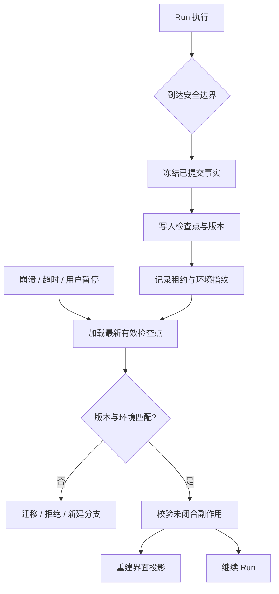

# Checkpoint 与 Resume

## 一句话结论

Checkpoint 是在一致边界上保存的最小恢复依据，Resume 是带验证规则从旧事实进入新进程。可靠方案不只保存“当前步骤”，还保存会话身份、已提交事件、工具结果、审批决定、预算和环境指纹，并明确哪些未闭合调用必须查询、补偿或拒绝。

## 理想模型

理想检查点至少包含：

| 字段组 | 内容 | 恢复用途 |
| --- | --- | --- |
| 身份 | Session ID、Run ID、Turn ID、schema 版本 | 防止串会话和误升级 |
| 历史 | 已提交用户输入、助手输出、工具调用与结果 | 重建上下文 |
| 决策 | 审批结果、权限范围、策略版本 | 避免恢复后越权 |
| 进度 | 当前 Step、下一步入口、预算余量 | 从正确位置继续 |
| 外部状态 | 后台任务 ID、锁、租约、幂等键 | 查询或补偿未知结果 |
| 环境 | 工作区路径、代码版本、容器镜像、宿主信息 | 判断能否安全复用 |

## 小白解释

把 Checkpoint 想成登山途中的路条。你不会每走一步都写一次，而是在岔路口、补给点和危险段前后写下位置、剩余物资和天气。第二天救援队看到路条，就知道哪些路线已走过、帐篷里有什么、不能重复带哪些装备。

Resume 不是直接按下播放键。新进程要先确认地图版本相同、帐篷还在、没有另一支队伍正在使用同一营地，然后才能按路条继续。

## 机制拆解

### 写入时机

常见时机包括每个 Turn 结束、危险工具执行前、审批通过前、长任务周期性间隔、预算即将耗尽和收到关闭信号。写入频率要平衡恢复粒度和性能：高频小写入适合交互式任务，低频大快照适合批处理。

### 一致性边界

Checkpoint 必须在事务边界或逻辑提交点生成。文件数据库可以原子写临时文件后 rename；事件溯源系统只需记录最后已确认事件序号；跨服务状态要用版本号或两阶段确认。不要把内存中的流式草稿、未审批参数或未提交 UI 状态混进权威检查点。

### Resume 流程

1. **发现**：按 Session 和 Run ID 找到最新有效检查点，而不是只取最新时间戳。
2. **验证**：检查 schema 版本、校验和、权限、租约和工作区指纹。
3. **对账**：查询未闭合的外部任务，识别部分完成和状态未知。
4. **重建**：从已提交事件重建上下文和界面投影。
5. **续跑**：重新申请预算和租约，再打开下一个边界。

如果工作区已被清理、依赖版本不同或另一个进程仍持有租约，应要求人工选择：迁移、放弃、新建分支或等待。

### 崩溃一致性

进程可能在写入一半时消失，因此检查点要有版本、校验和、备份指针或追加日志；加载器要能识别损坏文件并回退到上一个有效点。Reasonix 的文档快照显示其 checkpoint 设计包含损坏修复和兼容 JSONL；该行为属于待审事实，统一审查时会核对源码路径。

## 框架对照

下表只建立初稿证据索引，具体行为由批量 Implementation Review 核对：

| 框架 | Checkpoint 线索 | 关键锚点 |
| --- | --- | --- |
| Reasonix `aa82b2f` | Session 支持保存、加载、事件日志、兼容 JSONL、损坏修复和规范化。 | `internal/agent/session.go`、`docs/CHECKPOINTS.zh-CN.md` |
| DeepSeek Harness `b150a55` | ReactLoopAgent 从持久会话日志派生请求，事件流承担恢复基础。 | `packages/core/agent-loop/src/agent.ts`、`packages/core/session/src/types.ts` |
| Pi `c49906e` | 编码代理通过 SessionManager 写入树状 JSONL；`entry_added` 表示 durable entry 可查询。 | `packages/coding-agent/src/core/agent-session.ts`、`packages/coding-agent/src/core/session-manager.ts` |

## 常见坑

- **只存步骤编号。** 恢复后有历史没有工具结果，模型会重复动作或编造缺失观察。
- **把 UI 快照当真源。** 草稿可能不完整，权威数据必须来自已提交事件。
- **忽略外部世界。** 数据库行、云资源和消息队列不会因为进程崩溃自动回滚。
- **无租约恢复。** 旧进程和新进程同时运行，造成双写。
- **静默接受版本漂移。** 代码或 schema 变了，旧计划可能不再安全。

## 自检问题

1. 一个包含审批和后台任务的 Step 应在哪些点写检查点？
2. 恢复时如何区分“命令失败”和“命令可能已成功”？
3. 如果代码仓库被 rebase，旧检查点还能直接继续吗？
4. 为什么 `entry_added` 这类确认事件对恢复很关键？

## 相关页面

- [教材目录](../TOC.md)
- [Session、Turn 与状态模型](../01-core-concepts/session-and-state.md)
- [Retry 与幂等](./retry-idempotency.md)
- [术语表](../09-glossary/glossary.md)
