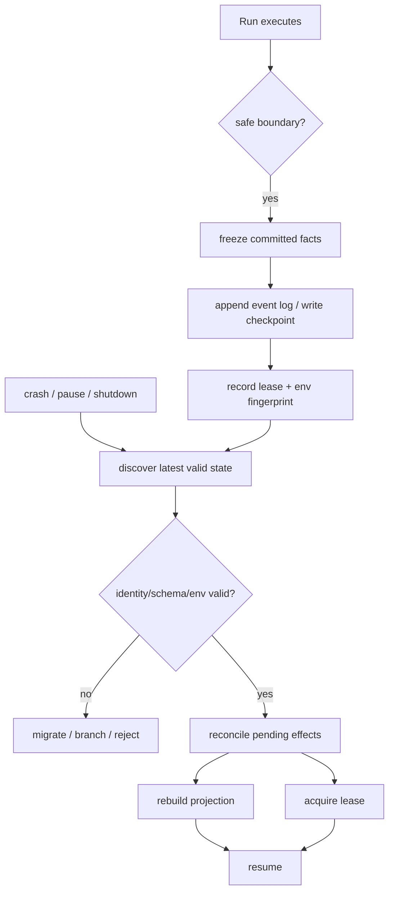
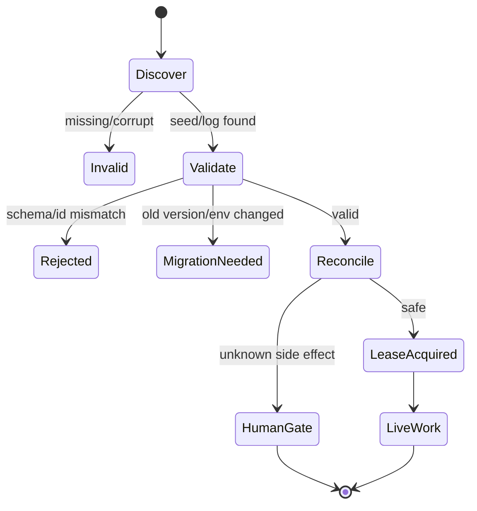

## 一句话结论

Checkpoint 不是“保存当前步骤号”，而是在一致边界上记录闭合事实、决策范围和外部任务引用。Resume 是带门槛的进入：先验证 session 身份、schema 版本、环境 cwd 和持久化后端，再处理 interrupted/pending 副作用；不能因为文件存在就自动续跑。

## 上一章遗留问题

M-09 保证取消后留下配对结果、local-only display 和 unknown remote。M-10 回答：新进程如何发现这些事实？旧进程还活着怎么办？workspace 被移动或 rebase 后能否继续？

## 本章解决什么矛盾

频繁快照减少丢失但增加 IO 和锁竞争；稀疏快照性能好但崩溃损失大。更关键的是恢复安全：另一个 writer 可能已更新 transcript，代码可能 rebase，后台 job 可能已完成。可靠方案是 append-only event log 作为权威、checkpoint 作为兼容/分页模型、load 时做 CAS 和环境检查。

Reasonix 用 CAS-protected Save 与 save-verified baseline 区分正常快照和历史重写；DeepSeek Harness 把 resume 建模为 persistence.prepare + seed，并用 `session/end-seed` 分隔种子与 live 工作；Pi 在 SessionManager 中打开 JSONL、迁移版本并重建索引，runtime 再发 `session_start reason=resume`。

## 核心不变量

1. **只存闭合事实**：committed message/tool result/approval decision 可入 checkpoint；streaming draft 不行。
2. **身份唯一**：Session ID、Run ID、schema version、writer ID 防止跨会话污染。
3. **基线受保护**：Save 不能 force-overwrite newer transcript；rewrite 需要 CAS ownership。
4. **环境显式**：cwd/workspace identity/provider/model 记录在 meta/header；不匹配时要求人工或迁移。
5. **pending 先对账**：interrupted tool、background job、unknown external action 在继续前查询、补偿或标记人工。
6. **租约防双写**：同一 session 同一时间只有一个 owner；rotation 清理旧 pending prompts。

失效边界在于外部世界没有事务：文件已改、远端已部署、消息已发送。checkpoint 能记录“我们以为做到哪”，但不能让宇宙回滚。

## 理想模型



| 字段组 | 内容 | 恢复用途 |
| --- | --- | --- |
| 身份 | Session/Run/Turn ID、schema version、writer ID | 防串会话与误升级 |
| 历史 | committed user/assistant/tool events | 重建上下文 |
| 决策 | approvals、grant scope、policy version | 避免恢复后越权 |
| 进度 | last closed boundary、next entry point、budget | 从正确位置继续 |
| 外部引用 | background job、idempotency key、remote task | 对账/补偿 |
| 环境 | cwd、workspace identity、model/provider、host | 判断可否复用 |



## 初学者主线

Checkpoint 是登山路条：

- 只写在岔路口和安全营地（closed boundary）；
- 写清队伍编号、日期、剩余物资（identity/budget）；
- 写明帐篷里有什么、哪些装备已借出（external refs）；
- 第二天要先确认这是同一条路线、没有别的队伍占用营地（validate/lease）。

精确机制是把“状态”分成三层：durable log、derived projection、process-local runtime。只有第一层能跨进程存活。失效边界是 durable log 也可能 torn write，所以需要修复协议。

### 写入时机

推荐边界：

1. 用户 turn 提交前；
2. assistant/tool 配对结果落盘后；
3. 审批决定记录后；
4. compaction/rewrite 完成后；
5. 收到 shutdown signal；
6. 长工具周期性进度点。

不要在 provider streaming 中途做 authoritative checkpoint。

### Resume 五步

1. **Discover**：按 session id/path 找最新有效 log/checkpoint；
2. **Validate**：schema、digest、writer、meta.cwd、provider/model；
3. **Reconcile**：列出 interrupted/pending 外部动作；
4. **Rebuild**：从 log 派生 messages/UI；
5. **Lease & Continue**：获取所有权，再接受新输入。

### 崩溃窗口

即使单条 append 也可能半写。处理策略：

- 追加日志按行解析到最后完整 record；
- 保留坏尾证据，截断到 last good offset；
- snapshot 用 temp+rename 或 CAS；
- meta sidecar 可能滞后，因此 load 后首次 save 要全量 heal。

## 机制深拆

### 1. Snapshot、Rewrite 与 Recovery 的区别

- **snapshot**：普通 autosave，不能覆盖更新的 transcript；
- **rewrite**：rewind/compaction/cancel recovery 的有意历史改写，必须仍拥有 baseline；
- **compact rewrite**：折叠 WAL，用于 redaction 等必须抹除旧字节的场景；
- **recovery branch**：锁被占用时写入独立稳定分支，而不是阻塞退出。

混淆 snapshot 和 rewrite 会造成 stale controller 把新 transcript 回滚。

直觉上，snapshot 是“抄一份当前黑板”；rewrite 是“擦掉重写”，必须证明你仍是值日生。失效边界是没有 CAS 时，两个值日生都会以为自己有权擦黑板。

### 2. Seed 与 live work 的分隔

事件溯源系统常把旧日志作为 seed 注入新 Session。关键是要有 durable marker 标记“从这里开始是新工作”。否则 replay/fork/resume 后无法区分历史 bracket 与本轮 bracket，compaction lifecycle 也会误判。

### 3. Meta 与 transcript 的滞后

meta sidecar 记录 revision/digest/version，但可能在 transcript 更新后、sidecar 写入前崩溃。安全规则：

- load 时若 meta 不可读，仍可打开 session，但 revision 视为未知；
- 未知 revision 不能当 baseline 参与 CAS；
- 本进程第一次 save 走完整路径并修复 ledger；
- 只有 save-verified baseline 才允许 no-op fast path。

### 4. Resume 时的环境检查

最低检查：

```text
cwd exists and matches recorded workspace identity
provider/model still configured or user approves switch
persistence backend available
schema migration path known
no other live owner holds lease
```

Pi 的 runtime 在 resume 前发 before-switch extension，可能取消；SessionManager 打开失败时抛 “not a valid session”，不修改原文件。

### 5. Pending 对账清单

恢复界面应显示：

```text
completed: [tool calls with paired results]
interrupted_local: [partial text/reasoning marked local-only]
unknown_remote: [job ids, idempotency keys]
not_started: [queued calls without dispatch evidence]
decision_required: [approve retry / compensate / abandon]
```

用户选择后再生成新的 bounded plan。

## 反例与故障模式

1. **只存 step number**
   - 触发：checkpoint 只有 `step=7`。
   - 因果：恢复后缺少 tool results，模型重复读/写。
   - 正确边界：保存闭合事件或从 log 重放。
2. **UI 快照当真源**
   - 触发：把 streaming assistant 文本写入 checkpoint。
   - 因果：崩溃后半句成为“事实”。
   - 正确边界：draft 属于 local display，不进 authoritative state。
3. **无租约双开**
   - 触发：用户开两个终端 resume 同一 session。
   - 因果：双写 transcript，审批结果错乱。
   - 正确边界：file/session lease；rotation clear pending。
4. **meta 滞后被当 baseline**
   - 触发：transcript 新、meta 旧。
   - 因果：CAS 误判磁盘为 stale，覆盖更新内容。
   - 正确边界：revisionKnown=false 时禁用 fast path。
5. **cwd 变化静默继续**
   - 触发：项目目录被移动后直接 resume。
   - 因果：相对路径指向错误仓库。
   - 正确边界：assertSessionCwdExists/workspace identity check。
6. **旧日志混入新生命周期**
   - 触发：fork/resume 后没有 end-seed marker。
   - 因果：compaction bracket 匹配错误，历史被误折叠。
   - 正确边界：durable seed boundary。
7. **外部 job 未对账**
   - 触发：崩溃前已提交 deploy API。
   - 因果：resume 后再次发布。
   - 正确边界：保存 idempotency key/job id 并先查询。
8. **损坏日志静默截断**
   - 触发：JSON 解析失败直接丢弃后续完好记录。
   - 因果：永久丢失数据且审计不可见。
   - 正确边界：保留 damaged tail artifact，截到 lastGoodEnd。

## 一条完整因果链

一个编码任务在 bash 测试执行中被强制关机：

1. 关机前 Session 已有：user prompt、assistant tool call、edit_file 成功结果；bash 尚无 result。
2. 进程重启后 load event log：最后一条闭合事件是 edit_file result；bash call 处于 pending。
3. Loader 校验 schema/digest/writer，确认 meta cwd 与当前目录一致。
4. UI 显示三类状态：completed edits、interrupted test（local-only tail）、unknown exit code。
5. 用户选择“重新运行测试”。Harness 为新 bash call 生成新 callId，不复用旧 key；旧 pending 标记 superseded-by-human-decision。
6. 新测试通过后，assistant 总结基于完整配对结果继续。
7. 若用户选择放弃，则 checkpoint 记录 human decision，避免下次 resume 再提示。

这条链的关键是：恢复不是重放一切，而是把不确定变成显式决策。

## 设计取舍

| 方案 | 收益 | 代价 | 适用 |
| --- | --- | --- | --- |
| 全量 snapshot | 简单、随机读快 | 大会话 IO 高 | 小型交互 |
| append-only event log | 崩溃友好、可审计 | 需要 compaction | 生产长会话 |
| log + compatibility checkpoint | 兼顾权威与分页 | 双工件一致性问题 | 桌面/CLI 共存 |
| periodic snapshot | 控制粒度 | 崩溃丢失窗口 | 批处理 |
| DB transaction | 强一致 | 依赖数据库 | 服务端多租户 |
| no lease, lock file only | 实现简单 | stalled holder 卡死 | 需 bounded wait |
| auto-resume everything | 体验流畅 | 危险副作用重复 | 不建议通用化 |
| human-gated reconcile | 最安全 | 多一次交互 | 有 unknown side effect |

迁移路径：先把所有状态收敛到 append-only log；再加 snapshot/CAS 和 recovery branch；然后引入 meta sidecar 与 save-verified baseline；最后实现 resume 的环境检查和对账 UI。

## 框架实现对照

以下路径均绑定固定快照；行号已在当前 `external/` 树核对。

| 框架 | Checkpoint/Resume 机制 | 关键锚点 |
| --- | --- | --- |
| Reasonix `aa82b2f` | Save/Snapshot/Rewrite/RewriteCompact 区分意图且禁止 force-overwrite；路径锁+文件锁有 bounded wait；meta sidecar 维护 digest/version/revision 与 saveVerified baseline，torn meta 时 revisionKnown=false；event log authoritative，jsonl 为兼容 checkpoint/history paging。 | `internal/agent/save.go:50-104,106-121,190-245`、`internal/agent/session_events.go:45-48,711-783` |
| DeepSeek Harness `b150a55` | resume 必须配置 sessionPersistence，否则报错；persistence.prepare 返回 seed/meta 且 race abort；setupAndPublish 以 action='resume' 发布；`session/end-seed` 标记 seed 结束，位置和时间承载语义；RequestHeaderReason 支持 initial/resume/change。 | `packages/core/agent-loop/src/index.ts:653-710`、`packages/core/session/src/types.ts:108-135,224-228,314-337` |
| Pi `c49906e` | runtime resume 发 before-switch 可取消，teardownCurrent 后创建新 runtime 并发 session_start reason=resume；SessionManager.setSessionFile 打开 JSONL，空文件初始化 header，非法文件 fail without modifying，读取 header id，必要时 migrateToCurrentVersion 并重建索引。 | `packages/coding-agent/src/core/agent-session-runtime.ts:203-223`、`packages/coding-agent/src/core/session-manager.ts:890-928` |

### Reasonix：CAS、双工件与 save-verified baseline

Reasonix 明确定义四种保存语义：`Save` 是 CAS-protected default，never force-overwrite escape hatch；`.jsonl` remains as a compatibility checkpoint and discovery anchor，而 append-only event log is authoritative once present；jsonl 同时作为 history paging 的 random-read model（`external/DeepSeek-Reasonix/internal/agent/save.go:190-198`）。`SaveSnapshot` 用于 autosave，注释强调 doing so cannot hide a newer transcript；rewind/compaction/cancel recovery 应调用 `SaveRewrite`（`:200-212`）。redaction 这类要抹除旧字节的场景用 `SaveRewriteCompact` 折叠 WAL（`:214-218`）。

保存进入双层锁：先 path-level session save lock，再 file lock；跨进程等待有 5 秒 bound，注释解释 forever wait 会 wedge UI 并保持 session lease alive（`:52-60,230-244`）。`ErrSessionFileLockHeld` 允许即将终止的 caller persist a recovery branch，而不在同一 stalled file 上无限等（`:68-75`）。

`sessionPersistState` 是防止陈旧覆盖的核心：digest/version/revision 之外还有 `saveVerified`。注释说明 load-time baseline 可能 pair disk transcript with lagging meta sidecar——interrupted save 会造成这种滞后——所以只有 completed save verified transcript and ledger agree 的 baseline 才能 arm snapshot no-op fast path；load 后 first save must run in full and heal stale ledger（`:83-104`）。若 meta unreadable/torn，`revisionKnown=false`，revision 0 must not pose as a baseline（`:88-94`）。

### DeepSeek Harness：persistence seed 与 resume barrier

DeepSeek Harness 把 resume 定义为 persistence 操作而非内存复制。`AgentLoop.resume()` 先取 `sessionPersistence`；未配置时抛出明确错误：“cannot resume: session persistence is not configured (load a dsh-session-persistence backend)”（`external/deepseek-harness/packages/core/agent-loop/src/index.ts:653-658`）。

`resumeWith` 创建 AbortController，并把 options.signal、owner unload、factory teardown fuse 成一个 signal；然后 `raceAbortCall(() => persistence.prepare(id, fused))`。注释解释原因：load may outlive its owner，a never-settling backend cannot pin the identity（`:662-692`）。prepare 返回 `SessionPreparation`，finally dispose；随后检查 owner fiber 和 ownership active，才调用 setupAndPublish，action 为 `'resume'`（`:693-703`）。

Session 类型层面，`RestoredSessionOptions.seed` 是 fresh detached storage events to validate and freeze；meta 带 cwd/parentSession/createdAt/seedLength 等（`external/deepseek-harness/packages/core/session/src/types.ts:124-135`）。`session/end-seed` 是 constructor-only writer 的 log-only marker：之前的 events came from the seed (resume, fork, replay)；定位最后一个 marker，避免每次 pickup 重复增长；unmatched compaction/start bracket 属于 ended lifecycle。文档同时警告它不是 concurrent-writer liveness signal（`:314-337`）。request header 的 reason 枚举包含 `'resume'`，表示 loop instance's first request over an existing log（`:222-228`）。

### Pi：JSONL 打开、迁移与环境断言

Pi runtime 的 `switchToSession` 流程很清晰：先 emit `beforeSwitch("resume")`，extension 可取消；然后记住 previousSessionFile，调用 `SessionManager.open(sessionPath)`；`assertSessionCwdExists(sessionManager, this.cwd)` 检查记录 cwd 是否存在；通过后才 teardownCurrent，并以 `sessionStartEvent.reason="resume"` 创建新 runtime（`external/pi/packages/coding-agent/src/core/agent-session-runtime.ts:203-223`）。

`SessionManager._setSessionFile` 处理三种情况：文件存在则 loadEntriesFromFile；空文件初始化 valid header；非空但不是合法 Pi session 则 throw “Session file is not a valid ...”，且不修改它（`external/pi/packages/coding-agent/src/core/session-manager.ts:895-911`）。成功加载后从 header 恢复 sessionId；若 `migrateToCurrentVersion` 返回 true 则 rewrite file；最后 `_buildIndex()` 并置 flushed=true（`:914-922`）。

这个设计把“能不能 resume”拆成两层：文件层负责格式与迁移，runtime 层负责环境信任和扩展取消。两者都通过才进入新生命周期。

## 实现精妙之处

1. **Reasonix 的 save intent 显式化**：Snapshot/Rewrite/RewriteCompact 是不同 API，而不是一个带布尔参数的函数，降低误用风险。
2. **Reasonix 的 saveVerified**：承认 meta sidecar 可能落后，用“本进程完成过一次完整 save”作为快速路径前提。
3. **Reasonix 的 bounded lock wait + recovery branch**：既不让 UI 被 stalled lock 卡死，也不静默丢弃数据。
4. **DeepSeek Harness 的 raceAbortCall**：把慢存储 prepare 纳入取消域，防止僵尸 load pin住 identity。
5. **DeepSeek Harness 的 end-seed marker**：用位置和时间承载语义，payload 为空，避免每次 pickup 重复写额外数据。
6. **Pi 的 assertSessionCwdExists**：把“目录还在吗”作为 resume 一等检查，避免相对路径漂移。
7. **Pi 的 invalid-file fail-closed**：非空但不认识的 session 不修改，给人工修复留证据。

## 自检与面试追问

1. 你的 checkpoint 里哪些字段来自 durable log？哪些只是投影？如果混淆，举一个会出错的恢复场景。
2. 为什么 load 后第一次 save 不能走 no-op 快速路径？构造一个 meta lag 导致覆盖的事故序列。
3. 如果 persistence.prepare 永不返回，用户点击取消，系统应如何释放资源？
4. 一个 session 的 cwd 存在但 Git HEAD 已 rebase，是否允许自动 resume？需要哪些额外指纹才能安全判断？
5. 如何向用户呈现 interrupted local output、unknown remote job 和 not_started queue，使其能做出安全选择？
6. 设计一个 schema v2→v3 迁移协议，要求失败时可回退且不破坏 v1 日志。

## 交给下一章的问题

本章解决了“从哪里恢复”。但底层仍未回答：什么时刻状态才算真正提交？M-11 将拆解 Persistence：WAL、fsync、schema 版本、迁移和环境指纹如何共同保证崩溃一致性。

## 相关页面

- [教材目录](../TOC.md)
- [Session、Turn 与状态模型](../01-core-concepts/session-and-state.md)
- [Retry 与幂等](./retry-idempotency.md)
- [Persistence](./persistence.md)
- [术语表](../09-glossary/glossary.md)
