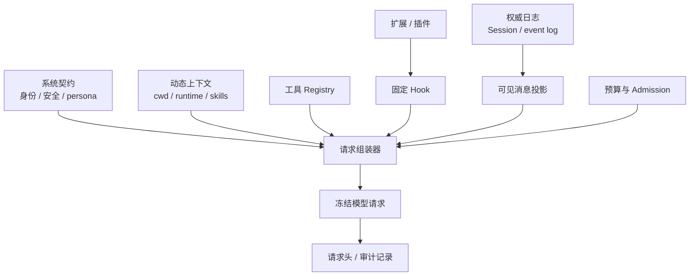
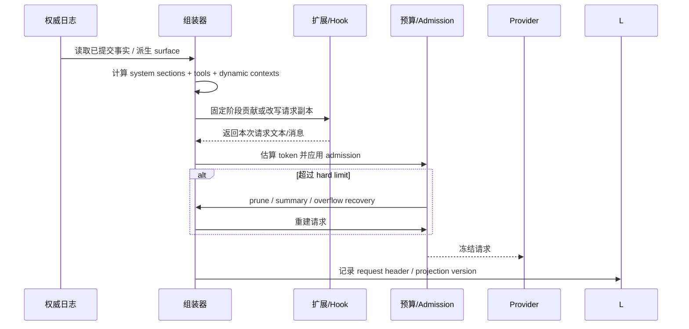

## 一句话结论

Context 是为一次模型请求构造的投影：它必须从已提交事实派生，按稳定层次组织，并保留来源、版本和请求头。组装器可以裁剪、排序和临时改写内容，但不能把 UI 草稿当事实，也不能让插件绕过预算或污染权威日志。

## 上一章遗留问题

C-04 说明 `message_end` 不一定等于持久提交，`entry_added` 这类 durable 事件才表示可查询。于是 M-01 要回答：一次请求到底读取哪一层？system prompt、工具 Schema 和动态状态何时重新计算？扩展改写的文本属于哪一层？如果估算超窗，谁负责收缩？

## 本章解决什么矛盾

模型缺少目标、约束和历史会做错事；塞入全部资料又会耗尽 token、破坏 prompt cache、放大提示注入并暴露敏感数据。同时，多步 Agent 每轮都会新增观察，静态拼接很快过期。因此 Context 组装必须在“完整”与“最小”、稳定前缀与新事实之间反复取舍。

Reasonix 用 pressure/overflow 两级准备解决超窗；DeepSeek Harness 用 append-only surface 派生消息并把 header 变化写入日志；Pi 把项目文件、技能和工具摘要编译进 base prompt，再允许每回合 extension override。三者都拒绝把“请求副本”当成权威日志。

## 核心不变量

1. **来源分离**：Session/event log 是权威事实；request messages 是派生投影。改写请求不得回写日志。
2. **可审计**：请求的关键配置（provider/model/system/tools/context window）应有 header 或等价记录；动态快照能归属到贡献者。
3. **每请求重建**：多步循环中每次模型调用前重新评估可见消息、工具面和动态上下文；不能把上一次 wire payload 当数据库。
4. **预算显式**：输入估算、fold threshold、hard ceiling 或 contextWindow 至少有一种边界；超限时走 prune/summary/error，不静默截断任务前提。
5. **扩展受控**：插件可以贡献或临时改写本次请求，但必须经过固定 hook，且不能绕过后续 admission。

失效边界各不相同：内存中的 projection version 能检测同进程变化；跨进程重启要靠持久事件重放；外部检索资料还需要时间戳和信任分级。没有一种机制能同时保证所有环境。

## 理想模型

| 层次 | 典型内容 | 权威来源 | 主要风险 |
| --- | --- | --- | --- |
| 平台指令 | 身份、安全规则、persona、部署约束 | 产品配置或 registry | 与任务冲突、被插件覆盖 |
| 任务与环境 | 目标、验收、cwd、权限、runtime snapshot | Run 元数据和宿主 | 过期、越权、泄露主机路径 |
| 对话历史 | 用户消息、assistant 结论、tool call/result | Session 或 event log | 未闭合草稿混入、重复、乱序 |
| 项目资料 | AGENTS.md、context file、skill、检索片段 | 工作区和资源 loader | 陈旧、不可溯源、提示注入 |
| 工具能力 | 名称、Schema、顺序、使用说明 | Tool Registry | 声明过多、相似能力互相干扰 |
| 临时注入 | 文件变更提醒、队列上下文、插件消息 | 当前 Turn | 绕过预算、覆盖安全指令 |

图中的“冻结请求”只服务本轮采样。失败重试可以复用它以保持 cache；一旦出现新观察或 context rebuild，必须回到组装器重新投影。

## 初学者主线

把模型想成一位只看当前文件夹的新同事。你不会把整台服务器搬给它，而是给它一个工作包：

1. 最上面是公司规章（system/identity）；
2. 接着是本任务目标和当前目录（task/environment）；
3. 然后是会议纪要（对话与工具结果）；
4. 再放相关项目说明书（AGENTS.md、skills）；
5. 最后附一张可用工具清单；
6. 助理在门口检查包裹重量（token budget），必要时抽出旧报告摘要。

关键不是“放多少”，而是每个物品都有标签：来自哪个文件、哪次读取、哪个版本。否则模型误读时，你无法判断是资料错了、资料过期了，还是模型理解错了。

### 组装时机

Context 不是回合开始时的一次性字符串。至少四类事件触发重建：

- 新的用户输入进入 Step；
- 工具结果改变事实集；
- provider/model/contextWindow 或工具面变化；
- compaction、rewind 或 policy 改变投影。

无工具问答可以只组装一次；编码循环通常每轮都要重新派生消息。

### 预算与优先级

理想顺序是先保住安全契约和不可再生的任务目标，再保留最近未决问题和关键工具观察；可重新检索的长文、重复日志和已完成步骤的原始输出先降级。降级要有两种形式：

- **投影内省略**：这次请求看不到，下次还能回来；
- **权威内压缩**：用摘要替代原始区间，但保留锚点和恢复线索。

后者属于 M-02。本章只要求组装器知道自己在处理哪种层。

### 工具声明也是上下文

名称、描述、参数 Schema、示例和使用约束共同决定模型的行动分布。声明过多会让相似工具竞争；顺序不稳定会破坏 prompt cache；隐藏了某工具却没给替代路径，模型可能编造 shell 命令。Registry 应按阶段、权限和能力过滤，并在请求头中留下最终工具集合。

### 可追溯性

最低审计粒度包括：

- request header：model/provider/system/tools/max tokens/context window；
- projection version 或 seq：说明消息来自哪次日志状态；
- source path/name：AGENTS.md、context section、插件名；
- trigger：pressure、overflow、manual、resume。

有了这些，才能区分“模型没看到规则”和“规则本身被插件删掉”。

## 机制深拆

### 1. 三种常见架构

**A. 从 durable log 派生**

权威日志保存事件，组装器按投影规则生成 message 数组。优点是重放一致、可撤销、便于压缩；缺点是要维护 surface/fold 规则。DeepSeek Harness 是典型实现。

**B. 内存会话加维护入口**

进程内 Session 保存消息，ContextManager 在每次请求前估算、prune 或 fold。优点是延迟低；缺点是崩溃恢复依赖独立持久化。Reasonix 属于这一类，并用 projection version 弥补。

**C. 编译式 prompt + 运行时 state**

启动时把系统模板、项目文件和技能编译成 base prompt；运行时维护 messages/state，每回合允许少量 override。优点是简单直观；缺点是资源变化后必须刷新 base prompt，否则旧文件继续生效。Pi coding-agent 采用这种方式。

直觉上分别是“从台账现抄”“白板定期擦写”“提前印好手册”。精确机制见框架对照。失效边界是：台账查询慢、白板易丢、印刷版更新滞后。

### 2. 请求头的最小契约

请求头不只是调试信息。它决定：

- 同一 header 是否能复用 provider cache；
- resume 时是否需要新 epoch；
- 审计者能否知道当时可见的工具面；
- contextWindow 预算属于哪个模型。

因此 header 应该 canonical 化：字段顺序无关、空值明确、变化才追加新记录，而不是每次请求都制造噪声。

### 3. 动态上下文的归属

动态上下文容易变成“垃圾抽屉”。正确做法是每个 contribution 有名字、顺序和文本，渲染后仍保留 section 列表。这样：

- UI 可以显示“这条 cwd 来自 runtime context”；
- 调试器可以禁用单个 contributor 复现问题；
- 快照可以声明 supersede 关系，避免新旧状态并存。

### 4. 扩展注入的四个门

1. **System assembly**：修改系统段落，影响整个请求；
2. **Pre-step / before start**：向本轮消息数组追加 context；
3. **Context prepare**：只改本次 request copy；
4. **Provider request**：最后 admission 前的最终裁决。

每个门的失败语义不同：block 可能返回 nil、错误或 rejection decision；改写只对当前请求有效。宿主必须把用户可见原因传出去，否则看起来像静默失败。

### 5. 预算失败的分级

- **低于 fold threshold**：直接返回 prepared context；
- **达到 fold threshold**：先 prune 可折叠工具输出，再考虑 summary；
- **达到 hard ceiling**：必须释放空间，summary 失败则返回 `ErrCompactionRequired` 或 admission error；
- **physical overflow**：一次性 recovery，不允许无限循环；
- **manual trigger**：失败要向操作者报错，而不是悄悄维持旧投影。

这五级防止两个极端：过早摘要丢失细节；硬截断删除任务前提。

## 反例与故障模式

1. **把上一条 wire payload 当缓存**
   - 触发：多步循环直接复制上次请求并 append 新结果。
   - 因果：compaction 或 rewind 后旧消息复活；工具面变化后模型仍看到旧 Schema。
   - 正确边界：每次从 durable/surface 投影重建，或显式携带 generation/version 并在变化时重建。
2. **扩展绕过预算**
   - 触发：插件在 pre-step 注入大文件全文。
   - 因果：估算基于 interceptor 前的消息，实际请求超过 contextWindow。
   - 正确边界：admission 必须发生在最终 request 上，或在 hard ceiling 后触发 overflow recovery。
3. **请求改写回写日志**
   - 触发：hook 直接修改 session 内对象。
   - 因果：临时脱敏或翻译永久改变历史，rewind 后无法还原。
   - 正确边界：copy-on-write；Reasonix 明确说明 context.prepare 只改 ephemeral copy。
4. **项目文件更新后继续用旧 prompt**
   - 触发：AGENTS.md 改了但 base system prompt 只在启动时构建。
   - 因果：模型遵循过期规则，用户以为新规则已生效。
   - 正确边界：资源变化触发 rebuild，或每回合从 loader 读取并记录 source path/version。
5. **header 无变化规则**
   - 触发：每次请求都写一条 request header。
   - 因果：日志膨胀，审计无法快速定位真正变化；cache 诊断失去意义。
   - 正确边界：canonical 比较，只在 initial/resume/change 时追加。
6. **把检索片段当权威事实**
   - 触发：搜索结果直接进入历史，没有 URL、时间和访问版本。
   - 因果：源页面变化后无法解释模型结论，也无法隔离注入。
   - 正确边界：作为带来源的 project/reference 层，必要时先消毒或要求模型引用。
7. **相似工具无序暴露**
   - 触发：registry 按 map 随机序输出 schema。
   - 因果：同样请求产生不同选择，prompt cache 失效，评测不可复现。
   - 正确边界：canonical order 或显式 toolOrder，未知工具报错而不是静默丢弃。

## 一条完整因果链

假设编码任务进行到第 12 轮，用户刚修改了项目规则：

1. 第 11 轮工具结果已提交到权威日志；UI 显示成功，但请求尚未发生。
2. 新 Step 开始，组装器从 durable log/surface 重新派生消息，而不是复制第 11 轮 payload。
3. Resource loader 发现 AGENTS.md 已更新，重建 system/project 层；section 名和 source path 保留。
4. Registry 输出本轮允许的工具，按 canonical order 放入 PromptAssembly。
5. Extension 在 pre-step 注入“文件已变更”短消息；admission 重新估算 token。
6. 估算越过 hard ceiling。组装器先 prune 旧工具结果；若仍超限，触发一次 summary/overflow recovery，并提升 projection version。
7. 成功后冻结请求并记录新 request header/projection version；失败则返回显式 compaction error，而不是发送注定超窗的 payload。
8. Provider 响应后，只有干净终态进入下一层权威日志。审计者可以用 header、projection version 和 section 名解释模型为什么遵循新规则、哪些旧输出被折叠。

这条链满足本章不变量：来源分离、每请求重建、扩展经过固定门、预算失败有恢复分支。

## 设计取舍

| 方案 | 收益 | 代价 | 适用条件 |
| --- | --- | --- | --- |
| 全量发送历史 | 不丢信息，实现最简单 | token 成本高，易超窗和注入 | 短会话或强预算后台 |
| 每请求从 log 派生 | 重放一致，支持 replace/fold | 需要 surface/cache 和投影测试 | 多客户端、审计和长会话 |
| 启动期编译 prompt | 快速、可读、易定制 | 资源热更新复杂 | 本地 coding agent、文件变化低频 |
| 固定 hook 注入动态上下文 | 扩展能力强 | 需要严格失败语义和预算复查 | 插件生态或多租户平台 |
| 只在 overflow 时压缩 | 保留细节更久 | 单次恢复压力大，可能失败 | 有 hard ceiling 和手动逃生口 |
| 达到阈值就维护 | 平滑延迟和成本 | 更多摘要次数，cache miss | 长任务和高频工具循环 |

迁移路径通常是：先给现有请求加 header 和来源日志；再把 message 构造收敛到一个 assembler；随后引入 projection version 和预算 admission；最后把压缩、rewind 和插件注入挂到同一投影规则上。不要一开始就实现全自动摘要，否则很难判断错误来自投影还是摘要质量。

## 框架实现对照

以下行为均绑定固定快照；行号已在当前 `external/` 树核对。

| 框架 | 组装策略 | 关键锚点 |
| --- | --- | --- |
| Reasonix `aa82b2f` | 每次采样先 `Prepare`，按 stable pre-interceptor shape 估算；pressure 下 prune/summary，overflow 一次性强制；随后 normalize、extension intercept、组装 Request 并冻结。 | `internal/agent/sampling_request.go:88-155,157-174`、`internal/agent/context_manager.go:68-153,156-214` |
| DeepSeek Harness `b150a55` | Session surface 是唯一消息来源，deriveMessages 缓存 frozen projection；pre-step 组装 ordered system sections/dynamic contexts/tools；buildRequest canonical 化 header/context，只在变化时追加事件。 | `packages/core/session/src/index.ts:701-747`、`packages/core/agent-loop/src/agent.ts:225-243,332-341,440-513`、`packages/core/system-prompt/src/index.ts:52-120,180-255` |
| Pi `c49906e` | Loader 汇聚全局与祖先 context files；AgentSession 用 valid tool snippets/guidelines 构建 base prompt；每回合注入 pending next-turn 消息，extension 可添加 custom message 或 override 本次 system prompt。 | `packages/coding-agent/src/core/resource-loader.ts:119-157,515-530`、`packages/coding-agent/src/core/agent-session.ts:1035-1067,1220-1283,540-560`、`packages/coding-agent/src/core/system-prompt.ts:8-72,121-161`、`packages/coding-agent/src/core/extensions/runner.ts:1081-1145` |

### Reasonix：两级预算与 ephemeral interception

`Prepare` 是唯一自动维护入口：低于 compact ratio 什么都不做；达到阈值时单飞执行 prune/summary，pressure 最多两次成功摘要（`external/DeepSeek-Reasonix/internal/agent/context_manager.go:68-80`）。估算使用 interceptor 之前的稳定形状，避免副作用插件被双调用；如果它们后来撑爆请求，overflow recovery 仍会触发（`:88-93`）。stuck input hash 防止同一视图反复失败；新消息形成新的 fold boundary 后才允许重试（`:108-130`）。

`buildSamplingRequest` 先移除 `CreatedAt` 这类 durable UI metadata，以免破坏 provider prefix cache；然后应用 role projection、`context.prepare`、工具 Schema、参数和最终 `provider.request` ruling（`external/DeepSeek-Reasonix/internal/agent/sampling_request.go:124-155`）。注释强调 session log 不会被 touch，replacement 是 ephemeral（`:133-135`）。admission 失败时只做一次 physical overflow recovery；projection version 没有前进就直接返回原错误（`:91-117`）。

### DeepSeek Harness：surface 派生与 canonical header

DeepSeek Harness 不从 raw events 直接拼 history。`deriveMessages()` 只遍历 surface nodes；raw chunk、turn boundary 没有 surface marker 就不会进入 transcript；compaction replace 会通过 generation 重建缓存（`external/deepseek-harness/packages/core/session/src/index.ts:708-747`）。返回数组是新快照，内部 Message deep-frozen，消费者无法改写日志。

Step 开始时，`preStep` 先 claim inbox，再按 agent scope 组装 PromptAssembly；dynamic contexts 渲染成 named sections，project 后可作为本轮 context 消息加入 claimed messages，并交给 `agent/pre-step` waterfall（`external/deepseek-harness/packages/core/agent-loop/src/agent.ts:225-243`）。真正的 model request 使用 `session.deriveMessages()`、rendered system 和 ordered tools（`:332-341`）。

`buildRequest` 从 persisted header 种子化配置，经 `agent/request` waterfall 补充；随后构造 canonical header 并比较 baseline，只在 `initial/resume/change` 时 append `request/header`（`:440-489`）。provider/model/contextWindow 变化单独记录 `request/context`（`:491-502`）。最终 request deep-freeze（`:505-512`）。

PromptAssembly 的结构也很清晰：sections、contexts、tools、variables 都有名字和 order；约定 harness identity 为 `-100`，persona 为 `0`，tool guidance 为 `100-199`；toolOrder 必须包含 rest marker，unknown configured name 会抛错（`external/deepseek-harness/packages/core/system-prompt/src/index.ts:52-120,142-178`）。渲染时空 section 丢弃，变量引用严格校验（`:204-217`）；动态快照明确声明 supersedes earlier snapshots（`:228-240`）。

### Pi：编译式 base prompt 与每回合 override

Pi 的 resource loader 从 agent dir 收集全局 context file，再从 cwd 向祖先目录收集去重后的 context files（`external/pi/packages/coding-agent/src/core/resource-loader.ts:119-157`）。刷新时读取 agents files、system prompt source、append prompts 等资源，并可被 host override（`:515-530`）。

AgentSession 构建 prompt 时只使用 registry 中有效的工具名，并收集对应 snippets 和 guidelines；连同 cwd、skills、contextFiles、custom/append prompt 一起传入 `buildSystemPrompt`（`external/pi/packages/coding-agent/src/core/agent-session.ts:1035-1067`）。`buildSystemPrompt` 会把项目文件包装成带 `path` 属性的 `<project_instructions>`，附加技能和 current working directory（`external/pi/packages/coding-agent/src/core/system-prompt.ts:46-71,121-161`）。因此来源至少保留在模型可见文本中。

每次用户回合，Pi 先构建 user message，再注入 pending next-turn messages；`before_agent_start` extension 可以追加 custom message，也可以替换本次 systemPrompt（`external/pi/packages/coding-agent/src/core/agent-session.ts:1220-1272`）。Extension runner 顺序调用 handlers，收集 messages 和 modified flag，最后由 AgentSession 应用 override 或复位 base prompt（`external/pi/packages/coding-agent/src/core/extensions/runner.ts:1081-1145`）。此外，`prepareNextTurnWithContext` 每次都用当前 base prompt 和当前 tools 覆盖 context（`external/pi/packages/coding-agent/src/core/agent-session.ts:540-560`），减少跨回合陈旧工具面。

## 实现精妙之处

1. **Reasonix 的 pre-interceptor estimation**：阈值判断不受插件膨胀影响，又能靠 overflow 兜底；代价是需要区分 stable shape 和真实 wire shape。
2. **Reasonix 的 inputHash/stuck 状态**：同一不可压缩视图不再空转；新消息改变 hash 后自动解封，兼顾防循环与继续工作。
3. **DeepSeek Harness 的 derived cache generation**：O(new nodes) 增量投影，replace 时整体重建；Message deep-frozen 让调用方拿到快照也不能篡改源头。
4. **DeepSeek Harness 的 named context sections**：动态上下文既能拼给模型，也能归因给子系统，调试时可逐项禁用。
5. **Pi 的 `<project_instructions path=...>`**：把来源嵌入模型文本，即使没有复杂审计系统也能人工追溯。
6. **Pi 的 nextTurn override**：base prompt 可以被单回合 extension 替换，但回合结束后复位，避免临时规则泄漏到未来。

## 自检与面试追问

1. 你的 Harness 中，“模型看到了 X”的证据是什么？请设计一条从 source path 到 request header 的审计链。
2. 如果 extension 必须注入 50k token 的诊断报告，应该在哪个阶段介入？预算系统如何避免它挤掉安全指令？
3. 为什么 request header 要 canonical 化？哪些字段变化应该开启新 epoch，哪些只是普通 change？
4. 编译式 prompt 如何支持 AGENTS.md 热更新？给出至少两种失效风险和对应验证方法。
5. 一个 bug 导致 compaction 后 tool call 没有 result。这个问题应在组装、投影还是压缩层被发现？为什么？
6. 如何在不发送真实密钥的情况下测试 provider request 的完整结构？mock 应断言哪些字段？

## 交给下一章的问题

本章解决了“哪些事实进入请求”。但当长会话超过窗口时，组装器只能选择 prune 或 summary。M-02 要回答：压缩器如何识别必须保留的任务前提、未决副作用和因果链？摘要失败、部分失败或与原始日志冲突时应如何恢复？

## 相关页面

- [教材目录](../TOC.md)
- [事件模型与流式输出](../01-core-concepts/events-and-streaming.md)
- [Context 压缩与截断](./context-compression.md)
- [Tool Schema 与调用协议](./tool-schema.md)
- [术语表](../09-glossary/glossary.md)
