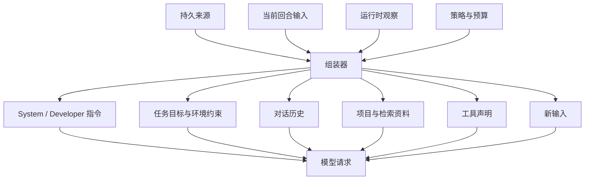

# Context 组装与分层

## 一句话结论

Context 不是把所有资料塞进一个提示词，而是为一次模型请求选择有权访问、有时效、能支撑下一步判断的信息，并按稳定层次组织成请求。好的组装必须同时回答三个问题：谁拥有来源、为什么现在进入请求、超出预算时牺牲什么。

## 理想模型

Context 有两个身份。对模型来说，它是一次请求中的可见资料；对线束（Harness）来说，它是从多个权威来源派生的临时投影。持久层保存用户消息、助手输出、工具结果和审批决定；组装器按当前步骤筛选并排序这些事实，再补充环境状态、检索结果和工具声明。

| 层次 | 典型内容 | 权威来源 | 主要风险 |
| --- | --- | --- | --- |
| 平台指令 | 安全规则、输出契约、开发者约束 | 产品或平台配置 | 与任务目标冲突 |
| 任务上下文 | 目标、验收标准、工作目录、权限 | Run 或 Turn 元数据 | 过期或越权 |
| 对话历史 | 用户输入、助手结论、工具调用与结果 | Session | 无提交点、重复或乱序 |
| 项目与检索资料 | 文件片段、索引结果、网页摘要 | 工作区或外部服务 | 陈旧、不可溯源、提示注入 |
| 运行时状态 | 上一步错误、剩余预算、待处理调用 | 当前 Run | 把界面草稿当事实 |
| 工具能力 | 工具名、参数 Schema、使用约束 | Registry | 声明过多挤占空间 |

## 小白解释

把模型请求想成给一位新同事准备的工作袋。里面不能只有聊天记录，还要放任务说明、相关文件、可用工具清单和当前进度。袋子容量有限，所以先放安全和任务规则，再放最近的关键结论，最后补充参考资料；无关材料越多，重要内容越容易被淹没。

每次行动后都要重新整理工作袋。上一步读取的文件如果已经变成结论，就不需要整段重复；失败的测试结果仍要保留，因为它解释了下一步为什么改方案。

## 机制拆解

### 组装时机

Context 在每次模型请求前重建，而不是只在回合开始时生成一次。无工具任务可能只需一次组装；多步循环中，每次工具观察都会改变下一步需要的资料。重建必须从已提交事实出发，不能直接复制上一请求的完整缓冲。

### 预算与优先级

预算包括输入 token、输出 token、工具数量和延迟上限。理想顺序是先保证安全与任务契约，再保留最新目标和未决问题，然后选择对话关键事实和工作区证据，最后裁剪低相关资料。裁剪不是随机丢弃，应记录被排除的来源，便于调试“模型为什么没看到某件事”。

### 动态上下文

动态上下文回答“现在发生了什么”：当前分支、测试失败、剩余时间、上一步工具错误和待审批项。它应带版本或时间戳，避免旧状态伪装成现状。敏感值默认脱敏；宿主路径、凭据和租户信息只有在必要且有权限时进入请求。

### 工具声明

工具声明也是上下文的一部分。每个工具应有名称、描述、参数 Schema 和约束；线束按权限、阶段和能力过滤，而不是始终发送全部注册项。声明过少会让模型不知道能力边界，过多则增加选择成本，甚至让相似工具互相干扰。

### 可追溯性

每次请求应能追溯到来源集合：哪条消息来自会话，哪个文件片段来自哪次读取，哪个工具声明来自哪个版本。这样实现审查可以复现请求，也能区分模型误读资料和资料本身过期。

## 框架对照

下表只建立初稿证据索引，具体路径和行为由批量 Implementation Review 核对：

| 框架 | Context 组装线索 | 关键锚点 |
| --- | --- | --- |
| Reasonix `aa82b2f` | Agent 聚合 Provider、工具 Registry 和 Session；Run 循环把系统提示、历史和新观察送入模型请求。 | `internal/agent/agent.go`、`internal/agent/session.go`、`internal/agent/run_loop.go` |
| DeepSeek Harness `b150a55` | ReactLoopAgent 从持久会话日志派生请求；agent-loop 负责历史、工具结果和下一轮推理的衔接。 | `packages/core/agent-loop/src/agent.ts`、`packages/core/session/src`、`packages/core/agent/src/runtime-types.ts` |
| Pi `c49906e` | 通用 agent 包定义 agent context 和执行环境抽象；编码代理通过 session 与 lane 组织消息、文件和扩展信息。 | `packages/agent/src/harness/types.ts`、`packages/coding-agent/src/core/agent-session.ts`、`packages/coding-agent/src/core/lane.ts` |

## 常见坑

- **把 Context 当缓存。** 它是请求投影；底层事实更新后必须重建，不能无限复用旧拼接。
- **只看最终文本。** 系统指令、历史顺序和工具声明同样影响行为，调试时要检查完整请求结构。
- **让所有模块自由追加内容。** 没有预算和优先级，检索结果和运行时提示会互相覆盖。
- **把检索当真相。** 外部资料需要来源和时间；不可信内容应先隔离，再进入模型请求。
- **忽略工具声明成本。** 能力列表本身占空间，也会改变模型的决策分布。

## 自检问题

1. 一次多步任务中，哪些事件应该触发 Context 重建？
2. 如果预算不足，你会先降低哪一层的信息密度？为什么？
3. 如何证明某个文件片段确实进入过模型请求？
4. 相似工具同时暴露时，如何减少误选？

## 相关页面

- [教材目录](../TOC.md)
- [Session、Turn 与状态模型](../01-core-concepts/session-and-state.md)
- [术语表](../09-glossary/glossary.md)
