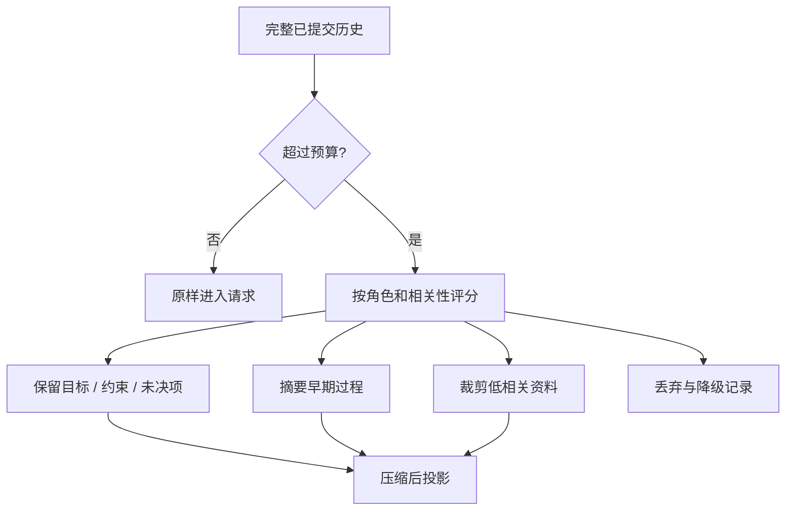

# Context 压缩与截断

## 一句话结论

Context 压缩不是尽量删字，而是在预算内决定哪些信息继续参与决策。可靠策略优先保留安全规则、当前目标、未决问题和已提交事实，降级或移出低相关资料，并记录丢失内容；否则模型可能基于残缺历史做出看似合理的错误判断。

## 理想模型

压缩有三条边界：

1. **来源不变**：Session、工作区和事件日志仍是权威事实；压缩只改变下一次请求的可见投影。
2. **提交点不变**：没有闭合的消息、未配对的工具调用和不完整的审批不能被摘要成“已完成”。
3. **可追溯**：每次压缩应能说明保留了什么、摘要了什么、丢弃了什么，以及依据是什么。

## 小白解释

把上下文想成一页会议纪要。你不能抄下整场会议，所以先写目标和结论，再写还没解决的问题，最后附上关键数据。中间讨论可以概括成一句“尝试过 A 和 B，A 失败原因是超时”。这样后来的人能接着做事，也知道为什么换路线。

硬截断像把纸的最后半行剪掉。如果剪掉的是结论或待办事项，后续行动就会出错。因此先要按意义移动或总结内容，实在无法保留时也要留下“这里还有资料没进入本次请求”的标记。

## 机制拆解

### 压缩时机

常见触发条件包括接近输入上限、单步预算超限、工具结果过大、检索命中过多和多步任务过长。压缩应在组装前或组装中执行；不要等模型返回上下文超限错误后才被动处理，因为重试会浪费延迟和费用。

### 策略分层

| 方法 | 典型对象 | 优点 | 风险 |
| --- | --- | --- | --- |
| 无损裁剪 | 重复空白、旧界面草稿、已失效临时状态 | 不改变事实 | 节省空间有限 |
| 结构化摘要 | 早期工具循环、长文档、多轮探索 | 大幅降低长度 | 可能丢掉反例和失败原因 |
| 选择性保留 | 最近回合、错误、审批、用户纠正 | 保住关键约束 | 需要准确的优先级 |
| 硬截断 | 超大文件、命令输出、附件预览 | 实现简单 | 容易切断结论 |

优先级通常从高到低是：安全与开发者约束、当前任务目标、用户最新纠正、未决问题、最近工具失败、关键成功证据、早期过程细节、低相关检索片段。这个顺序应随任务调整，但不能让普通资料压过安全规则。

### 工具结果

工具结果应先规范化，再进入上下文。超大输出可以保留状态码、路径、错误摘要、变更统计和关键前后文；完整原始结果留在持久层或工作区，供需要时重新读取。失败结果不能只因为太短就被删除，它是模型选择下一步的重要信号。

### 摘要与审计

如果用模型生成摘要，必须区分“原文事实”和“二次解释”。摘要应带来源范围、时间和生成方式；重要决策最好引用原始事件编号。恢复时，系统可以从权威日志重建更完整视图，不把上一次摘要当成唯一真相。

## 框架对照

下表只建立初稿证据索引，具体行为由批量 Implementation Review 核对：

| 框架 | 压缩与截断线索 | 关键锚点 |
| --- | --- | --- |
| Reasonix `aa82b2f` | Session 支持事件日志、兼容 JSONL、损坏修复和 checkpoint；Run 循环维护逐步扩展的历史。 | `internal/agent/session.go`、`internal/agent/run_loop.go`、`docs/CHECKPOINTS.zh-CN.md` |
| DeepSeek Harness `b150a55` | ReactLoopAgent 从持久会话日志派生请求；session 类型包含 surface 与事件流字段。 | `packages/core/agent-loop/src/agent.ts`、`packages/core/session/src/types.ts` |
| Pi `c49906e` | 编码代理使用 SessionManager 与树状 JSONL 会话；agent context 和 lane 组织执行历史。 | `packages/coding-agent/src/core/session-manager.ts`、`packages/agent/src/harness/types.ts`、`packages/coding-agent/src/core/lane.ts` |

## 常见坑

- **只看 token 数。** 删除最长的段落可能删掉唯一的关键证据。
- **把摘要写成新事实。** 摘要是投影，不能替代原始事件和工具结果。
- **静默截断。** 模型和调试者都应知道某些内容没有进入请求。
- **删除所有失败。** 失败观察解释了为什么要重试、改道或升级给人。
- **一次压缩永久生效。** 权威历史仍在时，不同步骤可以按需重建不同投影。

## 自检问题

1. 当前任务里哪三类内容绝对不能被压缩掉？
2. 一个 50,000 行的测试输出应保留哪些字段？完整输出存在哪里？
3. 如何验证摘要没有把失败描述成成功？
4. 模型说“我没看到某个文件”时，你需要检查哪些记录？

## 相关页面

- [教材目录](../TOC.md)
- [Context 组装与分层](./context-assembly.md)
- [术语表](../09-glossary/glossary.md)
