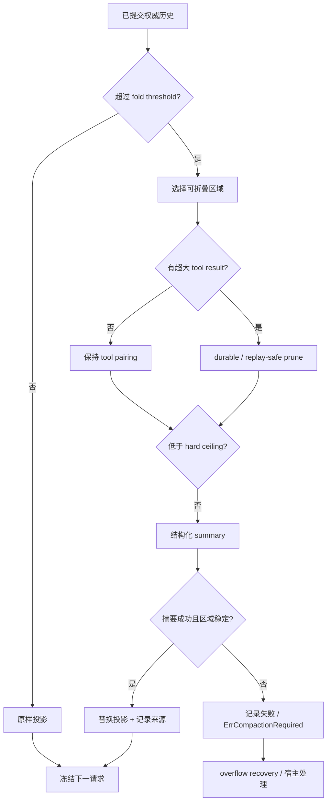
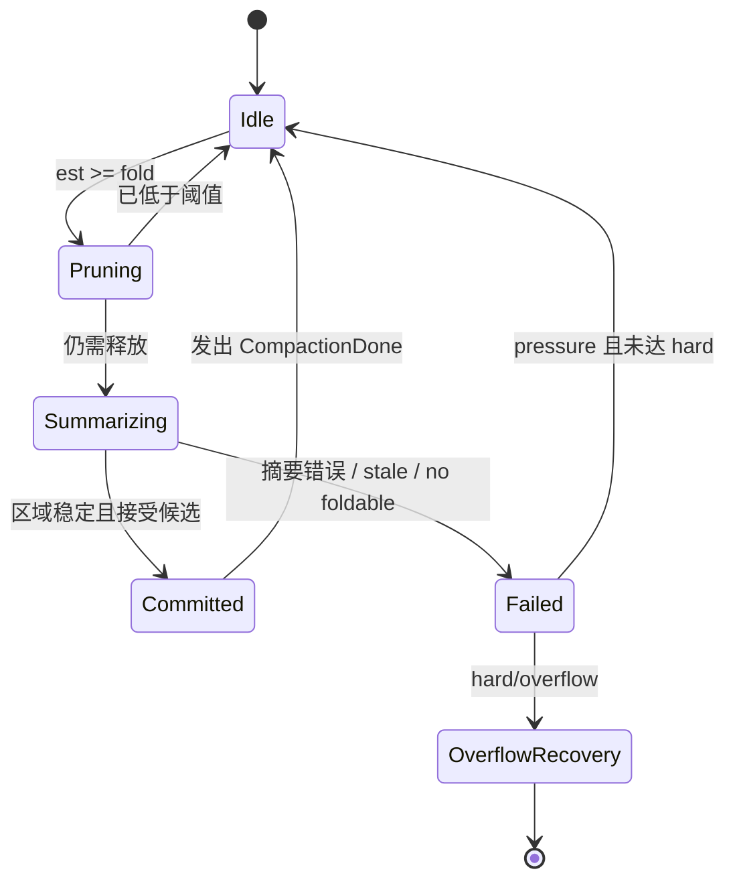

## 一句话结论

压缩是在“还能继续工作”和“不丢失决策前提”之间重新分配 token：先做可回放的 tool result pruning，再做有边界、有来源的 summary；硬截断只能用于原始输出层，并且必须留下总数、方向和截断原因。权威日志永远不是压缩器的草稿纸。

## 上一章遗留问题

M-01 说明请求是投影，超窗时应有 fold threshold 和 hard ceiling。但具体策略仍未回答：哪些消息可以折叠？为什么不能把 assistant tool call 和 result 分开？摘要失败后应该继续、报错还是重试？Pi 的长命令输出为什么可以在进入 Session 前截断？

## 本章解决什么矛盾

不压缩，长会话很快超过窗口；乱压缩，模型忘记用户约束、把失败当成功或重复危险动作。压缩还牵涉成本与缓存：过早摘要浪费 token，频繁摘要破坏 prompt cache。可靠设计因此分成多层——无损/低风险 prune、结构化 summary、事务化替换和最后的物理 overflow recovery。

Reasonix 用 durable projection receipt 记录每次维护；DeepSeek Harness 用 append-only surface replacement 和 compaction bracket；Pi 用 entry 树上的 cut point 和结构化 checkpoint summary。三者都拒绝把“模型看不见”等同于“事实不存在”。

## 核心不变量

1. **权威不可改写**：压缩只改变 model-visible projection 或追加 surface replacement，不删除 canonical log。
2. **调用结果成对**：折叠边界不得把 assistant tool call 与其 result 分开；否则下一次请求违反 provider 协议。
3. **摘要不是新真相**：摘要携带来源范围、token 统计和生成方式；必要时可以从 shadowed events 重建更完整视图。
4. **失败显式**：prune marker、compaction error、`ErrCompactionRequired` 或 manual failure 都必须可观察，不允许假装压缩成功。
5. **预算分级**：threshold 触发低成本维护；hard/overflow 才允许更强 recovery；manual 失败要向操作者报告而不是悄悄维持旧视图。

失效边界在于持久化时机：进程内 projection 可以回滚，跨进程 JSONL/SQLite 追加则依赖事务边界和崩溃修复。若日志已 torn write，必须走恢复章节，而不是继续压缩。

## 理想模型

| 方法 | 对象 | 收益 | 风险 | 适用 |
| --- | --- | --- | --- | --- |
| 无损规范化 | 重复空白、临时 UI 元数据 | 安全省 token | 收益小 | 所有请求 |
| 工具输出截断 | 长 shell/read 输出 | 保留首尾关键信息 | 中间错误被隐藏 | 进入 Session 前 |
| 工具结果 prune | 超大历史 result | 大幅释放空间，可回放 | cache miss | threshold/hard |
| 结构化 summary | 早期完整回合 | 压缩比最高 | 丢反例或细节 | fold region 稳定时 |
| 硬截断投影 | 最后手段 | 简单 | 删除结论 | 尽量避免 |

状态图强调一个常见误区：pressure 下摘要失败不一定致命；只有 hard ceiling 或 overflow 才必须阻止本次请求。

## 初学者主线

把上下文当成会议纪要：

- 先删重复空白和过期便签（无损清理）；
- 把 300 页测试日志换成首页、末页和“中间省略 280 页”（截断）；
- 把前两小时讨论写成一段纪要（summary），注明涵盖哪些时间；
- 最近半小时逐句保留（recent tail）；
- 不能把“张三提议但未批准”写成“已批准”。

精确机制是给每类内容定义优先级和可折叠性：安全规则和当前目标通常 fixed prefix；最近错误和未决问题在 recent tail；旧探索过程进入 fold region；未配对 tool call 是边界禁区。失效边界是评分器不可能完美：所以要用保守 cut point、来源记录和人工 compact 入口兜底。

### 压缩时机

1. **组装前 threshold**：估算达到 fold/reserve 阈值时执行；
2. **admission overflow**：最终请求超过 hard limit 时一次性 recovery；
3. **工具返回后**：大输出先在工具层规范化；
4. **手动命令**：用户要求 compact，失败必须报告；
5. **resume/fork**：读取旧投影前验证 transcript version/generation。

### 优先级

默认保留顺序：

1. 安全、开发者、权限约束；
2. 当前目标、验收标准、cwd；
3. 用户最新纠正；
4. 未决问题和待审批项；
5. 最近失败及其原因；
6. 关键成功证据和文件状态；
7. 早期过程细节；
8. 低相关检索片段。

这不是算法本身，而是 reviewer 应检查的不变量。真实系统常用“fixed prefix + digest + kept recent tail”实现近似。

### 工具结果的两种位置

- **进入 Session 前**：shell/read 工具可以直接 head/tail 截断，记录 total lines/bytes 和 truncatedBy；
- **已在历史中**：通过 prune 投影或 surface replacement 缩小 provider 可见内容，原始事件仍留在 canonical log。

混淆两者会导致审计困难：前者可能没有原始完整文本；后者必须有回放来源。

## 机制深拆

### 1. 选择折叠区域的三个约束

1. **保留 recent tail**：至少保留固定 token 数的最近上下文；
2. **平衡工具配对**：cut point 必须落在 assistant/tool pair 外部；
3. **稳定边界**：异步摘要期间新增消息可以等待，但被选 span 不能改变。

如果找不到合法区域，应返回 no-op，而不是切一半调用。

### 2. Summary 的输入与输出契约

输入应是序列化的 fold region，最好包裹在明确标签中，并区分 initial/update prompt。输出应是结构化 checkpoint：

- 当前目标和验收；
- 已完成变更与证据；
- 失败尝试及原因；
- 未决问题、下一步；
- 重要文件/命令状态。

自由散文容易漏掉失败。结构化模板让另一个 LLM 能直接续跑。

### 3. 替换的事务形状

durable compaction 至少需要四类记录：

1. `start`：占锁并声明 compactionId；
2. `summary`：保存摘要、shadowed range、usage/provider/model；
3. replacement：指向 start/end/source seqs；
4. `end`：成功或 error。

崩溃后，未匹配 `start` 能被发现；成功提交则可通过 source seqs 回放原始输入。没有这个形状，“摘要写到一半”很难恢复。

### 4. Cache 与版本

任何投影变化都会破坏 prompt cache，所以要显式记录 `CacheBreak`、generation、projection version 或 replaceGeneration。增量派生可以在无 replace 时复用旧缓存；replace 后必须重建。不要为了省 token 静默破坏 cache 又不解释延迟上升。

### 5. Manual vs automatic

自动压缩可以降级为 no-op；manual compact 通常代表用户主动清理，应区分 busy、commit、persistence 错误。否则用户不知道是没空间、摘要失败还是磁盘写入失败。

## 反例与故障模式

1. **只按字符长度删**
   - 触发：删除最长消息，恰好是唯一失败的 stack trace。
   - 因果：模型只看到后续成功，误以为问题消失，重复原方案。
   - 正确边界：失败观察优先级高于长度；至少保留错误类型、对象和下一步建议。
2. **切开 tool call/result**
   - 触发：按消息条数硬截断。
   - 因果：provider 看到 assistant tool call 没有 result，请求被拒或产生幻觉续接。
   - 正确边界：cut point 前移到 pairing balanced 的位置。
3. **摘要美化失败**
   - 触发：prompt 只要求“总结进展”。
   - 因果：“多次尝试后完成”掩盖了两次部分写入，模型跳过验证。
   - 正确边界：结构化模板强制 failed attempts、partial effects 和 verification 状态。
4. **stale summary 直接落地**
   - 触发：异步摘要期间用户追加了关键纠正。
   - 因果：replacement 覆盖包含纠正的区域，新指令从投影消失。
   - 正确边界：比较 surface generation/span hash；变化则 abort 并记录 SurfaceChanged/stale。
5. **把截断标记当数据**
   - 触发：模型把 `[truncated]` 后的第一行当作最后结果。
   - 因果：基于不完整输出下结论，跳过分页读取。
   - 正确边界：marker 同时给出 total/output 数量和方向，宿主提供显式 paging 工具。
6. **manual compact 静默 no-op**
   - 触发：用户执行 /compact，但没有可折叠区域。
   - 因果：用户以为已释放空间，实际仍接近上限。
   - 正确边界：报告 no foldable region、当前 token、可执行动作。
7. **overflow recovery 无限循环**
   - 触发：摘要输出仍然太大，系统反复摘要。
   - 因果：费用和时间失控，甚至再次超窗。
   - 正确边界：限制 attempts、预留 output tokens，失败返回 `ErrCompactionRequired`。

## 一条完整因果链

以一次 120 轮编码会话为例：

1. 第 119 轮 assistant message 提交后，usage 显示 context 接近窗口。
2. 组装器估算超过 fold threshold，进入 single-flight maintenance。
3. 先对超过阈值的旧 shell result 做 prune projection：head/tail 保留、中间 marker 替换；receipt 记录 affected count、saved tokens、input/output hash 和 CacheBreak。
4. 重算仍高于 hard ceiling，于是选择早期 fold region；边界回退到最近的 tool-pairing balanced 点。
5. `CompactionStarted` 发布，precompact hook 注入“保留测试失败原因”的指令。
6. 单次 summary call 在预留 output budget 内生成结构化 checkpoint，覆盖失败尝试、已完成 diff 和未决 lint 问题。
7. 摘要完成后比较 transcript version/prefix hash；期间第 120 轮尚未新增消息，区域稳定。
8. 投影变成 fixed prefix + digest + kept messages，canonical tail live splice；acceptCheckpointCandidate 确认真正省 token 且低于 ceiling。
9. commit 记录 receipt 并发出 `CompactionDone`；下一次请求使用新投影，prompt cache miss 被显式归因。
10. 用户之后问“为什么没跑测试”，审计者能从 summary、source range 和原始 event 找到被折叠的失败输出。

这条链证明压缩不是删除，而是把决策依据迁移到更低成本的表示，同时保留回放入口。

## 设计取舍

| 决策 | 收益 | 代价 | 成立条件 |
| --- | --- | --- | --- |
| 先 prune 后 summary | 成本低、可回放，避免摘要私有转换 | 两套机制，实现复杂 | 有 projection receipt/surface provenance |
| summary 写入权威日志 | resume 后仍可用 | 需要防止其替代 raw history | 明确 summary 是 checkpoint 类型 |
| summary 只作 ephemeral projection | canonical 更纯 | 进程崩溃后要重建摘要 | 有低延迟重建和预算 |
| 固定 recent tail token | 保住最新语境 | 早期关键事实可能被折叠 | summary 质量可验证 |
| 结构化模板 | 减少遗漏失败 | 摘要更长、更僵硬 | 任务需要可续跑 |
| 手动 compact 独立错误分类 | 用户体验清晰 | API 更多 | 有交互式宿主 |

迁移路径：先给工具输出加 truncation metadata；再把所有请求构造收敛到 assembler；然后引入 prune projection 和 receipt；最后才上 summary transaction。不要从自动摘要开始，因为它最难验证。

## 框架实现对照

以下路径绑定固定快照；行号已在当前 `external/` 树核对。

| 框架 | 压缩机制 | 关键锚点 |
| --- | --- | --- |
| Reasonix `aa82b2f` | pressure 时先把超大 tool result 变成 durable prune projection；再单次 summary 生成 prefix + digest + kept messages；canonical 不重写，tail live splice；receipt/version/hash 保证并发安全。 | `internal/agent/prune.go:16-39,67-147`、`internal/agent/compact_projection.go:403-556`、`internal/agent/compact_fold_input.go:32-45,43-68` |
| DeepSeek Harness `b150a55` | surface append-only，replace 通过 sourceEventSeqs 证明来源；basic compaction 用 start/summary/replacement/end bracket 和 stability check；tool pruner 用 shadow price 加 content-only replacement。 | `packages/core/session/src/surface.ts:1-8,40-68,210-243,286-379`、`packages/compaction/compaction-basic/src/region.ts:98-134,152-254,386-478`、`packages/compaction/compaction-tool-result-pruner/src/index.ts:43-121,124-184` |
| Pi `c49906e` | usage/threshold 判断触发 auto compaction；entry 树上反向累计 keepRecentTokens 并只在合法消息处 cut；summary 采用结构化 checkpoint prompt，支持 previous-summary update 和 turn prefix 场景；shell/read 输出在工具层按行/字节截断并返回元数据。 | `packages/coding-agent/src/core/compaction/compaction.ts:126-238,262-363,387-461,642-680,740-764`、`packages/coding-agent/src/core/agent-session.ts:2115-2153,2166-2180`、`packages/coding-agent/src/core/tools/truncate.ts:40-160` |

### Reasonix：durable projection 与一次摘要调用

`pruneToolResultContent` 以 rune 为单位保留 4096 个头 rune 和 1024 个尾 rune，中间替换为 `[... tool result middle pruned ...]`；阈值是 8192 runes（`external/DeepSeek-Reasonix/internal/agent/prune.go:16-39`）。这不是简单字符串裁剪：`pruneToolResultsToProjectionLocked` 快照 canonical version，构造新 projection，递增 ProjectionVersion/Generation，并写 receipt——包括 trigger、covered prefix hash、input/output hash、saved tokens、affected count 和 `CacheBreak: true`（`:67-110`）。提交前再次比较 transcript version、长度、prefix hash 和 projection state；不一致返回 `errCompressStaleContext`，持久化失败则回滚（`:124-146`）。

`compactToProjectionLocked` 进一步说明摘要边界：canonical transcript never rewritten；`CompactionNoop` 表示没有 foldable region，physical overflow 必须视为 hard failure（`external/DeepSeek-Reasonix/internal/agent/compact_projection.go:403-405`）。它规划 fold region、检查 fixed prefix 是否已超 trigger、发布 `CompactionStarted`、合并 precompact hook 指令；mustFree 时计算 safe summary prefix，否则因没有足够空间返回 checkpoint rejected（`external/DeepSeek-Reasonix/internal/agent/compact_projection.go:412-450`）。摘要请求只做一次，不做私有第二次转换；输入预算扣除 summary output reserve 和协议 reserve（`external/DeepSeek-Reasonix/internal/agent/compact_fold_input.go:32-45`）。成功后的 projection body 是 prefix、digest、kept messages；verbatim tail 从 canonical splice，使 rewind/snip 等 tail 改动无需重建 fold；accept candidate 要求真正节省并在 automatic 情况下低于 physical ceiling，然后 commit receipt 并发布 `CompactionDone`（`external/DeepSeek-Reasonix/internal/agent/compact_projection.go:489-520`）。

### DeepSeek Harness：append-only surface replacement

DeepSeek Harness 的 surface 层注释直接给出原则：append-only log remains source of truth；surface 只是 ordered view of message-producing events（`external/deepseek-harness/packages/core/session/src/surface.ts:1-8`）。append-origin 事件是人类 transcript 来源；replacement copies stay model-only（`:40-68`）。

replace 操作有严格证明：`sourceEventSeqs` 必须引用早于当前 seq 的事件，且包含每一个被 shadowed surface node（`:210-243`）。tool/result replacement 还被限制为“只改 content”——除 content 外的结构化字段必须 deep equal，且一次只能重写一个 current node（`:286-318`）。fold 状态用连续 seq 校验，替换节点 splice 后递增 `replaceGeneration`（`:320-379`）。

basic compaction 把这些规则包成事务：`selectCompactableRange` 从尾部反向累计 retainTokens，再向前回退直到 `toolPairingBalancedBefore`（`external/deepseek-harness/packages/compaction/compaction-basic/src/region.ts:98-134`）。`compactSurfaceRegion` 同步校验 idle/log 状态并 append `compaction/start` 作为 lock；摘要后 whole-surface 或 selected-span stability check 失败会抛 `SurfaceChangedError`；成功则 append `compaction/summary`、用 `user/message` replacement 引用 start/summary/shadowed seqs，再 append `compaction/end`；失败也补一条带 error chain 的 end（`:152-254`）。summary record 保存 compactionId、raw output provenance、shadowedRange/Seqs/tokenCount、provider/model/maxTokens/usage（`:447-477`）。

tool-result pruner 展示轻量路径：按 Unicode code point 测量文本，head/middle/tail 替换并保证 replacement 更小；每个替换前 append `compaction/prune` shadow-price event，随后 append 新 tool/result replacement，引用原 seq（`external/deepseek-harness/packages/compaction/compaction-tool-result-pruner/src/index.ts:43-121,124-184`）。即使中途失败，已提交 replacements 保持 durable。

### Pi：cut point、结构化 summary 与工具截断

Pi 的默认设置保留 16384 reserve tokens 和 20000 recent tokens；`shouldCompact` 在 contextTokens 超过 `contextWindow - reserveTokens` 时触发（`external/pi/packages/coding-agent/src/core/compaction/compaction.ts:126-138,232-238`）。估算优先用最近有效 assistant usage，再对 trailing messages 使用 chars/4 heuristic；error/all-zero usage 会退回估算，并检查 usage 是否来自上次 compaction 之前，避免刚压缩完又误触发（`:198-230`、`external/pi/packages/coding-agent/src/core/agent-session.ts:2122-2150`）。

cut point 算法在 session entries 上反向累计 estimated tokens，只能在 user/assistant/bash/custom/summary 等消息处切割，绝不在 toolResult 处切割；若在 assistant with tool calls 处切，其后 results 会被保留。找到预算点后再取最近的 valid cut point，并回扫非上下文 metadata（`external/pi/packages/coding-agent/src/core/compaction/compaction.ts:308-363,387-461`）。增量更新会寻找上一个 compaction entry，读取 previousSummary 和 firstKeptEntryId 作为 boundary（`:740-764`）。

summary 本身是结构化 checkpoint：initial prompt 要求 another LLM 可用于继续工作的 exact format，update prompt 接收 `<previous-summary>`；custom instructions 追加 focus，conversation 序列化后包裹在 `<conversation>` 中（`:467-537,642-680`）。maxTokens 取 `0.8 * reserveTokens` 与模型上限较小值，为摘要输出预留空间（`:659-662`）。split-turn 还有专门 prompt，说明 prefix 太大而 suffix 保留（`:821,975`）。

进入 Session 前，shell/read 输出走独立 truncate 层：默认 2000 行、50KB；`truncateHead` 适合文件开头，永不返回 partial line，第一行超限时返回空内容并标记 `firstLineExceedsLimit`；tail 截断适合 shell 末尾错误。结果包含 totalLines/Bytes、outputLines/Bytes、truncatedBy 和 max limits（`external/pi/packages/coding-agent/src/core/tools/truncate.ts:40-160`）。

## 实现精妙之处

1. **Reasonix 的 receipt 字段**：一次 prune 同时记录 source/output hash、saved tokens、affected count、cache break 和 covered prefix，使“为什么模型没看到原文”可以机器回答。
2. **Reasonix 的 live tail splice**：折叠区冻结，canonical tail 不复制，rewind 或 snip 后仍能立即反映，不必重建整个 fold。
3. **DeepSeek Harness 的 shadow price**：prune metering event 与 replacement 相邻追加，纯消费者无需保存 per-node 状态就能修正统计。
4. **DeepSeek Harness 的 content-only rewrite check**：tool/result replacement 除 content 外全部 deep equal，防止借压缩之名篡改错误码或 callId。
5. **Pi 的 stale usage guard**：检查 usage 时间是否早于 compaction entry，避免旧的大上下文用量造成压缩循环。
6. **Pi 的 split-turn summary prompt**：承认有时必须在 turn 内切，并用专门说明保留 suffix 语义，而不是假装没有切开。

## 自检与面试追问

1. 给定一个包含 20 个 tool call/result pair 的 fold region，如何在 O(n) 内找到合法 cut？若所有 cut 都超出 recent tail 预算怎么办？
2. 为什么 summary 要同时保存 provider/model/maxTokens/usage？缺少哪一项会让成本审计失效？
3. 如果用户在摘要期间发送 steering，三种实现分别会发生什么？你会在自己的系统中选择哪种稳定性级别？
4. 如何设计实验衡量 summary 丢掉失败原因的概率？需要哪些 ground truth 和判分规则？
5. `[truncated]` marker 应该放在模型可见文本还是 metadata？两种选择的模型行为差异如何测试？
6. 一个 bug 让 prune projection 的 RawContent 清空但 canonical 未变，用户会发现什么症状？如何用 receipt/hash 定位？

## 交给下一章的问题

现在知道如何安全收缩历史。但下一步行动取决于模型能否正确发现能力：工具名称、参数 Schema、返回格式和错误协议必须一致。M-03 将拆解 Tool Schema 与调用协议：如何声明、校验、排序和呈现工具面。

## 相关页面

- [教材目录](../TOC.md)
- [Context 组装与分层](./context-assembly.md)
- [Tool Schema 与调用协议](./tool-schema.md)
- [术语表](../09-glossary/glossary.md)
