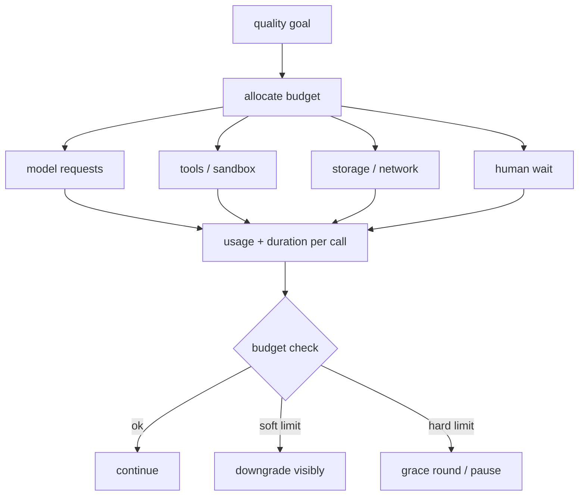
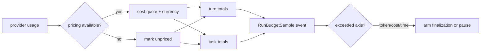

# Cost 与延迟

## 一句话结论

成本不是模型 token 单项，而是 token、工具执行、存储、人工等待和返工的乘积；延迟也不是首字时间，而是组装、排队、网络、沙箱和汇合的总和。可靠做法是用多维预算（token/cost/wall clock）设硬边界，把每笔用量归因到 turn/task/调用 ID；未计费的轮次不能当作免费，降级必须写进观察而不是静默改变质量。

## 上一章遗留问题

M-14 允许多分支并行。M-15 回答：三个子 Agent 的花费如何合并到父任务？一个分支慢如何不拖死整体？预算触顶后停在哪里恢复？

## 本章解决什么矛盾

只限轮数不可靠：同样一百轮可能是几分钟或几小时；只看钱也不行：不同模型价格不可迁移，且有些响应没有报价。Reasonix 的结论值得直接借用：tokens 是最通用的轴——慢而贵的循环会累积它们，快而空的循环也会累积它们。因此预算需要多轴并行：tokens、cost、wall clock，缺哪根就承认哪根盲区。

同时，观测要区分“单请求形状”和“多次重试总账”。Reasonix 明确禁止用 multi-attempt aggregate 覆盖 latest request usage，否则 compaction 决策会被虚增的上下文误导。

## 核心不变量

1. **多轴预算**：至少 tokens/cost/wall 三轴独立配置，负值视为 unset。
2. **归因到 ID**：每笔 usage 关联 model/provider/source（executor/subagent）和 session/run/turn。
3. **未计费保护**：cost 只有在 priced rounds 存在且无 unpriced turns 时才可比，free reading must never look like a crossing。
4. **ledger 只追加**：成功、失败、重试、synthetic 尝试都记行；billing 不随编排状态消失。
5. **硬边界触发收口**：触顶走 grace/finalization 或 pause，保留已完成工作并说明原因。
6. **降级显式**：减少候选、换小模型、缩窗口都要进入观察，不能静默改变验收标准。

失效边界在于外部价格波动和多币种：CostQuote 需要 currency 信息；没有 pricing 时只能依赖 token/wall 两轴。

## 理想模型



| 来源 | 指标 | 优化 |
| --- | --- | --- |
| 输入 token | prompt/cache read/write | 压缩、选择性注入 |
| 输出 token | completion/reasoning | 输出契约、候选限制 |
| 工具 | calls/duration/net | 缓存、批量、窄查询 |
| 存储 | log size/snapshot freq | 分级保留 |
| 人 | approval wait | 批量展示、自动放行低风险 |
| 失败 | retries/rework | 分类、幂等键 |



## 初学者主线

把预算当装修合同：

- 材料费（model cost）、工时费（wall）、耗材计数（tokens）分列；
- 未开发票的项目不能假装免费；
- 快超支时先做收尾，而不是中途弃工；
- 换便宜材料可以，但要在验收单上注明。

### 延迟解剖

用户感知延迟 = 组装 + 排队 + 网络 + 模型首字 + 流式时长 + 工具 + 汇合。优化前先测各段占比。常见误区是只优化 TTFT，却忽略 tool duration 和 join wait。

### 缓存策略

缓存键必须包含内容哈希、参数、权限范围和版本。权限变化时旧结果不可复用。模型响应只有在确定性场景或明确接受风险时缓存。

## 机制深拆

### 1. 预算对象设计

最小结构：

```text
TaskBudget { cost float, wall duration, tokens int }
normalize   负值=unset
limit       配置而非累计值
runBudget   started/rounds/requests/prompt/output/cost/unpriced
```

关键区分：limit 是配置，跨任务 reset 保留；accumulation 是本任务实际消耗。

### 2. Turn 与 Task 双账本

每个 turn 有自己的 runBudget；task 聚合所有 turns。observeRunBudget 把同一 quote 同时折叠进两个作用域，然后发出 RunBudgetSample 事件（counts and money, never content）。这样 UI 可以显示本轮进度，宿主可以检查全局上限。

### 3. Unpriced 保护

如果某轮 usage 没有 CostQuote 或 currency 为空：

1. 标记 unpricedTurns=true；
2. cost 轴不参与 exceeded 判定；
3. rounds/tokens/wall 继续累积。

这防止“无定价模型看起来免费”导致成本轴永不触发。

### 4. 单请求 vs 总账

sampling recovery 会产生多个 HTTP attempt。正确做法：

1. lastUsage 保持 latest single-request shape，供 context snapshot/compaction 使用；
2. billable aggregate 合并所有 attempts 的 delta，供计费使用；
3. RequestCount 用真实 delta，不用估算三角增长。

混用两者会导致 compaction 过早触发或费用低估。

### 5. 降级阶梯

推荐顺序：

1. 缩小检索窗口/分页；
2. 减少并行候选；
3. 子任务换小模型（标注质量预期）；
4. 延长非紧急队列；
5. 触达硬限制时 grace round → pause，保留 checkpoint。

每次降级写入 observation 的 downgrade_reason。

## 反例与故障模式

1. **只用轮数限制**
   - 触发：max_rounds=50。
   - 因果：一轮读 10MB 文件也能耗尽窗口；另一任务 200 轮也没事。
   - 正确边界：tokens/wall 作为主轴，rounds 仅作遥测。
2. **未计费当免费**
   - 触发：自定义 provider 无 pricing。
   - 因果：cost 轴永远不触发，任务烧穿 wall。
   - 正确边界：unpricedTurns 保护，提示用户配置或改用 token 轴。
3. **aggregate 覆盖 latest usage**
   - 触发：重试后把总 tokens 写入 lastUsage。
   - 因果：compaction 认为上下文暴涨，提前折叠。
   - 正确边界：分离 single-request shape 与 billable total。
4. **缓存忽略租户**
   - 触发：A 租户的检索结果被 B 复用。
   - 因果：数据泄露。
   - 正确边界：cache key 含 scope/permission/version。
5. **静默换小模型**
   - 触发：接近预算时悄悄切换。
   - 因果：输出质量变化无法解释，返工更贵。
   - 正确边界：downgrade_reason 进 observation/UI。
6. **TTFT 当全部延迟**
   - 触发：只优化 provider 首字。
   - 因果：用户等待仍被 30s 工具主导。
   - 正确边界：分段计时含 tool/join。
7. **预算不分层**
   - 触发：子 Agent 各有完整额度。
   - 因果：三个分支三倍花销。
   - 正确边界：父任务聚合上限，子分支继承剩余。
8. **硬限制静默截断**
   - 触发：达到上限直接 return nil。
   - 因果：用户以为完成，实际半途而废。
   - 正确边界：pause + resumable entry + 已完成工作清单。

## 一条完整因果链

一次无人值守重构任务的预算是 tokens=500k、cost=$10、wall=1h：

1. 每个 turn 结束，emitTurnUsage 发出带 ModelRef/Pricing/CacheDiagnostics 的 Usage 事件，返回 CostQuote。
2. observeRunBudget 把 quote 折叠进 turn 与 task 账本，并 emit RunBudgetSample（turn/task totals + currency），不含任何 transcript 内容。
3. 第 14 轮后 task tokens 达到 498k，cost=$9.7，wall=52m。handleToolRound 的检查发现 cost 轴先越界。
4. armFinalizationRound 设置 graceRound=true，注入“summarize completed/failed/next steps”指令并发 Notice。
5. 第 15 轮模型给出总结。handleFinalResponse 在 graceRound 下即使 readiness 通过也返回 gracePause，防止 Goal 自动续跑绕过用户选择的边界。
6. Controller 收到 taskBudgetPause(axis=cost)，UI 显示“已保存工作，发送消息继续（新预算）”。
7. 用户批准追加 $5。ResetTaskBudget 开启新 slice，但 Delivery evidence 与 Goal usage totals 保留，审计连续。
8. 若第 15 轮继续调用工具，boundary call 被 refuse 并配对结果，随后仍落入 pause——证明宽限是机制不是提示词。

这条链的核心：预算触顶不是错误码，而是一个受控的状态迁移。

## 设计取舍

| 方案 | 收益 | 代价 | 适用 |
| --- | --- | --- | --- |
| 无预算 | 简单 | 失控风险 | 本地玩具 |
| 只限 tokens | 可移植 | 无法反映真实费用差异 | 内部统一价目 |
| 多轴 token/cost/wall | 覆盖失败形态 | 配置复杂 | 生产 |
| per-call only | 实现简单 | 任务级失控 | 短脚本 |
| task-level aggregate | 全局可控 | 需要双账本 | 长任务/无人值守 |
| 静默降级 | 表面平滑 | 质量不可解释 | 禁止 |
| 显式降级阶梯 | 可解释可调 | 需定义档位 | 推荐 |
| cache everything | 省 token | 权限/新鲜度风险 | 只读且版本化数据 |

迁移路径：先把 Usage 事件补全 model/provider/source；再加 turn/task 双账本与 RunBudgetSample；然后引入 unpriced 保护和 exceeded 轴命名；最后实现降级阶梯与 grace pause。

## 框架实现对照

以下路径均绑定固定快照；行号已在当前 `external/` 树核对。

| 框架 | 预算机制 | 关键锚点 |
| --- | --- | --- |
| Reasonix `aa82b2f` | TaskBudget(cost/wall/tokens) 负值 normalize；runBudget 注释解释 rounds 是 poor proxy；observeQuote 区分 priced/unpriced；exceeded 按 token→cost→wall 命名第一越界轴；taskBudgetLimit 让 host-injected 优先；ResetTaskBudget 开新 slice 保留 evidence；observeRunBudget 双账本 + RunBudgetSample；emitTurnUsage 分离 lastUsage 与 aggregate。 | `internal/agent/run_budget.go:13-37,39-55,57-82,104-123,125-168`、`internal/agent/run_usage.go:269-286` |
| DeepSeek Harness `b150a55` | Storage 层 usage ledger append-only：every settled attempt writes one UsageRow，包括 failed/retried/synthetic/aborted；settlement transaction 同时写 response entry 与 usage row；rows never deleted so billing survives orchestration state；UsageRow 含 UUIDv7 id/seq/usage/entryId/adjustment。 | `external/pi/packages/agent/docs/harness.md:452-458,280-288,2440` |
| Pi `c49906e` | AI_TELEMETRY_SCHEMA 的 pi.ai.request span 记录 input/output/cache read/write/reasoning/total tokens、cost、chunk_count 和 time_to_first_chunk_ms，error.type 低基数；coding-agent 的 getUsageCostBreakdown 从 session entries 按 model 与 Tools/summaries 分桶统计 cost/tokens。 | `packages/agent/src/harness/telemetry.ts:93-113`、`packages/coding-agent/src/core/usage-totals.ts:22-69` |

### Reasonix：多轴预算与双账本

Reasonix 对预算的思考写在类型注释里。TaskBudget bounds one task on the axes its failures are reported in；Tokens is the one that generalizes——a slow expensive loop accumulates them and so does a fast empty one, where wall clock catches only the first and money is not portable across models（`external/DeepSeek-Reasonix/internal/agent/run_budget.go:13-17`）。runBudget 的注释进一步否定 rounds 计数：same hundred rounds cost minutes or hours depending on what each read and how long the model thought（`external/DeepSeek-Reasonix/internal/agent/run_budget.go:39-42`）。limit 字段单独注释为 configuration, not accumulation，survives the reset that starts a new task（`external/DeepSeek-Reasonix/internal/agent/run_budget.go:52-54`）。

记账时，observe 保证 A round whose usage never arrived still counts as a round, so the axis never reads cheaper than the turn actually was（`external/DeepSeek-Reasonix/internal/agent/run_budget.go:57-59`）。exceeded 则实现诚实原则：Cost only counts when the turn was actually priced; an unpriced model reads as free, and a free reading must never look like a crossing（`external/DeepSeek-Reasonix/internal/agent/run_budget.go:104-106`）。taskBudgetLimit 支持 host-injected override，让 unattended loop 有 ceiling 而 ordinary chat 没有（`external/DeepSeek-Reasonix/internal/agent/run_budget.go:125-133`）；ResetTaskBudget 只在 resumable explicit-budget pause 后、no Agent Run active 时调用，保留 Delivery evidence 与 persisted Goal usage totals（`external/DeepSeek-Reasonix/internal/agent/run_budget.go:135-140`）。

observeRunBudget 把 quote 同时折叠进 turn 与 task，然后 RecordRunBudget 一个 RunBudgetSample，包含 Turn/Task totals 和 Currency。totals 注释强调 counts and money, never content（`external/DeepSeek-Reasonix/internal/agent/run_budget.go:91-102,142-168`）。emitTurnUsage 另一侧保护单请求形状：lastUsage must stay as the latest single-request shape...Never overwrite it with a multi-attempt billable aggregate——that would inflate ContextSnapshot and compaction decisions；事件携带 CacheDiagnostics/SessionHit/Miss 并返回 CostQuote（`external/DeepSeek-Reasonix/internal/agent/run_usage.go:269-286`）。

### DeepSeek Harness：append-only usage ledger

DeepSeek Harness 把计费做成存储层一等公民。文档规定 Every settled provider attempt writes one UsageRow——successful, failed, retried, and synthetic attempts alike, including attempts whose operation later aborts；settlement transactions write response entry and usage row together；synthetic settlements write zero usage under reserved usage id。Rows are append-only：terminal cleanup deletes registers but never ledger rows, so billing survives everything that can happen to orchestration state（`external/pi/packages/agent/docs/harness.md:452-454`）。

UsageRow 结构包含 UUIDv7 id、storage-assigned seq、usage、可选 entryId 和 adjustment flag（true = caller-supplied reconciliation, not a provider report）（`external/pi/packages/agent/docs/harness.md:280-288`）。事件层面，usage 是 global-delivery exception：payload 携带 origin lane 和 complete ledger row including durable seq；消费端 keeps the greatest usage row.seq it has applied, preventing late older events from regressing totals（`external/pi/packages/agent/docs/harness.md:2440`）。这是分布式下防回退的标准手法。

### Pi：schema 化延迟与费用指标

Pi 的 pi.ai.request span 把性能与费用字段显式声明：pi.ai.usage.input/output/cache_read/cache_write/reasoning/total_tokens、pi.ai.usage.cost、pi.ai.stream.chunk_count、time_to_first_chunk_ms，以及 low-cardinality error.type（`external/pi/packages/agent/src/harness/telemetry.ts:93-113`）。这让 APM 能按模型/operation 聚合成本与流式体验，而不需要解析日志正文。

coding-agent 侧的 `getUsageCostBreakdown` 从 session entries 直接归因：assistant message 按 `provider/responseModel` 分桶，toolResult usage 和 branch_summary/compaction usage 归入 Tools/summaries 桶，最后输出 cost/token 排序（`external/pi/packages/coding-agent/src/core/usage-totals.ts:36-69`）。用户能看到“这个会话主要花钱在哪个模型、多少花在压缩”，这正是 M-12 要求的可解释性。

## 实现精妙之处

1. **Reasonix 的三轴哲学**：tokens 通用、wall 抓空转、cost 反映真实支出；三者互补而非替代。
2. **Reasonix 的 unpriced guard**：拒绝把未知价格当成零成本，避免 cost 轴形同虚设。
3. **Reasonix 的双账本**：turn 用于实时反馈，task 用于全局上限，同 quote 折叠保证一致。
4. **Reasonix 的 lastUsage/aggregate 分离**：保护 compaction 决策不被重试次数污染。
5. **DeepSeek Harness 的 synthetic zero rows**：连人工合成的结算也留 usage 行，账本完整覆盖所有尝试。
6. **DeepSeek Harness 的 row.seq 回退防护**：迟到事件不会让 totals 倒退。
7. **Pi 的 cost breakdown by bucket**：把 Tools/summaries 单列，让“压缩本身花了多少钱”可见。
8. **Pi 的 TTFT/chunk_count**：把流式体验纳入标准 span 而非自定义埋点。

## 自检与面试追问

1. 你的系统里 cost 轴在哪些情况下会失真？如何检测 unpriced rounds？
2. 为什么 compaction 决策要用 single-request usage？构造一个 aggregate 导致过早压缩的场景。
3. 如何为一个混合模型任务分配预算：主模型贵、摘要模型便宜？
4. 如果用户要求“再给我 $5 继续”，你的系统如何确保新预算不会被旧 pending 分支立即耗尽？
5. 设计一个降级实验：比较缩小检索窗口对任务成功率的影响，需要控制哪些变量？
6. 如何向财务解释 failed/retried/synthetic attempts 都出现在 usage ledger 中？

## 交给下一章的问题

预算管住了资源，但最后一个防线是内容安全：检索片段、网页正文和用户文件可能携带指令。M-16 将拆解 Prompt Injection 防护——如何在不可信内容面前保持工具输入可控。

## 相关页面

- [教材目录](../TOC.md)
- [Context 压缩与截断](./context-compression.md)
- [Sub-agent 与并发](./subagent-concurrency.md)
- [Prompt Injection 防护](./prompt-injection.md)
- [术语表](../09-glossary/glossary.md)
