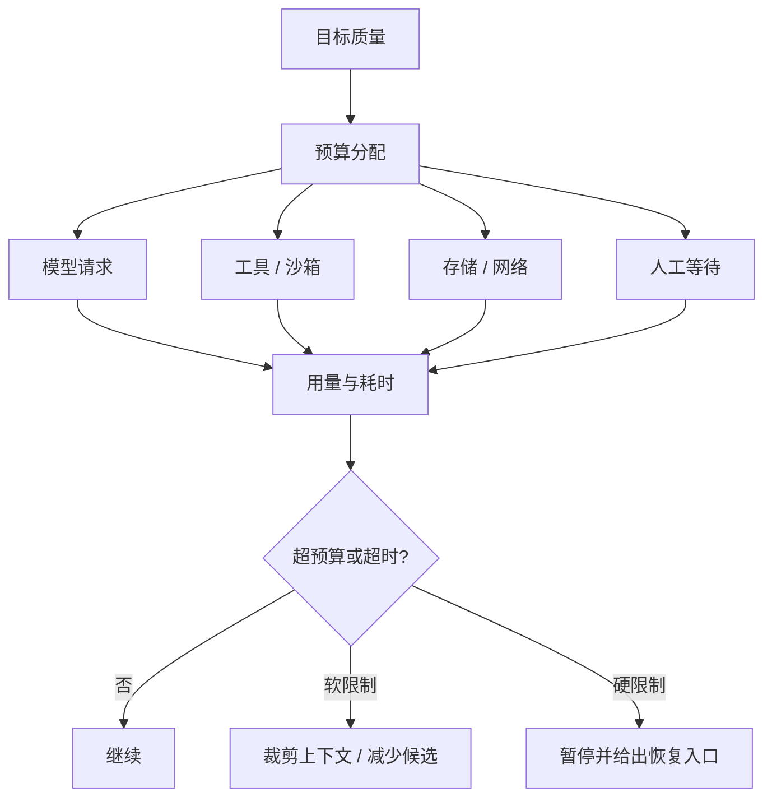

# 成本与延迟

## 一句话结论

成本不只是模型 token，还包括工具执行、存储、人工审批和失败重试；延迟也不只是首字时间，还包括上下文组装、沙箱启动、网络往返和汇合等待。可靠系统把两者归因到 Session、Turn、Step 和调用 ID，再用缓存、裁剪、并行与降级在质量约束内优化。

## 理想模型

| 来源 | 常见指标 | 主要优化 |
| --- | --- | --- |
| 输入 token | 请求字符数、历史长度、工具声明数 | 压缩、选择性注入、Schema 精简 |
| 输出 token | 回复长度、推理内容、多候选数 | 明确输出契约、限制候选 |
| 工具 | 调用次数、进程时长、网络流量 | 结果缓存、批量接口、窄查询 |
| 存储 | 日志大小、快照频率、保留期 | 分级保留、压缩、异步写入 |
| 人 | 审批等待、确认次数 | 批量展示、低风险自动放行 |
| 失败 | 重试次数、重复副作用 | 错误分类、幂等键、预检 |

## 小白解释

省钱不是只换最便宜的模型。如果便宜模型反复读错文件、跑错测试，最后花的时间更多。就像装修：材料费低但返工三次，总成本反而更高。先看哪一步浪费最多，再决定换方法、减少范围或提高单步质量。

延迟也一样。用户感受到的是“多久拿到可用结果”，不是某个接口单独多快。可以让进度条先显示已找到的关键线索，同时后台继续验证。

## 机制拆解

### 预算分层

至少要分四层：全局租户预算、Session 或项目预算、单次 Run 预算、单个调用预算。每层有软限制和硬限制：软限制触发降级提示，硬限制停止新调用并保存恢复点。子 Agent 要继承剩余预算，不能各自拥有完整额度。

### 归因与观测

每次模型请求应记录输入/输出 token、模型版本、缓存命中、费用或内部计价；每个工具应记录排队、执行、上传下载和重试耗时。归因粒度到调用 ID 后，才能发现某个检索器拖慢所有任务，或某类任务总在重复读取大文件。

### 缓存与复用

可缓存对象包括文件读取结果、索引摘要、测试结果、工具 Schema 和稳定前缀。缓存键要包含内容哈希、参数、权限范围和版本；权限变化时不可复用旧结果。模型响应只有在确定性场景或明确接受风险时才缓存。

### 并行与流水线

无依赖的搜索、读取和多候选生成可以并行；有依赖的任务应流水线化，例如一边下载一边解析已到的分片。并行会增加峰值成本和协调复杂度，必须结合 M-14 的并发上限和取消传播。

### 降级策略

接近预算时可按顺序降低成本：缩小检索窗口、减少候选数量、用更小模型处理子任务、延长非紧急任务排队时间、请求用户确认是否继续。降级要写进观察，不能静默改变质量标准。

## 框架对照

下表只建立初稿证据索引，具体行为由批量 Implementation Review 核对：

| 框架 | 成本 / 延迟线索 | 关键锚点 |
| --- | --- | --- |
| Reasonix `aa82b2f` | Run 循环、checkpoint 写入和 Session 持久化影响吞吐；工具分支影响耗时。 | `internal/agent/run_loop.go`、`internal/agent/session.go`、`docs/CHECKPOINTS.zh-CN.md` |
| DeepSeek Harness `b150a55` | Agent loop 组织模型与工具请求；事件持久化和 CLI 渲染参与端到端延迟。 | `packages/core/agent-loop/src/agent.ts`、CLI 应用入口 |
| Pi `c49906e` | Agent context 与 lane 抽象影响并发执行；AgentSession 维护消息生命周期。 | `packages/agent/src/harness/types.ts`、`packages/coding-agent/src/core/agent-session.ts` |

## 常见坑

- **只统计模型费用。** 工具超时、存储膨胀和人工等待常被漏算。
- **缓存忽略权限。** 不同租户或角色读到同一份“省钱结果”。
- **盲目换小模型。** 返工率和错误修复成本超过节省。
- **并行没有上限。** 高峰费用和资源争抢失控。
- **静默截断上下文。** 表面省了 token，实际导致错误方案和高额返工。

## 自检问题

1. 当前任务中最大的三项成本来自哪里？
2. 一个工具结果满足什么条件才能跨 Session 缓存？
3. 软限制触发时，先降级哪一层对质量影响最小？
4. 如何向用户解释“更慢但更准”的选项？

## 相关页面

- [教材目录](../TOC.md)
- [Context 压缩与截断](./context-compression.md)
- [Sub-agent 与并发](./subagent-concurrency.md)
- [术语表](../09-glossary/glossary.md)
