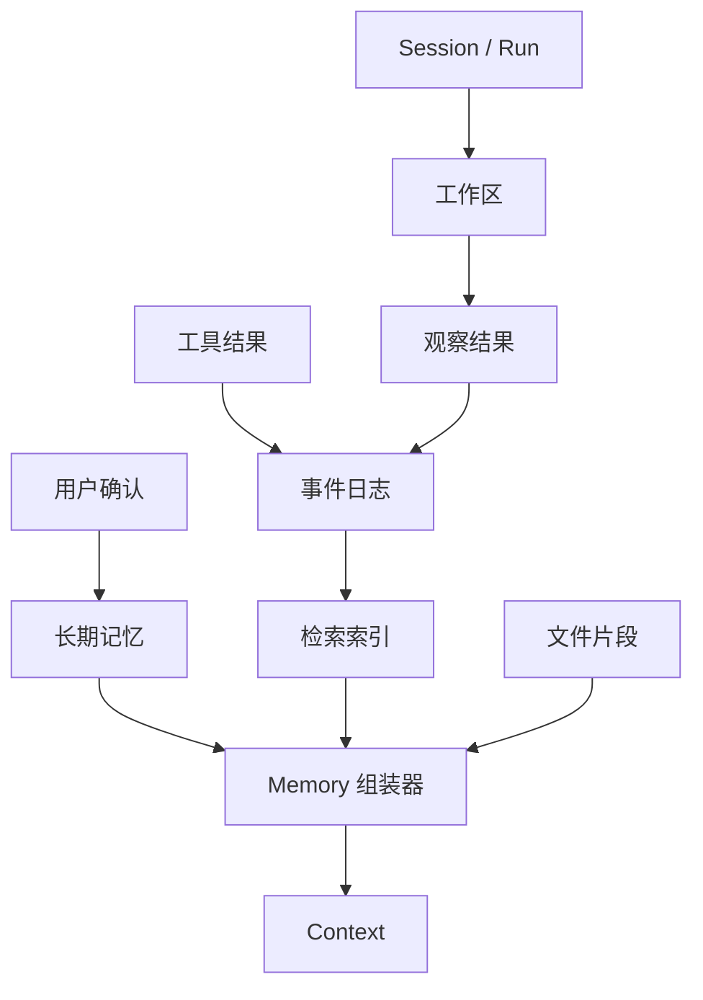

# Memory 与工作区

## 一句话结论

Memory 是跨任务保留并可重新进入上下文的知识；Workspace 是当前任务可读取和修改的可验证环境。二者都不能变成无结构的“万能笔记堆”：每条记忆要有来源、范围、置信度和失效条件，每个工作区要有权限、版本和变更记录。

## 理想模型

| 类型 | 典型内容 | 权威来源 | 主要风险 |
| --- | --- | --- | --- |
| 对话历史 | 当前任务的请求、结论、纠正 | Session | 把草稿当结论 |
| 项目知识 | 架构约定、构建命令、负责人偏好 | 版本库或用户确认 | 过期、以偏概全 |
| 检索知识 | 文档片段、网页摘要、代码搜索结果 | 原始文件或外部服务 | 提示注入、断章取义 |
| 工作区状态 | 源码、生成物、测试输出、容器卷 | 文件系统或宿主 | 与登记事件不一致 |
| 用户画像 | 语言、风格、常用路径、禁用操作 | 显式设置或批准的记忆 | 隐私越界、错误泛化 |

## 小白解释

把长期记忆想成同事的笔记本。可以记“这个项目用 pnpm，不要改格式化配置”，但不能因一次失败就写“所有测试都不可靠”。重要条目要写日期和来源，过时要划掉。

工作区则是办公桌。桌上的文件可以拿起来看、修改和运行测试，但只能放这个项目的材料；不能顺手打开隔壁部门的保险柜，也不能把临时草稿当成正式档案。

## 机制拆解

### 写入门槛

不是所有对话都值得记住。理想写入需要满足四个条件：来源明确、由用户显式确认或受控规则提炼、有适用范围、可更新和删除。应优先记录稳定事实（构建命令）、约束（不要提交 `dist/`）和偏好（回复用中文），而不是一次性错误或未经验证的猜测。

### 结构与溯源

一条记忆至少包括内容、来源事件 ID、创建时间、适用项目或路径范围、置信度和状态。这样检索时可以解释“为什么想起它”，冲突时可以比较新旧证据，用户也可以要求删除某条记忆。

### 检索与注入

Memory 不应默认全部进入 Context。按当前目标检索后，还要经过相关性、新鲜度、权限和长度过滤。不可信网页内容应标记为外部声明，不能直接覆盖项目规则；用户偏好不能越过安全策略。

### 工作区生命周期

工作区要定义根目录、初始化方式、快照点、清理策略和外部依赖。Agent 修改前最好读取基线，修改后生成 diff 和测试证据。长任务应定期提交或保存 checkpoint，避免几十个变更混在一起无法审查。

### 冲突与遗忘

新观察与旧记忆冲突时，不要静默覆盖。可以标记待确认、保留两个版本并注明证据，或要求用户裁决。敏感信息、过期凭证、已完成任务的临时上下文应主动过期；遗忘策略和保留策略一样重要。

## 框架对照

下表只建立初稿证据索引，具体行为由批量 Implementation Review 核对：

| 框架 | Memory / Workspace 线索 | 关键锚点 |
| --- | --- | --- |
| Reasonix `aa82b2f` | Session 聚合消息历史并支持持久化恢复；工具链路涉及工作区和写路径。 | `internal/agent/session.go`、`internal/tools`、`internal/agent/run_loop.go` |
| DeepSeek Harness `b150a55` | 持久会话日志作为跨请求派生基础；核心与 CLI 分离。 | `packages/core/session/src/types.ts`、`packages/core/agent-loop/src/agent.ts` |
| Pi `c49906e` | Agent context 组织会话上下文与执行环境；编码代理管理文件和 lane。 | `packages/agent/src/harness/types.ts`、`packages/coding-agent/src/core/lane.ts` |

## 常见坑

- **把向量库当真相。** 检索结果是投影，原始来源和权限仍需校验。
- **无限累积记忆。** 旧规则和新规则同时出现，模型不知道听哪一个。
- **记忆没有删除入口。** 用户无法撤回隐私或错误结论。
- **工作区无基线。** 无法判断哪些文件是 Agent 改的。
- **跨项目复用路径偏好。** 一个仓库的“不要动 build 目录”不应自动适用于另一个仓库。

## 自检问题

1. “用户喜欢简洁回答”应该由谁确认后才能成为长期记忆？
2. 一条旧架构说明与新 README 冲突时，系统应如何处理？
3. 如何证明某个建议来自哪份文件的第几行？
4. 任务结束后，哪些工作区内容应保留、归档或删除？

## 相关页面

- [教材目录](../TOC.md)
- [Context 组装与分层](./context-assembly.md)
- [Persistence](./persistence.md)
- [术语表](../09-glossary/glossary.md)
