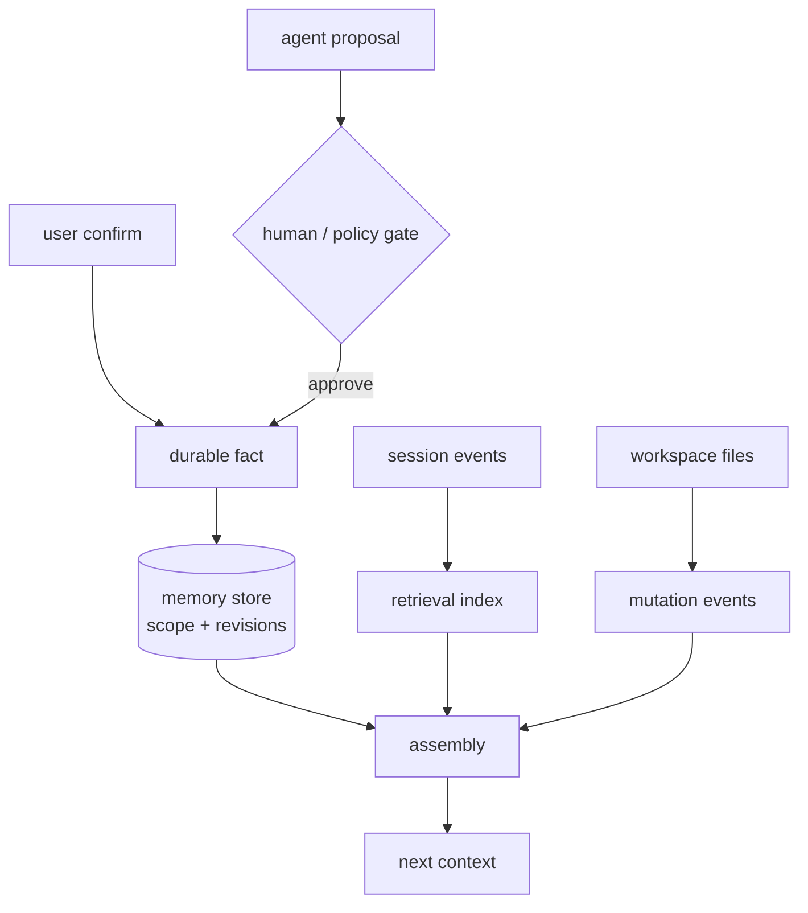
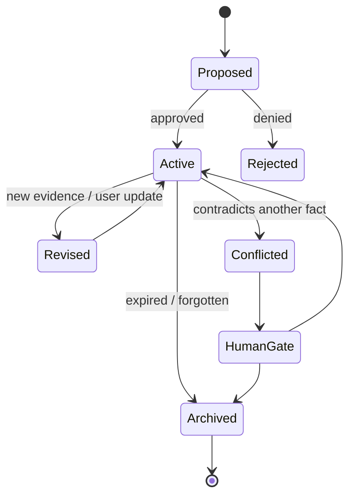

## 一句话结论

Memory 不是“多存点笔记”，而是把稳定事实变成带来源、范围、版本和失效时间的结构化对象；Workspace 也不是无限桌面，而是有写根、mutation 记录和生命周期的任务环境。检索到的记忆只是投影，冲突时必须回到来源或要求人工裁决。

## 上一章遗留问题

M-12 解决了单次 Run 的可见性。但用户偏好、项目约定和工作区文件会跨 Run 存活。M-13 回答：谁批准写入长期记忆？旧事实与新观察矛盾怎么办？Agent 改过哪些文件？临时目录何时清理？

## 本章解决什么矛盾

没有记忆，每次都要重复项目约定；乱记忆，一次错误结论会永久误导模型。工作区同理：不记录基线就无法审查 diff，不清理 temp 会泄漏数据。可靠设计因此拆成三层：

- **durable facts**：显式保存、可修订、可归档；
- **derived retrieval**：从事件/文档生成的索引，可重建；
- **workspace state**：真实文件系统，用权限和 mutation event 约束。

Reasonix 提供完整的 memory 工具链：project/global scope、revision 快照、subject key 唯一性、pinned 预算警告、volatility/expiry。Pi 用 custom/compaction entry 把扩展事实纳入会话树。Reasonix 还用 WorkspaceMutation 事件让宿主感知资源失效。

## 核心不变量

1. **来源可溯**：每条记忆能回答来自哪次确认或哪个事件。
2. **范围显式**：project/global/task/user 分层；跨项目复用需要新授权。
3. **修订不覆盖历史**：更新产生 revision；并发更新失败而不是静默覆盖。
4. **激活有预算**：pinned memory 占用每个 session prefix，必须稀缺并经用户明确请求。
5. **遗忘可审计**：archive 而非悄悄删除；当前会话也要收到 disregard 指令。
6. **工作区写入有登记**：tool 写完后发出 paths/content/tree/git meta 失效事件，失败也可能部分生效。

失效边界在于自然语言事实本身可能含糊：schema 能记录 volatility，却不能保证描述正确。所以人工 review 与 forget 入口不可省略。

## 理想模型



| 类型 | 权威来源 | 生命周期 | 主要风险 |
| --- | --- | --- | --- |
| durable fact | 用户确认或受控规则 | revision + expiry | 过期/泛化 |
| retrieval index | canonical events/docs | 可重建 | 断章取义 |
| workspace state | 文件系统 | task/session lifecycle | 未登记变更 |
| user preference | 显式设置 | 直到撤销 | 隐私越界 |



## 初学者主线

把 memory 当同事笔记本：

- 只记以后还会用的：构建命令、偏好、非显而易见约束；
- 每页写日期和出处；
- 同一个问题只保留一个当前答案（subject key）；
- 改答案时保留旧页（revision）；
- 不再适用时撕下来放进档案盒（archive），并在今天会议上说“别再听那条”（queue disregard）。

工作区是办公桌：只能放本项目材料，动过的抽屉要贴条（mutation event），临时纸屑定期清。

### 写入门槛

好记忆的信号：

1. 用户明说“记住这个”；
2. 多次 Run 中重复出现的稳定约定；
3. 从代码无法推导的原因（why we chose X）；
4. 有明确失效时间的事实（release branch）。

不该记的：

- repo 已有记录的结构；
- 单次对话细节；
- 未验证猜测；
- 必须永远执行的规则（应进 AGENTS.md 类 instruction 文件，不是 background memory）。

### 检索注入

检索结果进入 context 前过滤：

- scope 是否匹配当前 workspace；
- 是否过期或 volatile 且已老化；
- 与 pinned/instructions 冲突时降级为 reference；
- 来源路径是否仍存在/可信。

### 工作区生命周期

1. 任务开始：记录 baseline commit/workspace identity；
2. 执行中：writer tool 发 mutation paths；
3. 审查：diff 基于 baseline；
4. 结束：保留源码变更，清理 temp/cache；
5. 归档：生成 patch/summary 或丢弃。

## 机制深拆

### 1. Fact 对象的字段设计

一条 durable fact 至少要有：

```text
id/name            稳定引用
title/description  索引钩子
type               user/feedback/project/reference
scope              project/global
body               Markdown 事实本体
subject_key        可选唯一问题键
activation         relevant/pinned
volatility         evergreen/stable/volatile
expires_at         硬过期
verified_at        最近复核
revision           乐观并发版本
keywords           召回别名
```

这些字段把“记忆”从散文升级为可治理对象。

直觉上这是药品标签：名称、用途、有效期、批号齐全。精确机制是字段驱动检索与冲突检测。失效边界是 body 仍可能写错，所以 revision/archive 只保证过程可信，不保证内容正确。

### 2. Subject key 与唯一答案

像 `project.package_manager` 这样的键表示一个作用域内只有一个活跃值。保存新的同键事实应被拒绝并返回 holder id，引导走 update 而不是制造矛盾。这解决了“pnpm 还是 npm”类事实在索引里打架的问题。

### 3. Revision 与 archive

更新前 snapshot 当前文件到 `.revisions/<id>/<revision>.md`，再用 atomic write 发布新版。forget 不物理删除，而是 Archive 并返回 archived from 路径；同时向本会话队列注入 disregard 提示，避免已加载内容继续影响本轮。

### 4. WorkspaceMutation 是宿主缓存失效

它不等同于 provider-visible evidence ledger：writer 刚结束就发出，包含 ToolID/Name、Paths、Content/Tree/WorkingTree/GitMeta 维度。注释特别强调 failed writers still qualify——因为可能部分执行。普通 CLI/provider transport 不实现该 sink，只有宿主选择接收。

### 5. 会话树中的自定义事实

扩展级记忆可以成为 custom entry：customType + data，挂在当前 leaf 下。compaction summary 也是 entry，携带 firstKeptEntryId。这样“事实”与会话历史共享同一棵可审计树，而不是旁路数据库。

## 反例与故障模式

1. **一次失败写成永久规则**
   - 触发：某测试偶发超时后 Agent 保存“不要跑该测试”。
   - 因果：未来所有会话跳过关键回归。
   - 正确边界：volatile + expires_at；或仅作为 feedback 带 why/how-to-apply。
2. **全局范围滥用**
   - 触发：把当前项目的构建脚本路径存成 global。
   - 因果：污染其他项目上下文。
   - 正确边界：project 为安全默认；global 需要明确跨工作区语义。
3. **pinned 记忆挤爆前缀**
   - 触发：几十条 pinned facts 自动注入。
   - 因果：重要指令被挤出，成本上升。
   - 正确边界：pinned 仅限用户明确要求，且有预算限制。
4. **并发更新互相覆盖**
   - 触发：两个会话同时改同一 fact。
   - 因果：后写者抹掉先写者修正。
   - 正确边界：expected_revision CAS，冲突时报错。
5. **forget 后本轮仍生效**
   - 触发：删除文件但不通知当前会话。
   - 因果：已加载 guidance 继续影响决策。
   - 正确边界：queue “disregard loaded guidance”。
6. **检索片段冒充原始来源**
   - 触发：索引文本过期，直接注入答案。
   - 因果：引用不存在的接口。
   - 正确边界：检索命中后读原文件/原事件校验。
7. **无基线审查**
   - 触发：任务结束后才问改了什么。
   - 因果：无法区分 Agent 变更与用户变更。
   - 正确边界：baseline + per-writer mutation events。
8. **temp 目录永生**
   - 触发：full output 日志永久留在 /tmp。
   - 因果：敏感输出泄漏且磁盘膨胀。
   - 正确边界：task-scoped temp + cleanup policy。

## 一条完整因果链

假设团队决定包管理器从 pnpm 迁到 npm：

1. 用户在新会话中说：“记住这个项目现在用 npm。”
2. Agent 先查询 memory index，发现 `project.package_manager=pnpm`，holder id 为 m123、revision=7。
3. Agent 构造 remember 请求：同一 subject_key、新 body、expected_revision=7、volatility=stable。
4. Store 校验 revision 匹配，先把旧版快照到 `.revisions/m123/000000007.md`，再原子写出 revision=8。
5. 本会话队列收到更新提示，后续组装不再引用 pnpm。
6. 同期另一个旧会话仍尝试按 revision=7 更新，Store 返回 conflict 并给出当前 holder id，避免覆盖。
7. 三个月后迁移回滚，用户执行 forget。工具 Archive 该 fact，返回 archived 路径，并向当前队列注入 disregard；auto recall 不再加载。
8. 若需要追溯，`.revisions` 里仍能看到 pnpm→npm→archive 全程。

这条链说明：记忆的价值不在“记住”，而在“可修正、可撤销、可追溯”。

## 设计取舍

| 方案 | 收益 | 代价 | 适用 |
| --- | --- | --- | --- |
| 无长期记忆 | 最简单 | 重复沟通 | 一次性任务 |
| 自由 Markdown 笔记 | 灵活 | 无冲突/过期控制 | 个人草稿 |
| 结构化 fact + revision | 可治理 | schema 成本 | 团队/长期助手 |
| 向量库 only | 召回强 | 可能断章取义 | 辅助检索而非权威 |
| instructions file | 稳定规则透明 | 变更需要 PR | 必须遵守的约定 |
| pinned memory | 关键事实常驻 | 挤占预算 | 极少数用户明确要求 |
| session-tree custom entries | 与历史同源 | 会话文件增大 | 扩展事实 |
| sidecar DB | 查询强 | 双源一致性 | 大规模检索 |

迁移路径：先把项目约定从聊天记录整理进 instruction 文件；再引入带 id/revision 的 fact store；然后接 auto-recall 索引；最后补 forget/archive UI 与 workspace mutation 审计。

## 框架实现对照

以下路径均绑定固定快照；行号已在当前 `external/` 树核对。

| 框架 | Memory/Workspace 机制 | 关键锚点 |
| --- | --- | --- |
| Reasonix `aa82b2f` | memory store 按 project slug/global 分目录；ArchivedMemory 保留 traceability；remember 工具 schema 定义 type/scope/activation/volatility/subject_key/expires_at/verified/keywords 与 expected_revision CAS；forget 归档并向 Queue 注入 disregard；revision snapshot 到 .revisions 后 atomic write；WorkspaceMutation host-only 失效事件含 paths/content/tree/git meta。 | `internal/memory/store.go:97-125`、`internal/memory/remember.go:41-78`、`internal/memory/forget.go:45-69`、`internal/memory/store_v2.go:553-580`、`internal/event/workspace_mutation.go:5-34` |
| DeepSeek Harness `b150a55` | 本章未发现通用长期记忆子系统；会话事实以 append-only SessionEventMap/custom 类事件承载，跨 Run 复用依赖 persistence seed/resume（M-10）。此判断限于核心快照。 | `packages/core/session/src/types.ts:230-235` |
| Pi `c49906e` | SessionManager 提供 appendCustomEntry（extensions 自定义事实）与 appendCompaction（摘要 entry 含 firstKeptEntryId/tokensBefore）；entry 挂在 leaf 下形成可审计树。 | `packages/coding-agent/src/core/session-manager.ts:1096-1133` |

### Reasonix：结构化 fact store

存储位置由 `StoreFor` 解析：项目事实放在 `~/.reasonix/projects/<workspace-slug>/memory`，global 在 `~/.reasonix/memory/global`；userDir 不可解析时返回 zero Store，所有方法视为 disabled no-op——这是 fail-closed 的存储开关（`external/DeepSeek-Reasonix/internal/memory/store.go:105-116`）。`DirFor` 补充边界：GlobalDir unavailable 时 global writes fall back to Dir rather than being dropped（`external/DeepSeek-Reasonix/internal/memory/store.go:119-125`），宁可降级也不丢事实。`ArchivedMemory` 定义遗忘语义：saved fact removed from active memory but kept on disk for traceability，附 Path 和 ArchivedAt（`external/DeepSeek-Reasonix/internal/memory/store.go:97-103`）。

remember 工具的 description 本身就是策略文档：适合 user preferences、feedback with why/how、ongoing goals、references；不要保存 repo 已有内容或仅当前对话相关事实；standing rules belong in REASONIX.md/AGENTS.md instructions, not background memory；保存前查 index 复用 name，错则 forget（`external/DeepSeek-Reasonix/internal/memory/remember.go:43-55`）。

Schema 字段进一步把治理编码化：`expected_revision` 设置后 update fails instead of overwriting a newer change；`activation=pinned` 说明 loads into every session's stable prefix、budget-limited、ONLY when the user explicitly asks；`volatility` 区分 evergreen/stable/volatile；`subject_key` 保证 one active value per scope+subject，重复保存 rejected with holder's id；`expires_at` 过去后 stops being auto-recalled entirely；`verified=true` 仅在刚重新确认时刷新 freshness clock（`external/DeepSeek-Reasonix/internal/memory/remember.go:58-75`）。

forget 的行为分三步：Read 原记忆、Archive、若 ctx 有 Queue 则 QueueMemory 一句 “Forgot memory ... disregard its loaded guidance and background-index entry for the rest of this session.”；返回文案也说明 archived from 原引用（`external/DeepSeek-Reasonix/internal/memory/forget.go:45-67`）。这样当前会话和未来会话都不会继续误用。

持久化细节上，`snapshotMemoryRevisionInDir` 把当前内容写入 `.revisions/<id>/<zero-padded revision>.md`；`writeMemoryAtomic` 使用 shared crash-safe writer：temp + fsync + replace（`external/DeepSeek-Reasonix/internal/memory/store_v2.go:553-580`）。

### WorkspaceMutation：宿主侧失效信号

Reasonix 把工作区变更做成独立事件类型。`WorkspaceMutation` 注释强调它是 host-only resource invalidation produced immediately after one concrete writer finishes；separate from ToolResult ordering and from provider-visible delivery evidence ledger。字段包括 Paths、AllPaths、Content、Tree、WorkingTree、GitMeta（`external/DeepSeek-Reasonix/internal/event/workspace_mutation.go:5-17`）。

Sink 是 opt-in 能力：ordinary CLI、remote、provider transports do not implement；RecordWorkspaceMutation forwards only for sinks that opt in。注释还特别规定 failed concrete writers still qualify because they may have partially run（`external/DeepSeek-Reasonix/internal/event/workspace_mutation.go:19-34`）。宿主据此失效文件 watcher/diff 缓存/测试结果缓存。

### DeepSeek Harness：事实即会话事件

在本核心快照中未发现独立 long-term memory 子系统。跨 Run 的“记忆”通过 persistence seed/resume 实现（M-10）：旧 log 作为 seed 注入新 Session，`session/end-seed` 分隔历史与 live 工作。Run 内的扩展事实如果需要持久，应作为 SessionEvent append，保持 append-only source of truth（`external/deepseek-harness/packages/core/session/src/types.ts:230-235`）。这是一个清晰的架构立场：不另设旁路真相，除非引入专门的 memory service。

### Pi：扩展事实挂入会话树

Pi 的 SessionManager 给 extensions 提供 `appendCustomEntry(customType, data)`：生成 CustomEntry，包含 customType/data/id/parentId/timestamp，作为 current leaf 的 child 并推进 leaf（`external/pi/packages/coding-agent/src/core/session-manager.ts:1121-1133`）。因此插件可以记录自己的领域事实（例如 cache invalidation marker、user-approved note），同时享受 JSONL 持久化和树状审计。

compaction 也被建模为 entry：summary、firstKeptEntryId、tokensBefore、usage、fromHook 都在 CompactionEntry 上（`external/pi/packages/coding-agent/src/core/session-manager.ts:1096-1119`）。这与 M-02/M-11 呼应：压缩不是删除历史，而是在树上插入一个 checkpoint 节点，指明从哪里继续保留。

Pi 核心没有内置 global/project fact store；长期知识更多依赖 resource loader 加载的 context files/skills（M-01）和宿主扩展。教材读者应把它理解为“会话树 + 资源文件”组合，而不是自动记忆引擎。

## 实现精妙之处

1. **Reasonix 的 subject_key 唯一性**：把“事实冲突”前置为 schema 约束，拒绝矛盾写入并返回 holder id。
2. **Reasonix 的 expected_revision CAS**：并发更新不覆盖，冲突成为显式错误。
3. **Reasonix 的 pinned 预算警示**：在工具 description 中直接教育模型 pinned space is budget-limited，并把 always-rules 导向 instruction 文件。
4. **Reasonix 的 verified 与 updated_at 分离**：重新核实事实刷新 freshness，但不篡改创建语义。
5. **Reasonix 的 forget queue disregard**：归档未来生效的同时纠正当前会话，处理了“已经加载的记忆”这个常被忽略的状态。
6. **Reasonix 的 failed writer mutation**：承认失败工具可能部分执行，仍发失效事件，避免缓存脏读。
7. **Pi 的 compaction-as-entry**：压缩摘要在会话树上占一个节点，保留 firstKeptEntryId，恢复/分支逻辑不需要特殊 case。

## 自检与面试追问

1. 你的 memory schema 如何表达“这条事实只对 monorepo 的 services/auth 子目录有效”？scope 粒度过粗会出什么问题？
2. 如果两条 subject_key 相同的事实来自不同用户角色，系统应如何仲裁？
3. 为什么 pinned memory 不能由 Agent 自行决定？请设计一个预算与审批流程。
4. 一个 fact 过期后，检索索引中的 embedding/keyword 应立即删除还是标记 stale？两种选择的成本是什么？
5. 如何向用户展示 workspace mutation 历史，使其能快速判断“哪些文件是 Agent 改的”？
6. 如果扩展把大量 custom entries 写进会话树，会对 resume/context 组装造成什么影响？应加什么护栏？

## 交给下一章的问题

本章解决单个工作区的记忆与环境治理。当任务需要多个执行流协作时，新问题出现：Subagent 如何继承最小权限？并发如何共享工具而不互相破坏？M-14 将拆解 Subagent 与并发编排。

## 相关页面

- [教材目录](../TOC.md)
- [Context 组装与分层](./context-assembly.md)
- [Persistence](./persistence.md)
- [Subagent 与并发](./subagent-concurrency.md)
- [术语表](../09-glossary/glossary.md)
