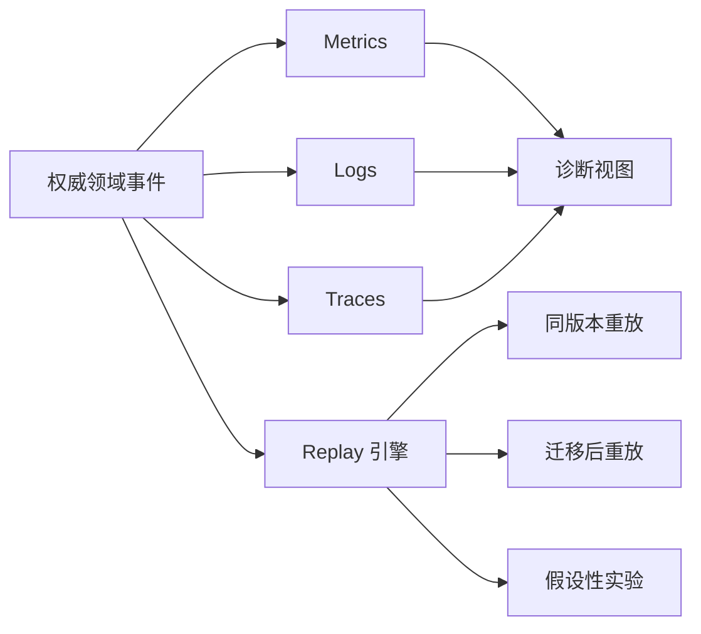

# Observability 与 Replay

## 一句话结论

Observability 要能回答“这次 Run 在哪一层失败”，Replay（重放）要能在受控环境里按权威事件重建决策过程。二者都以稳定 ID、因果顺序和脱敏证据为基础；只有截图或最终答案，不足以解释模型为什么误用工具。

## 理想模型

| 信号 | 回答的问题 | 典型内容 |
| --- | --- | --- |
| Metrics | 系统是否健康？ | 成功率、延迟、token、费用、工具错误率、审批等待时间 |
| Logs | 发生了什么？ | 请求摘要、参数分类、结果状态、清理与降级原因 |
| Traces | 调用如何嵌套？ | Session → Turn → Step → Model / Tool / Approval Span |
| Replay | 为什么这样决定？ | 同序事件输入、模型响应、工具观察、策略版本和环境指纹 |

## 小白解释

把一次 Agent 任务想成快递运输。Metrics 告诉你今天多少包裹晚点；Logs 记录每个站点签收和异常；Traces 显示包裹从仓库到分拣再到配送的路线；Replay 则是把同一张运单重新走一遍，看问题出在地址错误、车辆故障还是派件员判断。

如果只保留“客户说没收到”，就不知道包裹丢在哪个环节。Agent 也需要每一步的编号和时间线。

## 机制拆解

### 结构化信号

日志应输出 JSON 或其他可查询格式，至少包含 trace_id、session_id、run_id、step_id、tool_call_id、事件类型、状态和耗时。关键 ID 不要只放在自然语言里；否则无法聚合“某个工具在哪些任务中失败”。

### 追踪层级

一个用户问题可能包含多个模型请求和工具调用。追踪要把它们组成树：外层是 Turn 或 Run，内层是模型请求、工具执行、审批等待和持久化写入。Span 应记录开始、结束、错误分类、预算消耗和依赖版本。

### Replay 流程

1. **选择范围**：按 Run ID 或故障样本确定要重放的事件区间。
2. **固定输入**：使用已提交事件、工具声明、策略版本和模型配置；不要混入未提交草稿。
3. **处理副作用**：真实外部调用替换为录制结果、模拟器或沙箱代理。
4. **比较差异**：对比新旧模型输出、工具选择、费用和终止原因。
5. **保存结论**：把复现结果关联到原始事件，形成回归测试或修复证据。

Replay 不必须得到相同文本。模型有随机性时，重点核对输入上下文、可选动作、治理路径和终态是否一致。

### 隐私与采样

完整 prompt 和文件片段可能包含源码、密钥或客户数据。应分级存储：生产索引只留元数据，敏感正文加密并限制访问，调试环境使用脱敏副本。高成本追踪可以采样，但错误、审批拒绝、取消和安全事件必须全量保留。

## 框架对照

下表只建立初稿证据索引，具体行为由批量 Implementation Review 核对：

| 框架 | Observability 线索 | 关键锚点 |
| --- | --- | --- |
| Reasonix `aa82b2f` | Session 和 checkpoint 提供历史、修复和恢复记录；Run 循环包含错误分支。 | `internal/agent/session.go`、`docs/CHECKPOINTS.zh-CN.md`、`internal/agent/run_loop.go` |
| DeepSeek Harness `b150a55` | Agent loop 与 session 维护事件、中止原因和派生 surface。 | `packages/core/agent-loop/src/agent.ts`、`packages/core/session/src/types.ts` |
| Pi `c49906e` | `entry_added` 表明 durable entry 可查询；AgentSession 组织 turn 与 message 事件。 | `packages/coding-agent/src/core/session-manager.ts`、`packages/coding-agent/src/core/agent-session.ts` |

## 常见坑

- **只有最终 UI 截图。** 无法还原上下文、工具参数和策略版本。
- **日志没有关联 ID。** 多个并发任务的事件混在一起。
- **Replay 直接打真实 API。** 可能重复付款、重复发消息或污染外部系统。
- **采样丢掉失败。** 成功样本很多但故障样本不足，诊断能力反而下降。
- **混淆性能和质量。** 延迟正常不代表模型选对工具，成功率正常也可能费用失控。

## 自检问题

1. 一次工具失败应产生哪几类信号？
2. 如何在不重复副作用的情况下重放包含支付调用的 Run？
3. 生产环境中哪些事件不能采样？
4. 模型升级后，怎样判断旧任务的行为差异来自提示词、上下文还是模型？

## 相关页面

- [教材目录](../TOC.md)
- [Persistence](./persistence.md)
- [事件模型与流式输出](../01-core-concepts/events-and-streaming.md)
- [术语表](../09-glossary/glossary.md)
