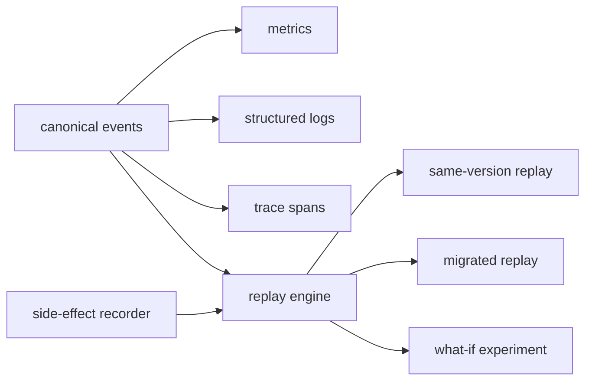
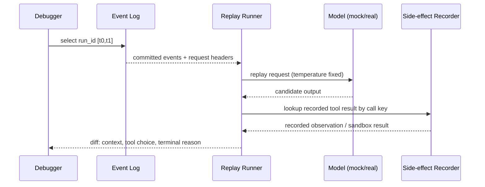

## 一句话结论

Observability 不是多打几条 log，而是让每个 Run 都能回答四层问题：系统健康吗？发生了什么？调用如何嵌套？为什么这样决定？实现基础是稳定 ID、事件因果引用、低基数错误分类和默认无正文的 telemetry；Replay 则用权威事件加录制副作用，在受控环境中重建输入与治理路径。

## 上一章遗留问题

M-11 保证 canonical log 可信。M-12 回答：如何从 log 聚合出指标？一次失败如何定位到具体 tool call？模型升级后如何比较旧行为？prompt 里有源码或密钥时怎么办？

## 本章解决什么矛盾

全量记录 prompt/output 最利于调试，但泄露源码和客户数据；只记元数据最安全，又常常无法解释模型误判。同时高基数 ID 若进入指标维度会炸掉存储。可靠方案是分层：

- **events/log**：完整权威事实，权限受限；
- **traces**：结构化 span，关联 IDs 与低基数属性；
- **metrics**：聚合数值，不含高基数；
- **replay fixtures**：录制副作用 + 输入指纹，可离线运行。

Reasonix 的 compaction receipt 刻意不包含 transcript content，只用 hashes and counts；Pi 的文档明确 Telemetry alone is content- and secret-free by default；DeepSeek Harness 用 `sourceEventSeqs` 把派生结果钉回原始 chunk。

## 核心不变量

1. **ID 因果完整**：trace_id/session_id/run_id/turn/step/tool_call_id 贯穿所有信号。
2. **错误全量**：failure、approval denied、cancel、security event 不参与采样。
3. **telemetry 无秘密**：默认不含 prompt、文件正文、token；正文留在受限 event store。
4. **低基数分类**：error code/type 用于聚合，原始 message 进日志而非 metric label。
5. **replay 隔离**：外部副作用必须替换为 recording/sandbox/mock，否则不得执行。
6. **版本可追溯**：model/provider/prompt/policy/schema 版本进入 span 或 request header。

失效边界在于第三方 SDK：它可能自行记录 body。因此边界不只是自家代码，还包括 HTTP client 日志、APM agent 和错误上报工具。

## 理想模型



| 信号 | 回答 | 必含字段 |
| --- | --- | --- |
| Metrics | 是否健康？ | name/value/timestamp + 低维 tag |
| Logs | 发生了什么？ | IDs/event/status/duration/redacted summary |
| Traces | 如何嵌套？ | parent/span IDs、attributes、error code |
| Replay | 为什么这样决定？ | input fingerprint/model config/policy version/recorded effects |



## 初学者主线

把一次 Run 当快递运输：

- metrics：今天多少包裹晚点；
- logs：每站签收/异常；
- traces：包裹从仓库到分拣到配送的路线；
- replay：同一张运单重走一遍，但用假卡车和录制的签收单。

精确机制是为每个 span 定义 schema：哪些 attribute required、cardinality 高低、错误码集合。失效边界是自由文本标签会把聚合系统拖垮。

### 三类诊断问题

1. **性能**：TTFT、总延迟、tool duration、retry 次数；
2. **成本**：input/output/cache/reasoning tokens、compaction cost；
3. **质量**：wrong tool、missing evidence、false success、policy denial。

不要用同一个 dashboard 混淆三者。

### Trace 树

推荐层级：

```text
run
└── turn
    ├── model.request
    │   ├── stream.chunk*
    │   └── usage
    ├── approval.wait?
    └── tool.call
        ├── tool.execute
        └── tool.result/truncation
```

每个 span 至少带 run/turn/step/call IDs 和 error class。

### Replay 的三种目标

1. **regression**：同版本同输入，验证 bug 修复；
2. **migration**：新 schema/model 后检查语义差异；
3. **what-if**：换 prompt/policy，评估假设方案。

第三种不是复现，而是实验，结论不能冒充历史事实。

## 机制深拆

### 1. Telemetry schema 化

schema 应声明：

```text
span name
parents
start attributes (required/values/cardinality)
end attributes (usage/error/outcome)
status rule
```

好处是编译期或启动期能发现漏字段；坏处是需要维护版本。收益通常大于成本。

直觉上这是体检表格式。精确机制是字段有类型和取值域。失效边界是医生自由写散文时，统计系统无法聚合。

### 2. Receipt 式 durable 观测

对昂贵维护操作（compaction/prune）应写 receipt：

```text
operation_id/status/action/trigger
source_projection/projection_version
covered_prefix_hash/input_hash/output_hash
input_tokens/result_tokens/saved_tokens
affected_count/cache_break/reason
```

receipt 回答“这次压缩做了什么、省了多少、是否破坏 cache”，而不暴露正文。

### 3. 事件因果引用

当 raw chunks 被聚合成 assistant message 时，message event 应携带 chunk seqs。这样 UI 可以展开“这条答案由哪些 token 组成”，replay 可以验证 assembler 行为，审计可以确认没有丢块。

### 4. Redaction 分层

| 层 | 内容 | 访问控制 |
| --- | --- | --- |
| event store | full prompt/tool output | 工程受控、加密 |
| trace span | metadata + hash + low-cardinality code | 团队可读 |
| metric | 数值聚合 | 广泛可见 |
| user-facing debug | redacted preview | 按租户权限 |

redaction 要发生在出口处，而不是依赖每个人记得手删。

### 5. Replay fixture

fixture 包含：

```text
request_fingerprint
model/provider/version
system/policy hash
recorded_tool_results keyed by callId/idempotency_key
expected_terminal_reason
invariants (no orphan call, no extra side effect)
```

模型输出可以不同，fixture 断言的是输入上下文、可选动作和终态类别。

## 反例与故障模式

1. **只有最终截图**
   - 触发：用户报“答错了”并附截图。
   - 因果：无法知道 system prompt、工具参数和 policy 版本。
   - 正确边界：Run 完成后生成可链接的 trace/report。
2. **日志无关联 ID**
   - 触发：多个并发任务都打印 “tool failed”。
   - 因果：无法聚合某工具的失败率。
   - 正确边界：结构化 JSON + IDs。
3. **高 cardinality metric label**
   - 触发：把 session_id/user_id 放进 Prometheus label。
   - 因果：时间序列爆炸，监控崩溃。
   - 正确边界：metric 只留 low cardinality；IDs 放 trace/log。
4. **采样丢弃错误**
   - 触发：为省成本按 10% 采样 spans。
   - 因果：罕见故障没有样本，SRE 失明。
   - 正确边界：error/security/approval-deny 全量。
5. **telemetry 泄露密钥**
   - 触发：HTTP client 自动记录 Authorization header。
   - 因果：token 进入 APM。
   - 正确边界：allowlist header；secret scanner；SDK 关闭 body logging。
6. **replay 打真实支付**
   - 触发：回归测试直接跑原 Run。
   - 因果：重复扣款或发消息。
   - 正确边界：recorder/mock/sandbox 替换外部 effect。
7. **成功样本偏斜**
   - 触发：只收集好评任务。
   - 因果：评测集无法代表故障模式。
   - 正确边界：分层采样 + 故障全量。
8. **版本缺失导致伪回退**
   - 触发：模型升级前后对比无 model/hash。
   - 因果：把提示词变化误判为模型退化。
   - 正确边界：request header 记录 provider/model/config hash。

## 一条完整因果链

用户报告“Agent 说测试通过但代码没改”：

1. 支持人员提供 run_id；trace 树展开该 Run 的三个 turn。
2. Turn 2 的 `tool.call bash` span 显示 exit_code=0、duration=12s；log 中 bounded tail 显示 “2 passed”。
3. 但 workspace mutation receipt 缺失对应路径；event log 显示后续 edit_file 被 mutation barrier skipped。
4. 假设形成：bash 测试跑了旧构建目录，edit 写入的是另一个 worktree。
5. 工程师构造 replay fixture：相同 request header、相同 turn 1/2 events、录制 bash 结果、mock edit。
6. Replay 复现模型选择同一 bash 命令，因为 cwd 来自 stale runtime context。
7. 修复 cwd 冻结逻辑后，CI 用同一 fixture 回归，断言 next tool choice 变为正确目录命令。
8. 生产 metric 新增 `wrong_workdir_test` 错误分类；旧 Run 通过 backfill 标注。

这条链展示了从用户抱怨到代码修复的观测闭环。

## 设计取舍

| 方案 | 收益 | 代价 | 适用 |
| --- | --- | --- | --- |
| 只存最终答案 | 成本最低 | 无法诊断 | 玩具项目 |
| 全量正文 + trace | 最强诊断 | 隐私/存储风险 | 内部高敏调试环境 |
| metadata + 正文分离 | 平衡安全与能力 | 两套访问控制 | 生产默认 |
| head-based sampling | 省 cost | 丢罕见错误 | 仅成功流量 |
| tail-based + errors all | 抓住故障 | 需要缓冲策略 | 推荐 |
| real-side-effect replay | 真实性强 | 危险且不可重复 | 禁止通用化 |
| recorded replay | 安全可重复 | 录制维护成本 | 回归测试 |
| sandbox replay | 可探索未知分支 | 环境搭建复杂 | 安全研究 |

迁移路径：先统一结构化日志和 IDs；再定义 trace schema 与错误码；然后从 canonical log 导出 metrics；最后为关键场景补 replay fixture。不要从买 APM 开始，先保证能回答“这个 callId 在哪”。

## 框架实现对照

以下路径均绑定固定快照；行号已在当前 `external/` 树核对。

| 框架 | 观测机制 | 关键锚点 |
| --- | --- | --- |
| Reasonix `aa82b2f` | ContextMaintenanceReceipt 是 durable、provider-neutral outcome；transcript content intentionally not included，hashes/counters 用于 dedupe/diagnostics；emitContextMaintenance 将 status/action/trigger/tokens/cache break 发入 Sink。 | `internal/agent/projection.go:80-104,116-130`、`internal/agent/context_receipt.go:54-64` |
| DeepSeek Harness `b150a55` | SessionEvent 带 monotonic seq/time/data/sourceEventSeqs；surface replacement 必须引用 shadowed seqs，使派生结果可追溯到原始 chunk/事件。 | `packages/core/session/src/types.ts:408-436`、`packages/core/session/src/types.ts:372-392` |
| Pi `c49906e` | AI_TELEMETRY_SCHEMA 定义 pi.ai.request span 的 operation/provider/model/streaming、usage/cost/TTFT/error type 等属性；HARNESS_TELEMETRY_SCHEMA 定义 run/compaction 等 operation span，required session/lane/operation id 与 recovery flag；harness 文档规定 telemetry content- and secret-free by default。 | `packages/agent/src/harness/telemetry.ts:42-118,193-256`、`packages/agent/docs/harness.md:2477` |

### Reasonix：receipt 不携带正文

Reasonix 对 compaction/prune 这类昂贵操作选择“账单式观测”。`ContextMaintenanceReceipt` 注释直接说明它是 durable、provider-neutral outcome；Transcript content is intentionally not included; hashes and counts are sufficient for dedupe and diagnostics（`external/DeepSeek-Reasonix/internal/agent/projection.go:80-83`）。字段覆盖 status/action/trigger、projection 版本、covered prefix hash、input/output hash、token 节省、affected tool results、summary hash/archive、cache break 和 reason（`:84-103`）。这使运维能回答“压缩是否值得、是否导致 cache miss”，而不需要把用户代码再复制一份进观测系统。

`CompactionState` 还保存 last trigger/mode/tokens/cost/generation/blockedInputHash（`:116-130`），把“上次为什么没压成”也变成持久状态。`emitContextMaintenance` 则把关键子集发到 Sink，形成实时事件（`external/DeepSeek-Reasonix/internal/agent/context_receipt.go:54-64`）。

这套设计的关键取舍是：诊断靠 hash 对比与计数，不看正文。若需要看正文，访问 canonical transcript，而不是让 telemetry 携带敏感内容。

### DeepSeek Harness：seq 引用即因果追踪

DeepSeek Harness 没有把 replay 能力藏在单独组件里，而是放进 SessionEvent 信封：type/seq/time/data 之外还有 `ignorable` 与 `sourceEventSeqs`（`external/deepseek-harness/packages/core/session/src/types.ts:408-436`）。文档规定 surface 事件的 `sourceEventSeqs` must include every shadowed surface node（`:372-392`）。这意味着 assistant/message 可以精确指出由哪些 assistant/chunk 组成，compaction replacement 可以指出遮蔽了哪些旧节点。

对 observability 的意义是：任何派生视图都能回答“你来自哪里”。调试 BlockAssembler 丢块、UI 重放错序、compaction 多删内容时，不需要额外 trace 系统，canonical log 本身就是因果图。

### Pi：schema 化 telemetry 与 secret-free 默认

Pi 把 telemetry 定义成显式 schema。`AI_TELEMETRY_SCHEMA` 的 `pi.ai.request` span 要求 operation/provider/model/api/streaming 作为 start attributes；end attributes 包括 response model/id、normalized stop_reason、HTTP status、各类 tokens、cost、chunk count、time_to_first_chunk_ms 和低基数 error.type（`external/pi/packages/agent/src/harness/telemetry.ts:42-118`）。这覆盖了性能、费用和错误三类问题，而且字段类型明确，适合导出到标准 APM。

Harness 层 schema 进一步要求 operationStartAttributes：pi.session.id、pi.lane.name、pi.operation.id 都是 required 且 high cardinality，pi.operation.recovery 是 required boolean；operationErrorAttributes 使用 stable error code/type 低基数分类（`:193-230`）。`pi.harness.run` span 的 outcome 枚举为 completed/aborted/failed/suspended（`:235-255`）。高 cardinality ID 放在 span 属性而非 metric label，这是正确的分层。

最重要的是隐私边界写在 harness 文档里：Events may contain sensitive conversation and tool content. Serving layers own authorization and redaction... Telemetry alone is content- and secret-free by default（`external/pi/packages/agent/docs/harness.md:2477`）。也就是说事件流可以有正文供授权消费者使用，而 telemetry 通道默认剥离内容与秘密。

## 实现精妙之处

1. **Reasonix 的 receipt-as-telemetry**：昂贵维护的结果成为持久账单，hash 让两次操作可比对，而不需要保存正文。
2. **Reasonix 的 blocked generation 状态**：blockedInputHash/generation 让“上次失败的原因”也成为观测事实，防止反复撞墙。
3. **DeepSeek Harness 的 sourceEventSeqs**：把因果引用作为数据格式的一部分，replay/UI/audit 共享同一张因果图。
4. **DeepSeek Harness 的 ignorable marker**：观测兼容性与语义正确性挂钩，未知必需事件拒绝重建，避免静默残缺 trace。
5. **Pi 的 typed telemetry schema**：required/cardinality/values 在 schema 中声明，减少“日志写了但没人能查”的问题。
6. **Pi 的 TTFT/chunk_count**：流式体验指标进入 AI span，而不是散落在自定义日志。
7. **Pi 的 secret-free 默认**：把脱敏责任放在通道边界，而不是要求每个开发者记得手动过滤。

## 自检与面试追问

1. 给定一个 tool_call_id，你的系统能在多久内找到相关 prompt、policy hash、child process 日志和外部请求 ID？
2. 如何设计错误分类，使其既能聚合又不丢失根因？请给出三层字段示例。
3. 如果 APM SDK 自动捕获 request body，你会从哪些层拦截？如何在 CI 中检测泄露？
4. Replay 时模型输出不同，哪些差异可以接受，哪些必须 fail？请定义 fixture assertion。
5. 一个 Run 包含真实支付调用，如何构造安全的 what-if 实验？
6. 如何向租户证明 debug 数据访问符合最小权限？需要哪些审计字段？

## 交给下一章的问题

Observability 解决“看得懂”。但长期记忆和工作区文件会跨 Run 存活：谁有权写入记忆、何时清理临时工作区、敏感片段如何过期？M-13 将拆解 Memory 与 Workspace 管理。

## 相关页面

- [教材目录](../TOC.md)
- [Persistence](./persistence.md)
- [Memory 与工作区](./memory-workspace.md)
- [术语表](../09-glossary/glossary.md)
