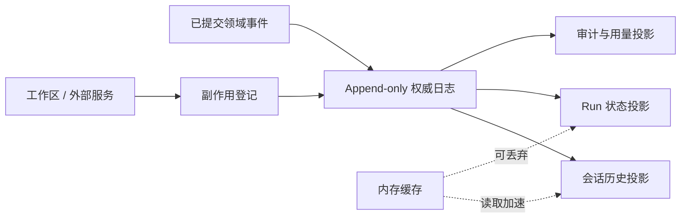

# Persistence

## 一句话结论

Persistence 不是把对象序列化到磁盘，而是决定哪些事实是权威、何时提交、如何派生视图、怎样跨版本迁移，以及崩溃后仍能回答“发生过什么”。可靠数据层把事件、投影、缓存和外部副作用分开管理。

## 理想模型

| 数据类型 | 典型形式 | 一致性要求 | 可否重建 |
| --- | --- | --- | --- |
| 领域事件 | 用户输入、助手输出、工具结果、审批决定 | 必须原子追加 | 否，是权威源 |
| 投影 | 当前会话列表、任务面板、统计报表 | 最终一致或事务一致 | 是 |
| 缓存 | token 计数、索引、渲染片段 | 尽力而为 | 是 |
| 工作区状态 | 源码、生成文件、容器卷 | 与事件登记对账 | 部分可重建 |
| 密钥与凭据 | 短期 token、代理配置 | 加密、最小保留 | 由密钥系统管理 |

## 小白解释

把 Persistence 想成餐厅的订单系统。服务员口头转述可能漏单，所以每张菜单先打印成小票；厨房看小票做饭，收银台按小票结账，经理用小票统计销量。屏幕上的“出餐中”只是方便查看的投影，小票才是证据。

Agent 也一样：模型输出和工具结果先成为不可改写的事件；界面、搜索索引和报告都可以从这些事件重新计算。如果屏幕丢了但小票还在，就能恢复。

## 机制拆解

### 写入模式

常见模式有三种：

1. **Append-only 日志**：只追加不改写，天然适合审计和重放。
2. **状态快照**：读取简单、恢复快，但要处理半写损坏和版本兼容。
3. **日志加快照**：定期保存快照，之后追加增量事件，兼顾速度和完整性。

JSONL 是本地 Agent 常见选择，因为崩溃后通常还能解析前面完整行；SQLite、PostgreSQL 或云存储则提供事务、查询和并发能力。选择取决于单机还是多机、租户隔离、合规和延迟要求。

### 提交点与一致性

权威事件应在业务边界提交：用户输入确认、助手消息闭合、工具调用与结果配对、审批决定生效。跨资源时要么放入同一事务，要么使用 outbox、幂等键和补偿。不要让数据库已提交但副作用未执行的状态长期无主。

### 派生与重建

投影应声明来源范围和版本。升级 schema 时，可以回放旧事件生成新投影，而不是直接改写历史。重建过程要限流，避免一次性读爆存储；重建完成后要对比关键不变量，例如每个工具调用都有结果或明确失败。

### 迁移与保留

事件结构要有版本号和新旧字段共存策略。破坏性变更应写成新版本事件，而不是篡改旧行。保留策略按数据分级：审计事件长留并加密归档，临时流式片段快速清理，凭据交给专用密钥系统，敏感字段在入库前脱敏。

### 并发访问

多进程或多设备访问时需要锁（lock）、租约（lease）、乐观并发或单一写入者协议。即使日志本身可以追加，也要防止两个 Run 同时声称拥有同一会话。移动端离线写入还要考虑冲突合并规则。

## 框架对照

下表只建立初稿证据索引，具体行为由批量 Implementation Review 核对：

| 框架 | Persistence 线索 | 关键锚点 |
| --- | --- | --- |
| Reasonix `aa82b2f` | Session 支持保存加载、事件日志、兼容 JSONL、checkpoint sidecar 和修复。 | `internal/agent/session.go`、`docs/CHECKPOINTS.zh-CN.md` |
| DeepSeek Harness `b150a55` | 会话以事件溯源为核心，ReactLoopAgent 从日志派生请求和 surface。 | `packages/core/session/src/types.ts`、`packages/core/agent-loop/src/agent.ts` |
| Pi `c49906e` | 底层会话使用 JSONL header 加追加行；SessionManager 校验父子链并暴露 entry 查询。 | `packages/coding-agent/src/core/session-manager.ts` |

## 常见坑

- **只保存最终答案。** 工具失败、审批拒绝和中断原因丢失后无法审计。
- **把 UI 状态当权威。** 界面刷新后无法证明哪些请求真正执行过。
- **没有 schema 版本。** 升级后旧会话打不开，或者被静默截断。
- **副作用不登记。** 数据库说成功，工作区却没有对应变更。
- **所有数据一个保留期。** 敏感信息留存过久，审计记录又被过早删除。

## 自检问题

1. 你的系统里哪张表或哪个文件是不可重建的权威源？
2. 助手流式输出应在什么条件下变成持久事件？
3. 从 v1 事件迁移到 v2 投影时，如何验证没有丢事件？
4. 两个浏览器同时打开同一 Session，谁有权写入？

## 相关页面

- [教材目录](../TOC.md)
- [Checkpoint 与 Resume](./checkpoint-resume.md)
- [术语表](../09-glossary/glossary.md)
