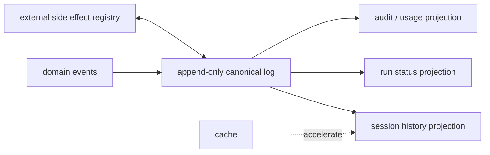
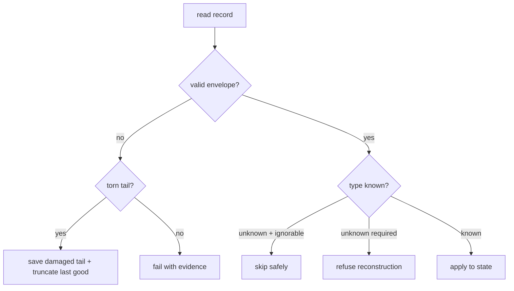

# Persistence

## 一句话结论

Persistence 要回答四个问题：哪份数据是权威？何时原子提交？哪些视图可以重建？旧版本如何迁移？可靠设计把 append-only canonical log 放在中心，投影和缓存都可丢弃或重放；未知的必需事件必须拒绝重建，而不是静默跳过。

## 上一章遗留问题

M-10 说明 checkpoint 只能包含闭合事实。M-11 回答：这些事实以什么格式落盘？半行 JSON 怎么办？v1 日志如何升级到 v3？“数据库说成功但工作区没变”如何避免？

## 本章解决什么矛盾

直接序列化内存对象最快，但版本升级会破坏旧文件；只存最终答案省空间，却丢失审计链。多进程并发又要求写入权协议。工程解法是分层：

- **canonical events**：append-only、带 seq/version；
- **projections**：从事件派生，可重建；
- **caches**：性能优化，可删除；
- **external effects**：用登记表 + idempotency key 对账。

Reasonix 用 event JSONL 加兼容 checkpoint；DeepSeek Harness 把 SessionEventMap 定义为 append-only source of truth 并区分 ignorable 词汇增长与 format bump；Pi 用 header version 加 id/parentId entry tree，并提供 v1→v2→v3 迁移。

## 核心不变量

1. **权威先提交**：先写 canonical event/log，再更新内存投影和 UI。
2. **可解释历史**：失败、取消、审批拒绝都留记录；不能只存成功答案。
3. **未知必需即拒绝**：reader 不认识且无 `ignorable` 标记的事件时，必须 refuse reconstruction。
4. **版本单调**：只有 writer 语义不再向后兼容时才 bump format version；普通新事件类型用 ignorable 覆盖。
5. **投影可重建**：任何 UI/索引/统计都能从 canonical log 重算，或声明不可重建的外部依赖。
6. **副作用登记**：外部动作的 request key/job id/result ref 与事件关联，供对账。

失效边界在于存储介质和并发：JSONL 可能 torn write，SQLite 有事务但锁竞争，云对象存储最终一致。没有一种介质能同时优化所有维度。

## 理想模型



| 数据 | 一致性 | 可否重建 | 保留策略 |
| --- | --- | --- | --- |
| 领域事件 | 原子追加 | 否（是权威） | 长/按合规 |
| 投影 | 最终一致或事务 | 是 | 随需重建 |
| 缓存 | 尽力而为 | 是 | 短 |
| 工作区状态 | 与登记对账 | 部分 | 版本控制 |
| 凭据 | 专用密钥系统 | 由密钥系统管理 | 最短必要 |



## 初学者主线

把 Persistence 当餐厅小票系统：

- 点一道菜打印一张小票（event append）；
- 厨房、收银台、报表都看小票（projections）；
- 屏幕上的“出餐中”只是缓存（UI state）；
- 菜退了不能撕小票，要打一张退款票（append correction）；
- 小票格式升级要能读老票（migration）。

精确机制是每条记录有 type、seq/time、payload 和兼容性标记。失效边界是小票纸也可能撕裂，所以 loader 要知道最后一张完整票在哪。

### 写入模式

1. **append-only JSONL**：本地友好，崩溃后通常可解析前面完整行；
2. **snapshot**：读取快，但需要处理半写和版本；
3. **log + snapshot**：定期快照加速，增量日志保证完整；
4. **database**：事务/查询强，但要设计 schema migration；
5. **object storage**：容量大、最终一致，适合归档。

### 提交点

权威事件的业务边界包括：

- user message accepted；
- assistant message closed；
- tool call/result paired；
- approval decided；
- compaction committed。

流式 chunk 可以作为低层事件持久化（若需要 replay UI），但不能单独改变语义状态。

### Schema 演进

三种变化不同：

1. 新增 informational event → 用 ignorable marker，不 bump format；
2. 影响重建语义的新事件类型 → bump format 或要求旧 reader 拒绝；
3. header/envelope/surface 机制变化 → bump format，提供 upgrade step chain。

“能 parse”不是正确性：静默跳过影响重建的内容就是错误读取。

## 机制深拆

### 1. Canonical log 的字段

最小信封：

```text
type       事件类型
seq        会话内单调连续
time       epoch ms
data       payload
ignorable  可否被未知 reader 跳过
source_seq 引用的早期事件
writer_id  谁写的（可选）
revision   乐观并发版本（文件型系统）
digest     完整性校验（可选）
```

`seq` 连续性能发现丢行；`source_seq` 能表达 compaction replace 和 chunk→message 因果。

直觉上这是账本页码。精确机制是连续 seq 让 loader 发现中间缺失；失效边界是分布式多写者无法共用单一 seq，需要分区键或 Lamport 时钟。

### 2. 投影重建

每个 projection 应声明：

```text
source_range: seq [a,b] or full log
schema_version: projection vN
deterministic: true/false
rebuild_cost: estimate
invariants: tool call has result / parent exists
```

重建后运行 invariant checks，而不是假设代码正确。

### 3. 迁移策略

- **copy-on-read migrate**：打开旧文件时生成新版本副本，保留原文件；
- **rewrite-on-open**：小文件可直接重写，但要先备份；
- **lazy adapter**：读时转换到内存，写时仍旧格式，延迟迁移；
- **new log branch**：破坏性变更开新分支，旧日志只读。

所有迁移都要能回答“如果中途崩了怎么办”。

### 4. 并发写入者

选项：

1. single-writer owner + lease；
2. file lock + bounded wait；
3. optimistic CAS on revision/digest；
4. database row-level locking；
5. CRDT/event merge（复杂，慎用）。

即使 log 本身 appendable，也要防止两个 Run 同时声称拥有同一 session。

### 5. 外部副作用登记

登记字段：

```text
event_seq        关联权威事件
operation        deploy/send/create
idempotency_key
remote_id
status           pending/completed/unknown/compensated
evidence_ref
checked_at
```

这让“数据库已写、外部没做”或反之成为显式任务，而不是丢失在日志里。

## 反例与故障模式

1. **只保存最终答案**
   - 触发：为省空间只写 assistant text。
   - 因果：工具失败、审批拒绝消失，模型重复犯错。
   - 正确边界：领域事件全量 append。
2. **UI 状态当权威**
   - 触发：刷新页面才生成 transcript。
   - 因果：断线期间的真实执行无法证明。
   - 正确边界：server-side canonical log 先行。
3. **无 schema 版本**
   - 触发：字段改名后旧文件解析错位。
   - 因果：静默产生错误历史。
   - 正确边界：header version + 明确 migration/refuse 规则。
4. **未知事件静默跳过**
   - 触发：新版写入必需事件，旧版 reader 忽略。
   - 因果：重建出残缺会话还以为成功。
   - 正确边界：required by default，ignorable 显式标记。
5. **半行 JSON 直接加载**
   - 触发：崩溃留下 torn tail。
   - 因果：后续完好行被误认为损坏。
   - 正确边界：line-oriented 解析到最后完整 record，保存坏尾证据。
6. **两个进程同时写**
   - 触发：无 lease 的桌面双开。
   - 因果：交错 append，seq 断裂。
   - 正确边界：owner lease/CAS/bounded lock。
7. **迁移覆盖原文件**
   - 触发：v1→v3 直接 rewrite 且失败在中途。
   - 因果：旧唯一副本损坏。
   - 正确边界：copy-on-read 或 backup+atomic rename。
8. **外部副作用无登记**
   - 触发：API 成功但进程崩溃，事件未写。
   - 因果：resume 后不知道已部署。
   - 正确边界：outbox/idempotency key/reconciliation 表。

## 一条完整因果链

一次长会话经历三次版本升级：

1. v1 JSONL 只有顺序 entries，无 id/parentId。
2. 用户升级工具。loader 读 header 发现 version 缺失视为 v1，执行 v1→v2 迁移：为每条 entry 分配 id，parentId 指向前一条；compaction 的 firstKeptEntryIndex 转成 firstKeptEntryId。
3. 继续读到 v2→v3 规则：hookMessage role 重命名为 custom，header.version=3。
4. 迁移采用 copy-on-read：新文件写入成功前，原 v1 文件保留；若 rewrite 中途崩溃，下次仍能从原文件重来。
5. 新版本继续 append，entry 通过 parentId 形成 tree，支持 branch/fork。
6. 审计工具读取 v3 文件，验证每个非 root entry 都能找到父节点；孤儿 entry 显式显示为 root，而不是被删除。
7. 若未来 v4 新增必需 lifecycle event，format version bump，v3 runtime 拒绝而不是猜；若是纯通知事件则带 ignorable=true，v3 可安全跳过。

这条链说明：迁移不是改历史，而是提供确定性的旧→新视图，并保留回退证据。

## 设计取舍

| 方案 | 收益 | 代价 | 适用 |
| --- | --- | --- | --- |
| JSONL only | 简单、可人工查看 | 查询弱、并发需外置协议 | 本地单用户 |
| SQLite | 事务、查询、部分索引 | schema migration 复杂 | 桌面多会话 |
| PostgreSQL | 强事务、多租户 | 运维成本 | 服务端 |
| object storage + manifest | 归档便宜 | 最终一致 | 备份/合规 |
| 全量 snapshot only | 读快 | 大文件 IO、易半写 | 小任务 |
| event log + projection | 审计强、可演进 | 实现复杂 | 生产 Harness |
| copy-on-read migration | 安全 | 存储翻倍 | 本地文件升级 |
| lazy adapter | 平滑过渡 | 双路径维护 | 过渡期 |

迁移路径：先定义 canonical event envelope 和 seq；再让所有投影只读事件；然后加入 version/migration；最后补 external effect registry。不要一开始引入数据库，先把事实边界画清。

## 框架实现对照

以下路径均绑定固定快照；行号已在当前 `external/` 树核对。

| 框架 | 持久化机制 | 关键锚点 |
| --- | --- | --- |
| Reasonix `aa82b2f` | session event log schema v1 只有 replace/append 两类；重放有 bytes/records/messages/collection items 四重安全预算；超过预算不得退回旧 checkpoint；compact floor/factor 控制 WAL 膨胀；appendSessionEvent O_APPEND 写入，replace fsync。 | `internal/agent/session_events.go:21-48,92-103,711-783` |
| DeepSeek Harness `b150a55` | SESSION_FORMAT_VERSION 是磁盘格式唯一真相，当前 pinned 0，不兼容拒绝且不迁移；bump 判定基于 writer 语义而非 parser 接受度；SessionEventMap 是 merge-extensible append-only source of truth，seq 连续含 raw chunks；SessionEvent 带 ignorable/sourceEventSeqs。 | `packages/core/session/src/types.ts:33-56,230-235,408-436` |
| Pi `c49906e` | CURRENT_SESSION_VERSION=3；v1→v2 增加 id/parentId 树并转换 compaction index；v2→v3 hookMessage 改名 custom；loadEntriesFromFile 流式解码按完整行解析；getTree 将 orphan 显示为 root；entries append-only，branch() 改 leaf。 | `packages/coding-agent/src/core/session-manager.ts:30,230-291,514-545,1296-1345` |

### Reasonix：安全预算与 WAL 膨胀控制

Reasonix 的 event log 常量不只是格式声明。`sessionEventReplayMaxBytes` 限制 decoder 输入，注释解释这是为了 corrupt logs 不能耗尽 RAM；紧接着又加了 records/messages/collectionItems 上限，因为 compact JSON array can expand into a much larger graph after decoding（`external/DeepSeek-Reasonix/internal/agent/session_events.go:25-33`）。这比单一字节上限更诚实：解码后的对象图才是真正的资源风险。

`ErrSessionReplayLimitExceeded` 的语义也很明确：session left untouched because replaying would exceed safe replay limits；callers must not fall back to an older checkpoint，因为 event log may contain newer turns（`:45-48`）。宁可拒绝，也不用旧快照制造时间倒流。

写入侧，`appendSessionEvent` 打开 O_CREATE|O_WRONLY|O_APPEND，chmod 0600，写入后根据 sync 参数决定 fsync；replace 事件强制 sync，防止 power cut 丢整份转录（`:711-755`）。compact floor 256KiB 和 factor 4 则回答另一个问题：rewind/recovery 这类 replace-heavy history 不能让 WAL 无界增长，超过 live transcript 四倍后折叠成一个 replace event（`:35-42`）。

### DeepSeek Harness：version bump 的哲学

DeepSeek Harness 对 format version 的注释值得逐句读：SESSION_FORMAT_VERSION stamped into every newly-written header and enforced by every persistence backend on load；unreleased 期间 pinned at 0，no compatibility implied，incompatible logs rejected，no migration provided（`external/deepseek-harness/packages/core/session/src/types.ts:33-39`）。

bump 规则刻意反直觉：由 what the WRITER emits 决定，不由 newer reader 能接受什么决定。“parses without error” is not correctness——silently skipping content that shapes reconstruction is a wrong read（`:40-45`）。只有 header shape、event envelope、core event semantics 或 surface mechanism 变化才 bump；ordinary new event type 用 per-event ignorable guard 覆盖词汇增长；不确定时就 bump，near-identity upgrade step almost free，missed bump makes older runtimes read wrong silently（`:46-51`）。

`SessionEventMap` 注释给出数据定位：merge-extensible、append-only source of truth；message history derived from this log；every event lossless JSON，sequence numbers stay contiguous including raw chunks，所以 persistence can store canonical log verbatim（`:230-235`）。SessionEvent 信封则实现兼容策略：ignorable 缺席即 required，unknown required MUST refuse reconstruction；defaulting required means forgotten marker over-refuses rather than silently resuming gutted session（`:416-424`）。surface 事件还要求 sourceEventSeqs 记录因果来源（`:427-436`）。

### Pi：版本迁移与 entry tree

Pi 选择显式整数版本：CURRENT_SESSION_VERSION=3（`external/pi/packages/coding-agent/src/core/session-manager.ts:30`）。迁移函数逐步组合：`migrateV1ToV2` 为每个 entry 生成本地唯一 id，parentId 指向前一条，从而把扁平列表转成树；同时把 compaction 的 firstKeptEntryIndex 转换成 firstKeptEntryId，因为 index 在树结构中不再稳定（`:230-257`）。`migrateV2ToV3` 把 hookMessage role 改名为 custom（`:259-275`）。`migrateToCurrentVersion` 按 header version 依次应用，返回是否发生迁移（`:281-291`）。

读取器是 line-oriented：`loadEntriesFromFile` 使用 StringDecoder 处理 UTF-8 chunk 边界，只在完整 newline 处 parse，最后再尝试 pending 尾部（`:514-543`）。因此 torn final line 不会污染前面完整 entries。

树语义也保持诚实：文档说明 well-formed session has exactly one root，orphaned entries (broken parent chain) are also returned as roots（`:1305-1335`）。也就是坏指针不会被静默删除，而是在树视图中暴露。entries append-only，branch() 通过移动 leaf pointer 实现分支，而不是修改历史（`:1296-1300`）。

## 实现精妙之处

1. **Reasonix 的四重重放预算**：bytes 之外再限 records/messages/collection items，防 compact JSON 解码爆炸。
2. **Reasonix 的 compact floor/factor**：给短会话免维护优惠，又保证 replace-heavy 历史 WAL 有上界。
3. **DeepSeek Harness 的 writer-centric bump rule**：把“能否 parse”和“语义正确”分开，减少静默错误读取。
4. **DeepSeek Harness 的 required-by-default ignorable**：忘写 marker 导致过度拒绝，而不是过度接受，安全方向正确。
5. **Pi 的 index-to-id compaction migration**：承认树化后数组下标不再是稳定身份，主动转换引用。
6. **Pi 的 orphan-as-root**：坏父链可见化，便于诊断而不是悄悄修复。
7. **三家共同点**：canonical log 与投影分离，历史修正通过新事件或新分支表达。

## 自检与面试追问

1. 你的系统中哪一份文件/表是不可重建的？如果它损坏，RPO 是多少？
2. 为什么新增事件类型不一定 bump format version？请举一个必须 bump 的具体变化。
3. 如何设计一个 JSONL loader，使其既容忍 torn tail 又不吞掉 buried corruption？
4. 如果两个设备离线各自 append，合并策略应如何处理冲突审批决定？
5. 请为一个外部支付 API 设计 outbox 表字段和状态机，保证 resume 后不会重复扣款。
6. 从 v2 到 v3 的迁移中途崩溃，如何保证下次能继续而不是产生混合格式？

## 交给下一章的问题

现在有了可信历史。M-12 将回答 Observability 与 Replay：trace 如何把 prompt、工具、事件和版本串起来，如何在调试时重放决策链，以及敏感内容如何脱敏。

## 相关页面

- [教材目录](../TOC.md)
- [Checkpoint 与 Resume](./checkpoint-resume.md)
- [Observability 与 Replay](./observability.md)
- [术语表](../09-glossary/glossary.md)
