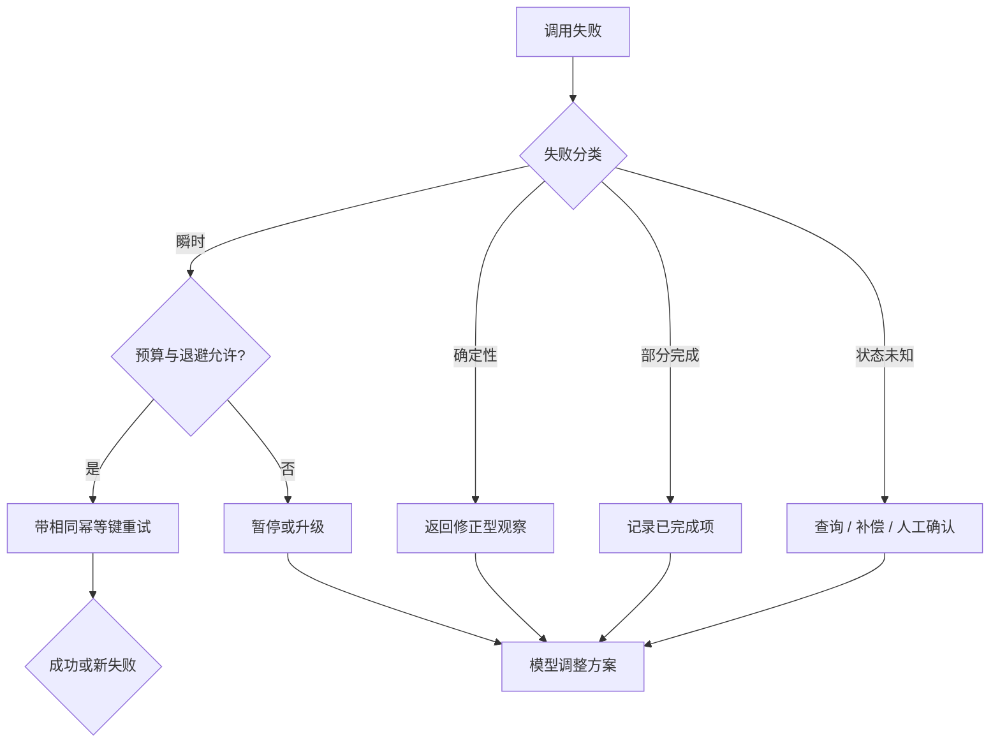

# Retry 与幂等

## 一句话结论

重试只应作用于失败原因明确且重复执行安全的操作。可靠设计先区分瞬时错误、确定性错误、部分完成和状态未知，再为副作用建立幂等键（idempotency key）、补偿或人工介入；不能把所有异常都交给模型“再试一次”。

## 理想模型

| 错误类型 | 例子 | 默认策略 |
| --- | --- | --- |
| 瞬时 | 网络抖动、429、临时数据库切换 | 指数退避、抖动、有限次数 |
| 确定性 | 参数无效、权限不足、文件不存在 | 不重试，返回可修正原因 |
| 部分完成 | 批量写入 3/8 成功 | 列出已完成项，只重试剩余项 |
| 状态未知 | 请求超时但服务可能已执行 | 先查询或幂等重放，必要时补偿 |
| 系统不可用 | 沙箱或存储故障 | 失败关闭，等待恢复或人工 |

## 小白解释

网络失败像快递员没接到电话，重新派一次通常安全；但“把 100 元转给 A”不能只说“再试一次”。如果第一次其实已成功，第二次就会重复扣款。解决办法是带同一张订单号：商家先查订单是否完成，未完成才处理。

Agent 里的重试也一样。读文件失败可以重试；发消息、付款、部署或删除文件必须先知道上次做到哪一步，或者用唯一任务号让服务端去重。

## 机制拆解

### 分层重试

模型请求重试通常针对限流、断流或服务错误，重试前要保留已收到的稳定前缀和用量。工具调用重试取决于副作用：只读操作可自动重试；写操作需要幂等键、预检查或补偿。业务方案重试则是模型根据失败观察改变路径，例如换测试命令或缩小修改范围；它不属于同一调用的自动重试。

### 幂等键

幂等键应由稳定语义生成，例如 Run ID、Step ID、调用 ID、目标资源和参数摘要；不要使用随机数或当前时间。服务端收到相同键时，应返回第一次结果或当前状态。键的生命周期要覆盖超时、重放和恢复，否则崩溃后新进程可能生成新键。

### 退避与预算

有限重试要同时设置次数、总时间、费用和并发额度。指数退避可减少雪崩，加入随机抖动能避免同一任务同步重试。每次失败都应进入持久观察；重试不是删除上一次错误，而是追加新的尝试记录。

### 补偿与恢复

无法幂等的外部动作需要补偿：取消订单、删除临时资源、回滚迁移，或者标记待人工确认。补偿本身也可能失败，因此要有独立状态和重试策略。恢复时，系统先加载已提交事实，识别未闭合调用，再决定重放、查询、补偿或暂停。

## 框架对照

下表只建立初稿证据索引，具体行为由批量 Implementation Review 核对：

| 框架 | Retry 线索 | 关键锚点 |
| --- | --- | --- |
| Reasonix `aa82b2f` | Run 生命周期区分错误与恢复；Session 有 checkpoint 和修复机制。 | `internal/agent/run_loop.go`、`internal/agent/session.go`、`docs/CHECKPOINTS.zh-CN.md` |
| DeepSeek Harness `b150a55` | Agent loop 组织模型和工具分支；持久会话日志支持派生请求。 | `packages/core/agent-loop/src/agent.ts`、`packages/core/session/src` |
| Pi `c49906e` | Agent 事件包含 turn 错误和工具结果；编码代理维护会话状态。 | `packages/agent/src`、`packages/coding-agent/src/core/agent-session.ts` |

## 常见坑

- **无差别重试。** 权限错误和参数错误重试多少次都不会成功。
- **随机幂等键。** 每次重试看起来都是新请求，服务端无法去重。
- **覆盖失败历史。** 审计者看不到尝试次数和错误变化。
- **只重试请求不检查效果。** 状态未知的副作用可能已经发生。
- **预算只算次数。** 长退避、模型费用和用户等待时间同样会耗尽任务价值。

## 自检问题

1. 一个支付工具需要哪些字段才能安全重试？
2. 429 和 403 的处理为什么必须不同？
3. 批量任务部分完成后，如何构造只包含剩余项的新调用？
4. 进程崩溃后，如何判断旧调用是失败还是状态未知？

## 相关页面

- [教材目录](../TOC.md)
- [Tool 执行与副作用](./tool-execution.md)
- [Tool 结果处理与截断](./tool-results.md)
- [术语表](../09-glossary/glossary.md)
