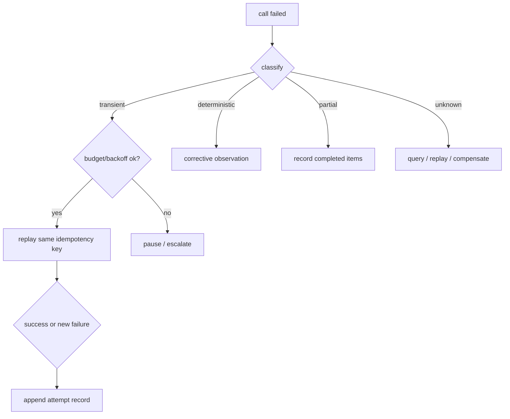
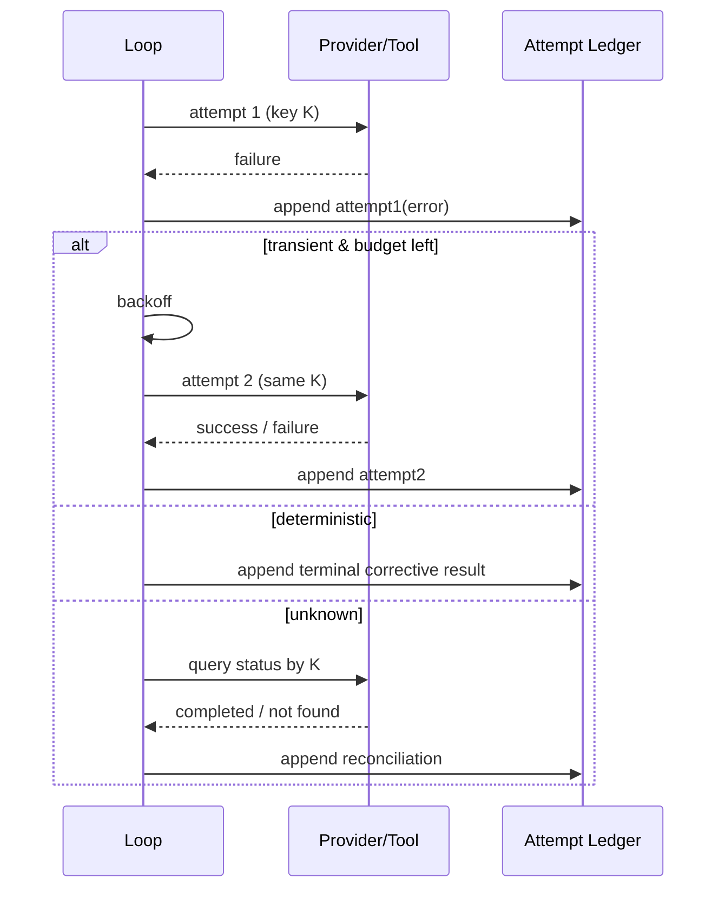

# Retry 与幂等

## 一句话结论

重试不是异常处理器。先回答三个问题：失败是瞬时的还是确定的？重复执行是否安全？上次到底做到哪一步？只有答案分别是“瞬时”“安全”和“已知/可查询”时才自动重试；否则返回修正型观察、补偿或暂停。每次尝试都要成为追加事实，不能覆盖前一次失败。

## 上一章遗留问题

M-07 把执行困在边界内，但命令仍可能因网络抖动、429 或进程崩溃失败。M-08 回答：模型请求的断流能否原样重放？工具写了一半怎么办？超时的外部调用是失败还是状态未知？

## 本章解决什么矛盾

不重试，一次网络抖动就中断长任务；乱重试，同一个部署执行两次。核心是把“恢复控制流”和“重复副作用”分开：

- **provider request** 通常无目标副作用，可有限重放；
- **read-only tool** 可重试；
- **write/external action** 需要幂等键、预检查、补偿或人工；
- **业务方案变化**不是 retry，而是新决策。

Reasonix 用 frozen sampling request 保证重放一致；DeepSeek Harness 让插件在 `agent/request-error` waterfall 中决定是否 retry；Pi 用 auto retry 做指数退避并把 error message 从 live state 移除但保留 session 历史。

## 核心不变量

1. **分类先行**：transient、deterministic、partial、state-unknown、infra-unavailable 分别走不同分支。
2. **重放稳定**：同一逻辑请求的重试使用相同 messages/tools/order；context 变化必须重建为新请求。
3. **预算多维**：次数、总时间、token/cost、用户等待和并发额度都有限制。
4. **尝试可审计**：retry event/error observation 追加到历史，不删除旧失败。
5. **幂等键稳定**：由 Run/Step/call ID + 目标 + 参数摘要派生，生命周期覆盖崩溃恢复。
6. **未知不对账成成功**：timeout 后只能查询、幂等重放、补偿或标记人工确认。

失效边界在于外部系统契约：没有 idempotency API 时，客户端只能尽量预检；有 API 但 key 过短也会碰撞。跨进程恢复还要求 key 能从 durable checkpoint 重导出。

## 理想模型



| 类型 | 例证 | 默认策略 |
| --- | --- | --- |
| transient | network reset、429、503 | limited exponential backoff + jitter |
| deterministic | invalid args、403、not found | 不重试，给修正路径 |
| partial | batch 3/8 写入 | 列出完成项，只补剩余 |
| unknown | timeout after dispatch | query/idempotent replay/compensate |
| infra unavailable | sandbox/storage down | fail closed 或显式降级 |



## 初学者主线

把重试当快递：

- 地址写错（deterministic）：改地址，不要重发；
- 快递员没接到电话（transient）：稍后再派；
- 包裹可能已送达但没签收（unknown）：凭订单号查；
- 一箱碎成三件（partial）：只补七件；
- 快递站关门（infra unavailable）：不要硬闯。

精确机制是为每个动作声明 safety class：`safe-retry`、`idempotent-by-key`、`needs-precheck`、`compensable`、`manual-only`。失效边界是现实系统常常未声明；Harness 必须默认保守。

### 分层重试

1. **transport/provider retry**：连接失败、限流、断流；保留 usage delta。
2. **protocol retry**：响应语法完整但不满足 replay contract，例如 missing reasoning。
3. **tool retry**：只读直接；写操作看幂等性。
4. **business retry**：模型改变方案；这是新 turn/new call，不复用旧 key。
5. **workflow retry**：checkpoint 后重启 Run；必须重建 pending 状态。

### 幂等键设计

推荐组成：

```text
scope       tenant/project/session
operation   deploy-payment-send-message
identity    run_id:step_id:call_id
target      repo/env/resource
input_hash  canonical params hash
attempt_semantics first-wins | last-wins | query-required
```

随机 UUID 只适合一次性任务；恢复后重新生成会破坏去重。

## 机制深拆

### 1. 冻结请求与 context rebuild

Provider 重试有两种合法形态：

- **exact replay**：网络断流后重放完全相同 body，保持 cache 和协议假设；
- **rebuilt request**：context limit 后压缩/裁剪，生成新请求并重置 attempt 计数。

混淆两者会导致：重放时上下文已经变了，或重建时误以为仍是同一逻辑请求。

直觉上，前者是“同一张表单重新提交”，后者是“填一张新表单”。失效边界是新表单必须有新的关联 ID，否则服务端去重会拒绝它。

### 2. 错误分类信号

可靠信号包括 HTTP status、error code、stderr signature、provider finish reason、本地 cancellation。不要用字符串包含 `error` 判断可重试。每个 class 应绑定策略：

```text
429/503        retry with respect Retry-After
401/403        no retry, refresh credential or ask user
400/422        no retry, corrective observation
ECONNRESET     retry if request side-effect safe
timeout        state unknown unless API guarantees
cancelled      stop; do not auto retry
```

### 3. 尝试账本

最小记录：

```text
attempt_id
parent_call_id / idempotency_key
started_at / ended_at
classification
request_fingerprint
usage_delta
outcome
evidence_ref
```

UI 可以只显示最后一次，但持久层必须能回答“试了几次、每次差异是什么”。

### 4. Partial completion

批量动作应返回 per-item status：

```json
{"completed":["a","b"],"failed":[{"item":"c","code":"LOCKED"}],"not_started":["d"]}
```

下一轮只构造剩余项的新调用，并为每项携带子 key。把整批标为 failed 会重复前三项。

### 5. 补偿

不可撤回动作要设计补偿或人工 gate：

- 发布包：无法撤回，改为手动确认 + dry-run；
- 发消息：先查 message ID，再考虑删除/更正；
- 云资源：创建带 tag 的资源，失败时按 tag 清理；
- 数据库迁移：forward-only + 反向脚本不承诺等价。

补偿本身也是副作用，需要独立 key、权限和重试策略。

## 反例与故障模式

1. **403 被无限退避**
   - 触发：通用 catch 所有异常后 retry。
   - 因果：浪费预算，最终仍失败，日志充满重复错误。
   - 正确边界：403 属于 deterministic，转授权修复或人工。
2. **随机幂等键**
   - 触发：每次 retry 生成新 UUID。
   - 因果：支付服务视为两笔订单。
   - 正确边界：key 由 call identity + canonical input 派生并持久化。
3. **重放前修改了 history**
   - 触发：stream 失败后先把 partial assistant message 加入 Session 再重试。
   - 因果：第二次请求包含第一次残片，协议/cache 都错。
   - 正确边界：failed attempt 不入权威历史；只在 local display/recovery 层保存。
4. **timeout 当作确定失败**
   - 触发：HTTP timeout 后立即重发部署。
   - 因果：远端实际已发布，重复发布造成回滚或双版本。
   - 正确边界：state unknown → 查询 release ID/status。
5. **覆盖错误历史**
   - 触发：UI/Session 用最新结果替换 attempts 数组。
   - 因果：审计者不知道第一次是权限错误、第二次才是网络错误。
   - 正确边界：append-only attempt records。
6. **补偿风暴**
   - 触发：清理失败也自动重试，触发删除 API 限流。
   - 因果：补偿本身变成事故。
   - 正确边界：补偿有独立低并发策略和人工上限。
7. **业务方案调整冒充 retry**
   - 触发：模型换了一条命令，但复用旧 idempotency key。
   - 因果：服务端按 first-wins 返回旧结果，新方案被拒。
   - 正确边界：输入语义变化必须生成新 key。
8. **恢复后丢 pending**
   - 触发：进程崩溃重启后重新发起全部工具。
   - 因果：已完成写入重复执行。
   - 正确边界：checkpoint 保存 pending call/key/outcome，恢复时对账。

## 一条完整因果链

一个发布工具调用第三方 API：

1. 第一次 POST 带 `Idempotency-Key: deploy:run42:step7:call3:<hash>`，网关超时。
2. Harness 不把它标为 failed，而是创建 state-unknown observation 并追加 attempt 1。
3. 因为 API 支持幂等查询，先用同一 key GET `/deployments?key=...`。
4. 服务端返回 409 “in progress”；Harness 等待 2 秒再查，而不是重新 POST。
5. 第二次查询返回 deployment_id 和 completed。Attempt 2 是 reconciliation，不是重复部署。
6. 若查询一直 404 且超过窗口，则根据 API 合同选择一次同 key POST 重放；仍无响应则升级人工，并保留 incident evidence。
7. Session 最终包含：original timeout、query attempts、final deployment result。审计者能证明只有一个 deployment。

这条链的核心是：对状态未知而言，“查”通常优于“再做一次”。

## 设计取舍

| 方案 | 收益 | 代价 | 适用 |
| --- | --- | --- | --- |
| 不自动重试 | 最安全 | 体验差 | 不可逆外部动作 |
| 固定次数盲重试 | 实现简单 | 重复副作用 | 只读探测 |
| 分类 + 指数退避 | 平衡成功率与成本 | 需要准确错误码 | provider/read-only tools |
| 幂等键 + first-wins | 可安全重放 | 服务端必须支持 | 支付/部署/消息 |
| precheck + patch | 无需服务端 key | 有竞态窗口 | 本地文件、简单 API |
| saga compensation | 可回滚长流程 | 补偿复杂且可能失败 | 多服务工作流 |
| manual gate | 最终兜底 | 阻塞自动化 | 高危生产变更 |

迁移路径：先停止吞异常，输出结构化 classification；再把 provider retry 从工具 retry 分离；然后为关键外部工具加 idempotency key；最后实现 attempt ledger 和 recovery 对账。

## 框架实现对照

以下路径均绑定固定快照；行号已在当前 `external/` 树核对。

| 框架 | Retry 机制 | 关键锚点 |
| --- | --- | --- |
| Reasonix `aa82b2f` | frozen sampling request 最多 1+5 次 body attempt；stream interrupted discard speculative sink 后 exact replay；context limit 替换 frozen 并归零 attempt；missing reasoning protocol retry/fallback；失败 usage delta 合并。 | `internal/agent/run_loop.go:340-344,362-388,391-459,498-517`、`internal/agent/sampling_request.go:59-85`、`internal/agent/sampling_attempt.go:10-52` |
| DeepSeek Harness `b150a55` | assembler finish 为 error/aborted 时进入 `agent/request-error` waterfall，携带 failure/retryPolicy/signal；只有 `action.kind === 'retry'` 才 continue，否则抛 LlmError；chunk/message 提交边界保证失败尝试不污染派生历史。 | `packages/core/agent-loop/src/agent.ts:372-389,339-370` |
| Pi `c49906e` | settings 默认 maxRetries=3/baseDelayMs=2000；_prepareRetry 递增 attempt、超过上限回退计数、指数 delay、emit start/end；等待可 abort；取消时 emit Retry cancelled；错误 assistant message 从 live state 移除但 session 保留。 | `packages/coding-agent/src/core/settings-manager.ts:878-905`、`packages/coding-agent/src/core/agent-session.ts:2807-2860,2835-2839` |

### Reasonix：frozen request 与三类重试

Reasonix 的注释把规则说得很清楚：prepare once、freeze provider request、最多 `maxSamplingAttempts` body attempts，only commit after clean terminal；failed attempts never write Session or execute tools（`external/DeepSeek-Reasonix/internal/agent/run_loop.go:340-344`）。常量是初始 1 次 + 5 次恢复（`external/DeepSeek-Reasonix/internal/agent/agent.go:48-51`）。

stream interrupted 未耗尽时，`handleSamplingError` 先 `streamSink.Discard()`、emit `Retrying`，再按 frozen request 重试；等待期间 ctx 取消则返回 interrupted terminal（`external/DeepSeek-Reasonix/internal/agent/sampling_request.go:59-80`）。backoff 约 0.5s、1s、2s、4s、8s 加 jitter，取消时返回 false（`external/DeepSeek-Reasonix/internal/agent/run_loop.go:498-517`）。

context limit 是不同类：如果可恢复，丢弃 sink、替换 frozen request、`attempt = 0; continue`（`external/DeepSeek-Reasonix/internal/agent/run_loop.go:371-379`）。missing reasoning 则属于 protocol recovery：可能做一次 exact replay，失败后 fallback 或 unreplayable terminal（`:391-459`）。每次 HTTP attempt 通过 RequestAttemptCount delta 记录真实计费，多 attempt 再合并 billable aggregate（`external/DeepSeek-Reasonix/internal/agent/sampling_attempt.go:10-52`）。

这套设计的关键是：**同一逻辑请求**的 stream/protocol retry 保持 frozen payload；**物理约束变化**的 context rebuild 显式成为新请求。

### DeepSeek Harness：waterfall 决定是否 retry

DeepSeek Harness 在 assembler 判定 finish 为 `error` 或 `aborted` 后，不直接重试，而是发起 `agent/request-error` waterfall；payload 包括 turn/step/provider/failure/retryPolicy/signal（`external/deepseek-harness/packages/core/agent-loop/src/agent.ts:372-385`）。

默认 fallback 返回 undefined；只有插件返回 `action?.kind === 'retry'` 才 `continue` 当前 while loop，否则抛出带 failure/code 的 `LlmError`（`:386-389`）。这意味着重试策略可以被宿主替换：内置不做隐式盲重试，策略拥有明确裁决点。

提交边界同样重要：chunk 逐个 append 到 session 并收集 seqs；只有干净终态才 append assistant/message 并携带 sourceEventSeqs（`:339-370`）。因此 request-error retry 之前，失败的推测输出不会进入 derived history。

### Pi：用户可见的 auto retry 与指数退避

Pi 的 retry 设置默认 enabled、maxRetries=3、baseDelayMs=2000；provider 另有 timeout/maxRetries/maxRetryDelayMs 配置（`external/pi/packages/coding-agent/src/core/settings-manager.ts:878-905`）。

`_prepareRetry` 是显式状态机：递增 `_retryAttempt`；超过 `maxRetries` 时回退计数并返回 false；delay 使用 `baseDelayMs * 2^(attempt-1)`；emit `auto_retry_start`，包含 attempt、maxAttempts、delayMs 和 errorMessage（`external/pi/packages/coding-agent/src/core/agent-session.ts:2811-2833`）。

等待期间创建 abort controller；sleep 被 abort 后 emit `auto_retry_end(success:false, finalError:"Retry cancelled")` 并返回 false（`:2841-2858`）。重试前会把 live agent state 最后一条 error assistant message 移除，但注释强调 keep in session for history（`:2835-2839`）。这实现了 UI 投影与会话审计分离：用户不必看到死循环错误气泡，而持久层仍保留尝试证据。

summarization 还有独立 callbacks：`onRetryScheduled/onRetryAttemptStart/onRetryFinished` 分别发出 scheduled/attempt_start/finished 事件（`:2782-2804`），说明不同子系统可以有自己的 attempt telemetry，但事件命名和终态仍统一。

## 实现精妙之处

1. **Reasonix 的 frozen vs rebuilt 二分**：stream retry 保 payload，context rebuild 归零 attempt，避免两种恢复共享一个模糊 counter。
2. **Reasonix 的 usage delta**：RequestAttemptCount 差值记录真实 HTTP POST，pre-wire 失败不计费，多 attempt 合并总账。
3. **DeepSeek Harness 的显式 retry decision point**：没有内置 catch-all，宿主必须在 waterfall 中返回 `{kind:'retry'}`，责任清晰。
4. **DeepSeek Harness 的 chunk seq provenance**：即使后续 retry，先前 attempt 的原始 chunk 仍在 log 中，但不会进入 derived history。
5. **Pi 的 live/session 分离**：错误消息从当前 UI state 移除，同时保留 session history，兼顾体验与审计。
6. **Pi 的 attempt count correction**：超过上限时先减一，让 post-run 能报告真实完成尝试数，而不是 off-by-one。
7. **三家共同点**：失败尝试都不直接变成 committed assistant/tool result，除非作为显式错误观察。

## 自检与面试追问

1. 一个 API 同时支持 `Idempotency-Key` 和状态查询接口，你会优先重放还是查询？判断条件是什么？
2. 如何区分 provider stream retry 和 protocol retry？两者对 request fingerprint 的要求有何不同？
3. 如果错误消息包含敏感 token，attempt ledger 应保存什么？模型可见文本又应保存什么？
4. 批量 100 个文件的移动操作失败在第 37 个，如何设计返回结构和下一次调用的 keys？
5. 进程崩溃后 checkpoint 只有 pending call 没有 outcome，你的第一动作是什么？
6. 为什么 post-hook 不能把 failed attempt 从 Session 删除？如果要隐藏 UI，应在哪层处理？

## 交给下一章的问题

重试解决了“失败后要不要再来一次”。但如果调用永远不返回，系统需要主动终止：M-09 将拆解 Timeout 与取消——如何传播 signal、终止进程树、把已发生副作用标为 partial/unknown。

## 相关页面

- [教材目录](../TOC.md)
- [Tool 执行与副作用](./tool-execution.md)
- [Timeout 与取消](./timeout-cancellation.md)
- [Checkpoint 与 Resume](./checkpoint-resume.md)
- [术语表](../09-glossary/glossary.md)
