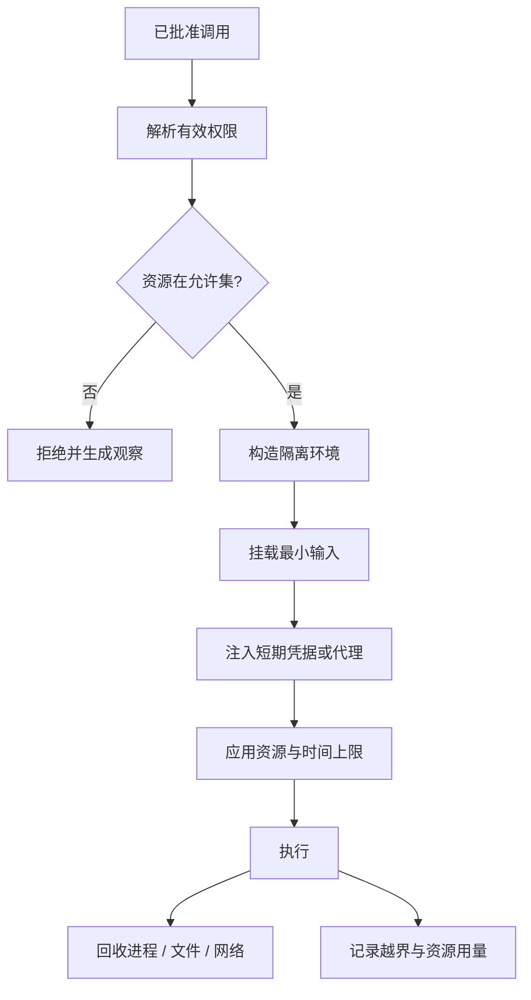

# Sandbox 与权限

## 一句话结论

Sandbox 是给工具执行划定可验证边界的机制，权限是进入这些边界的能力声明。可靠系统采用默认拒绝（default deny），把文件、网络、进程、时间和凭据分开授权，并用运行时隔离兜底；提示词中的“不要越界”不能替代任何一层。

## 理想模型

| 维度 | 典型控制 | 常见失败模式 |
| --- | --- | --- |
| 文件系统 | 工作区白名单、只读挂载、临时目录、路径规范化 | 符号链接逃逸、相对路径漂移 |
| 网络 | 域名 allowlist、出站代理、无网络模式 | 重定向到内网、DNS 隧道、下载大文件 |
| 进程 | 用户/组隔离、无特权容器、系统调用过滤 | shell 注入、子进程继承过高权限 |
| 凭据 | 短期令牌、最小 scope、密钥代理 | 环境变量泄露、长期 token 进入日志 |
| 资源 | CPU、内存、磁盘、进程数、超时 | 测试死循环占满主机 |
| 审计 | 命令、路径、域名、变更和退出状态 | 只有最终文本，无法追责 |

## 小白解释

把 Sandbox 想成实验室的通风柜。实验人员可以做有风险的操作，但只能把手伸进固定开口，气体不会进入整个房间；废液有专门容器，结束后要清理。权限单决定能做哪类实验，通风柜保证出错也不影响整栋楼。

对 Agent 来说，读项目文件像查看样品，联网像订购试剂。系统应先问“这次任务需要什么”，而不是把整间仓库和所有钥匙都交给助手。

## 机制拆解

### 最小权限

每次 Run 或工具调用应获得完成任务所需的最小集合。例如搜索代码只需读取 `src/` 和索引服务；跑单元测试可能需要临时目录和包管理源；发布操作才需要部署凭据。权限应带范围和过期时间，不能因一次批准变成永久全局能力。

### 路径边界

文件控制必须先规范化路径，再判断是否在允许根内，并处理符号链接、硬链接、父目录逃逸和大小写差异。写入通常分三类：只读源码区、可写构建产物区和独立临时区。删除和移动要有额外确认，避免一个路径规则覆盖多个真实目标。

### 网络与凭据

网络不是只有“开”和“关”。理想设计区分包管理源、API 主机、本地服务和任意网页；出站请求应经过代理以记录域名、方法和大小。凭据不能直接写进模型上下文或普通环境变量，优先使用短期 token、作用域代理或密钥网关，并在错误信息中脱敏。

### 运行时隔离

可选层级包括进程参数限制、操作系统用户、容器、微虚拟机和远程执行。层级越高，逃逸面越小，但延迟和工程成本也越高。选择时要考虑宿主信任级别、多租户需求、工具能力和恢复速度；没有单一方案适合所有任务。

### 失败关闭与降级

Sandbox 初始化失败、权限解析不明或隔离器不可用时，不应退回无沙箱模式。可以提供显式降级：只读继续、等待人工批准、切换到受控远端，或者终止当前分支。所有降级都要留下原因和决策者。

## 框架对照

下表只建立初稿证据索引，具体行为由批量 Implementation Review 核对：

| 框架 | Sandbox 线索 | 关键锚点 |
| --- | --- | --- |
| Reasonix `aa82b2f` | 工具层检查写路径；Agent 层存在门控和命令分支。 | `internal/tools`、`internal/agent/run_loop.go` |
| DeepSeek Harness `b150a55` | 权限类型和前置策略参与工具链路；CLI 与核心分离。 | `packages/core/agent-loop/src`、权限相关 package |
| Pi `c49906e` | 通用 agent 包定义执行环境抽象；coding-agent 支持不同宿主装配。 | `packages/agent/src`、`packages/coding-agent/src/core/sdk.ts` |

## 常见坑

- **把提示词当防火墙。** 模型输出可能被注入或误生成，必须由线束强制执行边界。
- **只校验入口字符串。** 未规范化的路径、重定向和嵌套命令会绕过表面检查。
- **凭据进入上下文。** 一旦出现在模型请求或日志中，就难以完全收回。
- **忽略子进程。** 子进程可能继承网络、文件描述符和高权限用户。
- **资源上限缺失。** 一个失控测试就能让整个宿主不可用。

## 自检问题

1. 同一任务中的读、测试和发布操作分别需要哪些权限？
2. 如何防止 `/workspace/link -> /etc` 这样的符号链接逃逸？
3. 包安装需要访问公网时，如何既允许依赖下载又阻止数据外发？
4. 沙箱服务不可用时的安全降级顺序是什么？

## 相关页面

- [教材目录](../TOC.md)
- [审批模型](./approval.md)
- [Tool 执行与副作用](./tool-execution.md)
- [术语表](../09-glossary/glossary.md)
