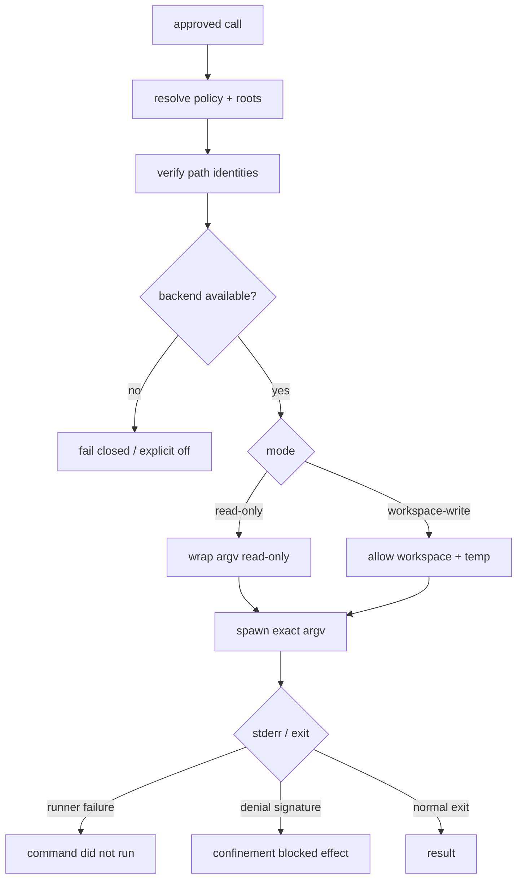
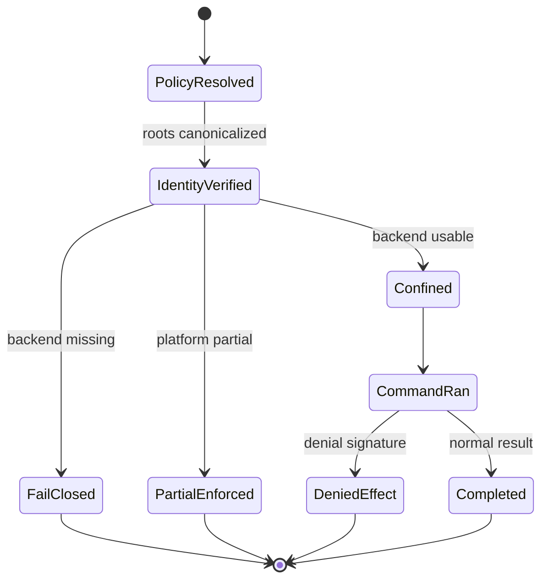

## 一句话结论

Sandbox 是执行层的强制边界，权限是策略层的能力声明。可靠设计把两者分开：policy 说"这次可以写 workspace"，enforcement 用 Seatbelt/bubblewrap/Landlock/ACL 让进程真的只能写那里。后端缺失时必须 fail closed 或显式降级，绝不能静默裸跑。

:::note
policy 说"这次可以写 workspace"，enforcement 让进程**真的只能写那里**。两者不能混为一谈。
:::

## 上一章遗留问题

M-06 保证人批准了某个请求。但被批准的 shell 仍可能 fork 子进程、访问 home 目录、连接内网或改写 session 文件。M-07 回答：如何把“允许”翻译成操作系统约束？授权目录的 symlink 身份变化怎么办？

## 本章解决什么矛盾

完全隔离让编译、测试和包管理无法工作；不隔离又把宿主交给概率性模型。工程解法是分层：

- **policy**：read-only / workspace-write / danger-full-access 等模式；
- **identity**：canonical path、verified root、session grant；
- **enforcement**：OS jail 包裹 exact argv；
- **fallback**：后端不可用时拒绝或显式降级；
- **diagnosis**：区分 runner failure 与 sandbox denial。

Reasonix 强调 permitted command still cannot escape the box；DeepSeek Harness 把 confinement 定义为 same-world process seam；Pi 当前核心偏本地进程控制与环境裁剪，依赖宿主扩展实现更强隔离。

:::tip
分层设计：**policy**（意图） → **identity**（身份） → **enforcement**（OS 约束） → **fallback**（显式降级）。
:::

## 核心不变量

1. **默认拒绝**：没有明确允许的写、网络和敏感读都应失败。
2. **policy 与 enforcement 分离**：权限规则决定意图，OS backend 决定事实；前者不能替代后者。
3. **根是身份不是字符串**：授权前 canonicalize/realpath；使用时确认身份未变，否则从有效集合剔除。
4. **exact argv 进入 jail**：不能把模型字符串重新拼成 shell 命令再包裹。
5. **不可用即拒绝**：请求 enforce 而后端缺失时返回 SANDBOX_UNAVAILABLE/refusing to run unconfined，除非产品显式选择 off 并告知用户。
6. **受保护状态优先**：即使 broad root 覆盖 session/state 路径，也保持只读。

失效边界在于平台能力：Windows 可能只有 partial ACL；macOS 的 sandbox-exec 存在但 `sandbox_apply` 被禁；Linux 旧内核只支持部分 Landlock ABI。系统必须报告 full/partial，而不是假装同等强度。

:::danger
后端缺失时必须 **fail closed**，绝不能静默裸跑。系统必须报告 full/partial，不能假装同等强度。
:::

## 理想模型



| 维度 | 控制点 | 典型失败 |
| --- | --- | --- |
| 文件 | WriteRoots、ForbidReadRoots、ProtectedWriteRoots | symlink 替换、hard link alias |
| 进程 | PID namespace、die-with-parent、process tree kill | detached 后代继续写 |
| 网络 | off/proxy/domain allowlist | DNS 隧道、内网 SSRF |
| 凭据 | 短期 token、代理注入、env 删除 | API key 进入日志 |
| 资源 | timeout、CPU/memory/pids | 死循环占满宿主 |
| 审计 | wrapped argv、denial、runner failure、mutation paths | 只记最终文本 |



## 初学者主线

把 sandbox 当实验室通风柜：

1. 权限单（policy）说今天做哪类实验；
2. 通风柜（enforcement）保证气体不出柜；
3. 试剂瓶贴唯一编号（canonical root identity）；
4. 排风扇坏了就停实验（fail closed）；
5. 记录是“排风故障”还是“化学品反应”（runner failure vs denial）。

### 权限分层

- **baseline**：workspace、配置 allow_write、CLI add-dir；
- **session grant**：本次逻辑会话批准的额外目录；
- **per-call roots**：随 execution context 传入，不泄漏给其他调用；
- **persistent rule**：写入配置，需要治理和撤销入口；
- **task grant**：绑定任务目标和精确操作。

### 路径身份

`/workspace/data` 只是名字。授权时应 realpath；如果之后它变成指向 `/home/user` 的 symlink，旧授权不应继续生效。更严格的做法是把 verified identity 保存在 root set，构造 sandbox 时剔除身份已变的路径。

### 网络

网络控制至少四档：

1. off：禁止 egress；
2. proxy only：所有请求过记录代理；
3. domain allowlist：包管理源/API 白名单；
4. full：仅限本地可信开发。

凭据不要直接进环境变量；用短期 token 或 proxy 注入，并确保错误输出脱敏。

### 运行时层级

从弱到强：

```text
process args/env trimming -> OS user -> Seatbelt/Landlock/bwrap/ACL -> container/microVM -> remote executor
```

层级越高，逃逸面越小，延迟和维护成本越高。同一 Harness 可以按工具选择不同层：rg 只读助手不需要 writer lane，bash 写命令才需要。

## 机制深拆

### 1. Spec 应包含什么

一个跨平台 Spec 至少要有 mode、write roots、read roots、forbid-read roots、network、temp strategy、shell、protected state 和 direct-writes lane。Windows AppContainer 可能需要单独的 write subset；Linux bwrap 可以把 session temp bind 到 `/tmp`；macOS profile 用 SBPL 表达 deny/allow。

直觉上这是搬家清单：房间（roots）、禁区（forbid）、快递（network）、钥匙（credentials）、闹钟（timeout）分别列。失效边界是清单写得再好，锁坏了也不能假装锁上了。

### 2. Runner failure 与 denial 的区别

这两者经常被混淆：

- **runner failure**：jail 没能启动或自身崩溃，命令没有运行；
- **denial**：jail 正常运行，内核拒绝了某个文件效果。

判定规则应先看特定 exit code，再排除 informational line，然后匹配 fatal signature；最后才匹配 denial dialect。否则命令打印 “permission denied” 作为业务日志时会被误判为沙箱拦截。

### 3. Session temp 与连续命令

构建工具常假设 `/tmp` 在多条命令间存在。两种策略：

1. 每条命令 fresh tmpfs，最干净但破坏工作流；
2. logical-session private temp bind 到 `/tmp` 并导出 TMPDIR/TMP/TEMP，会话结束清理。

MCP 这类独立沙箱通常选 1；交互式 coding session 常选 2。

### 4. Protected state

Agent 自己的 session JSONL、checkpoint、权限配置必须防止被执行进程改写。即使 workspace root 是用户 home，也要把这些路径列为 protected write roots，先于 broad allow 判断。

### 5. 显式降级顺序

推荐：

1. fail closed；
2. 用户显式设置 off 后 unconfined，并在 UI/status 提示；
3. 切换远程受控 executor；
4. 只读继续；
5. 终止分支。

不允许的是“backend missing → 静默裸跑”。

## 反例与故障模式

1. **symlink 身份漂移**
   - 触发：用户授权 `/work/data` 后，它被替换为 `/etc` symlink。
   - 因果：旧 root 字符串仍匹配，写入落到 `/etc`。
   - 正确边界：保存 verified identity；构造 sandbox 时 stable roots 剔除身份变化者。
2. **后端缺失静默放行**
   - 触发：Linux 没有 bwrap，代码 catch 错误继续 spawn。
   - 因果：本该受限命令直接写 home 或联网。
   - 正确边界：SandboxUnavailableError / refusing to run unconfined。
3. **shell string 重新解析**
   - 触发：把 `"ls; curl evil"` 传给 wrapper 时再次经过 shell 展开。
   - 因果：profile 只覆盖预期 argv，注入部分绕开参数化。
   - 正确边界：confine exact argv；shell 形式固定为 `['bash','-c',command]`。
4. **denial 误判为业务错误**
   - 触发：应用自己打印 permission denied。
   - 因果：Harness 报告 sandbox blocked，掩盖真实 bug。
   - 正确边界：按 backend denial signatures 匹配，且先排除 runner failure。
5. **partial enforcement 当 full**
   - 触发：Windows ACL 无法防 hard-link alias，但 UI 显示完全隔离。
   - 因果：用户放心处理恶意仓库。
   - 正确边界：报告 partial，要求更高层隔离或拒绝高危操作。
6. **子进程继承完整 env**
   - 触发：bash 直接获得 provider key。
   - 因果：脚本把它 echo 到日志或发到第三方。
   - 正确边界：删除 session/provider env；需要时通过受控 hook 注入。
7. **session temp 泄漏**
   - 触发：每条命令共享 host `/tmp` 且无命名空间。
   - 因果：跨会话读取敏感中间产物。
   - 正确边界：per-session private temp、tmpfs、会话清理。
8. **broad home root 覆盖 agent state**
   - 触发：用户为了方便授权整个 home。
   - 因果：被执行进程改写 checkpoint 或权限规则。
   - 正确边界：ProtectedWriteRoots 保持 read-only。

## 一条完整因果链

一条 bash 命令要在 Linux 上安装依赖：

1. policy 解析为 `workspace-write`，workspaceRoot 为项目目录，sessionId 存在。
2. WritableRootSet 计算 baseline + session + per-call roots，并用 verified identity 过滤；发现 `/work/cache` 的 inode 身份变了，将其移出 EffectiveSandboxRoots。
3. Provider 选择 runner chain：bwrap probe 成功，生成 `--ro-bind / / --dev /dev --unshare-pid --proc /proc --die-with-parent --tmpfs /tmp --bind <root> <root>`，随后接 exact argv。
4. 命令尝试写 `/etc/hosts`。bwrap 返回 read-only file system；Harness 按 bwrap denial signature 分类为 confinement blocked effect，而不是 runner failure。
5. 另一次启动中 bwrap 缺失，provider 抛 `SANDBOX_UNAVAILABLE`；tool result 明确说 refusing to run unconfined，并提示安装 bwrap或显式关闭。
6. 用户选择显式 `[sandbox] bash = "off"` 后，UI 状态显示 unconfined；审计事件记录决策者。
7. 会话结束时 private temp 清理，session grants 清除；下一次会话从 baseline 重新开始。

这条链证明：策略、身份、强制、诊断和降级必须在同一条执行路径上闭合。

## 设计取舍

| 方案 | 收益 | 代价 | 适用 |
| --- | --- | --- | --- |
| 无沙箱 + 审批 | 实现快 | 一个坏命令毁宿主 | 本地单人原型 |
| 应用层路径检查 | 跨平台简单 | TOCTOU、子进程绕过 | 内置 file tools 辅助 |
| Seatbelt/Landlock/bwrap | 同世界低延迟强制 | 平台差异和探针复杂 | 主流桌面/服务器 |
| Windows ACL/AppContainer | 原生支持 | hard link/ACL 盲区，partial | Windows 必须支持时 |
| Container/microVM | 强隔离、可复现 | 冷启动、卷和网络配置 | 多租户、不可信仓库 |
| Remote executor | 宿主零风险 | 网络延迟、状态同步 | 云端批处理 |
| Proxy network allowlist | 可审计 | 需要 CA/DNS 策略 | 需要依赖下载 |

迁移路径：先统一 exact argv 和结构化结果；再加 baseline/session/per-call root 身份管理；然后接入一个平台 backend 并定义 unavailable error；最后补齐 denial/runner failure 分类和多 backend chain。

## 框架实现对照

以下路径均绑定固定快照；行号已在当前 `external/` 树核对。

| 框架 | 沙箱机制 | 关键锚点 |
| --- | --- | --- |
| Reasonix `aa82b2f` | sandbox 包定义 OS-level jail、macOS Seatbelt/Linux bubblewrap/Windows off、Spec 的 write/read/forbid/network/temp/protected fields、fail-closed message 和 remediation；WritableRootSet 管理 baseline/session/per-call roots，stable identity 剔除变化 root；内置写工具另有 confineWrite。 | `internal/sandbox/sandbox.go:1-14,20-71,73-109`、`internal/sandbox/writable_roots.go:10-18,88-107,145-154`、`internal/tool/builtin/confine.go:213-246` |
| DeepSeek Harness `b150a55` | SandboxProvider 定义 same-world process-confinement seam、read-only/workspace-write/danger-full-access modes、full/partial enforcement、ConfinedArgv、RunnerFailureRule、denialSignatures 和 SANDBOX_UNAVAILABLE fail closed；local profiles 分别生成 bwrap/Landlock/Seatbelt 参数；windows-acl 明确 partial。 | `packages/sandbox/sandbox/src/index.ts:1-32,39-72,81-124,152-170`、`packages/sandbox/sandbox-local/src/profiles.ts:16-58`、`packages/sandbox/sandbox-local/src/index.ts:177-240` |
| Pi `c49906e` | 核心 bash 执行提供 cwd fsAccess、detached POSIX process、track pid、timeout/abort process tree kill、合并 stdout/stderr；spawn context 删除 PI_* session env，extension BashSpawnHook 可调整 command/cwd/env；未在核心中发现通用容器/OS jail 层，更强隔离需宿主替换 operations 或外部环境。 | `packages/coding-agent/src/core/tools/bash.ts:88-154,164-190`、`packages/coding-agent/src/core/exec.ts:34-60`、`packages/coding-agent/src/core/bash-executor.ts:48` |

### Reasonix：policy 下面的 OS 强制层

Reasonix sandbox 包注释明确分层：它 wraps a shell command in an OS-level jail；bash 可以几乎自由读，但只能写 writable roots，可选 forbid-read roots，网络仅在允许时可达。这是 enforcement layer beneath permission rules——a permitted command still cannot escape the box。macOS 用 Seatbelt，Linux 用 bubblewrap；Windows 当前没有 OS-level bash sandbox，product setting resolves to off；请求 enforce 但无后端时 bash tool fails closed（`external/DeepSeek-Reasonix/internal/sandbox/sandbox.go:1-14`）。

`Spec` 把这些需求结构化：Mode、WriteRoots、ReadRoots、AppContainerWriteRoots、DirectWrites、ForbidReadRoots、Network、MinimalWrites、Shell、SessionTemp、ProtectedWriteRoots（`:20-71`）。注释解释 Windows low-integrity writer lane 只给 raw-argv write-capable command，普通 rg 不启用；SessionTemp 在 Linux bwrap 中 bind 到 `/tmp` 并导出 TMPDIR/TMP/TEMP，使同一逻辑 session 的 Bash 调用共享临时文件；MCP 独立沙箱则留空（`:29-66`）。

`UnavailableMessage` 是明确的产品契约：“bash sandbox requested but unavailable on this host; refusing to run unconfined.”，随后给出平台修复建议：Linux 安装 bwrap 或显式设置 off；macOS 确保 sandbox-exec usable；Windows 说明当前 fixed off（`:76-95`）。`BackendUnavailableReason` 则供 MCP 等有意继续 unconfined 的子系统输出诊断（`:97-109`）。

`WritableRootSet` 把权限拆成 baseline 和 session；per-call roots ride on execution context and never leak to other tool calls（`external/DeepSeek-Reasonix/internal/sandbox/writable_roots.go:10-13`）。`Effective()` 合并三层；`EffectiveSandboxRoots()` 用 stableWriteRoots 构造 fail-closed view，omit approved root whose identity has changed（`:98-107`）。`CloneRestricted` 支持子代理继承交集而非扩权：empty cap copies current snapshot (inherit, do not expand)（`:145-154`）。

### DeepSeek Harness：same-world seam 与精确失败分类

DeepSeek Harness 的 sandbox service 注释限定范围：它是 same-world process-confinement capability seam，wrap exact subprocess argv under a host-path file policy；containers、microVMs 和 remote execution replace the surrounding capability seam instead（`external/deepseek-harness/packages/sandbox/sandbox/src/index.ts:1-5`）。

词汇表很小：`read-only` 只允许必要 sink 如 `/dev/null`；`workspace-write` 加 workspace 和 backend-defined temp；`danger-full-access` bypasses confinement。Network/process visibility deliberately outside this vocabulary（`:23-32`）。Policy 是 PER CALL 的：两个 consumer 可以同时在不同 policy 下运行，approved escalated retry 是新 call with wider policy；defaulting/resolution 必须发生在 consumer boundary（`:61-72`）。

`ConfinedArgv` 不仅返回 argv，还返回 enforcement completeness、denialSignatures 和 runnerFailureRules（`:90-116`）。注释强调消费者必须匹配 selected backend 的 dialect，而不是 cross-backend union，因为 union claims denials a given backend never produces。`SANDBOX_UNAVAILABLE` 通过 structured error channel 传递，provider fails closed，silent unconfined passthrough is forbidden（`:118-157`）。

local profiles 给出具体形态：bwrap 使用 ro-bind 根、dev、unshare-pid、proc、die-with-parent，workspace-write 再加 tmpfs 和 bind root；Landlock readOnly `/`，readWrite `/dev/null`，workspace-write 加 `/tmp` 和 root；Seatbelt 生成 `(deny file-write*)`、允许 `/dev/null` 和 shared writableRoots，注释说明与 in-process fs fence 共享 helper 以免 drift（`external/deepseek-harness/packages/sandbox/sandbox-local/src/profiles.ts:16-58`）。STATIC_ENFORCEMENT 将 windows-acl 标为 partial，原因是 NTFS hard links can alias granted workspace file outside it（`external/deepseek-harness/packages/sandbox/sandbox-local/src/index.ts:177-187`）。

DENIAL_SIGNATURES 区分各内核方言：bwrap 的 read-only file system、Landlock 的 permission denied、Seatbelt 的 operation not permitted、Windows ACL 的 access denied 系列（`:205-213`）。RUNNER_FAILURE_RULES 要求 exit gate 加 fatal signature；例如 Landlock 的 launcher failure exit 125，informational line 排除 older ABI partial warning；Windows runner failure exit 127，避免 confined command merely prints signature 被误判（`:218-240`）。

### Pi：本地进程控制与宿主扩展点

Pi 核心没有在本快照中提供通用 OS jail/container 服务。它的 bash 执行边界集中在进程生命周期和环境裁剪：spawn 前 `fsAccess(cwd)` 确认工作目录存在；POSIX 使用 detached；child pid 进入 tracker；timeout 和 abort 都调用 `killProcessTree`；stdout/stderr 合并进入 OutputAccumulator；finally 移除 listener/tracker/timer（`external/pi/packages/coding-agent/src/core/tools/bash.ts:88-154`）。

`resolveSpawnContext` 先复制 shell env 并删除 `PI_SESSION_ID/FILE/PROVIDER/MODEL/REASONING_LEVEL`，再根据 exposeSessionEnvironment 决定是否注回；最后允许 extension 的 `BashSpawnHook` 调整 command、cwd、env（`:164-190`）。这是宿主定制入口：可以把命令转发 SSH/container/remote executor，但核心本身不做策略评估。

`execCommand` 也体现保守默认：spawn `shell:false`、stdio pipe、abort 先 SIGTERM 五秒后 SIGKILL、等待 child process 时处理 inherited handles held by detached descendants（`external/pi/packages/coding-agent/src/core/exec.ts:34-60`）。`BashOperations` 注释指出可替换 operations 用于 remote execution (SSH, containers, etc.)（`external/pi/packages/coding-agent/src/core/bash-executor.ts:48`）。因此在 Pi 中，“sandbox”更多是宿主部署属性；教材读者应把它理解为集成点而非内置强制层。

## 实现精妙之处

1. **Reasonix 的 stable write-root identity**：授权的是验证后的目录身份，不是可变路径字符串；身份变化自动退出 sandbox root 集。
2. **Reasonix 的 CloneRestricted inherit-not-expand**：子代理只能拿到父集交集；空 cap 表示继承当前快照，而不是获得无限权限。
3. **Reasonix 的 protected state**：即使 broad home root 覆盖 session store，也强制只读，防止 Agent 自我修改审计链。
4. **DeepSeek Harness 的 per-call policy**：同一天同一 registry 可以同时跑 read-only bash 和 writable child agent，escalated retry 是新调用新策略。
5. **DeepSeek Harness 的 dialect-specific diagnosis**：不用全平台 union 匹配，减少把应用日志误判为沙箱拒绝。
6. **DeepSeek Harness 的 partial honesty**：Windows ACL 不宣称 full，因为 NTFS hard link alias 破坏绝对承诺。
7. **Pi 的 env hygiene**：默认删除 session/model 元数据，再用显式开关注回，降低凭据面。

## 自检与面试追问

1. 你的系统里 policy allow 和 OS enforce 分别由谁实现？如果二者不一致，哪个赢？
2. 如何测试 symlink/hard link 逃逸？请设计一个不会污染宿主的自动化用例。
3. 为什么 runner failure 不能当作 command failure？请构造一个会让误判影响用户决策的场景。
4. 如果必须允许 `npm install`，如何同时阻止其 postinstall 脚本访问内部服务？给出网络、DNS、代理和凭据方案。
5. Windows ACL 报告 partial 时，哪些任务应拒绝执行？何时应升级到 container/remote executor？
6. 设计 session temp 的生命周期：创建、共享、清理、崩溃残留和对账。

## 交给下一章的问题

沙箱限制了单次执行的空间。但当命令失败时，另一个风险出现：自动重试可能重复下载、重复发布或重复写文件。M-08 将回答 Retry 与幂等：什么时候重试是恢复，什么时候是二次伤害。

## 相关页面

- [教材目录](../TOC.md)
- [审批模型](./approval.md)
- [Tool 执行与副作用](./tool-execution.md)
- [Retry 与幂等](./retry-idempotency.md)
- [术语表](../09-glossary/glossary.md)
