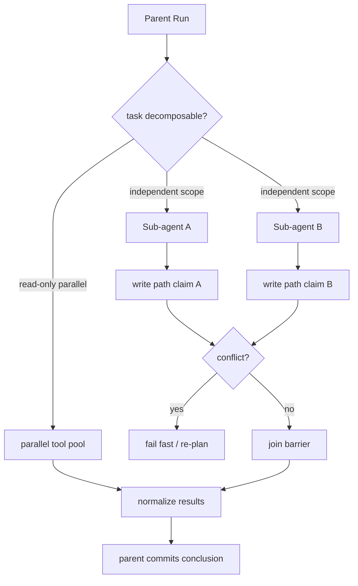
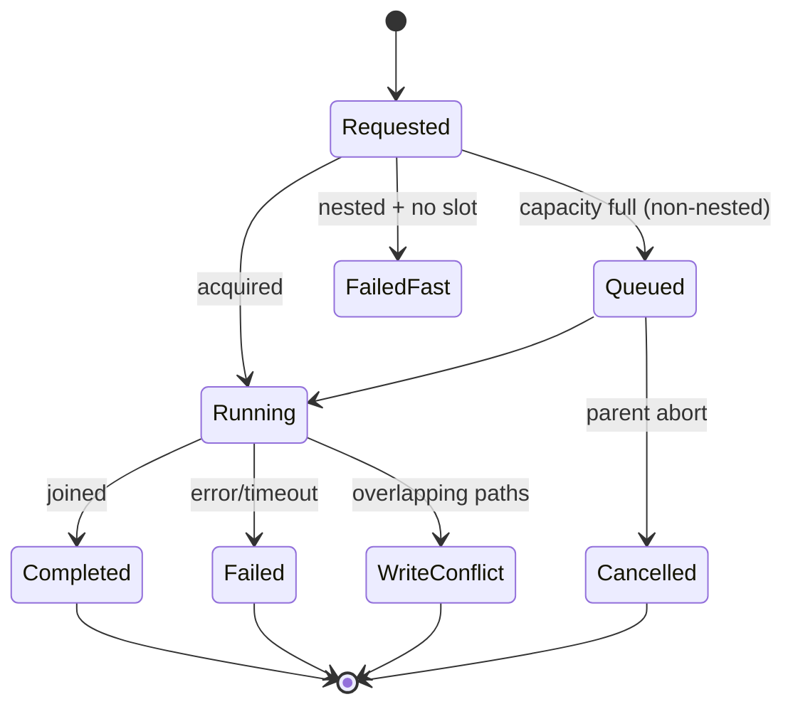

## 一句话结论

并发只有在边界清晰时才有收益。并行只读工具共享权限但各有调用 ID；子 Agent 拥有独立会话和最小授权；父级写工具用路径预留阻止子 Agent 重叠写入。调度器必须同时限制总数、写者数和路径冲突，嵌套请求在容量不足时 fail fast 而不是死等。

## 上一章遗留问题

M-13 管住了单个执行流的记忆和工作区。M-14 回答：多个 task/fleet 分支同时跑时谁拥有哪个路径？子 Agent 会话如何与父目录关联？一个分支超时如何不影响其他分支？

## 本章解决什么矛盾

串行最安全但慢；全并行最快但容易重复副作用。工程折中是把并发拆成两类：

- **parallel tool calls**：同一决策上下文内的短操作，靠 concurrency-safe 分类和 ordered commit 保证；
- **subagents**：独立会话、独立预算、独立历史，靠 scheduler 和写路径 claim 隔离。

Reasonix 用 session-scoped `SubagentScheduler` 统一 task/fleet/nested 场景；DeepSeek Harness 把子 Agent 建模为 durable parent-child session 关系；Pi 在本地工具层用 mutation queue 与 terminate hint 控制并行批次。

## 核心不变量

1. **并发是能力不是默认**：只有显式 safe 或 scheduler 批准的操作才可并行。
2. **权限不升级**：子 Agent 只能继承交集（workspace roots、tools、budget），不能读取父凭据原文。
3. **写路径唯一**：重叠 writer claim 冲突立即失败；parent write 进行中阻塞重叠子任务。
4. **嵌套防死锁**：nested acquire 容量不足时 fail fast，不排队等待父槽。
5. **分支可观测**：每个分支有 id/status/budget；迟到结果不得覆盖已汇合结论。
6. **取消全树传播**：父 cancel → 子 abort → 进程树终止；部分完成的分支保留 partial 事实。

失效边界在于外部系统没有事务：两个子 Agent 各自成功调用不同 API，也可能在业务层互相矛盾。join 层必须做语义审查，而不是只看 exit code。

## 理想模型



| 层级 | 共享 | 独立 | 典型用途 |
| --- | --- | --- | --- |
| 并行模型请求 | 目标/历史投影 | request seq/output buffer | 多候选生成 |
| 并行只读工具 | 权限/环境 | callId/result | 多目录搜索 |
| 并行写操作 | 锁协议 | 文件分区/事务 | 批量重构 |
| Sub-agent | 总目标/权限摘要/预算 | 子 Session/局部计划/temp | 调研/修复/评审 |



## 初学者主线

把并发当装修队：

- 多人查资料：各自带笔记本，最后交笔记（read-only parallel）；
- 多人改房间：先领房间钥匙和区域图（write claim），钥匙冲突就换人（fail fast）；
- 外包小组（subagent）：有自己工作间，不能直接进主卧室（independent session）；
- 领班收工前要清点每队交付物（join contract）。

### 任务契约

每个子任务应包含：

```text
goal            要回答或完成什么
inputs          初始事实/文件范围
allowed_tools   白名单
forbidden       不可执行动作
write_paths     可写路径集合
budget          tokens/time/tool calls
timeout         分支 deadline
deliverable     返回格式与证据要求
failure_policy  retry/abort/skip
```

模糊契约会让子 Agent 自行扩权。

### 汇合策略

1. **拼接**：结果天然分区；
2. **比较**：多候选按测试/成本排序；
3. **投票**：多数派 + 记录分歧；
4. **级联**：A 输出作为 B 输入，形成 DAG；
5. **人工审查**：高风险或高分歧暂停。

join 必须处理 late/failed/empty/timeout 分支。

## 机制深拆

### 1. Scheduler 的三类配额

生产调度器至少限制：

1. **total slots**：同时运行的 subagent 数；
2. **writer slots**：其中可写者数量；
3. **path conflicts**：writer 之间的路径重叠。

再加 parent write reservation：父级写工具执行期间持有的路径集，阻止重叠子任务但不占子 Agent 槽位。

直觉上这是停车场：总车位、货车位、以及“这条车道正在施工”。失效边界是路径声明不全（opaque bash），需要 opaque/whole-workspace 保守处理。

### 2. Nested fail fast

嵌套请求如果也排队等待父级释放槽位，容易形成环等待。规则应是：

- 非 nested：FIFO 等待直到容量空闲或 ctx 取消；
- nested：容量不足立即返回明确错误，让上层重新规划。

这牺牲一点吞吐换取无死锁。

### 3. Whole-workspace 保守性

当子任务无法枚举路径（opaque bash/MCP）时，可以声明 whole-workspace 写意图。它与任何运行中的 writer 冲突，相当于独占锁。代价是并行度下降；收益是未声明副作用不会漏检。

### 4. 子 Agent 会话模型

两种风格：

1. **独立 durable session**：子 Agent 有自己的 SessionId/history，父保存引用；适合 long-running continuable 任务。
2. **父内局部上下文**：子任务只是父 Run 内一段受控循环，结束即折叠为 result；实现简单但审计粒度低。

durable 模式必须定义 parent-child address 和 one-shot/continuable mode。

### 5. Join 的迟到问题

一旦父提交结论：

- 迟到成功结果标记 superseded，不覆盖；
- 迟到错误进入 incident log，供下次改进；
- 若结论依赖该分支，则父不应提前 commit。

因此 join barrier 要么等待全部终态，要么显式声明放弃策略。

## 反例与故障模式

1. **为并发而并发**
   - 触发：三个步骤有依赖却并行发起。
   - 因果：B 用旧输入计算，浪费 token 还产生误导候选。
   - 正确边界：先画依赖 DAG；无依赖才并行。
2. **两个 writer 改同一文件**
   - 触发：scheduler 只限数量不限路径。
   - 因果：diff 相互覆盖，测试通过不代表最终状态正确。
   - 正确边界：WritePathSet overlap 检测，冲突 fail fast。
3. **父写期间放行子写**
   - 触发：父 edit_file 尚未结束，后台 subagent 开始写同一路径。
   - 因果：预览与实际不一致，evidence 无法归因。
   - 正确边界：ReserveParentWrite 阻塞重叠 claim。
4. **嵌套排队死锁**
   - 触发：孙 Agent 等待子 Agent 释放槽，子 Agent 又等父任务。
   - 因果：整棵树挂起。
   - 正确边界：nested fail fast。
5. **子 Agent 继承完整凭据**
   - 触发：直接复制 env 给子进程。
   - 因果：日志泄露 token，权限越界。
   - 正确边界：下发短期 scoped credential/proxy。
6. **迟到分支覆盖结论**
   - 触发：join 后某分支返回更优方案。
   - 因果：最终报告被悄悄改写，用户看到前后不一。
   - 正确边界：superseded 状态 + incident 记录。
7. **opaque bash 声明过窄**
   - 触发：脚本内部写了很多文件但只声明一个路径。
   - 因果：与其他 writer 冲突未被发现。
   - 正确边界：无法证明时 whole-workspace/opaque。
8. **取消不传子树**
   - 触发：父 cancel 只停当前 turn。
   - 因果：后台 subagent 继续烧钱并写文件。
   - 正确边界：cancel 传播到所有 child sessions/process trees。

## 一条完整因果链

重构三个模块的任务：

1. 父 Agent 创建三个 subagent 契约：A→auth、B→billing、C→reporting，各带 write paths 和 budget。
2. Scheduler 批准 A/B/C 的 total slots；A/B 是 writer 且路径不相交，C 先只读。
3. 用户中途要求修改 billing 接口。父 Agent 对 `/src/billing/api.ts` 发起 edit_file，Scheduler 登记父 write claim。
4. 同时 B 的下一个写请求命中相同路径，canStart 检查发现 “write path conflict with a parent write in progress”，立即失败而非排队。
5. B 返回冲突观察；父 Agent 决定等 edit 提交后再重试 B，并把该事件写入 join 记录。
6. A 完成，release claim；B 重试成功；C 汇总只读调研。
7. Join barrier 收齐三个终态后，父 Agent 生成统一 diff 与测试计划。迟到的旧 B 结果（若有）标记 superseded。
8. 全程审计能回答：谁在哪条路径写了什么、何时冲突、如何解决。

## 设计取舍

| 方案 | 收益 | 代价 | 适用 |
| --- | --- | --- | --- |
| 全串行 | 最简单安全 | 慢 | 高危生产初期 |
| 只并行 read-only | 低风险提速 | 写仍串行 | 大多数编码任务 |
| path-partitioned writers | 真正并行写 | 需要准确路径提取 | 结构化编辑工具 |
| opaque whole-workspace lock | 安全保守 | 牺牲并行度 | bash/MCP 不透明副作用 |
| shared-session subagent | 上下文丰富 | 写入协议复杂 | 强协作场景 |
| independent-session subagent | 隔离清晰 | 需要 join/address 协议 | 长任务/continuable |
| fire-and-forget branches | 响应快 | 失败不可控 | 不建议用于写操作 |

迁移路径：先把工具标注 concurrency-safe；再引入 total/writer 配额；然后加路径冲突检测；最后支持 durable child sessions 与 join contracts。

## 框架实现对照

以下路径均绑定固定快照；行号已在当前 `external/` 树核对。

| 框架 | 并发机制 | 关键锚点 |
| --- | --- | --- |
| Reasonix `aa82b2f` | SubagentScheduler 是 session-scoped controller，服务 task/fleet/parallel_tasks/profile skills/nested；maxTotal/maxWriters 配额；Acquire 区分 non-nested FIFO 与 nested fail fast；canStart 检查 total/writer/whole-workspace/path overlap/parent claims；ReserveParentWrite 让父写阻塞重叠子 claim 且不占子槽。 | `internal/agent/scheduler.go:36-55,78-107,305-333,199-226` |
| DeepSeek Harness `b150a55` | 子 Agent 是 durable parent-child session 域：SubagentListEntry 含 activity running/inactive、hasChildren、one-shot/continuable mode、diagnostic corrupt/unavailable；SubagentAddress 由 parentSessionId+childSessionId+mode 组成；persisted transcript reads never activate an Agent，continuable prompt 经 live direct parent 进入 child inbox。 | `packages/host/apiproxy/src/api/subagents.ts:1-63` |
| Pi `c49906e` | 本地并行写保护由 per-file mutation queue 提供（realpath key，同文件串行）；BeforeToolCallResult.terminate 参与 batch early termination——只有每个 finalized tool result 都 terminate 才提前结束批次；核心未见通用 subagent scheduler，跨流编排属宿主层。 | `packages/coding-agent/src/core/tools/file-mutation-queue.ts:16-61`、`packages/agent/src/types.ts:61-69,371-374` |

### Reasonix：session-scoped 调度器

Reasonix 的 `SubagentScheduler` 注释直接列出适用范围：shared by task, fleet, parallel_tasks, profile skills, and nested sub-agents（`external/DeepSeek-Reasonix/internal/agent/scheduler.go:36-38`）。它维护 maxTotal/maxWriters、activeLive claims、nextClaimID，以及独立的 parentClaims——注释解释 parent write paths held during Execute block overlapping subagent claims without consuming a subagent concurrency slot，因为 parent is not a subagent（`:48-51`）。

`AcquireWithID` 的行为差异很关键：non-nested 请求进入 FIFO waiters，等到容量空闲或 ctx cancelled；nested 请求在容量不足时立即返回 “subagent concurrency limit reached ...; nested subagents fail fast to avoid parent/child slot deadlock”（`:78-107`）。release 必须恰好调用一次，即使 Acquire 出错也安全（no-op）。

`canStartLocked` 是冲突判定核心：total 满、非 writer 直接通过；writer 还要看 activeWriters 上限、WholeWorkspace 与任何 running writer 冲突、ScheduleOverlaps 与 live reservation 冲突，以及与 parentClaims 冲突，分别给出具体 reason（`:305-332`）。这让失败信息可直接反馈给模型或运维。

`ReserveParentWrite` 补上父子协作：conflict fails immediately（parent cannot queue behind background jobs mid-tool-call），release once 后 pump waiters（`:199-226`）。

### DeepSeek Harness：durable parent-child 域

DeepSeek Harness 把 subagent 定义为 browser-safe domain contract。开篇注释确立两条原则：Persisted transcript reads never activate an Agent；continuable prompts route through the exact live direct parent into the child's Agent inbox（`external/deepseek-harness/packages/host/apiproxy/src/api/subagents.ts:1-4`）。这意味着查看子历史是被动读，续聊才是主动路由，且必须经过直接父级。

`SubagentListEntry` 的字段设计覆盖运维需求：activity 区分 running/inactive；hasChildren 表示 direct descendant has durable origin 'subagent'；mode 分 one-shot 与 continuable（后者 label required）。还有 diagnostic kind，reason 为 corrupt/unsupported/unavailable，说明坏目录不会被静默隐藏（`:13-36`）。

`SubagentAddress` 由 parentSessionId、childSessionId 和 mode 组成（`:48-57`）。这个三元组就是路由键：同一个 child 在不同 parent 下的地址不同，避免跨树误投递。`SubagentsApi.list` 只列 direct children，parentAvailable 只是 hint，authoritative check 在 continuable prompt 时进行（`:59-80`）。这种 hint/check 分离避免了列表与实际激活之间的竞态误判。

### Pi：本地批次与终止提示

Pi 核心没有通用 subagent scheduler。它的并发控制集中在两层：

1. **file mutation queue**：`withFileMutationQueue` 用 realpath 作 key（存在则 realpath，缺失则 resolvedPath），同一 key 串行、不同 key 并行，finally release 并清理空队列（`external/pi/packages/coding-agent/src/core/tools/file-mutation-queue.ts:16-61`）。这解决了最常见的同文件双写。
2. **batch terminate hint**：`shouldTerminateToolBatch` 要求 finalizedCalls.length > 0 且 every result.terminate === true（`external/pi/packages/agent/src/types.ts:371-374`）。BeforeToolCallResult 的文档说明 terminate 只是 hint，参与 early-termination rule（`:61-69`）。也就是说单个 blocked 调用不会武断杀掉整批，除非批内所有结果都同意终止。

跨进程或多 Agent 编排需要宿主组合多个 AgentSession 或替换 BashOperations 到 remote executor；核心保持小而确定。

## 实现精妙之处

1. **Reasonix 的 parentClaims 不占子槽**：正确区分“父级临时持锁”和“子 Agent 占用并发额度”，避免父写饿死子任务计数。
2. **Reasonix 的 nested fail fast**：宁可报错也不制造 slot deadlock，错误文案直接解释原因。
3. **Reasonix 的 whole-workspace claim**：给不可静态分析的副作用一条保守通道，而不是假装安全并行。
4. **DeepSeek Harness 的 read-vs-route 分离**：浏览子 transcript 不激活 Agent，续聊必须经活体直接父级，降低意外唤醒与跨树注入。
5. **DeepSeek Harness 的 diagnostic entry**：corrupt/unsupported 的子会话出现在 catalog 中并说明原因，便于清理而不是神秘消失。
6. **Pi 的 realpath queue**：简单机制解决高频同文件竞争；不同文件仍并行。
7. **Pi 的全员 terminate 规则**：early termination 需要批内一致意愿，防止单个拒绝阻断其他合法调用。

## 自检与面试追问

1. 你的 scheduler 如何处理“路径声明错误”？opaque 工具应默认什么 claim？
2. 如果两个子 Agent 分别写 package.json 的 dependencies 和 scripts，路径相同但字段不同，是否允许？需要什么更细粒度协议？
3. 如何验证 nested fail fast 真的避免死锁？请画出一个会死锁的反例时序。
4. durable child session 的 GC 策略是什么？孤儿 child 何时归档？
5. join 时如何比较两个模型的候选方案？评分函数应包含哪些维度？
6. 父 Agent 被取消时，如何在 100ms 内通知所有子孙分支？哪些资源需要 grace period？

## 交给下一章的问题

并发改变了成本结构：更多并行请求意味着更高峰值 token、更长队列和更复杂的延迟分布。M-15 将拆解 Cost/Latency 预算：如何度量、分配和降级。

## 相关页面

- [教材目录](../TOC.md)
- [Tool 执行与副作用](./tool-execution.md)
- [Cost 与延迟](./cost-latency.md)
- [术语表](../09-glossary/glossary.md)
