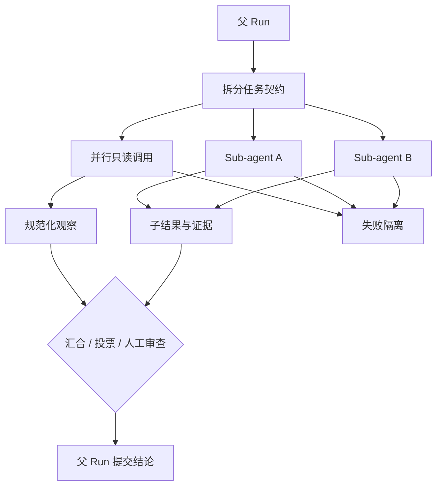

# Sub-agent 与并发

## 一句话结论

并发只有在边界清晰时才有价值。并行工具调用共享同一个决策上下文；Sub-agent（子智能体）拥有独立目标和局部状态，但必须向父 Run 回传可验证结果。没有任务 ID、写入范围、超时和汇合规则，速度提升会被重复副作用、状态冲突和不可审计的失败抵消。

## 理想模型

| 层级 | 共享内容 | 独立内容 | 典型用途 |
| --- | --- | --- | --- |
| 并行模型请求 | 目标和历史投影 | 请求编号、输出缓冲 | 多候选生成 |
| 并行只读工具 | 权限和环境 | 调用 ID、结果 | 搜索多个目录或服务 |
| 并行写操作 | 全局锁协议 | 文件范围、事务 | 批量重构的不同模块 |
| Sub-agent | 总目标、权限摘要、预算 | 子历史、局部计划、临时文件 | 独立调研、测试修复、评审 |

## 小白解释

让多位助手同时工作前，先分清是“多人查资料”还是“每人改一间房”。查资料可同时进行，最后把笔记交给主管；改房间则要分配房间号和钥匙，不能两人同时刷同一面墙。

Sub-agent 就像外包小组：给它一份任务书，说明目标、边界、交付格式和时间。它可以在自己桌上试错，但不能直接对外发布；完成后由主管检查并合并成果。

## 机制拆解

### 任务契约

每个子任务应包含目标、输入、允许工具、禁止动作、写入路径、预算、超时、交付格式和失败处理。模糊指令“帮我研究一下”会导致子 Agent 自行扩大范围；好的契约会要求返回来源、证据、结论和未决问题。

### 状态与隔离

子 Agent 可以有自己的 Session 和草稿，但权威历史仍要能追溯到父 Run。共享文件要有锁或分区；共享消息应带版本和因果序号。子 Agent 不应直接继承全部凭据，应下发最小 scope 和短期租约。

### 汇合策略

常见方式包括：

1. **拼接**：结果天然分区，例如不同文件的搜索摘要。
2. **比较**：多候选方案按测试、成本或风险排序。
3. **投票**：多个独立判断取多数，但要记录分歧。
4. **级联**：一个结果作为下一个输入，形成有向流程而非无序并发。
5. **人工审查**：高风险或高分歧时暂停给用户。

汇合器必须处理迟到、失败、空结果和超时；不能因为一个分支未结束就无限阻塞整轮任务。

### 失败、取消与资源

单个分支失败不应污染其他分支，但错误要进入父 Run 观察。取消父任务时要传播到所有子 Agent，等待它们释放锁和临时资源。并发度要限制模型请求数、工具进程数、网络配额和总费用；重试也要继承同一幂等语义。

## 框架对照

下表只建立初稿证据索引，具体行为由批量 Implementation Review 核对：

| 框架 | Sub-agent / 并发线索 | 关键锚点 |
| --- | --- | --- |
| Reasonix `aa82b2f` | Run 循环维护 Step 与工具分支；Session 有唯一提交协议和 checkpoint。 | `internal/agent/run_loop.go`、`internal/agent/session.go` |
| DeepSeek Harness `b150a55` | Agent loop 组织请求与工具事件；session 类型包含 turn、step 和 surface。 | `packages/core/agent-loop/src/agent.ts`、`packages/core/session/src/types.ts` |
| Pi `c49906e` | 通用 agent 包定义 lane 和执行环境抽象；宿主钩子可阻断调用。 | `packages/agent/src/harness/types.ts`、`packages/coding-agent/src/core/lane.ts` |

## 常见坑

- **为并发而并发。** 任务有依赖时，并行只会增加协调成本。
- **子 Agent 直接写主历史。** 两个写入者破坏提交点。
- **没有交付格式。** 结果无法比较，也无法追溯证据。
- **忽略迟到分支。** 已汇合后又收到旧结果，覆盖最终结论。
- **预算不分层。** 一个子任务耗尽全局 token 或时间。

## 自检问题

1. 哪些信号说明应该使用 Sub-agent，而不是一次工具调用？
2. 三个子 Agent 同时修改相邻文件时需要哪些锁规则？
3. 一个分支成功但另一个超时，父 Run 应如何汇合？
4. 如何防止子 Agent 把父任务的完整凭据复制进自己的日志？

## 相关页面

- [教材目录](../TOC.md)
- [Tool 执行与副作用](./tool-execution.md)
- [Sandbox 与权限](./sandbox.md)
- [术语表](../09-glossary/glossary.md)
