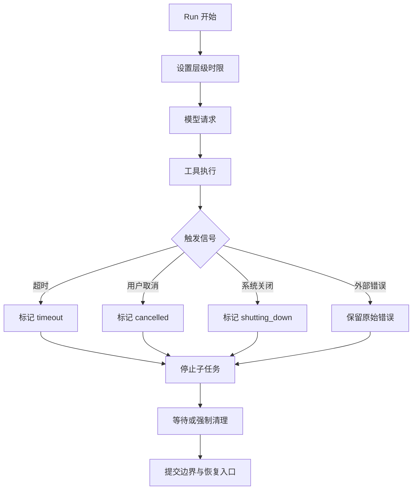

# Timeout 与取消

## 一句话结论

Timeout 回答“等多久必须放弃”，Cancellation 回答“如何通知所有层停止”。两者都必须区分正常完成、超时、用户取消和系统关闭，并把已发生的副作用、稳定前缀和清理结果写入持久事实；否则界面停了，后台仍在改文件，或恢复时误以为什么都没发生。

## 理想模型

| 层级 | 典型上限 | 目的 |
| --- | --- | --- |
| 连接 / 流空闲 | 数秒到数十秒 | 防止连接挂起 |
| 单次模型请求 | 十秒到数分钟 | 控制延迟和费用 |
| 单个工具 | 按命令类型设定 | 防止测试或安装死循环 |
| Step / Turn | 汇总所有子调用 | 保证回合有界 |
| Run / Session | 全局预算和生命周期 | 支持排队、租约和回收 |

## 小白解释

Timeout 像微波炉的定时器：时间到了就停止加热，不管食物是否完全热了。Cancellation 像主动按下停止键，机器要知道不是停电，而是有人要求停止。

如果按停止时锅里还有食物，不能假装锅里是空的。系统要记录加热多久、哪些部分可能半熟。对 Agent 来说，“半熟”可能是写了一半的文件、已启动的容器或已发出的请求。

## 机制拆解

### 超时设计

内层时限应小于外层剩余时间，并预留清理时间。例如 Turn 还剩 10 秒时，不应启动默认 30 秒的工具。超时要区分连接失败、响应慢、流空闲和整体耗时；返回给模型的观察应说明哪一层超时、等待多久、是否可缩小范围重试。

### 取消传播

取消信号要贯穿 UI、编排器、模型流和子进程。理想做法使用上下文取消、AbortController、进程组信号或远端租约撤销；每一层收到信号后停止读取新输出，但允许有限时间保存稳定结果和释放资源。忽略信号的第三方调用要标记为状态未知。

### 清理与宽限期

取消后通常有两阶段：先温和终止（SIGTERM、close stream、cancel request），再在宽限期后强制回收（SIGKILL、断开连接）。执行器负责删除临时文件、释放锁、停止子进程和网络代理。清理本身要有日志；失败清理不能静默吞掉。

### 状态投影

超时和取消的最终观察不同：

- **timeout**：说明达到哪个预算、最后输出是什么、是否可重试。
- **cancelled**：说明由谁取消、取消时进度和已完成副作用。
- **shutting_down**：说明系统级原因、租约是否过期和恢复入口。
- **unknown**：外部服务未确认结果时，先查询或进入 M-08 描述的补偿流程。

## 框架对照

下表只建立初稿证据索引，具体行为由批量 Implementation Review 核对：

| 框架 | Timeout / 取消线索 | 关键锚点 |
| --- | --- | --- |
| Reasonix `aa82b2f` | Session checkpoint 文档列出 aborted、error、interrupted 等恢复语义。 | `docs/CHECKPOINTS.zh-CN.md`、`internal/agent/run_loop.go` |
| DeepSeek Harness `b150a55` | Session 类型包含 completed、aborted、blocked、error、max-tokens、interrupted 等中止原因。 | `packages/core/session/src/types.ts`、`packages/core/agent-loop/src/agent.ts` |
| Pi `c49906e` | Agent 会话维护 turn 事件和 message_end；entry_added 表达持久化可见性。 | `packages/coding-agent/src/core/agent-session.ts`、`packages/coding-agent/src/core/session-manager.ts` |

## 常见坑

- **只有单一全局超时。** 一个慢下载耗尽整轮预算，后续步骤没有机会运行。
- **取消只改 UI。** 后台命令继续执行，产生用户不知道的副作用。
- **强制杀死前不落盘。** 已收到的稳定输出和变更摘要丢失。
- **把超时当业务失败。** 模型可能只需要分页读取或更窄查询，而不是换方案。
- **忘记租约续期。** 长任务被调度器误判死亡，出现双写。

## 自检问题

1. 一个安装依赖的工具应该设置哪些独立时限？
2. 用户在流式回答中途取消时，应保留多少内容？
3. 如何确保子进程不会比父 Run 存活更久？
4. 外部 API 超时后，第一动作应该是立即重试还是查询状态？

## 相关页面

- [教材目录](../TOC.md)
- [Retry 与幂等](./retry-idempotency.md)
- [Tool 执行与副作用](./tool-execution.md)
- [术语表](../09-glossary/glossary.md)
