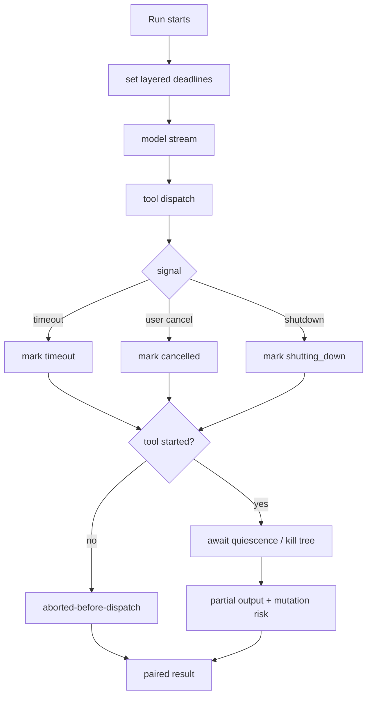
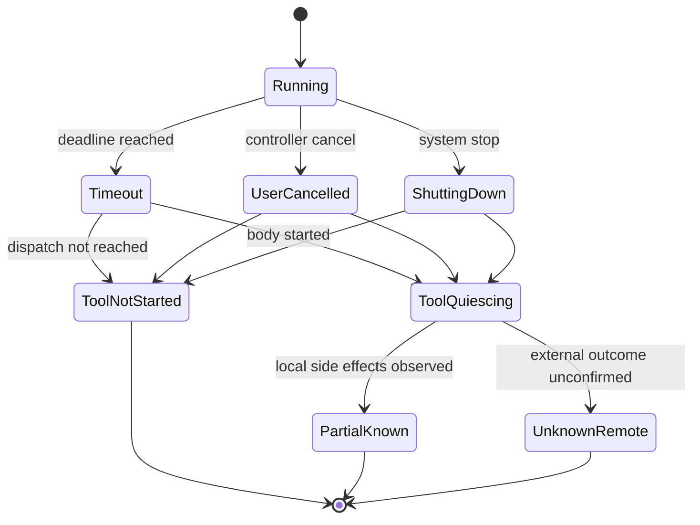

## 一句话结论

Timeout 回答“等多久必须放弃”，Cancellation 回答“谁要求停止”。两者都要把原因传播到 provider stream、工具 body 和子进程，但都不能把终止当成回滚：未派发调用记录 aborted-before-dispatch，已启动调用等它达到 quiescence 后标为 aborted/partial，外部状态未知则交给查询或补偿。

## 上一章遗留问题

M-08 说明 timeout 属于 state unknown。M-09 要回答：信号如何穿过多层？SIGTERM 后多久 SIGKILL？用户在流式中途取消时保留什么？审批等待被取消时 pending prompt 怎么办？

## 本章解决什么矛盾

没有时限，一个死循环测试耗尽宿主；粗暴 kill，又会丢失稳定输出并留下未知副作用。取消还要区分三种来源：预算耗尽（timeout）、人主动停止（cancel）、系统关闭（shutdown）。三者对恢复策略不同：timeout 可能缩小范围重试，cancel 不应自动继续，shutdown 需要租约与重启协议。

Reasonix 用 context cancel 加 CancelRequested 区分显式用户停止；DeepSeek Harness 把 body 是否启动作为 cancellation result 分界，并要求 started promise 达到 quiescence；Pi 用 process tree kill 和 abortable retry sleep 保证本地命令可终止。

## 核心不变量

1. **信号可达边界**：UI/Controller → Run → provider stream → tool executor → child process 都能收到终止通知。
2. **原因不合并**：timeout、cancelled、shutting_down、provider error 分别建模；不能全部折叠成 error。
3. **分界清晰**：dispatch 前取消是 aborted-before-dispatch；body 已启动必须等待 quiescence 再给 aborted result。
4. **副作用不消失**：已完成配对结果保留；partial 输出转 local-only 或 structured metadata；外部状态标记 unknown。
5. **清理有限且可观察**：SIGTERM → 宽限期 → SIGKILL；清理失败要记录，不能静默吞掉。

失效边界在于不可中断资源：远端任务可能继续运行，文件系统操作可能只完成一半，第三方 API 没有 cancel endpoint。此时唯一诚实状态是“本地停止，远端未知”。

## 理想模型



| 层级 | 典型上限 | 目的 |
| --- | --- | --- |
| HTTP idle / stream idle | 数秒到数分钟 | 防连接挂起 |
| 单次模型请求 | 数十秒到数分钟 | 控制延迟费用 |
| 单个工具 | 按命令类型 | 防死循环安装/测试 |
| Step / Turn | 汇总子调用 | 保证回合有界 |
| Run / Session / lease | 全局预算 | 支持排队和回收 |



## 初学者主线

Timeout 是微波炉定时器；Cancellation 是有人按停止键。按停后锅里的食物不会消失：

- 还没放进微波炉的菜不再加热（aborted-before-dispatch）；
- 正在热的一盘要等门打开（quiescence）；
- 已倒进盘子的部分就是事实（completed tool pair）；
- 外卖是否已经下单不知道（unknown remote）。

### 超时设计

1. 内层 deadline 小于外层剩余时间，预留清理窗口；
2. 区分 connect timeout、idle timeout、total timeout；
3. 返回观察说明哪一层触发、等待多久、最后输出是什么；
4. 可缩范围的任务提示 next action，例如分页读取或更窄测试。

### 取消传播

理想链路：

```text
User click -> controller.cancel()
  -> run context cancel
  -> provider stream close
  -> tool AbortSignal/context
  -> process group TERM
  -> grace timer
  -> KILL + cleanup
```

每一层收到信号后停止新工作，但允许有限时间 flush 已收数据、释放锁和写 metadata。

### 清理责任

| 资源 | 温和终止 | 强制回收 |
| --- | --- | --- |
| shell 进程树 | SIGTERM | SIGKILL |
| HTTP 请求 | abort/close | socket destroy |
| 文件锁 | release defer | lease expiry |
| 临时目录 | normal cleanup | startup sweep |
| 远端 job | cancel API | TTL/reaper |

## 机制深拆

### 1. 取消的三种时刻

1. **before dispatch**：无目标副作用，直接生成 canonical aborted-before-dispatch 结果；
2. **body running**：不能丢弃 promise。让 wrapper/tool 收到 fused signal，等待其 settle，再把成功结果转换为 aborted/partial；
3. **after completion**：结果已经产生，但 caller 不再需要。仍要记录事实；是否展示由 UI 决定。

直觉上这是叫停出租车：上车前取消不用付费；车已出发要等停下结算；行程完成则是一次真实行程。

### 2. Timeout 与 cancel 的区别

- timeout 由预算触发，模型可见文本应包含 budget 名称、耗时和最后输出；
- cancel 由人或上游发起，应说明 cancelled-by 并停止 auto-retry；
- shutdown 是进程生命周期事件，需要保存 checkpoint、释放 lease、通知调度器；
- provider failure 不是取消，保留原始错误分类以便 M-08 判断。

### 3. 子进程终止

POSIX 推荐流程：

1. spawn detached，便于管理整棵树；
2. track root pid；
3. signal/timeout 触发 `killProcessTree(pid)`；
4. 等待 exit，但不被 detached descendants 的 inherited stdio 卡住；
5. finally 移除 listener/tracker/timer。

Windows 语义不同，通常用 Job Object/taskkill；抽象层必须暴露平台差异而不是假装一致。

### 4. 流式输出的取消保存

取消前已收到的 stdout/stderr 是证据。执行器应在终止后做 bounded snapshot：tail 内容、总行字节、truncation metadata、full-output 引用。不要因为 abort 就清空 accumulator。

### 5. 审批等待的取消

等待用户点击时也可能收到 cancel。正确顺序：

1. clear/remove pending approval ID；
2. 通过 ctx 解除 waiter；
3. 如果 approval 同时被取消，合并为 aborted-before-dispatch；
4. UI 清理卡片，审计记录 approvalCancelled。

## 反例与故障模式

1. **取消只隐藏 UI**
   - 触发：前端删除 spinner，但不调用 controller cancel。
   - 因果：shell 继续跑并写文件，用户以为任务已停。
   - 正确边界：cancel 必须到达 run context 和 process tree。
2. **SIGTERM 后立刻 SIGKILL**
   - 触发：宽限期为零。
   - 因果：子进程来不及 flush 日志或清理 temp。
   - 正确边界：先温和终止，再按平台宽限期强杀。
3. **丢弃已启动 promise**
   - 触发：abort 后直接返回，不 await 工具 promise。
   - 因果：goroutine/task 泄漏，稍后写入共享状态。
   - 正确边界：started body reaches quiescence before ABORTED outcome。
4. **timeout 当业务错误**
   - 触发：部署请求超时后返回 “command failed”。
   - 因果：远端可能已发布，模型重复部署。
   - 正确边界：timeout + state unknown + query/compensate hint。
5. **清空中断输出**
   - 触发：取消时丢弃 OutputAccumulator。
   - 因果：无法判断测试跑到哪里、哪些文件改了。
   - 正确边界：保留 bounded tail 和 truncation/full-output metadata。
6. **pending approval 泄漏**
   - 触发：turn 结束但审批卡仍在 UI。
   - 因果：用户迟到点击，授权作用于错误回合。
   - 正确边界：cancel path clearAll；rotation 清理特定 kind。
7. **detached descendant 挂起**
   - 触发：shell 启动后台 worker 继承 stdio。
   - 因果：waitForExit 永不 resolve。
   - 正确边界：kill tree + 不等待无关 inherited handles。
8. **lease 未续期**
   - 触发：长任务超过调度器租约。
   - 因果：第二个 worker 启动，双写资源。
   - 正确边界：心跳续期或显式 fencing token。

## 一条完整因果链

用户在 bash 测试执行 80% 时点击 Stop：

1. Controller 设置 canceling=true，调用 cancel() 解除 run context；approval.clearAll() 清掉待审项。
2. Agent loop 在当前采样/工具边界收到 ctx.Done。正在运行的 bash 收到 abort。
3. 执行器调用 killProcessTree(rootPid)；子进程退出，OutputAccumulator finish，保留 tail、totalLines/Bytes 和 full-output temp file。
4. 工具结果不是 success，而是 cancelled/aborted；metadata 记录 MutationRisk=unknown（测试可能写了缓存）。
5. 尚未派发的 read_file 得到 “cancelled: context cancelled before execution” 配对结果。
6. handleToolRound 在写入本批所有结果后才检查 ctx.Err 并返回，Session 没有孤儿 assistant tool call。
7. Controller 看到 errors.Is(err, context.Canceled) 且 CancelRequested 为 true，保留完整用户 prompt 与配对工具工作，把 partial reasoning/output 转 local-only，并为下一轮准备 bounded recovery。
8. UI 显示 stopped；审计能看到 completed diff、cancelled test、not-started read。

这条链的核心是：停止的是未来动作，过去事实被结构化保留。

## 设计取舍

| 方案 | 收益 | 代价 | 适用 |
| --- | --- | --- | --- |
| 只设全局 deadline | 简单 | 一个慢步骤饿死后续 | 单步脚本 |
| 分层 deadline + 预留清理 | 可定位瓶颈 | 配置复杂 | 生产 Harness |
| abort 即丢 promise | 响应快 | goroutine 泄漏、假取消 | 禁止 |
| await quiescence | 事实完整 | 延迟一点返回 | 有副作用的工具 |
| SIGTERM only | 温和 | 恶意/失控进程不停 | 不安全 |
| TERM→grace→KILL | 兼顾清理与可靠 | 平台差异 | shell 类默认 |
| 远端 reaper/TTL | 处理失联 | 可能误杀慢任务 | 外部 job |
| checkpoint on shutdown | 支持恢复 | 写入延迟 | 长会话 |

迁移路径：先让所有工具接受 cancel signal；再统一 aborted-before-dispatch 与 aborted-after-start 两种结果；然后加分层 timeout 和结构化 metadata；最后补 shutdown checkpoint 和 lease 续期。

## 框架实现对照

以下路径均绑定固定快照；行号已在当前 `external/` 树核对。

| 框架 | 取消机制 | 关键锚点 |
| --- | --- | --- |
| Reasonix `aa82b2f` | Controller.Cancel 设置 canceling、clearAll approvals、cancel context；RuntimeStatus 暴露 CancelRequested/Cancellable；run orchestrator 对 explicit cancel 与 provider interrupted 分别保留配对工具工作并把 unsafe fragments 转 local-only；execute_batch 在每个阶段检查 ctx.Err，取消后填充剩余结果并在写完批次后返回。 | `internal/control/controller.go:2052-2119`、`internal/control/turn_orchestrator.go:291-324`、`internal/agent/execute_batch.go:154-166,250-340,631-668` |
| DeepSeek Harness `b150a55` | scheduler 记录 callerSignal 与 bodyInvoked；callerCancelled 读取状态；cancellationResult 按 body 是否启动区分 aborted/aborted-before-dispatch；dispatchToolBody fuse signals，注释要求 started promise reaches quiescence；post/dispatch 成功结果也会被规范化为 cancellation result。 | `packages/core/tools/src/index.ts:1510-1545,1590-1616,1932-1944` |
| Pi `c49906e` | bash 工具设置 timeoutHandle 和 abort listener，二者都 killProcessTree；waitForChildProcess 后区分 signal.aborted 与 timedOut 并抛对应错误，finally 清理 tracker/listener/timer；AgentSession.abort 先 abortRetry、agent.abort，再 waitForIdle；abortRetry abort 当前 retry sleep。 | `packages/coding-agent/src/core/tools/bash.ts:115-151`、`packages/coding-agent/src/core/agent-session.ts:1558-1568,2863-2868` |

### Reasonix：显式取消与局部显示保护

`Controller.Cancel` 的注释说明两个要点：中止 in-flight turn；blocked awaiting approval 的 goroutine 通过 cancelled context unblock。实现中先置 `c.canceling=true`，再 `approval.clearAll()`，最后调用 cancel func；如果没有活动 turn 但 Goal active，则停止 Goal（`external/DeepSeek-Reasonix/internal/control/controller.go:2052-2069`）。`CancelRequested()` 只是读取 canceling 标志；`RuntimeStatus` 同时给出 Running、PendingPrompt、BackgroundJobs、CancelRequested 和 Cancellable（`:2090-2119`），供 UI 判断能否显示 Stop 按钮。

取消后的持久化策略在 turn orchestrator 中：当 `errors.Is(err, context.Canceled) && c.CancelRequested()`，synthetic turn strip 其后消息；real visible turn 调用 `stripCancelledVisibleTurnMessagesAfterWithFallback`，fallback 保留真实 user message/images/timestamp。注释强调 keep the real prompt and any fully paired tool work；partial reasoning/output remains durable for display but marked local-only。Provider/API failure 若有 interrupted display 也走同样 safe recovery path（`external/DeepSeek-Reasonix/internal/control/turn_orchestrator.go:291-324`）。

execute_batch 层在每个 batch 前后检查 ctx.Err：取消后 `markCancelled` 为剩余 call 填充 “cancelled: context cancelled before execution”；handleToolRound 则先写入全部 results，再因 ctx.Err 返回（`external/DeepSeek-Reasonix/internal/agent/execute_batch.go:154-166`、`:250-340`、`:631-668`）。这保证了 call/result pairing 不因取消断裂。

### DeepSeek Harness：bodyInvoked 决定取消形态

DeepSeek Harness 的 cancellationStates 记录 callerSignal 和 bodyInvoked。`callerCancelled` 读取该状态；`cancellationResult` 根据 body 是否启动选择 `toolAbortedResult(prior)` 或 `toolAbortedBeforeDispatchResult(prior)`（`external/deepseek-harness/packages/core/tools/src/index.ts:1510-1525`）。这不是文案差异：前者表示副作用可能已经开始，后者表示没有进入 tool body pipeline。

`dispatchToolBody` 的注释进一步定义 quiescence 合同：Cancellation never abandons the body；a started promise reaches quiescence before its outcome becomes ABORTED。实现把 callerSignal 与 wrapper replacement signal fuse，若 fused signal 已 aborted 则立即 before-dispatch；否则把 fused signal 交给 body（`:1527-1545`）。

调度器在 dispatch/post 两个阶段都会检查 caller cancellation：即使 body 返回非 error 成功，也会通过 `cancellationResult` 转换（`:1590-1594`、`:1609-1616`）。canonical before-dispatch result 带 `AbortError` 和 `TOOL_ABORTED_BEFORE_DISPATCH` code，同时保留 prior additionalContexts（`:1932-1944`）。

这套设计解决了两个常见 bug：取消后 Promise 继续写共享状态；以及把“用户取消”误报成工具业务失败。

### Pi：进程树、timeout 与 retry sleep 的可中止性

Pi 的 bash backend 把 timeout 和 abort 归一到同一个动作：`onAbort` 调用 `killProcessTree(child.pid)`。timeoutHandle 到期置 `timedOut=true` 并杀树；signal 已 aborted 时立即杀，否则 addEventListener once。`waitForChildProcess` 返回后先判断 `signal?.aborted` 抛 “aborted”，再判断 `timedOut` 抛 `timeout:<seconds>`。finally 移除 pid tracker、clear timeout、removeEventListener（`external/pi/packages/coding-agent/src/core/tools/bash.ts:115-151`）。

上层 AgentSession 提供组合取消：`abort()` 先 `abortRetry()`，再 `agent.abort()`，最后 `await waitForIdle()`（`external/pi/packages/coding-agent/src/core/agent-session.ts:1558-1565`）。`abortRetry()` abort 当前 retry sleep，使 `_prepareRetry` 的 sleep 抛出并 emit “Retry cancelled”（`:2863-2868`、M-08 锚点 `2841-2858`）。这保证用户不仅能停当前请求，也能停掉即将开始的自动重试。

Pi 的模式说明：本地进程控制可以做得非常直接；跨平台差异集中在 killProcessTree/waitForChildProcess 内部。缺少的是统一 OS jail 层，这与 M-07 的结论一致。

## 实现精妙之处

1. **Reasonix 的 CancelRequested 双标志**：ctx.Canceled 可能来自父级关闭，canceling 标志才能确认是本控制器主动取消，从而选择正确的持久化分支。
2. **Reasonix 的 approval.clearAll**：Stop 不仅终止执行，也清掉待审卡片，避免迟到的批准作用于旧上下文。
3. **Reasonix 的 write-results-before-return**：handleToolRound 先落盘整批配对结果，再因 ctx.Err 返回，牺牲一点延迟换取历史完整性。
4. **DeepSeek Harness 的 bodyInvoked 状态机**：把取消分为 before-dispatch 和 after-start，而不是用一个笼统 aborted 掩盖副作用可能性。
5. **DeepSeek Harness 的 fused signal**：around wrapper 替换 signal 时仍能把原始 callerSignal 注入，防止包装层意外屏蔽取消。
6. **Pi 的 timeout/abort 同一 kill path**：两者都走 killProcessTree，避免两套清理逻辑漂移。
7. **Pi 的 abortRetry**：把等待中的指数退避视为可取消操作，用户不必等完最长 backoff。

## 自检与面试追问

1. 你的系统中 ctx canceled 有多少种来源？如何在日志中区分用户取消、shutdown 和父级取消？
2. 为什么 body started 后不能立即返回 ABORTED？如果工具内部忽略 signal，最大等待时间应如何配置？
3. 如何测试 detached descendants 不阻塞 waitForChildProcess？请设计一个会产生继承 stdio 句柄的用例。
4. 一个远程部署 API 没有 cancel endpoint。超时后你的状态机有哪些转移？何时允许人工确认？
5. 用户取消时，已收到的 10MB stdout 应保存哪些字段？这些字段如何帮助下一步决策？
6. shutdown 时 checkpoint、lease 和 in-flight HTTP 的清理顺序是什么？哪一步失败最危险？

## 交给下一章的问题

现在知道如何停止并留下对账信息。M-10 将回答恢复起点：哪些闭合事实能进入 checkpoint，pending call 如何变成 resume 任务，崩溃后如何验证环境仍然成立。

## 相关页面

- [教材目录](../TOC.md)
- [Retry 与幂等](./retry-idempotency.md)
- [Tool 执行与副作用](./tool-execution.md)
- [Checkpoint 与 Resume](./checkpoint-resume.md)
- [术语表](../09-glossary/glossary.md)
