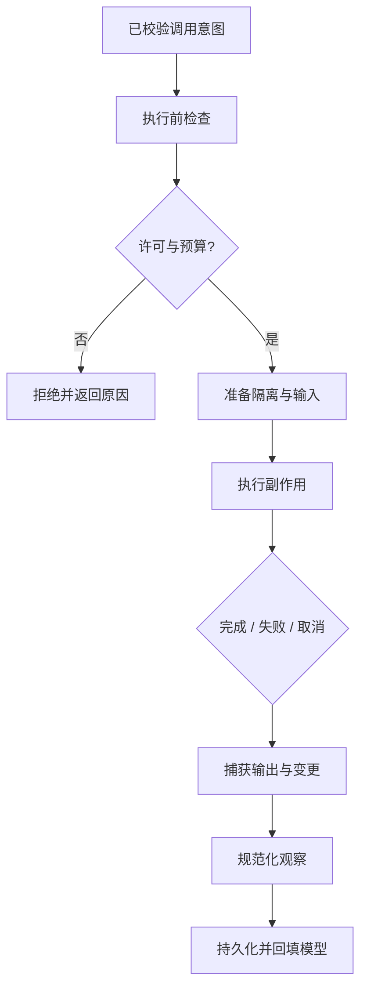

# Tool 执行与副作用

## 一句话结论

工具执行是线束（Harness）把受控能力交给外部世界的过程。它先确认调用已校验并获得许可，再选择隔离环境、限制资源、记录副作用，最后把成功、失败或部分完成规范成观察（observation）。执行器的目标不是让所有调用成功，而是让每个结果都可信。

## 理想模型

理想执行链有五个不变量：

1. **入口唯一**：工具只能经过注册表、校验器和治理层进入执行器。
2. **环境受限**：文件、网络、进程、时间和内存都有明确边界。
3. **意图与效果分离**：模型的调用不等于已完成动作；执行后才有观察。
4. **失败也是事实**：错误必须进入持久层，不能只显示给用户。
5. **清理有责任方**：临时目录、子进程、锁和网络连接由执行器或宿主显式释放。

## 小白解释

把工具执行想成让外包人员进仓库。先核对工单和门禁，再把人员带到指定货架，限定可用电梯和时间；搬完货要写交接单。货物没搬到、搬错位置或中途被叫停，都不能只说“没做成”，还要写清进度和已动过的货架。

对代码助手来说，“搬东西”可能是修改文件、运行测试或访问网络。系统应知道命令在哪个目录执行、能否联网、超时多久、产生了哪些新文件；否则下一次决策就像凭记忆猜仓库现状。

## 机制拆解

### 执行前检查

执行器收到的不应是原始模型 JSON，而是已解析、已校验并带调用 ID 的请求。它仍要做最后一轮环境检查：工作区是否存在、依赖是否可用、权限是否匹配当前阶段、并发额度是否还有空间。这些检查能捕捉校验之后环境变化造成的竞态。

### 副作用分级

| 级别 | 示例 | 控制重点 |
| --- | --- | --- |
| 只读 | 读文件、搜索、查询状态 | 防止敏感读取和高成本扫描 |
| 可逆写 | 在临时目录创建文件、写入草稿 | 记录路径并提供清理 |
| 难逆写 | 修改源码、发布包、发送消息 | 审批、快照、幂等键和补偿 |
| 外部可见 | 调用第三方 API、发通知 | 配额、审计和不可撤回提示 |

级别决定默认策略：只读可以更宽松，难逆写需要更强审批和更精确的错误处理。级别也应出现在 Schema 中，帮助模型理解风险。

### 并发与顺序

有些工具天然可并行，例如独立文件的搜索；有些必须串行，例如同一文件的多次编辑或有依赖关系的安装命令。执行器应声明并行能力和锁粒度。并发不只是提高速度，还会带来输出交错、重复副作用和死锁，因此没有调用 ID 和因果顺序就无法安全回填结果。

### 失败、取消和部分完成

失败观察应包含分类、关键参数、输出摘要和建议动作。用户取消时，执行器要停止进程并记录已完成的副作用；无法立即中断的外部调用应标记为状态未知。部分完成是最危险的终态：例如批量更新 8 个文件中的 3 个，必须列出已完成项，而不是只返回 `error`。

## 框架对照

下表只建立初稿证据索引，具体行为由批量 Implementation Review 核对：

| 框架 | 工具执行线索 | 关键锚点 |
| --- | --- | --- |
| Reasonix `aa82b2f` | Agent 层做未知工具与门控，工具层解析参数并检查写路径。 | `internal/agent/run_loop.go`、`internal/tools` |
| DeepSeek Harness `b150a55` | 注册层应用前置策略，具体工具负责声明校验和运行。 | `packages/core/agent-loop/src`、工具相关 package |
| Pi `c49906e` | 通用循环查找和校验工具，宿主钩子可阻断；执行环境抽象由通用包定义。 | `packages/agent/src`、`packages/coding-agent/src/core/agent-session.ts` |

## 常见坑

- **把模型输出直接交给 shell。** 这会绕过 Schema、治理、审计和环境限制。
- **只记录退出码。** 相同退出码可能代表不同副作用，必须保存关键输出和变更摘要。
- **允许无限并发。** 文件锁、网络配额和子进程数量会迅速变成稳定性问题。
- **取消即删除记录。** 已发生的写操作不会消失，隐藏它们会让后续修复出错。
- **忽略工作目录漂移。** 同一相对路径在不同 cwd 下可能产生完全不同的副作用。

## 自检问题

1. 校验通过后的哪类环境变化仍会导致执行失败？
2. 一个会发送消息的工具需要哪些幂等和补偿设计？
3. 用户在命令运行 80% 时取消，持久层应记录什么？
4. 如何防止两个并行编辑器同时改同一个文件？

## 相关页面

- [教材目录](../TOC.md)
- [Tool Schema 与调用协议](./tool-schema.md)
- [术语表](../09-glossary/glossary.md)
