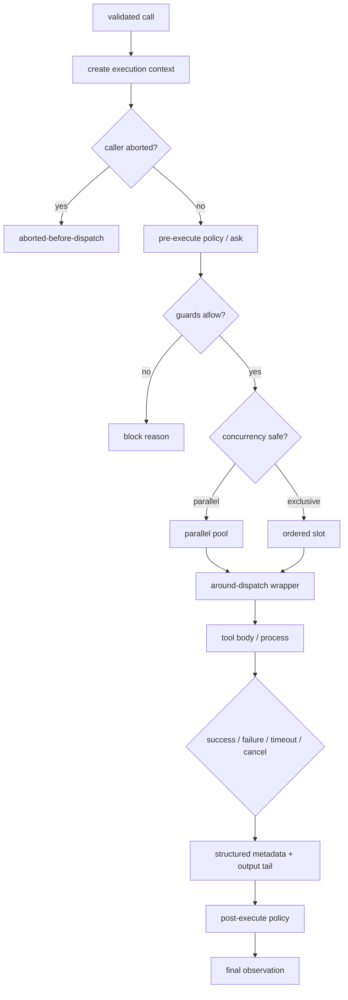
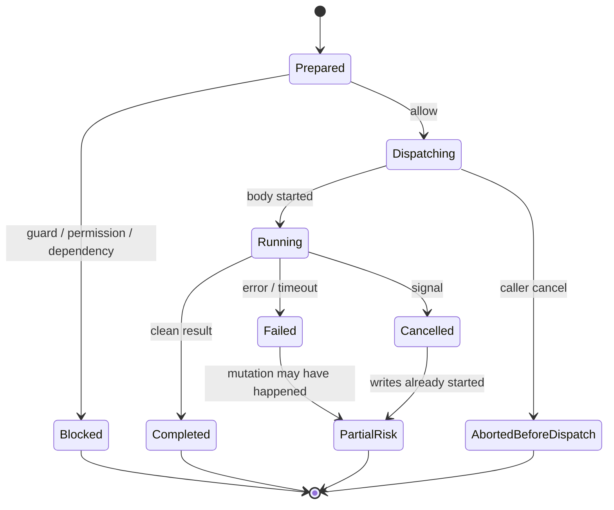

## 一句话结论

工具执行不是"调用函数"，而是把受检意图放进一条可取消、可归属、可审计的管线：先做环境和权限 preflight，再按并发契约派发，捕获结构化元数据和副作用风险，最后把 success/error/blocked/aborted 都规范成 tool observation。执行器的目标不是零失败，而是没有不可解释的失败。

:::note
执行器的目标不是零失败，而是**没有不可解释的失败**。
:::

## 上一章遗留问题

M-03 停在治理放行。但放行后仍有问题：路径在校验后是否仍安全？同一文件被并行编辑怎么办？子进程如何随 abort 终止？命令已经写了半个文件时结果算什么？M-04 回答这些副作用控制问题。

## 本章解决什么矛盾

快速反馈要求并行和流式输出；安全性要求写串行、边界固定、失败可见。外部世界还不可事务化：文件可能半写，网络请求无法撤回，子进程可能有后代。执行器因此必须把“已完成”“未开始”“可能部分完成”区分开，而不是只返回 exit code 或异常。

Reasonix 用 parse → policy → prepare → finish 的单调用管线加 workspace lease；DeepSeek Harness 用 pre-execute/guard/around-dispatch/body/post-execute 的注册表调度；Pi 用 per-file mutation queue 和 process-tree kill。三者共同点是：副作用必须留下结构化证据，取消不能抹掉事实。

:::tip
执行管线：**preflight**（环境+权限） → **dispatch**（并发契约） → **execute**（捕获元数据） → **observation**（规范化结果）。
:::

## 核心不变量

1. **入口唯一**：执行只能来自 registry 调度；模型文本、插件或 UI 不能绕过 preflight 直接 spawn。
2. **边界在执行时复查**：cwd、symlink、workspace root、session store 和 contextual visibility 可能在校验后变化，execute/preflight 必须再次判断。
3. **并发显式**：只有声明安全的操作才可并行；未知、异常或共享状态一律 exclusive。
4. **取消传播但不撒谎**：abort 会停止新工作并终止进程树；已经发生的副作用保留为 partial/may-have-completed。
5. **观察结构化**：模型可见文本、host/UI 元数据、原始输出分离；失败阶段和 mutation risk 是一等字段。

失效边界在于平台差异：POSIX 可以 detached + process group kill，Windows 进程树语义不同；symlink realpath 在竞态中仍可能被替换。所以边界检查要尽量靠近 write，且失败宁可拒绝。

:::caution
边界检查要**尽量靠近 write**，且失败宁可拒绝。校验后路径可能仍被替换。
:::

## 理想模型



| 副作用级别 | 示例 | 控制重点 |
| --- | --- | --- |
| 只读诊断 | read/search/status | deny roots、成本、敏感读取 |
| 可逆写 | temp file、draft | 记录路径、清理责任 |
| 难逆写 | source edit、install、delete | confine、lease、幂等键 |
| 外部可见 | API、通知、发布 | 配额、审计、不可撤回提示 |
| 状态未知 | 已派发后被 kill 的远程任务 | partial/unknown，不伪装成功 |



状态图的关键是 `PartialRisk` 不是错误修饰词，而是后续决策输入：需要检查 diff、重跑测试或人工确认。

## 初学者主线

把执行器当成工地监理：

1. 工单（call）已经签字；
2. 监理先看现场有没有变化（cwd、symlink、权限）；
3. 危险工种要单独许可；
4. 两队不能同时改一面墙（file lease/mutation queue）；
5. 中途叫停也要记录哪些墙动了；
6. 完工单分三栏：给模型的摘要、给监理的结构化数据、给档案的原始凭证。

### 执行前复查

即使参数合法，环境也可能变化：

- 相对路径依赖 cwd；
- symlink 可能指向新目标；
- 文件可能已被另一个 agent 改动；
- plan/read-only 模式可能刚切换；
- 上游 MCP server 可能刚好连接完成或下线。

因此 execute 前的 preflight 不是重复劳动，而是缩小 TOCTOU 窗口。

### 并发与顺序

并行安全不是“这个函数线程安全”，而是“这组参数不会改变其他调用的可观察前提”。独立搜索可以并行；同一路径写入必须串行；bash 即使看似只读也常默认 writer-capable，除非 host 能从命令证明只读。

### 取消的三段语义

1. **dispatch 前**：返回 aborted before dispatch，无副作用；
2. **进程中**：发送 SIGTERM，超时 SIGKILL，等待退出并收集已有输出；
3. **副作用后**：不能回滚现实，标记 partial/may-have-completed 并保留输出。

### 结构化观察

最小字段：

```text
model_content     给模型的稳定文本
is_error          成功/业务失败/系统错误
error             机器可读 message/code
execution_state   running/completed/failed/timed_out/cancelled/not_run
failure_phase     preflight/authorization/dependency/launch/execution/timeout/cancellation
mutation_risk     none/not_started/may_have_completed/may_be_partial/unknown
output_tail       有界 stdout+stderr 尾部
duration/start    归属与性能分析
raw_output_ref    本地分页引用（可选）
```

## 机制深拆

### 1. 单调用管线的固定顺序

推荐顺序：

1. create execution context（冻结 args、绑定 callId/scope）；
2. caller-cancelled check；
3. pre-policy / hook ask；
4. monotonic guards；
5. resolve real target/proxy；
6. acquire lease/queue；
7. around-dispatch wrapper；
8. body；
9. post-policy；
10. finalize content/materialize。

顺序错了会出现两类事故：hook 在无效 args 上误报；post-policy 在 pipeline 错误上二次改写。

直觉上这是登机流程：值机（prepare）、安检（guard）、廊桥（dispatch）、落地报告（post）。失效边界是：安检后旅客仍可能换登机口，所以关键资源在登机前还要最后确认。

### 2. Workspace 与父级写入预留

子代理并发时，仅靠文件系统锁不够。父级写工具执行期间应向 scheduler 登记路径集，阻止重叠的后台 subagent claim；冲突立即失败而不是排队，避免 parent 在工具中途无限等待。释放必须在 defer/finalizer 中一次且仅一次。

### 3. Mutation barrier

一个 batch 内，如果前面的修改失败或被 block，后面的 mutation/verification 应该跳过；read-only diagnosis 可以继续。原因很简单：基于失败状态的验证会产生假阳性。skipped 结果必须说明“verification was not executed”，不能折叠成 pass。

### 4. 进程生命周期

长命令应有：

- 明确 timeout；
- abort listener；
- SIGTERM 后强制 SIGKILL；
- detached/descendant 处理，防止继承 stdio 句柄导致挂起；
- stdout/stderr 合并或带序号保存，保持 child-write order；
- 输出上限和 full-output 引用。

### 5. Post-execute 的能力边界

post-hook 可以接受、替换 content、附加 context 或把成功改成失败；但不能把 failed result 的 canonical value 替换成成功——因为副作用已经发生，语义反转只会制造假账。

## 反例与故障模式

1. **校验后 symlink 被替换**
   - 触发：validator 解析 `/work/a` 时指向项目内，write 前攻击者改为外部目录。
   - 因果：越权写入真实目标。
   - 正确边界：realpath + deepest existing ancestor，在 execute 边界 confine；高危场景用沙箱兜底。
2. **两个 agent 并行编辑同一路径**
   - 触发：parent 写文件时后台 subagent 也写同一文件。
   - 因果：diff 互相覆盖，evidence 无法归因。
   - 正确边界：parent write reservation 冲突即失败；subagent 排队等待释放。
3. **mutation 失败后继续跑测试**
   - 触发：batch 中 edit 报错，后续 bash test 仍执行旧代码。
   - 因果：绿色测试掩盖未应用变更。
   - 正确边界：dependency barrier skip verification，并显式说明 not run。
4. **SIGTERM 不杀进程树**
   - 触发：shell 启动后台 worker。
   - 因果：主 shell 退出但 worker 继续写文件，结果状态失真。
   - 正确边界：detached + kill process tree，超时升级 SIGKILL。
5. **timeout 当作普通失败**
   - 触发：部署命令超时被 kill。
   - 因果：远端可能已上线，模型误以为可重新部署导致重复副作用。
   - 正确边界：timed_out + may_have_completed + 补偿建议。
6. **post-hook 把失败改成成功**
   - 触发：策略希望隐藏内部错误，直接翻转 isError。
   - 因果：模型不再修复，审计丢失失败原因。
   - 正确边界：failed result 不能 replace value/content 为成功；block 只能变成 corrective feedback。
7. **取消后删除 partial output**
   - 触发：UI 收到 abort 就清空日志。
   - 因果：用户不知道哪些文件已改。
   - 正确边界：保留 bounded tail、workspace mutation paths 和 cancelled 状态。
8. **cwd 漂移**
   - 触发：相对路径在 session 开始和现在之间解析到不同目录。
   - 因果：写错位置或读取错误配置。
   - 正确边界：execution context 冻结 cwd，或每次 resolve 后记录 absolute path。

## 一条完整因果链

假设一个 batch 包含：`edit_file a.ts`、`bash npm test`、`read_file b.ts`，用户在第 2 步运行时取消：

1. edit_file 通过 preflight、confineWrite 和 parent write reservation，成功提交 diff；workspace mutation paths 记录 `a.ts`。
2. bash 启动测试进程，stdout/stderr 合并流入 OutputAccumulator。
3. 用户取消。执行器向进程组发送终止信号，超时后强杀；已有输出 tail 保留。
4. 测试 result 是 cancelled，`FailurePhase=cancellation`；因为测试可能已经产生缓存/临时文件，MutationRisk 标为 not_started 或 unknown（取决于分类）。
5. read_file 未启动，得到 “cancelled: context cancelled before execution”。
6. 循环在写入全部三个配对结果后才因 ctx.Err() 返回，Session 没有孤儿 tool call。
7. 下轮模型看到：a.ts 已改、测试被取消且输出尾部显示两个通过、b.ts 未读。它选择先查看 diff 再决定是否继续。

这条链的核心是：取消改变的是“未来动作”，不是“过去事实”。

## 设计取舍

| 设计 | 收益 | 代价 | 适用条件 |
| --- | --- | --- | --- |
| 全部串行 | 顺序简单、易审计 | 慢，无法利用只读并行 | 高危生产环境初期 |
| 显式 concurrency-safe classifier | 只读诊断加速 | 分类错误会破坏共享状态 | classifier 必须纯且 fail closed |
| parent/subagent path reservation | 防止跨 agent 覆盖 | 需要路径提取和冲突策略 | 有后台子代理 |
| 合并 stdout/stderr 单管道 | 保持真实交错顺序 | 难以分开日志级别 | shell 类工具 |
| 分开 stdout/stderr | 易于解析 | 失去时间交错 | 编程式 API 工具 |
| post-hook 可改 content/value | 灵活治理 | 可能伪造成功 | 禁止失败值反转 |
| structured execution metadata | UI/审计/恢复都受益 | schema 维护成本高 | 生产 coding harness |

迁移路径：先统一所有工具返回 `{content,isError}`；再加 callId/duration/state；然后引入 pre/post hook 与 guard；最后为写类工具补 lease、mutation risk 和 raw output paging。不要一开始就追求全工具沙箱，先把边界字段说清楚。

## 框架实现对照

以下路径均绑定固定快照；行号已在当前 `external/` 树核对。

| 框架 | 执行机制 | 关键锚点 |
| --- | --- | --- |
| Reasonix `aa82b2f` | executeOne 固定 parse→policy→prepare→finish，defer 释放 mutation/parent/lease；contextual gate、plan mode、proxy resolve、delivery gates、mutation barrier、permission 依次检查；confineWrite 区分 workspace/session data/managed approval；ShellExecution 提供结构化 state/failure phase/mutation risk/output tail；scheduler 支持 parent write reservation。 | `internal/agent/execute_one.go:21-66,68-134,137-178,197-232`、`internal/tool/builtin/confine.go:191-246`、`internal/tool/shell_execution.go:8-113`、`internal/agent/scheduler.go:199-226` |
| DeepSeek Harness `b150a55` | ToolRegistry scheduler 先创建 frozen execution context，检查 caller cancel；pre-execute waterfall/serviceAsk 后应用 monotonic guards；around-dispatch 包装 body；body/unknown-tool 失败仍走 post-execute；caller cancellation 会把非错误结果转成 cancellation result；post-execute accept/block 受限，failed result 不能替换 value。 | `packages/core/tools/src/index.ts:1329-1505,1563-1599,1609-1645,1731-1781,1100-1128` |
| Pi `c49906e` | sequential/parallel 执行后 afterToolCall 可覆盖 content/details/usage/isError；toolResult 统一带 toolCallId/name/isError/timestamp；execCommand 与 bash 工具支持 signal、timeout、SIGTERM→SIGKILL、process tree kill 和 detached descendant 等待；file mutation queue 按 realpath 串行同一路径，不同路径并行。 | `packages/agent/src/agent-loop.ts:433-487,489-553,670-700,713-790`、`packages/coding-agent/src/core/exec.ts:11-107`、`packages/coding-agent/src/core/tools/file-mutation-queue.ts:16-61`、`packages/coding-agent/src/core/tools/bash.ts:88-154,164-190` |

### Reasonix：单调用管线与结构化 ShellExecution

`executeOne` 的注释明确它是 pure with respect to event sink，可从 parallel goroutine 调用；阶段是 parse → policy → prepare → finish（`external/DeepSeek-Reasonix/internal/agent/execute_one.go:21-23`）。defer 负责 observeAfterMutation 和释放 mutation write、parent write、lease（`:27-48`）。

parse 阶段处理 ambiguous MCP reference、unknown tool、loop guards 和 stale anchor；bash 可以由 host 从具体 args 分类成 read-only，并把这一事实贯穿 permission/evidence/receipt，而不改变 provider schema（`:50-134`）。policy 阶段依次执行 plan mode、proxy resolution、contextual gate、execution preflight、delivery gates、mutation barrier 和 recovery/permission（`:137-163`）。contextual gate 对 update_goal、complete_step、background jobs 给出专门文案，fail closed（`:165-195`）。

`confineWrite` 的顺序是 workspace confinement first，然后 session-data guard；即使在 root 内也不能写 Reasonix 自己的 session stores。managed config 在 root 外只有在 fresh per-write human approval 下才能继续，没有 approver 就沿用 confinement error（`external/DeepSeek-Reasonix/internal/tool/builtin/confine.go:213-232`）。preview 不写盘，所以 managed config 不需要 per-write approval，但 Execute 仍会拦截（`:234-246`）。

`ShellExecution` 是 host/UI 元数据，明确 never part of provider-visible schema or request bytes（`external/DeepSeek-Reasonix/internal/tool/shell_execution.go:8-35`）。state 包括 running/completed/failed/timed_out/cancelled/background_started/not_run；failure phase 包括 preflight/authorization/dependency/launch/execution/timeout/cancellation；mutation risk 包括 none/not_started/may_have_completed/may_be_partial/unknown（`:37-66`）。OutputTail 最多 16 KiB，合并 stdout+stderr 以保持 child-write order（`:27-31,90-91`）。DetailedExecutor 还要求 policy/preflight block 时 Execution 仍 populated 且 state=not_run（`:101-112`）。

`ReserveParentWrite` 在 parent write-tool Execute 期间持有路径集，阻止重叠 subagent claims；注释强调 conflict fails immediately，parent cannot queue behind background jobs mid-tool-call，release 由调用方负责（`external/DeepSeek-Reasonix/internal/agent/scheduler.go:199-226`）。

### DeepSeek Harness：scheduler 的 pre/guard/around/body/post

DeepSeek Harness 把执行拆成 scheduler 阶段。`prepareExecution` 创建 execution 后先检查 callerCancelled；然后运行 scoped `tools/pre-execute` waterfall，gate.kind 为 ask 时走 serviceAsk；approval cancelled 加 caller cancel 会转成 aborted-before-dispatch。decision 非 allow 或 monotonic guard 有 denial reason 时，生成 `Error: <reason>` 的 isError result（`external/deepseek-harness/packages/core/tools/src/index.ts:1463-1505`）。

guard 是 monotonic：任何匹配 guard 可以 deny，但没有 guard 能 force-allow 另一个 guard 已拒绝的调用；global 与 scope chain 按顺序取第一个 denial（`external/deepseek-harness/packages/core/tools/src/index.ts:1100-1128`）。collapsed Code Mode 调用会得到明确路由错误：直接调用被 collapse 的工具时应进入 run_code program，而不是 bare unknown tool（`:1423-1444`）。

`dispatchScheduledExecution` 运行 `tools/execute` waterfall 和 tool body；tool/unknown-tool failures still receive post-execute，pipeline failures 已经 final。返回前若 caller cancelled 且结果不是 error，会转换为 cancellation result（`:1563-1599`）。finalize 阶段再次处理 caller cancellation，然后 materialize final result、apply definition-owned content、notify authoritative result；任何 materialization 错误都转成 error result（`:1609-1645`）。

post-execute 的权限被刻意限制：accept 可保留成功并可替换 content，但不能同时替换 value 和 content；block 会把结果变为 isError 并携带 corrective feedback；对 failed result 不能 replace value，因为那等于宣称副作用没有发生（`:1731-1781`）。

### Pi：per-file 串行、进程树终止与 afterToolCall

Pi 的 sequential/parallel batch 在 M-03 已核对。执行体 `executePreparedToolCall` 通过 onUpdate 流式发出 partial result，settle 后关闭更新通道（`external/pi/packages/agent/src/agent-loop.ts:670-700`）。`finalizeExecutedToolCall` 允许 afterToolCall 覆盖 content/details/usage/terminate/isError；afterToolCall 自身抛错则整体转为 error result（`:713-751`）。最终 `createToolResultMessage` 强制带 toolCallId、toolName、normalized content、isError 和 timestamp，保证 null content 不进入历史（`:777-790`）。

共享 `execCommand` 支持 signal、timeout、cwd；abort 时先 SIGTERM，5 秒后 SIGKILL；等待 child process 时特别处理 inherited stdio handles held by detached descendants（`external/pi/packages/coding-agent/src/core/exec.ts:11-107`）。bash 工具的本地 backend 更进一步：spawn 前 fsAccess 检查 cwd；非 Windows 使用 detached；trackDetachedChildPid 管理 pid；onAbort 调用 `killProcessTree`；timeout 同样杀树；finally 清理 tracker/handle/listener（`external/pi/packages/coding-agent/src/core/tools/bash.ts:88-154`）。

bash spawn context 会删除默认 PI_* session env，再根据设置选择暴露 session metadata；extension 的 BashSpawnHook 可以调整 command/cwd/env（`:164-203`）。文件副作用由 `withFileMutationQueue` 保护：key 用 resolved path，存在则 realpath；同一 key 串行，不同文件并行；finally release 并清理空队列（`external/pi/packages/coding-agent/src/core/tools/file-mutation-queue.ts:16-61`）。

## 实现精妙之处

1. **Reasonix 把 bash 从 schema-level writer 降级为 invocation-level reader**：不改 provider schema，但 permission/evidence/mutation accounting 都使用真实效果，兼顾 cache 与最小授权。
2. **Reasonix 的 managed config 三态**：root 内禁 session store、root 外默认拒绝、特殊 config 需 fresh human approval，避免了“白名单内即可写一切”的粗粒度漏洞。
3. **Reasonix 的 parent write reservation 立即冲突**：不让 parent 排队在后台 job 后面，避免一次写调用阻塞整个回合。
4. **DeepSeek Harness 的 monotonic guard**：deny 可组合，allow 不可覆盖 deny，天然适合多租户策略叠加。
5. **DeepSeek Harness 的 cancellation normalization**：caller cancel 后即使 body 返回成功也转成 cancellation result，防止“取消了却报成功”。
6. **Pi 的 realpath mutation queue**：不同路径并行、同一物理路径串行，简单地解决大多数本地编辑竞争；失效边界是 realpath 竞态和跨设备语义。
7. **Pi 的 process tree cleanup**：detached、track pid、SIGTERM/SIGKILL、waitForChildProcess 组合，减少僵尸进程和挂起 promise。

## 自检与面试追问

1. 你的执行器在 validator 之后还有哪些 TOCTOU 窗口？如何用 preflight、lease 和 sandbox 缩小它们？
2. 如果一个工具同时写本地文件和调用远程 API，取消时应该如何组合 local partial 与 remote unknown 状态？
3. 为什么 post-hook 不能把 failed value 替换为 success？什么情况下允许替换 model-facing content？
4. 设计一个跨平台的 process tree 终止协议，说明 Windows 与 POSIX 差异以及超时升级策略。
5. 如何测试 mutation barrier？请构造一个会让“测试通过”变成假阳性的 batch。
6. 如果 parent write reservation 与 subagent claim 冲突，什么时候应等待、什么时候应失败？给出三种产品场景的选择。

## 交给下一章的问题

本章解决了副作用如何被控制和记录。但工具可能返回 100MB 日志、畸形 JSON、图片或嵌套错误。M-05 要回答结果处理与截断：如何在保留证据、控制 token 和不改变成功/失败语义之间取舍。

## 相关页面

- [教材目录](../TOC.md)
- [Tool Schema 与调用协议](./tool-schema.md)
- [Tool 结果处理与截断](./tool-results.md)
- [术语表](../09-glossary/glossary.md)
