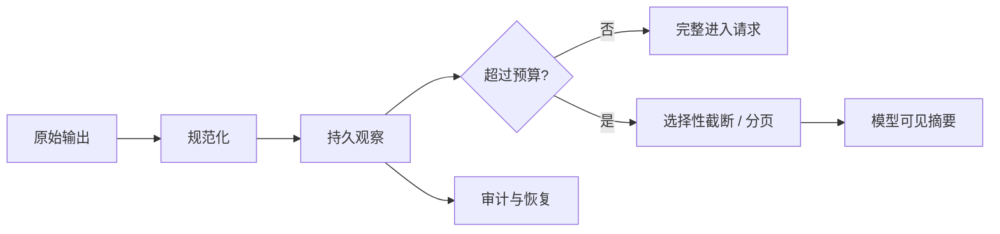

# Tool 结果处理与截断

## 一句话结论

工具结果不是一段可以原样转发的文本，而是带有状态、来源、大小和生命周期的观察（observation）。可靠处理链先保留完整原始证据，再生成适合模型的摘要；必要时截断或分页，并明确告诉模型哪些内容被省略、如何取回。

## 理想模型

理想观察至少包含：

| 字段 | 说明 |
| --- | --- |
| 调用 ID | 把结果归属到正确请求，支撑并发和重试 |
| 状态 | 成功、业务失败、系统错误、超时、取消或未知 |
| 数据 | 结构化负载、文本输出、变更列表或错误详情 |
| 来源 | 工具版本、命令、路径、查询和时间 |
| 截断信息 | 原始大小、保留范围、省略原因和取回方式 |
| 敏感度 | 是否含密钥、租户数据或需要脱敏的路径 |

## 小白解释

把工具结果想成体检报告。医院保存完整检验数据，再给病人一页摘要：关键指标、异常项和建议。报告太厚时，医生不会把整本书交给下一位会诊医生，而是带上异常页和原始编号，需要时再调完整记录。

同样地，测试日志可能有一万行，但模型通常只需要失败的测试名、断言、关键堆栈和相关文件。原始日志留在磁盘，供人类审查或后续精确读取。

## 机制拆解

### 规范化

不同工具的返回形式不同：有的返回 JSON，有的打印日志，有的直接改变文件。执行器应统一包装成观察，不让每个调用点自行解释退出码。业务失败要保持独立状态，不能全部折叠成字符串 `error`。

### 大小控制

先设置单次结果上限和整轮累计上限，再按工具类型选择保留面：

- **搜索**：保留命中数、路径、行号和高亮片段。
- **测试**：保留总结、失败用例、断言差异和关键堆栈。
- **文件读取**：保留行号范围和编码提示，超大文件改为窗口读取。
- **网络响应**：保留状态码、头部摘要、体大小和关键字段。
- **写操作**：保留受影响路径、新增/删除统计和回滚线索。

截断必须发生在稳定边界：按行、按 JSON 节点、按测试用例或按日志块，避免把多字节字符、对象或异常栈切成不可解释的碎片。

### 分页与引用

如果结果超出预算，模型可见部分应带引用句柄，例如文件路径加行号范围、游标、结果集 ID 或原始观察 ID。下一轮可以用更窄的查询继续读取。不要只说“输出已截断”，还要说明剩余内容大概是什么以及如何获取。

### 失败与敏感信息

失败结果要保留到持久层，并在下一次请求中以模型能理解的方式出现。错误文本进入模型前应脱敏：移除 token、连接串、内网地址和无关环境变量；完整堆栈和参数可保存在权限更高的审计日志中。

## 框架对照

下表只建立初稿证据索引，具体行为由批量 Implementation Review 核对：

| 框架 | 结果处理线索 | 关键锚点 |
| --- | --- | --- |
| Reasonix `aa82b2f` | Run 循环把工具结果扩展进 Session 历史；Session 支持持久化与修复。 | `internal/agent/run_loop.go`、`internal/agent/session.go` |
| DeepSeek Harness `b150a55` | Agent loop 处理模型、工具与会话事件；session 类型包含消息和 surface。 | `packages/core/agent-loop/src/agent.ts`、`packages/core/session/src/types.ts` |
| Pi `c49906e` | 编码代理在 `message_end` 后处理 `toolResult`；底层 entry 由 SessionManager 管理。 | `packages/coding-agent/src/core/agent-session.ts`、`packages/coding-agent/src/core/session-manager.ts` |

## 常见坑

- **只转发 stdout。** 缺少状态和来源时，模型无法区分警告、成功和失败。
- **静默截断结论。** 日志末尾常是汇总；从开头保留不一定是最优策略。
- **丢失原始证据。** 摘要无法替代调试所需的完整观察。
- **把敏感错误发给模型。** 审计价值和上下文安全必须分层。
- **没有取回路径。** “已省略”如果没有引用，会让任务卡死在信息缺口上。

## 自检问题

1. 一个工具同时产生文件变更和错误时，观察应如何表达？
2. 20 MB 的搜索结果应保留哪些最小字段？
3. 如何设计游标，让模型只读取相关的第二页？
4. 哪些内容可以进入模型摘要但不能进入公开 UI？反过来呢？

## 相关页面

- [教材目录](../TOC.md)
- [Tool 执行与副作用](./tool-execution.md)
- [Context 压缩与截断](./context-compression.md)
- [术语表](../09-glossary/glossary.md)
