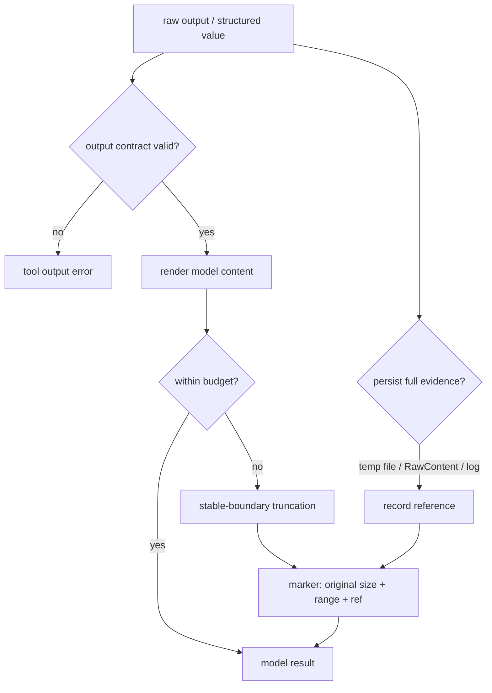
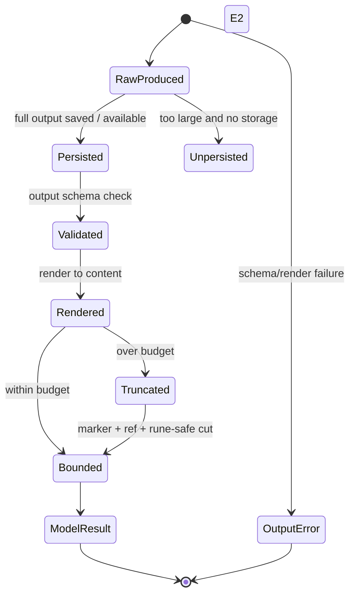

## 一句话结论

工具结果必须分三层：完整原始证据留在本地或 canonical log；host/UI 使用结构化元数据；模型只接收有界、稳定、带截断标记和取回引用的投影。截断不是隐藏失败，而是重新选择决策面——成功仍是成功，错误仍是错误，省略处必须有"从哪里拿回"的路径。

:::note
截断不是隐藏失败，而是**重新选择决策面**。成功仍是成功，错误仍是错误。
:::

## 上一章遗留问题

M-04 已经把 success/error/cancelled/blocked 规范成结构化观察，但输出可能是 100MB 日志、二进制图片、嵌套 JSON 或半截 Unicode。M-05 回答：哪些内容进入 provider request？截断边界如何选择？模型如何知道还能读什么？

## 本章解决什么矛盾

全量转发会耗尽 context、破坏 prompt cache 并泄露敏感信息；过度摘要又可能删掉唯一失败堆栈。工具作者希望自定义展示，Harness 必须保证统一预算和协议。可靠方案是分层处理：先保留原始证据，再按工具形状裁剪模型内容，最后由 registry 校验输出契约。

Reasonix 用 32KiB 稳定 Content 加 RawContent 分页和 tool-aware snip strategy；DeepSeek Harness 在 registry 中校验 output schema 后才渲染 model content；Pi 用流式 OutputAccumulator 保留 tail 并把 full output 写入 temp file。

:::tip
三层分离：**raw evidence**（完整原始） → **structured meta**（host/UI） → **bounded projection**（模型可见）。
:::

## 核心不变量

1. **证据先行**：截断前确定完整输出是否已保存或可在权威层重建；不能先丢后想。
2. **有界投影**：provider-visible content 有硬上限，且切点落在 rune/行/JSON 节点等稳定边界。
3. **语义不变**：截断不把 error 变 success，也不把 partial 写成 complete。
4. **省略可寻址**：marker/footer 至少给出原大小、保留范围、callId 或 full-output 路径。
5. **契约校验**：canonical output 先过 schema，再 render 成模型内容和 presentation meta；render 错误转成工具错误而不是污染历史。

失效边界在于存储生命周期：temp file 可能被清理，RawContent 只在当前 Session 可用，跨进程恢复依赖 checkpoint。因此 marker 要尽量让读者知道证据在哪一层，而不承诺永久存在。

:::caution
marker 要让读者知道**证据在哪一层**，但不承诺永久存在。temp file 可能被清理。
:::

## 理想模型



| 层 | 内容 | 消费者 | 典型上限 |
| --- | --- | --- | --- |
| Raw evidence | 完整 stdout、响应体、diff 前像 | 人类审计、paging 工具 | 磁盘/log 预算 |
| Canonical value | 结构化 JSON、变更列表 | Registry、测试、replay | 输出 schema |
| Host metadata | ShellExecution、truncation meta、卡片 | UI、遥测 | 小 |
| Model content | 文本、图片占位、关键 JSON | Provider | 32KB 级别 |
| Presentation | diff 卡片、状态徽标 | 用户界面 | 视觉预算 |



## 初学者主线

把工具结果当快递：

- 原始包裹放在仓库（full evidence）；
- 快递单写明重量、尺寸和存放位置（metadata/ref）；
- 给收件人的通知只列关键信息（model content）；
- 如果通知放不下，就写“共 120 页，已附第 1 页和最后一页，凭单号取全件”。

精确机制是给每个结果定义 `model_content <= budget`、`marker` 和 `reference`。失效边界是仓库也可能清空，所以重要任务应把关键证据复制到 Session 或工作区，而不是只依赖临时文件。

### 结果类型与保留面

| 类型 | 必留字段 | 可省略 | 取回方式 |
| --- | --- | --- | --- |
| shell 日志 | exit/state、尾部错误、总行字节 | 中间重复日志 | temp file / paging |
| 文件读取 | 行号范围、编码、hash/锚点 | 未请求页 | offset/limit 重读 |
| 搜索 | hit count、path:line、片段 | 全文上下文 | 更窄 query |
| 测试 | summary、failed case、assertion | passing logs | rerun 单测 |
| 网络 | status、headers 摘要、body size | 大 body | 分页/API |
| 写操作 | path、insert/delete、mutation risk | 全量 diff 细节 | VCS/diff 工具 |

### 截断策略

1. **tail-first**：shell/test 的结论通常在末尾；
2. **head-heavy**：文件读取开头常含结构和最相关内容；
3. **middle-out**：两端都有价值时保留头尾并替换中间；
4. **node-safe**：JSON 按 value 切，不切字符串字节；
5. **failure-aware**：检测到 `error/panic/fatal` 时增加 tail 权重；
6. **rune-safe**：多字节字符和 emoji 不能切成无效 UTF-8。

### Marker 设计

最低字段：

```text
tool name
call id
original bytes / lines
kept head/tail or line range
omitted reason (budget)
reference (RawContent, temp file, page cursor)
next action hint
```

坏 marker：“output truncated”。好 marker：“Showing lines 9801-10000 of 24000; full output: /tmp/pi-bash-x.log”。

## 机制深拆

### 1. 三层输出的生产顺序

推荐顺序：

```text
body returns canonical value
  -> validate output schema
  -> deep freeze / snapshot value
  -> render model content
  -> project presentation meta
  -> apply post-policy
  -> finalize content
  -> materialize final immutable observation
```

不要先渲染再校验：否则非法 value 可能已经进入 UI 或模型文本。

直觉上这是食品加工：先验收原料（schema），再做包装标签（render/meta），最后封箱（materialize）。失效边界是包装机坏了不能把原料偷偷出厂，而要报“加工失败”。

### 2. 错误结果的特殊处理

错误输出经常包含 stack trace、内网地址或 token。应分两份：

- audit detail：完整错误、args、环境摘要，权限更高；
- model text：first-line error、修正建议、必要时附 Schema。

如果 args 本身不是合法 JSON，直接重试大概率还会错；此时把工具 Schema 附在错误后，可以让下一次调用直接对齐形状。

### 3. 流式输出的内存控制

长命令不能等结束后才截断：

- 只保留 rolling tail 用于实时显示；
- streaming UTF-8 decoder 处理 chunk 边界；
- 超过阈值时把 full stream append 到 temp file；
- snapshot 返回 totalLines/Bytes 与保留范围；
- onUpdate throttle 防止 UI 每字节刷新。

### 4. 图片与二进制

图片不能嵌入可能被截断的长文本。正确做法是结构化 images 数组加文本占位符；base64 放入独立通道，避免 16KiB/32KiB 截断破坏 payload。

### 5. Reader observation 与后续编辑

读取类工具可以在返回前记录行号和每行 hash，供 host 做 stale-anchor 编辑检查。这个 observation 属于 host-only，不应进入 provider request；它的价值是把“模型读过什么”变成可验证事实。

## 反例与故障模式

1. **从中间切断 rune**
   - 触发：按字节数 `s[:32000]` 截断中文或 emoji。
   - 因果：产生 invalid UTF-8；某些 tokenizer/provider 报错或乱码。
   - 正确边界：snapToRuneBoundary 或 code point slicing。
2. **tail 截断丢失错误**
   - 触发：只保留前 2000 行，异常栈在末尾。
   - 因果：模型以为构建成功，继续部署。
   - 正确边界：tail-first 或 failure-aware tail weighting。
3. **marker 无引用**
   - 触发：只写 `[truncated]`。
   - 因果：模型无法分页，重复执行昂贵命令。
   - 正确边界：给出 callId/temp file/line range 和 next action。
4. **render 抛错污染历史**
   - 触发：presentation 函数假设字段存在，访问 undefined。
   - 因果：整个 batch 异常或写入半成品内容。
   - 正确边界：render 错误转为 ToolOutputError/error result，canonical history 不受污染。
5. **图片 base64 被截断**
   - 触发：截图以 data URL 拼接在长文本中。
   - 因果：截断后图片不可解码，还浪费大量 token。
   - 正确边界：ImageTool 结构化通道；文本只留占位符。
6. **敏感 token 进入 model content**
   - 触发：API 响应 headers 原样转发。
   - 因果：密钥进入 provider 请求和历史日志。
   - 正确边界：allowlist headers、secret scanning、audit/model 分层。
7. **临时文件被清理**
   - 触发：OS 清理 tmpdir 后模型仍引用 full output。
   - 因果：下一轮读取失败，用户以为工具撒谎。
   - 正确边界：重要证据复制到 session/workspace，或在 marker 中说明生命周期。
8. **成功输出过大被静默丢弃**
   - 触发：超过上限直接 return nil。
   - 因果：模型看到空结果，把成功当无操作。
   - 正确边界：至少保留 summary、计数器和取回引用。

## 一条完整因果链

一条 bash 命令输出 18MB 测试日志：

1. 进程持续写入 stdout/stderr；OutputAccumulator 用 streaming decoder 解码 chunk，只维护 decoded tail 和行计数。
2. 总量超过 maxBytes，accumulator 打开 `/tmp/pi-bash-xxxx.log`，继续追加原始 chunk。
3. onUpdate 每 100ms 发一次 bounded snapshot，UI 显示滚动尾部但不撑爆内存。
4. 进程退出。finish 解码最后一段，snapshot 计算 totalLines=24190、totalBytes=18MB、outputLines=2000、outputBytes≈50KB。
5. formatOutput 在模型文本后追加 footer：“Showing lines 22191-24190 of 24190. Full output: /tmp/pi-bash-xxxx.log”。
6. details 记录 truncation 和 fullOutputPath，供 UI 渲染“查看全部”。
7. 模型读到最后的 failed test 和 assertion，调用 `read_file /tmp/pi-bash-xxxx.log` 或运行更窄的测试。
8. 若任务需要长期审计，宿主把关键失败段复制进 Session；否则 temp file 按本机策略清理。
9. 结果 isError 保持 false（命令本身成功）或 true（测试失败），footer 不改变该语义。

这条链显示：截断的目标是保留“下一步动作所需的最小充分信息”，同时让其余数据仍然可达。

## 设计取舍

| 决策 | 收益 | 代价 | 适用条件 |
| --- | --- | --- | --- |
| 只发 tail | 保住最新错误/汇总 | 开头前提可能缺失 | shell/test |
| 只发 head | 保住文件结构与目录 | 结束状态丢失 | read/list |
| middle-out + marker | 两端兼顾，预算稳定 | marker 占空间，实现复杂 | 通用大输出 |
| 全部存 file，只给引用 | 最省 token | 模型需额外读取步骤 | 引用工具可靠时 |
| 强制 output schema | 结构化、防漂移 | 作者成本高 | 生产 registry |
| 自由文本输出 | 工具接入快 | 难以生成卡片和验证 | 原型工具 |
| temp file 引用 | 简单直接 | 生命周期不受 Session 控制 | 本地交互式任务 |
| Session 内 RawContent | 与会话同生命周期 | 增大持久层 | 需要恢复/审计 |

迁移路径：先给所有工具加统一 truncation wrapper 和 marker；再把关键工具改成 canonical value + render；随后为 shell/read 类增加 full-output 存储；最后把 snip geometry 移到工具自身声明，避免新工具继承错误默认值。

## 框架实现对照

以下路径均绑定固定快照；行号已在当前 `external/` 树核对。

| 框架 | 结果机制 | 关键锚点 |
| --- | --- | --- |
| Reasonix `aa82b2f` | 32KiB provider Content 上限；truncateToolOutputFor 按 bash/read/search 选择 snip geometry，failure-aware 增加 tail，rune-safe snap，循环压缩 marker；超限时保留 rawOutput；SnipHint 让工具自带折叠几何；ModelTextObservation 记录行 hash 且 host-only。 | `internal/agent/agent.go:2758-2810`、`internal/agent/execute_one.go:692-758`、`internal/tool/tool.go:220-243`、`internal/tool/observation.go:7-23` |
| DeepSeek Harness `b150a55` | createSuccessResult 先 snapshot/validate output schema，再 render content、project presentationMeta，最后 materialize freeze；finalizeScheduledExecution 处理 cancellation/post error；applyFinalContent 只能替换 content；tools/result observer 失败 contained；normalizeDispatchResult 区分 canonical 与 authored result。 | `packages/core/tools/src/index.ts:1792-1823,1609-1654,1656-1676,1825-1862` |
| Pi `c49906e` | OutputAccumulator 用 streaming decoder、rolling tail、line/byte 计数和 temp file；bash 每 100ms throttle onUpdate，最终 footer 显示行范围/字节限制/fullOutputPath；details 保存 truncation/fullOutputPath；read/grep/find/ls 用 truncateHead 并暴露 TruncationResult；truncateHead 保证完整行并在首行超限时 fail closed。 | `packages/coding-agent/src/core/tools/output-accumulator.ts:28-118`、`packages/coding-agent/src/core/tools/bash.ts:338-426`、`packages/coding-agent/src/core/tools/read.ts:286-296`、`packages/coding-agent/src/core/tools/grep.ts:340-341`、`packages/coding-agent/src/core/tools/truncate.ts:71-160` |

### Reasonix：稳定 Content、RawContent 与工具感知折叠

Reasonix 把 provider-visible Content 上限定为 32KiB，RawContent 保存完整本地结果供分页（`external/DeepSeek-Reasonix/internal/agent/agent.go:40-42`）。`finishToolExecution` 在 tool.after hook、post hooks、receipts 和 recovery observation 之后才截断；错误路径会把 `error: %v\n%s` 作为 rawErr，若 arguments 不是合法 JSON，还在 detail 后附加工具 Schema，帮助下一次重试对齐形状；截断发生时 `out.rawOutput = rawErr`（`external/DeepSeek-Reasonix/internal/agent/execute_one.go:692-758`）。

`truncateToolOutputFor` 不是单一 head cut：默认 40 行/8000 chars；bash 保持对称；read_file/web_fetch 采用 120 行/12000 chars 加 12 行/2000 chars；grep/glob/ls 是 80 行/10000 chars 加 8 行/1000 chars。若 head+tail 超出预算则按 2/3、1/3 收缩；文本包含 `error:`、`panic:`、`fatal:` 时 tail 至少提升到 1/3。切点用 `snapToRuneBoundary` 对齐 rune；marker 包含 toolName、callID、resultRef、original size 和 kept size；若仍超限，最多三轮均分修剪 head/tail 并重算 marker（`external/DeepSeek-Reasonix/internal/agent/agent.go:2758-2810`）。

SnipHint 进一步把折叠几何放到工具上：注释说明零值非法、几何跟随工具改名，contract test 要求每个 registered tool 显式声明或选择 read-only/side-effecting 默认，防止新工具静默套用通用策略（`external/DeepSeek-Reasonix/internal/tool/tool.go:220-243`）。`ModelTextObservation` 则记录 reader 返回的 contiguous window、起始行和每行 SHA-256，明确 host-only、never added to provider request，用于 stale-anchor 安全比较（`external/DeepSeek-Reasonix/internal/tool/observation.go:7-43`）。

### DeepSeek Harness：先验 output，再渲染内容

DeepSeek Harness 不信任 body 返回值。`createSuccessResult` 先 `snapshotToolValue` detach candidate，再用 `validateJsonSchemaValue(tool.output.schema)` 校验；violations 会抛 `ToolOutputError`。通过后才 deep freeze value、调用 `tool.output.render(exec.arguments, value)` 生成 ContentBlock；render 抛错转为 projectionError。顶层调用还可执行 presentationMeta 生成 UI payload，同样 snapshot/projection 保护（`external/deepseek-harness/packages/core/tools/src/index.ts:1792-1823`）。

调度器最后才 materialize：post-execute 后处理 caller cancellation；finalize 阶段的 materialization 或 finalContent 错误会转成 error result，不会让半成品成功进入 observer（`:1609-1645`）。`notifyResult` 冻结 exec，observer 异步失败只 warn，不改写 authoritative outcome（`:1656-1676`）。对 around-dispatch authored result，registry 区分 canonical result 和外部 result；error 保留 error/content/meta，success 必须重新走 owning output contract（`:1825-1844`）。`materializeFinalResult` 将 presentation 字段 materialize 并 deep freeze，success 才携带 canonical value（`:1846-1862`）。

这套顺序解决了两个问题：非法 value 不会进入模型文本；UI 卡片的崩溃也不会伪造工具成功。

### Pi：流式 accumulator 与可读 footer

Pi 的 `OutputAccumulator` 为流式输出设计：append 使用 streaming UTF-8 decoder，保持 decoded tail；需要保存全量时打开 temp file 并继续写原始 Buffer。snapshot 用 `truncateTail` 生成 content，并合并 totalLines/totalBytes/outputLines/outputBytes/max limits；`persistIfTruncated` 确保截断时 temp file 存在（`external/pi/packages/coding-agent/src/core/tools/output-accumulator.ts:28-118`）。

bash 工具把 accumulator 接入执行：每收到 data 就 append 并 schedule update；update 有 100ms throttle，partial snapshot 也会 persistIfTruncated。结束时 finish、closeTempFile，然后 formatOutput。footer 不是模糊 `[truncated]`：partial last line 会说明“Showing last X of line N”；lines 截断显示起止行和总数；bytes 截断显示行范围和 limit，并且都带 Full output 路径（`external/pi/packages/coding-agent/src/core/tools/bash.ts:338-426`）。

description 也提前声明协议：输出截断到最后 2000 行或 50KB，先到者为准；截断时 full output 保存到 temp file（`:330-336`）。其他工具复用同一元数据：read 使用 truncateHead（`external/pi/packages/coding-agent/src/core/tools/read.ts:286-296`），grep/find/ls 在 rawOutput 上截断并保存 TruncationResult（`external/pi/packages/coding-agent/src/core/tools/grep.ts:340-341`）。`truncateHead` 保证不返回 partial line；第一行超过 byte limit 时返回空 content 并标记 `firstLineExceedsLimit`，这是 fail-closed 而不是猜测切点（`external/pi/packages/coding-agent/src/core/tools/truncate.ts:71-160`）。

## 实现精妙之处

1. **Reasonix 的 failure-aware tail**：不是静态比例，而是在检测到错误关键词后动态增加尾部预算，适配日志的真实信息分布。
2. **Reasonix 的 marker 重算循环**：marker 本身也占空间，修剪 head/tail 后重新计算 original/kept size，保证最终 body 真正低于上限。
3. **Reasonix 的 SnipHint contract test**：把折叠几何作为工具能力，并用测试强制每个工具有立场，避免“新增工具忘记配置”这类隐性回归。
4. **DeepSeek Harness 的 schema-before-render**：canonical value 先验证，render/meta 错误都转成 projectionError，保证模型看到的文本来自合法数据。
5. **DeepSeek Harness 的 canonical WeakMap/token**：只有 registry 自己生成的结果被视为 canonical，around-dispatch 外部 result 必须重新归一化，防止绕过 output contract。
6. **Pi 的 streaming decoder + temp file**：实时显示、内存上限和全量证据可以同时成立，不需要等进程结束才决定截断。
7. **Pi 的 footer 即接口**：行范围、limit 和 Full output 路径直接写在模型文本里，弱 agent 也能理解下一步。

## 自检与面试追问

1. 为什么截断要在 tool.after/post hook 之后？提前截断会破坏哪些语义？
2. 设计一个 JSON Lines 日志的 node-safe truncation 算法，说明如何保证每行可解析且总量可控。
3. 如果 full-output temp file 已被清理，模型引用它失败，系统应如何降级？如何在 marker 中预防？
4. 如何测试 render/presentationMeta 的异常不会污染 Session？需要哪些 fault injection 点？
5. 一个 API 工具返回 10MB JSON，其中 20 个字段有价值。你会选择 server-side filter、client paging 还是 model-facing digest？
6. 如何在不发送真实 secret 的情况下测试脱敏规则？请定义 allowlist、redaction marker 和审计层的关系。

## 交给下一章的问题

现在结果可以被安全地看见。但有些危险动作不应等到结果出现才发现：删除分支、发布包、修改 protected config 需要在副作用前获得同意。M-06 将拆解审批模型：何时阻塞、谁批准、拒绝如何成为模型可见事实。

## 相关页面

- [教材目录](../TOC.md)
- [Tool 执行与副作用](./tool-execution.md)
- [Context 压缩与截断](./context-compression.md)
- [审批模型](./approval.md)
- [术语表](../09-glossary/glossary.md)
