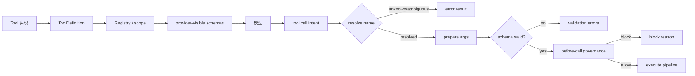

## 一句话结论

Tool Schema 是三方契约：给模型看 name/description/parameters，给 Registry 看执行与并发能力，给治理层看风险与权限。模型输出只是调用意图；只有经过存在性解析、结构校验、语义检查和治理门后，它才成为受控执行请求。

:::note
模型输出只是**调用意图**。经过解析、校验和治理门后，才成为受控执行请求。
:::

## 上一章遗留问题

M-02 说明折叠不能拆散 assistant tool call 与 result。这隐含了两个协议要求：调用必须有可归属 ID，结果必须显式成功或失败。M-03 要回答：工具面如何进入上下文？未知或歧义名称如何处理？Schema 校验通过后为什么还可能被拒绝？

## 本章解决什么矛盾

声明太简单，模型会编造参数或在错误场景调用；声明太复杂，token 成本上升且相似工具互相干扰。同时，安全约束不能只写在 description 里：路径白名单、写入权限、阶段可见性和并发规则必须由代码 fail-closed 执行。工具协议因此要同时服务模型理解、机器校验和治理。

Reasonix 用 per-run Registry 分离 provider-visible schema 和 executable tools；DeepSeek Harness 在注册时强制 output contract 并维护 scoped registry；Pi 允许 prepareArguments 兼容旧格式，但最终仍用 TypeBox 校验并让 beforeToolCall 阻断。

:::tip
三方契约：**模型** 看 name/description/parameters → **Registry** 看执行与并发 → **治理层** 看风险与权限。
:::

## 核心不变量

1. **名称可解析**：exact name 优先；别名唯一才可解析，ambiguous 返回候选且不执行。
2. **声明与执行同源**：provider 只看到 name/description/parameters；timeoutMs、并发 classifier、output renderer 等运行时元数据不进模型。
3. **校验分层**：结构错误应可修正；语义和权限错误 fail-closed；前者返回给模型，后者可能需要用户介入。
4. **ID 归属**：tool call/result 通过 `callId` 配对；嵌套 dispatch 也要有 sub-call ID。
5. **失败是观察**：unknown tool、invalid args、blocked、abort 都生成错误 result，而不是静默消失或抛出未配对异常。

失效边界在于宿主差异：同一工具在不同 provider 上可能支持不同的 Schema 子集；跨进程插件可能注册重复名称；异步 hook 可能在 abort 后返回结果。协议必须在每一层选择保守分支。

:::danger
安全约束不能只写在 description 里。路径白名单、写入权限、并发规则必须由代码 **fail-closed** 执行。
:::

## 理想模型



| 契约组 | 内容 | 消费者 | 是否进模型 |
| --- | --- | --- | --- |
| 身份 | name、namespace、canonical name | Registry、审计、模型 | 是 |
| 描述 | 用途、边界、非目标、输出形态 | 模型 | 是 |
| 输入 | 类型、必填、enum、默认值、互斥 | 模型、validator | 是 |
| 输出 | canonical value schema、render/presentation | Registry、UI | 通常否 |
| 运行时 | timeoutMs、concurrency-safe、依赖注入 | executor/scheduler | 否 |
| 治理 | ReadOnly、executionMode、allow/deny、phase | approval/sandbox | 部分 via executionMode |

```mermaid
sequenceDiagram
  participant Reg as Registry
  participant Loop as Agent Loop
  participant Val as Validator
  participant Gov as Governance/Hook
  participant Exe as Tool Executor
  Reg->>Loop: 当前 scope 的 visible schemas
  Loop->>Reg: resolve(name)
  alt unknown / ambiguous
    Reg-->>Loop: not found / candidates
    Loop-->>Model: error tool result
  else resolved
    Loop->>Val: validate/coerce args
    alt invalid
      Val-->>Loop: path + message + received args
      Loop-->>Model: invalid_arguments result
    else valid
      Loop->>Gov: beforeToolCall(args, signal)
      alt block/abort
        Gov-->>Loop: blocked reason
        Loop-->>Model: error tool result
      else allow
        Loop->>Exe: execute(callId, args, signal, onUpdate)
        Exe-->>Loop: result or thrown failure
      end
    end
  end
```

## 初学者主线

把工具当成自动售货机：

- 货架标签是 description；
- 按键编号是 name；
- 投币规格是 parameters；
- 出货口和故障灯是 result/error 协议；
- 店员权限卡是治理元数据。

顾客说“我要 A3”只是意图。机器仍要确认 A3 存在、金额正确、没有售罄、你有权限购买。语法正确不代表能出货。

### Schema 设计原则

1. **名字表达动作**：`search_code` 比 `run_query` 更少误用。
2. **描述写边界**：适用场景、只读还是写、耗时预期、常见失败。
3. **参数强类型**：能用 enum/integer/boolean 就不要让模型写自由 JSON 字符串。
4. **互斥显式**：`oneOf`、required 组合或 validator 明确说明冲突。
5. **输出契约独立**：模型看到的内容与 UI 卡片、日志详情可以分离。

### 调用生命周期

最小状态序列：

```text
declared -> intent -> resolved -> validated -> allowed -> executing -> settled
```

settled 包括 success、business failure、system error、blocked、aborted。每个非终态都应有事件或进度流；终态必须有 result。

### 错误分类

| 类别 | 例子 | 模型能否自修 |
| --- | --- | --- |
| unknown_tool | 名称拼错或未注册 | 通常能改名 |
| ambiguous_alias | MCP 别名命中多个工具 | 能根据候选修正 |
| invalid_arguments | 缺 path、offset 为负 | 能读错误路径修复 |
| semantic_rejected | 文件不在工作区 | 有时能换路径 |
| permission_denied | 审批拒绝、只读模式 | 不应绕过 |
| unavailable_phase | Plan mode 调用 update_goal | 应改为回答或等待 |
| upstream_failure | 网络/API 失败 | 可重试或改道 |
| aborted | 用户取消 | 不应继续原调用 |

## 机制深拆

### 1. Registry 的两种视图

**Executable view**：所有已注册且未被 suspend/hide 的工具，供 `Get/Execute` 使用。

**Provider-visible view**：允许出现在下一次请求 Schema 的子集。两者分离可以：

- 让 capability dispatch 调用隐藏工具而不改变模型面；
- 保持 cache 稳定，只在真正需要时更新 schema surface；
- 支持阶段性工具（如 plan/execution 差异）而无需反复注册。

失效边界是：如果 hidden tool 可以通过另一个工具间接触发，host 必须在 execute 前再次检查 contextual visibility。

### 2. 结构校验与语义校验

结构校验回答“形状是否正确”：类型、required、enum、additionalProperties。它应该返回带路径的错误，方便模型修改。

语义校验回答“这个合法值现在是否可用”：路径是否在工作区、查询语言是否支持、资源是否存在、预算是否够。它通常在工具实现内完成，并且必须考虑 host 注入的工作目录和 deny roots。

直觉上，结构校验是拼写检查，语义校验是门禁。失效边界是：拼写正确的钥匙也可能打不开这扇门。

### 3. Fail-closed 元数据

并发、超时、ReadOnly、PlanModeSafe 这类字段不能靠模型自觉：

- 未声明 concurrency safe 时默认 exclusive；
- classifier 异常或返回非 true 时降级串行；
- contextual tool 在 stale transcript 中不可见就不得执行；
- bash/plugin 即使看似只读也常被迫返回 false，因为静态分析无法证明副作用。

这些默认值牺牲一些并行度，换来副作用顺序和安全。

### 4. Hook 的位置

`beforeToolCall` 必须在 validation 之后、execute 之前：

- 太早会把无效 args 交给策略，产生误报；
- 太晚则已经产生副作用；
- 必须接收 abort signal，否则取消后仍可能阻塞等待用户。

block 结果要转换成 tool result，而不是让整个 batch 丢失其他调用的结果。

### 5. 输出契约

现代 Harness 区分三层：

1. canonical value：工具函数返回的结构化 JSON；
2. model content：渲染成文本/图片的 provider 内容；
3. presentation meta：UI 卡片、diff、时间线。

把三者混在一个字符串里会让截断破坏图片或 diff。分开声明还能让 replay 重建相同 UI。

## 反例与故障模式

1. **同名工具跨插件冲突**
   - 触发：两个扩展都注册 `search`。
   - 因果：按 map 插入顺序随机胜出，行为随加载顺序变化。
   - 正确边界：scoped shadowing 规则明确，全局重复注册直接失败。
2. **歧义别名自动选择**
   - 触发：MCP server 提供 portable alias，另一个 server 也有同名 alias。
   - 因果：调用发给错误 server，用户数据泄露或操作错误资源。
   - 正确边界：ambiguous 返回 canonical candidates，永不猜测执行。
3. **description 替代权限**
   - 触发：写工具说“不要删除重要文件”，但没有 deny root。
   - 因果：模型偶尔忽略提示；测试也无法复现权限边界。
   - 正确边界：description 引导行为，confine/permission 强制行为。
4. **自由字符串嵌套 JSON**
   - 触发：filter 参数定义为 string，实际要求 JSON。
   - 因果：转义错误难以定位，validator 无法给出字段路径。
   - 正确边界：使用 object/array schema 或受控 query DSL 枚举。
5. **校验前 hook 泄露敏感值**
   - 触发：hook 收到原始 args，其中包含 token。
   - 因果：错误消息或第三方策略日志记录 secret。
   - 正确边界：先脱敏/结构校验；hook 只接收必要字段或已验证副本。
6. **prepareArguments 掩盖坏输入**
   - 触发：兼容层悄悄补默认 path 或重命名字段。
   - 因果：模型从未学会正确调用，日志中的原始 args 与实际执行不一致。
   - 正确边界：兼容层只做确定性规范化，并在必要时记录 transformation。
7. **并发 classifier 抛异常**
   - 触发：isConcurrencySafe 读取外部状态时失败。
   - 因果：若当作 true 会并行写共享状态。
   - 正确边界：任何异常都降级 exclusive。
8. **abort 后继续 emit update**
   - 触发：工具后台任务已经结束但仍在回调 partial result。
   - 因果：UI 显示已完成步骤，实际调用被取消。
   - 正确边界：update callback 在 promise settle 后关闭，abort 优先。

## 一条完整因果链

假设模型在第 5 轮发出三个调用：

1. `read_file {"path":"src/a.ts","offset":-1}`；
2. `old_search {"query":"x"}`（已被 rename）；
3. `write_file {"path":"../../etc/hosts",...}`。

处理过程：

1. Registry 解析：`read_file` exact 命中；`old_search` unknown；`write_file` exact 命中。
2. `read_file` 参数结构校验失败，错误指出 `offset must be >= 0`，生成 invalid_arguments result。
3. `old_search` 得到 “Tool old_search not found”；若存在唯一 MCP alias 则可解析，多个 alias 则返回 candidates。
4. `write_file` 参数结构合法，进入 before-call governance；host 发现路径逃逸 workspace，立即 block，生成 permission_denied result。
5. 三个结果都带有原 callId，并按模型 order 写回 Session；assistant tool calls 没有孤儿。
6. 下一轮模型看到 offset 修正建议、可用工具名和工作区限制，而不是看到一次崩溃或部分执行。

这条链显示：协议的目标不是避免所有错误，而是让每类错误成为下一步决策的观察。

## 设计取舍

| 决策 | 收益 | 代价 | 适用条件 |
| --- | --- | --- | --- |
| 强类型 JSON Schema | 可验证、可生成 SDK | 作者成本高 | 生产工具和多模型支持 |
| 自由字符串参数 | 灵活、声明短 | 无法精确校验 | 仅限内部原型 |
| 静态 Schema + contextual visibility | cache 稳定且阶段安全 | 需要 execute 前二次检查 | plan/execution 分离 |
| 全部工具始终暴露 | 模型知道能力全集 | token 高、易误选 | 小工具集 |
| allow/deny/restrict | 按任务裁剪能力面 | 配置错误可能导致空集 | 多 agent/多阶段 |
| 兼容 prepareArguments | 渐进迁移旧模型 | 可能掩盖训练需求 | 过渡期工具 |
| 输出 schema + render | 结构化审计和 UI | 注册更复杂 | 需要卡片/replay |

迁移路径：先把现有自由文本参数改成 object schema；再把执行函数与 model-facing schema 分离；然后引入 registry scope/restrict；最后为关键工具添加 output contract 和 presentation meta。

## 框架实现对照

以下路径均绑定固定快照；行号已在当前 `external/` 树核对。

| 框架 | 工具协议机制 | 关键锚点 |
| --- | --- | --- |
| Reasonix `aa82b2f` | Tool 接口包含 Name/Description/Schema/Execute/ReadOnly；Registry 是 per-run set，支持 provider-visible allowlist、schemaRev、exact/MCP alias ResolveCall、stable name order Schemas。read_file 展示 Schema、分页描述、path confine 和 invalid args。 | `internal/tool/tool.go:20-43,279-330,483-516,609-635`、`internal/tool/builtin/readfile.go:51-69,117-139` |
| DeepSeek Harness `b150a55` | ToolDefinition 要求 mandatory output {schema,render}；register 校验 output schema、timeoutMs，保留 run_code 名；schemas() 只暴露 name/description/parameters；executionMode 对未知/异常 fail closed；enforced JSON Schema subset 支持 oneOf/properties/required/additionalProperties/items/enum/const。 | `packages/core/tools/src/index.ts:211-288,1031-1062,1228-1285`、`packages/core/tools/src/json-schema.ts:31-87,654-656` |
| Pi `c49906e` | AgentTool 继承 TypeBox Tool，含 label、prepareArguments、execute、executionMode；循环按 sequential/parallel 执行；prepareToolCall 先找工具、prepare、validateToolArguments，再 beforeToolCall 阻断；validation structuredClone、normalize optional nulls、Convert/coerce、TypeBox Check 并返回 path errors；coding-agent registry 合并 builtin/custom/extension 并过滤 active tools。 | `packages/agent/src/types.ts:386-409,411-419`、`packages/agent/src/agent-loop.ts:411-487,586-668,670-700`、`packages/ai/src/utils/validation.ts:302-349`、`packages/coding-agent/src/core/agent-session.ts:2588-2679,929-954` |

### Reasonix：per-run Registry 与静态可见性

Reasonix 的 `Tool` 接口把五件事绑定在一起：Name、Description、JSON Schema、Execute 和 ReadOnly（`external/DeepSeek-Reasonix/internal/tool/tool.go:20-35`）。注释强调 ReadOnly 决定 batch 是否并行，bash/plugin 必须返回 false，因为无法从 args 静态推断副作用（`external/DeepSeek-Reasonix/internal/tool/tool.go:29-34`）。可选接口进一步扩展能力：ContextualTool 在执行时判断 ProviderVisible，Previewer 计算将要产生的 diff，ImageTool 把图片放在结构化通道而不是文本里（`external/DeepSeek-Reasonix/internal/tool/tool.go:37-85`）。PlanModeClassifier 刻意与 ReadOnly 分离——complete_step 可以无副作用但不能在 planning 阶段执行（`external/DeepSeek-Reasonix/internal/tool/tool.go:87-96`）。

Registry 是 per-run set：enabled built-ins 加 plugin tools，Agent 只见 Registry，不见全局 built-in set（`external/DeepSeek-Reasonix/internal/tool/tool.go:1-4,281-295`）。`SetProviderVisibleTools` 限制 provider schema，同时保持所有 registered tools 可通过 Get/Execute 调用，供 use_capability dispatch（`external/DeepSeek-Reasonix/internal/tool/tool.go:287-293,302-330`）。`ResolveCall` exact name 优先；MCP portable alias 只有唯一匹配才返回，多个匹配返回 sorted candidates 且 never executed（`external/DeepSeek-Reasonix/internal/tool/tool.go:483-516`）。`Schemas()` 按 stable name order 导出 provider-visible definitions（`external/DeepSeek-Reasonix/internal/tool/tool.go:609-635`）。

`read_file` 是具体样本：description 说明 line numbering、offset/limit 分页和 trailer；Schema 定义 required `path`、minimum 约束（`external/DeepSeek-Reasonix/internal/tool/builtin/readfile.go:51-67`）。Execute 中 JSON Unmarshal 失败返回 invalid args，空 path 单独报错；随后 resolveReadablePath 和 confineRead 处理 workdir、external aliases 与 forbidden roots（`external/DeepSeek-Reasonix/internal/tool/builtin/readfile.go:117-139`）。

### DeepSeek Harness：注册时强制 output contract

DeepSeek Harness 的 ToolDefinition 不只是输入 Schema。它要求 mandatory `output: { schema, render }`，可选 presentationMeta；execute 返回 canonical lossless JSON value，finalizeContent 是同步最后一步内容投影（`external/deepseek-harness/packages/core/tools/src/index.ts:211-247`）。`timeoutMs` 是 cooperative budget，由 policy wrapper 执行，永远不会发给模型（`external/deepseek-harness/packages/core/tools/src/index.ts:248-255`）。`isConcurrencySafe` 只有显式 `true` 才并行；omission、exception、non-true 都是 exclusive（`external/deepseek-harness/packages/core/tools/src/index.ts:256-269`）。

`register()` 在进入 scoped layers 前检查 output 形状、`assertSupportedJsonSchema(output.schema)` 和 positive finite timeout；`run_code` 名字无条件 reserved，任何 scope 不能注册或 shadow（`external/deepseek-harness/packages/core/tools/src/index.ts:1031-1062`）。`restrict()` 要求 agent-scoped context，拒绝空 filter，allow/deny 交集生效（`external/deepseek-harness/packages/core/tools/src/index.ts:1064-1080`）。

模型面由 `schemas(scope)` 投影：只取 visible definitions 的 name/description/parameters，并 deep clone/snapshot，排除 execution 和 presentation callbacks（`external/deepseek-harness/packages/core/tools/src/index.ts:1228-1267`）。调度前的 `executionMode` 再次解析当前定义；unknown、hidden、collapsed、undeclared、invalid 或 throwing classifier 一律 `{kind:'exclusive'}`（`external/deepseek-harness/packages/core/tools/src/index.ts:1269-1285`）。

enforced JSON Schema 是一个明确子集：type、oneOf、properties、required、additionalProperties、items、enum、const；description/title/default/examples 只是 annotation。作者错误收集所有 violation paths（`external/deepseek-harness/packages/core/tools/src/json-schema.ts:31-87`）。运行时 `validateJsonSchemaValue` 对任意 value total，并返回 path-qualified violations（`external/deepseek-harness/packages/core/tools/src/json-schema.ts:646-656`）。

### Pi：TypeBox 校验与 beforeToolCall 门

Pi 的 AgentTool 在基础 Tool 之上增加 label、prepareArguments、execute 和 executionMode override（`external/pi/packages/agent/src/types.ts:386-409`）。AgentContext 只带 systemPrompt/messages/tools，因此每次 run 的工具面是显式快照（`external/pi/packages/agent/src/types.ts:411-419`）。

执行入口按配置和工具声明选择 sequential 或 parallel；只要有一个 sequential tool，整批走 sequential（`external/pi/packages/agent/src/agent-loop.ts:411-425`）。Sequential 循环逐个 emit start、prepare、execute、end、result message，abort 时 break（`external/pi/packages/agent/src/agent-loop.ts:433-487`）；parallel 先准备，执行体异步并发，最后按 source order 组装 messages（`external/pi/packages/agent/src/agent-loop.ts:489-553`）。

`prepareToolCall` 是协议核心：找不到工具立即返回 “Tool X not found” immediate error；找到后先 `prepareToolCallArguments`，再 `validateToolArguments`；然后才调用 `config.beforeToolCall`。Hook 可以 block 并携带 reason/terminate；abort 也转换为 immediate error。校验抛出的异常同样变成 error result（`external/pi/packages/agent/src/agent-loop.ts:600-668`）。execute 通过 toolCallId、validated args、signal 和 onUpdate 回调进行，settle 后不再接受 updates（`external/pi/packages/agent/src/agent-loop.ts:670-700`）。

TypeBox validation 不是简单 Check：先 structuredClone 原始 arguments，normalize optional nulls，`Value.Convert` 做类型转换；非 TypeBox symbol 的 raw JSON schema 还会 coerceWithJsonSchema。失败时列出 formatted path、message 和 Received arguments（`external/pi/packages/ai/src/utils/validation.ts:302-349`）。

coding-agent 层再合成 registry：base definitions、SDK custom tools 和 extension registered tools 合并，受 allowed/excluded names 过滤；extension wrapper 包住 custom tools；新 Map 成为 `_toolRegistry`，active names 去重后交给 `setActiveToolsByName`（`external/pi/packages/coding-agent/src/core/agent-session.ts:2588-2679`）。后者只接受 registry 内的名字，未知名 ignored，并重建 base system prompt 使工具说明与新集合一致（`external/pi/packages/coding-agent/src/core/agent-session.ts:929-954`）。

## 实现精妙之处

1. **Reasonix 的 provider-visible/executable 分离**：隐藏工具仍可被 capability dispatch 调用，避免为了隐藏而删除执行能力；代价是 contextual visibility 必须 execute 前复查。
2. **Reasonix 的 ambiguous alias fail-closed**：返回 sorted candidates 而不是第一个 match，消除插件加载顺序带来的随机性。
3. **DeepSeek Harness 的 mandatory output schema**：把“工具返回什么”从文档约定提升为注册期校验，Code Mode 和 UI 可以共享同一 canonical value。
4. **DeepSeek Harness 的 reserved run_code**：不允许任何 scope 占用 transport 名字，防止 preset 挂载后才出现的碰撞。
5. **Pi 的 validation coercion**：兼容 `"5"` 到 `5`、optional null 清理等真实模型习惯，但仍用 path-qualified errors 拒绝不可修错误。
6. **Pi 的 immediate error result**：not found、invalid、blocked、abort 都保持 call/result 配对，batch 其他调用不受影响。

## 自检与面试追问

1. 如果 provider 只支持扁平 JSON Schema，你的 Registry 应该降级、报错还是编译？三种选择的兼容性和安全影响是什么？
2. 一个工具的 description 说可以联网，但治理层禁止网络。模型频繁尝试时，应该在 schema、runtime 还是评测层修复？
3. 如何设计 alias 解析规则，使新增 MCP server 不会改变已有调用的目标？
4. `prepareArguments` 什么时候有价值？请给出三条必须记录 transformation 的条件。
5. 为什么 `isConcurrencySafe` 要接收已校验 args？如果它需要读取数据库，设计上有什么风险？
6. 请为一个 `run_tests` 工具写出 input schema、canonical output schema、model content 和 presentation meta 的划分。

## 交给下一章的问题

本章停在治理放行的瞬间：调用已解析、参数已校验、hook 已允许。M-04 要回答执行器如何控制副作用——Workspace Lease、父级写入预留、进程生命周期、取消传播和部分失败如何管理。

## 相关页面

- [教材目录](../TOC.md)
- [Context 压缩与截断](./context-compression.md)
- [Tool 执行与副作用](./tool-execution.md)
- [术语表](../09-glossary/glossary.md)
