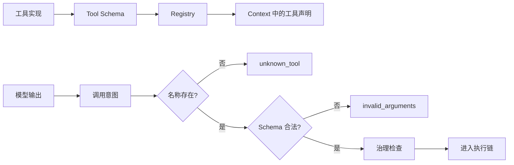

# Tool Schema 与调用协议

## 一句话结论

Tool Schema 是模型、线束（Harness）和工具实现之间的契约。它必须同时告诉模型“什么时候能用”、告诉线束“参数长什么样”、告诉实现“依赖和副作用是什么”。缺少任何一层，模型输出就只是一个待验证的调用意图，而不是可以执行的命令。

## 理想模型

理想契约至少包括五组信息：

| 契约组 | 内容 | 主要消费者 |
| --- | --- | --- |
| 身份 | 稳定名称、版本、命名空间 | 模型、Registry、审计 |
| 描述 | 用途、适用条件、限制和非目标 | 模型 |
| 参数 | 类型、必填项、枚举、格式、默认值和互斥关系 | 模型、线束 |
| 结果 | 成功数据、业务失败、系统错误、取消状态 | 线束、模型 |
| 治理 | 权限、风险级别、幂等性、是否可并行 | 审批器、执行器 |

## 小白解释

把工具想成一台自动售货机。商品名和按钮说明是给顾客看的 Schema；投币口、出货口和故障提示是接口约定；后台补货员关心库存和权限。顾客说“我要 A3”后，机器仍要确认商品存在、金额正确、出货口畅通，然后才真正出货。

模型提出 `read_file` 也一样。名字正确不代表能读，路径合法也不代表有权限。线束要先查目录里有没有这个工具，再校验参数形状，最后交给治理和执行环节。

## 机制拆解

### Schema 设计

好的 Schema 使用稳定且语义清晰的工具名，例如 `search_code` 比 `run_query` 更不容易误用。描述应写适用场景和边界：读取范围、是否写文件、是否联网、耗时预期和常见失败。参数避免用自由字符串嵌套 JSON；能用枚举、数字、布尔或带格式字段时，不要让模型自行发明语法。

### 调用生命周期

一次调用至少经历六个状态：声明进入上下文，模型输出调用意图，线束解析并校验，治理层判断许可，执行器产生观察，协议层规范化返回成功或失败。每个调用应有唯一 ID；并发调用也要能归属到正确的回合和消息。

### 校验层次

1. **存在性**：工具是否注册，是否在当前阶段暴露。
2. **结构**：必需字段是否齐全，类型和格式是否正确。
3. **语义**：路径是否落在允许的工作区内，查询语言是否符合工具要求。
4. **组合**：多个参数是否冲突，批量大小是否超限。
5. **治理**：风险等级、权限、预算和用户设置是否允许。

前四类错误通常应返回可修正的失败，让模型调整后重试；治理拒绝可能需要用户介入，不应被模型绕过。

### 错误契约

错误响应要有机器可读分类和人可读说明。常见类别包括未知工具、参数无效、权限不足、资源不存在、超时、上游失败、已取消和部分完成。返回给模型的文本应说明下一步可能的选择，但不能泄露敏感路径或完整堆栈。

## 框架对照

下表只建立初稿证据索引，具体行为由批量 Implementation Review 核对：

| 框架 | 工具协议线索 | 关键锚点 |
| --- | --- | --- |
| Reasonix `aa82b2f` | Agent 层处理未知工具和门控；具体工具负责解析参数并检查写路径。 | `internal/agent/run_loop.go`、`internal/tools` |
| DeepSeek Harness `b150a55` | 注册层处理解析、未知工具和前置策略；具体工具在执行时校验声明。 | `packages/core/agent-loop/src`、工具注册相关 package |
| Pi `c49906e` | 通用循环查找工具、校验参数并允许宿主钩子阻断；扩展可贡献工具类型。 | `packages/agent/src`、`packages/coding-agent/src/core/agent-session.ts` |

## 常见坑

- **只写参数类型。** 缺少用途和限制时，模型会在语法合法但语义错误的场景调用。
- **用自然语言承载关键约束。** “不要删除重要文件”不能替代路径白名单和权限检查。
- **丢失调用 ID。** 并发或重试后，结果无法可靠归属。
- **把所有失败都当异常。** 业务失败是正常观察，应回到模型形成决策依据。
- **声明与实现漂移。** Schema 改了，执行器和审批器仍按旧字段判断。

## 自检问题

1. 一个工具描述中，哪句话最能减少误调用？
2. 参数通过 Schema 校验后，还有哪些原因会导致治理拒绝？
3. 并发调用两个同名工具时，如何区分请求和结果？
4. 返回给模型的错误为什么要和审计日志不同？

## 相关页面

- [教材目录](../TOC.md)
- [Context 组装与分层](./context-assembly.md)
- [术语表](../09-glossary/glossary.md)
