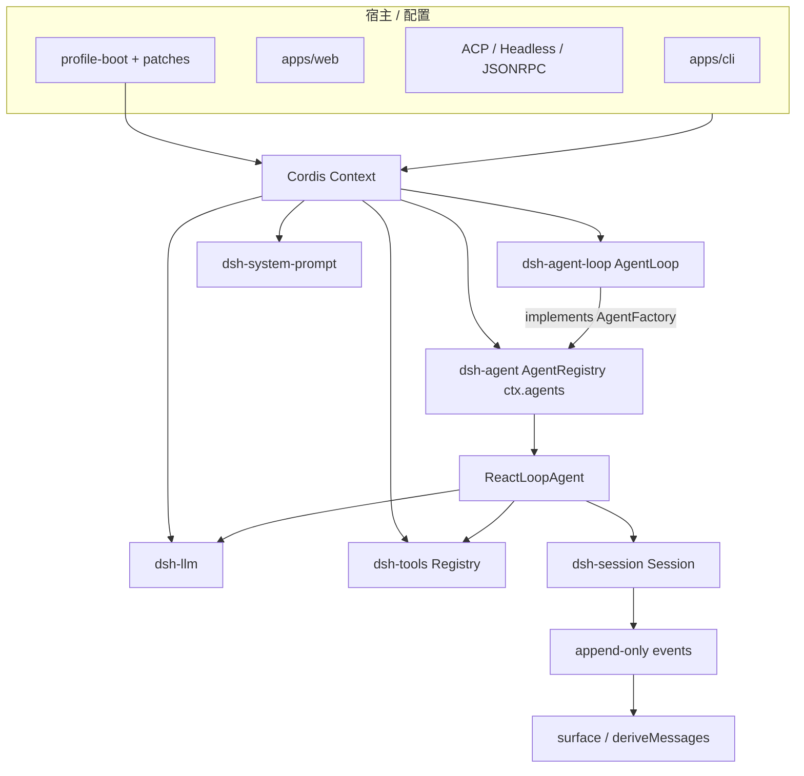
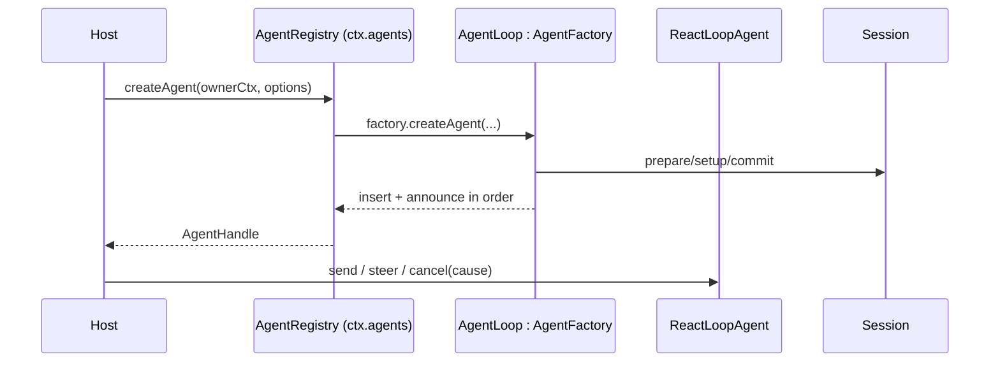

## 一句话结论

DeepSeek Harness 用 Cordis 服务容器做装配，用接口反转做解耦：`ctx.agents`（AgentRegistry）暴露创建/resume 门面，`AgentFactory` 由 `agent-loop` 包实现，消费方永远不 import 具体 loop。权威状态是 append-only Session event log；`SessionHeader` 把版本、cwd、fork 血缘、seedLength、subagent origin、delegationDepth 和 agentPreset 持久化到日志之外，使 resume/fork 的治理语义跨进程存活。CLI/Web/ACP/headless 只是不同宿主，核心契约不变。

## 上一章遗留问题

Reasonix 用“厚 Controller + generation 清理”解决多端复用。DeepSeek Harness 走另一条路：服务容器 + 声明式插件。本章回答：为什么 AgentFactory 放在 dsh-agent？delegation depth 为什么必须在 header 里？并行工具为什么还要按模型顺序提交？

## 本章解决什么矛盾

宿主多样性与核心稳定性是一对矛盾：CLI 要交互，Web 要浏览器安全，ACP/headless 要协议桥。DeepSeek Harness 的答案是三层分离：

1. **契约层**（dsh-agent）：定义 Agent/Inbox/Status 与 `AgentFactory`；
2. **实现层**（dsh-agent-loop）：`AgentLoop` 注入 agents/sessions/llm/tools/systemPrompt 并提供工厂；
3. **事实层**（dsh-session）：append-only events + surface 投影。

加上 profile-boot 的 bundle/patch/overlay 声明式装载，宿主只需选择挂载哪些服务行，而不 fork 核心代码。

直觉上这是“插座标准”。精确机制是 Cordis 的依赖注入与 scope 生命周期。失效边界是：契约演进需要版本纪律——SESSION_FORMAT_VERSION pinned at 0 正是为了在未发布期避免半兼容负担。

## 架构分层

| 层 | 关键符号 | 职责 |
| --- | --- | --- |
| 宿主装配 | apps/cli profile-boot、Cordis loader | 解析 home/profile/bundle/patch，决定服务图 |
| 身份注册 | dsh-agent `AgentRegistry`（ctx.agents） | create/resume/dispose 门面、owner/initiator 追踪 |
| 循环驱动 | dsh-agent-loop `AgentLoop` | 实现 AgentFactory；并行上限配置；发布 ReactLoopAgent |
| 执行循环 | dsh-agent-loop `ReactLoopAgent` | idle/running phase、inbox、turn/step、错误瀑布 |
| 会话事实 | dsh-session `Session`/`SessionEvent` | append-only 权威历史、surface 派生 |
| 存储 | SessionHeader + persistence | 版本、血缘、seedLength、preset 治理字段 |

## 工厂反转：为什么 AgentFactory 在 dsh-agent

`AgentFactory` 的 JSDoc 完整描述了 create 的顺序契约：awaits unpublished setup → optional synchronous commit → inserts session and agent → emits creation notifications in order → emits agent/session-start → only then starts the loop；rollback covered，但已发出的通知由 agent/disposed 或 session/disposed 配对（`external/deepseek-harness/packages/core/agent/src/index.ts:183-214`）。resume 则要求先存在 sessionPersistence 服务（`:204-213`）。

`NO_FACTORY_MESSAGE = 'no agent factory registered (load an agent-loop plugin)'` 直接点明设计：没有加载 loop 插件时，registry 是一个诚实的空门面而不是隐式实现（`:216-217`）。

`AgentRegistry` 注释进一步说明 initiator 机制的边界：Initiator methods provide same-process causal attribution only. Ambient presence is neither liveness proof nor authorization; subjects and owners remain explicit, as does identity at worker, process, persistence, and wire boundaries（`external/deepseek-harness/packages/core/agent/src/index.ts:244-255`）。也就是说，因果归因只在本进程内有效，跨边界身份仍需显式传递。

## Agent 接口：最小可观察面

`AgentOptions` 只有 provider/model/maxTokens 三项，注释说明 Persona belongs to system-prompt sections——请求级配置与提示词组合分属不同层（`external/deepseek-harness/packages/core/agent/src/runtime-types.ts:23-31`）。

`AgentStatus = 'idle' | 'running'`，注释明确 disposal removes the agent from its registry; it is not a third observable status（`:43-50`）。取消语义也精确定义：cancel(cause) clears queued and steering work unless keepInbox；first cause wins for that activity；no active activity 时 cancellation is a no-op and does not arm later work（`:33-41,78-85`）。

`whenIdle()` 的注释强调它 follows replacement work started before the observed driver retires, but does not identify the settlement of any particular message（`:87-93`）；`runMaintenance` 只能在 true idle phase 启动，later waking input remains in the inbox until the task settles, while public status stays idle（`:95-104`）。这三条把“空闲”的工程含义钉死：空闲不等于消息结算完成，也不阻塞维护任务期间的新输入排队。

## AgentLoop：具体工厂与配置

`AgentLoop extends Service implements AgentFactory`，静态声明 `inject = ['agents', 'sessions', 'llm', 'tools', 'systemPrompt']`（`external/deepseek-harness/packages/core/agent-loop/src/index.ts:296-297`）。Config schema 校验 maxParallelToolCalls ≥1（默认 DEFAULT_MAX_PARALLEL_TOOL_CALLS）和声明式 agents 列表（`:299-311`）。

构造器里有一个关键注释：Read through on every scheduler decision: tool-calls.ts destructures this at the start of each group, so a committed change caps the next group without disturbing the one in flight（`:328-330`）。也就是说 maxParallelToolCalls 是“下一组生效”的活配置，而不是冻结快照。

启动时还执行 identity 校验：sessionId 与 resumeSessionId 互斥；exactIdentity 防止两个配置项指向同一 id（`:280-292`）。

## SessionHeader：治理字段持久化

`SessionHeader` 被定义为 Immutable validated storage metadata, kept outside the conversation event log（`external/deepseek-harness/packages/core/session/src/types.ts:58-61`）。每个字段都是一条治理规则：

- `version`：stamped from SESSION_FORMAT_VERSION；backend rejects any other version on load (no migration)（`:62-67`）；
- `cwd`：记录创建时工作目录；
- `parentSession`/`seedLength`：fork/seed 血缘；Persisting this boundary lets resume and replay distinguish parent history from child work（`:74-80`）；
- `origin: 'subagent'`：coarse product classification...not proof that the child is continuable（`:81-85`）；
- `delegationDepth`：Persisted so a recursion budget survives restart and resume—a runtime-only depth would reset a resumed child to top-level（`:86-91`）；
- `agentPreset`：the preset decides the session's tools and prompt: a resume that restored a different composition would replay history the model can no longer act on（`:92-98`）。

这组字段回答了 M-10 的恢复问题：不是只存“步骤号”，而是把决定“能不能继续、按什么身份继续”的元数据全部落盘。

## 事件溯源与会话

`Session.append` 是唯一写入口：assistant chunk/message、user message、turn/step 边界、tool call/result 都成为带连续 seq 的事件（M-11 已核对 types.ts:230-235）。`deriveMessages()` 从 surface nodes 派生模型请求投影，raw chunks 因无 surface marker 不入历史（M-01 锚点 index.ts:708-747）。

因此“模型可见历史”和“UI 显示”都是事件的投影：崩溃后从 log 重放即可重建两者；fork 通过 seed + seedLength 区分继承与新生。

## 工具链路要点

F-D2/F-D3 将展开细节，本章只锚定两点：

1. `executeToolCalls` 按 model order 调度，exclusive 形成屏障、parallel 使用 rolling pool（默认 10，可配 maxParallelToolCalls）；
2. dispatch 可并发，但 policy/result/result-context 最终按模型顺序提交；abort 时已开始的调用 drain，未开始的补 synthetic error result。

## 扩展点

| 扩展点 | 入口 | 说明 |
| --- | --- | --- |
| Profile/Patch | cordis.yml、bundle、overlay | 声明式替换/禁用服务 |
| Agent Preset | SessionHeader.agentPreset | 决定 tools/prompt 组合，防 resume 错配 |
| Model | ctx.llm route | adapter defaults 可裁剪不支持字段 |
| Tools | ctx.tools | executionMode/approval/sandbox/结果转换 |
| Events | agent/*、session/* dispatch | UI/遥测/协议桥集成 |

## 反例与故障模式

1. **消费方直接 import AgentLoop**
   - 触发：绕过 ctx.agents 直连 loop 包。
   - 因果：失去 factory 反转，宿主无法替换单测/远端实现。
   - 正确边界：只编程于 ctx.agents 门面。
2. **delegationDepth 存内存**
   - 触发：子代理深度只在 runtime 计数。
   - 因果：resume 后重置为顶层，递归预算失效，可能无限派生。
   - 正确边界：depth 写入 header。
3. **agentPreset 不校验**
   - 触发：resume 到不同 preset。
   - 因果：历史中的 tool call 无法在新工具面下重放。
   - 正确边界：header 记录 preset 并在 restore 时校验。
4. **把 origin=subagent 当可续聊证明**
   - 触发：UI 看到 origin 就显示 continue 按钮。
   - 因果：continuable 需要活体父级路由，误判导致投递失败。
   - 正确边界：origin 只是展示分类；路由以 SubagentAddress 为准。
5. **disposal 当第三状态**
   - 触发：轮询 status 等待 disposed。
   - 因果：dispose 从 registry 移除，status 永远不会变 disposed。
   - 正确边界：监听 agent/disposed 通知而非轮询 status。
6. **maxParallelToolCalls 当冻结值**
   - 触发：启动时缓存一次。
   - 因果：运行中调参对 in-flight 组之外的批次无效。
   - 正确边界：每次调度决策重新读取。
7. **seed 后不记 seedLength**
   - 触发：fork 子会话无法区分父历史。
   - 因果：replay/审计混淆继承与新生。
   - 正确边界：header.seedLength 显式存边界。
8. **cancel 无 cause**
   - 触发：所有取消都传同一 reason。
   - 因果：审计无法区分用户停止、超时和系统回收。
   - 正确边界：cause 作为稳定调用者意图进入 signal。

## 一条完整因果链

部署一个 headless 子代理任务：

1. 宿主以声明式 agents 配置启动：id=child-a、provider/model/maxTokens、resumeSessionId 指向已有会话。
2. AgentLoop 构造时校验 identity 互斥并应用 launcher identities；注册为 AgentFactory。
3. 宿主调用 ctx.agents.resume(ownerCtx,{resumeSessionId})；persistence.prepare 返回 seed+meta（含 delegationDepth=2、agentPreset=researcher、seedLength=140）。
4. setupAndPublish 以 action='resume' 发布 handle；session/end-seed 之前的 140 个事件被标记为继承历史。
5. 宿主向 inbox send 新任务；ReactLoopAgent 进入 running phase，turn/start 落盘。
6. Step 中 deriveMessages() 只包含 surface 节点；raw chunks 留在 log 供 UI 重放。
7. 工具批次按当前 maxParallelToolCalls 调度；结果按模型顺序提交，每个 result 引用 callSeq。
8. 若宿主崩溃后重启，resume 再次读取 header：delegationDepth=2 保证递归预算仍在；agentPreset=researcher 保证工具/prompt 组合一致；seedLength=140 保证审计能区分继承与新工作。

这条链的核心：身份、血缘、深度、能力组合都被持久化为治理数据，而不是散落在运行时变量里。

## 设计取舍

| 方案 | 收益 | 代价 | 适用 |
| --- | --- | --- | --- |
| Cordis 服务容器 | 声明式装配、scope 生命周期 | 学习成本 | 多服务多宿主 |
| Factory 反转 | 核心不依赖实现包 | 多一层接口 | 多实现可选时 |
| append-only event log | 审计/replay/fork | 存储治理复杂 | 长会话服务化 |
| header 外置治理字段 | 快速校验身份/血缘 | 双工件一致性 | 有持久 backend |
| SESSION_FORMAT_VERSION=0 | 未发布期零兼容包袱 | 升级即拒旧档 | 内部迭代阶段 |
| idle/running 两态 | 简单可推理 | 维护任务需独立 API | 有 runMaintenance 类需求 |
| parallel pool + ordered commit | 提速且保协议正确 | 调度器复杂 | 工具批次 |

迁移启示：若你的单体验 Harness 要服务化，优先抽出“身份注册 + 工厂”与“append-only 事实”，宿主差异交给装配层；不要先拆 LLM 适配层，那通常是最稳定的部分。

## 自检与面试追问

1. AgentRegistry 的 initiator AsyncLocalStorage 能提供什么保证？不能提供什么？
2. 为什么 disposal 不是第三状态？如果产品要求显示 disposed，应从哪里取数据？
3. keepInbox 取消与传统“清空队列”取消分别适合什么场景？
4. seedLength 与 compaction firstKeptEntryId 有何异同？两者能否互相替代？
5. 如果要在 header 增加 tenantId，需要同步修改哪些读写路径？version 是否必须 bump？
6. 对照 Reasonix 的 BuildResult/Owner：两套生命周期模型的本质差异是什么？

## 交给下一章的问题

本章给出组件地图与治理字段。F-D2《DeepSeek Harness Run 生命周期》将沿 ReactLoopAgent 的 turn/step 状态机深挖 preStep、buildRequest、流式提交与错误瀑布。

## 相关页面

- [教材目录](../../TOC.md)
- [一次 Agent Run 的完整生命周期](../../01-core-concepts/agent-run-lifecycle.md)
- [Persistence](../../02-harness-mechanics/persistence.md)
- [DeepSeek Harness Run 生命周期](./run-lifecycle.md)
- [术语表](../../09-glossary/glossary.md)
