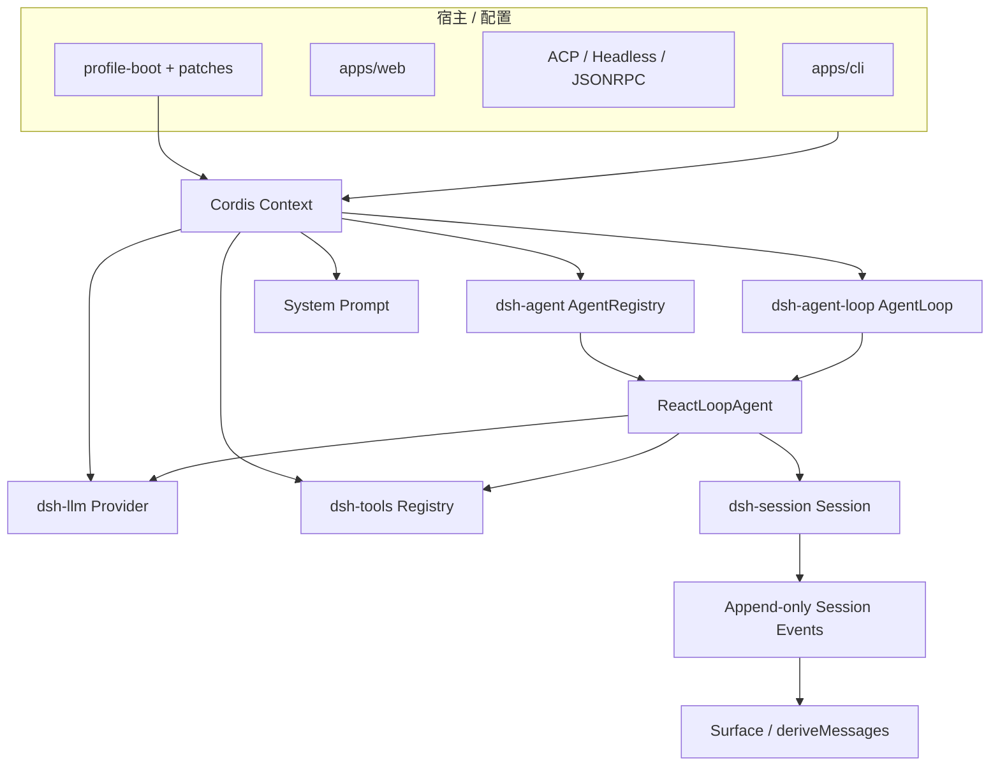
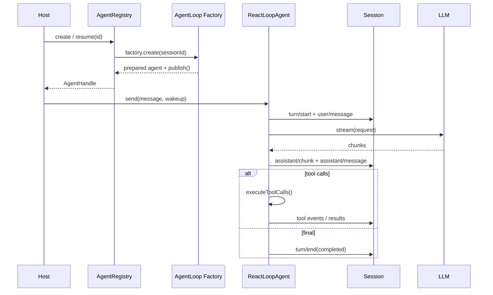

# DeepSeek Harness 架构总览

## 一句话结论

DeepSeek Harness 是一个以 Cordis 服务容器和持久会话日志为中心的 TypeScript 线束（Harness）。CLI 只是宿主之一：`dsh-agent` 定义 Agent 身份和生命周期，`dsh-agent-loop` 提供 ReactLoop 驱动，`dsh-session` 把消息、chunk 和工具结果追加成可重放事件，再派生界面与模型请求投影。

## 定位与部署形态

仓库采用 workspace monorepo：

- **应用宿主**：`apps/cli` 是主要交互入口；`apps/web` 提供浏览器端形态。
- **示例协议**：`examples/acp-agent`、`headless-agent`、`jsonrpc-agent` 展示同一核心可以接入不同传输边界。
- **核心包**：`packages/core/agent`、`agent-loop`、`session` 分别负责身份注册、循环驱动和持久事实。
- **能力包**：LLM、tools、context、fs、host/apiproxy 等包按能力拆分，通过依赖注入进入运行时。
- **原生与 SDK**：`native/landlock-run` 和 `python/sdk-runtime` 表明隔离与外部运行时不是单一语言实现。

CLI 通过 `profile-boot.ts` 装载配置：读取 `$DSH_HOME`、安装锚点和 profile 目录，组合 bundle、用户 patch、overlay 和 telemetry patch，再交给 Cordis loader。因此 CLI 不硬编码全部服务，而由声明式配置决定挂载哪些能力。

## 架构分层

| 层 | 关键符号 | 职责 |
| --- | --- | --- |
| 宿主装配 | `apps/cli/src/profile-boot.ts`、Cordis loader | 解析 home、profile、bundle、patch 和 shutdown。 |
| 身份注册 | `packages/core/agent/src/index.ts:256` 的 `AgentRegistry` | 创建、查找、resume、fork 和销毁 Agent；维护 owner/dispose 语义。 |
| 循环驱动 | `packages/core/agent-loop/src/index.ts:296` 的 `AgentLoop` | 实现 `AgentFactory`，读取并行上限等配置，创建并发布 `ReactLoopAgent`。 |
| 执行循环 | `packages/core/agent-loop/src/agent.ts:64` 的 `ReactLoopAgent` | 管理 idle/running、Inbox、turn/step、流式请求、错误瀑布和取消。 |
| 会话事实 | `packages/core/session/src/index.ts:425` 的 `Session` | 追加事件、维护 seq、派生 surface 和消息投影。 |
| 存储 | `SessionStore` | 持久化 header 与事件日志，支持 create、restore、fork 和 resume。 |

## 核心类型

| 类型 | 锚点 | 设计意图 |
| --- | --- | --- |
| `AgentOptions` | `runtime-types.ts:24` | 绑定 provider route、model、maxTokens 等请求级配置。 |
| `AgentStatus` | `runtime-types.ts:50` | 只暴露 `idle` / `running`；disposal 不作为第三个可观察状态。 |
| `Agent` | `runtime-types.ts:64` | 公开 id、options、session、inbox、ctx、cancel、whenIdle、runMaintenance 和 send 边界。 |
| `AgentFactory` | `agent/src/index.ts:183` | 让 loop 包提供创建逻辑，消费方只依赖 `ctx.agents`，不直接依赖具体 loop 包。 |
| `ReactLoopAgent` | `agent-loop/src/agent.ts:64` | 把一个 session 绑定到 phase、scope、dispatcher 和 runtime projection。 |
| `SessionHeader` | `session/src/types.ts:61` | 存储版本、id、createdAt、cwd、fork parent、seedLength、subagent origin、delegation depth 和 agent preset。 |
| `SessionEvent` | `session/src/types.ts:408` | 带 seq 和类型的持久事件；是权威历史的最小单元。 |

## 调用链

1. **启动**：CLI 进入 `profile-boot`，准备 profile 和 patch 层，Cordis loader 挂载服务。
2. **注册**：`AgentLoop` 注入 `agents`、`sessions`、`llm`、`tools` 和 `systemPrompt`，实现 `AgentFactory` 并写入 `ctx.agentLoop`。
3. **创建或 resume**：调用方通过 `AgentRegistry` 提供目标 session id；factory 创建 detached Session、等待 setup、提交 commit、插入 registry、按序发布通知，最后启动 loop。
4. **输入**：前端调用 `send`、`followup` 或 `steer`。消息先进入 Inbox：follow-up 排下一回合，steer/inject 可排下一步。
5. **驱动**：`wakeDriver` 建立 running phase 和 AbortController，`kick()` 反复执行 `turn()` 直到队列无 pending。
6. **Step**：每个 step 从 `deriveMessages()` 组装请求，流式接收 chunk 并逐个 append；完成后形成 assistant message。
7. **分支**：没有 tool call 则本 step completed；有 tool call 则交给 `executeToolCalls`，其结果上下文进入 next-step inbox，继续下一步。
8. **退出**：Turn 写入 `turn/end`；取消、错误、max-tokens 或 blocked 都保留结构化原因，随后回到 idle 或继续 pending 工作。

## 状态与持久化

DeepSeek Harness 采用事件溯源风格。`Session.append` 是写入口：assistant chunk、完整消息、用户消息、turn/step 边界、tool call 和结果都成为带单调 `seq` 的权威事件。`SessionHeader` 保存在日志外，记录格式版本、cwd、fork lineage、seed length、delegation depth 和 agent preset；resume 后仍可判断历史来源、递归预算和可用工具组合。

`deriveMessages()` 从事件派生下一次模型请求的消息投影；surface 则为 UI 提供另一层视图。这样“模型可见历史”和“界面显示”都可以重建，而权威数据仍是事件序列。存储路径、锁策略、损坏修复和 surface 全量规则属于批量 Implementation Review。

## 工具链路

`executeToolCalls` 按模型顺序调度一批 calls。每个 call 先构造 `ToolExecutionInput`，包含 callId、name、arguments、agent 和 abort signal。调度器按 `ctx.tools.executionMode` 分组：

- **exclusive**：形成 barrier，保持严格顺序。
- **parallel**：使用 rolling pool，默认上限来自 `DEFAULT_MAX_PARALLEL_TOOL_CALLS = 10`，可通过 `maxParallelToolCalls` 配置。

Dispatch 可以并发，但 policy、result 和 result context 最终按模型顺序提交。Abort 时已开始的调用会被 drain，未开始调用补写 synthetic error result，保证重放有效；内部 scheduler failure 不伪造结果。具体权限、沙箱和工具包装在 F-D3 展开。

## 扩展点

| 扩展点 | 入口 | 说明 |
| --- | --- | --- |
| Profile / Patch | `cordis.yml`、bundle、home patch、overlay | 无需改源码即可替换或禁用服务行。 |
| Agent Preset | Session header 的 `agentPreset` | 决定 prompt 和工具组合；resume 时防止错配。 |
| Model | `ctx.llm` provider route | Agent options 选择 provider/model，adapter defaults 可删除不支持字段。 |
| Tools | `ctx.tools` | 注册执行模式、审批、沙箱和结果转换。 |
| Context | agent-scoped `Context` | Agent 本地贡献在 dispose 时回退，之后拒绝注册。 |
| 事件消费者 | `agent/*`、`session/*` dispatch | UI、遥测和协议桥按事件集成。 |

## 设计取舍

- **优点**：核心与宿主解耦，CLI、Web、ACP 和 headless 复用同一 Agent/Session 契约；事件溯源天然支持审计、fork、resume 和多投影；工具并发有明确 barrier 和有序提交。
- **代价**：Cordis、patch 和多包边界提高入门成本；事件粒度细，存储和索引需要认真治理；跨包契约演进必须同时兼顾兼容与迁移。
- **适用判断**：适合需要协议桥、可审计长会话和声明式部署的服务化 Harness。若只需单文件本地工具，包边界和服务容器可能过重。

## 自检问题

1. 为什么 `AgentFactory` 放在 dsh-agent 接口上，而不是让消费方导入 AgentLoop？
2. `SessionHeader.seedLength` 如何区分父历史和子任务工作？
3. 工具 parallel pool 为什么还要按模型顺序提交结果？
4. Resume 时 agentPreset 变化会带来什么风险？

## 相关页面

- [教材目录](../../TOC.md)
- [一次 Agent Run 的完整生命周期](../../01-core-concepts/agent-run-lifecycle.md)
- [Persistence](../../02-harness-mechanics/persistence.md)
- [术语表](../../09-glossary/glossary.md)
