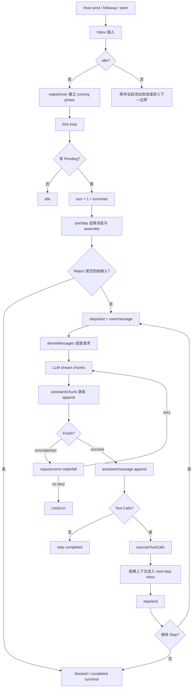

# DeepSeek Harness Run 生命周期

## 一句话结论

DeepSeek Harness 用 `ReactLoopAgent` 把一个 Session 驱动成 Inbox → Turn → Step → 模型流 → 工具 → 下一步的状态机。每个 chunk 都先成为持久事件；只有流结束后才形成完整 assistant message。Turn 有明确开始/结束事件，错误、取消和 max-tokens 也保留结构化原因，中断后可按日志重建进度。

## 定位与边界

| 边界 | 实现 | 说明 |
| --- | --- | --- |
| Agent 活动 | `AgentStatus`、phase | `idle` 表示无 driver；`running` 从唤醒输入进入可取消预处理开始，直到 drain、关闭或 checkpoint。 |
| 用户 Turn | `turn/start` / `turn/end` | 一个 Turn 可包含多个 Step；follow-up 会开启下一 Turn。 |
| 模型请求 / Step | `step/start` / `step/end` | 一次 PromptAssembly 到模型流结束；可能产生文本、tool calls 或 max-tokens。 |
| 中途输入 | `send`、`steer`、`inject` | follow-up 排 `next-turn`，steer/inject 排 `next-step`，是否唤醒由调用方决定。 |
| 维护任务 | `runMaintenance` | 只能在真实 idle phase 启动；后续唤醒输入留在 Inbox。 |

## 生命周期图

## 核心状态

ReactLoopAgent 构造时绑定 session、options、scope、dispatcher、Inbox 和 runtime context。它从 Session 日志中查找最后一个 `turn/start` 来初始化 `lastTurn`，因此 resume 后不会重复编号。

Phase 是内部状态机：

- **idle**：保留 `lastTurn`，可接受维护任务或唤醒。
- **running**：携带 AbortController、当前 `turn`、当前 `step` 和 wake 标记。
- **maintenance**：可取消的独立任务；公共 status 仍显示 idle。

`setPhase` 在外部可见状态变化时发布 `agent/status`。取消时若未设置 `keepInbox`，先清空队列，再中止当前活动；取消后提交的 waking input 会归入下一回合。

## Turn 循环

`kick()` 反复调用私有 `turn()`。每次 Turn 先写 `turn/start`，然后循环执行 Step：

1. **preStep**：根据目标边界从 Inbox 选择消息并决定是否进入。拒绝时以 blocked 结束；初始边界没有消息则以 completed 结束，不浪费模型请求。
2. **写入用户消息**：通过 preStep 的消息逐条 append。
3. **Step 执行**：进入 `step()` 并在 finally 写入 `step/end`。
4. **粘性 max-tokens**：一旦某步达到 token 上限，后续即使正常完成也不能把本回合终态降级为 completed。
5. **停止检查**：已有终态且 `next-step` inbox 为空时触发 `agent/turn-stopping`，随后写 `turn/end`。
6. **续跑判断**：仍有 pending 时更换 AbortController、清空 step 计数并返回 true，让 kick 打开下一个 Turn。

异常路径同样结构化：abort 时终态为 `aborted`；普通错误被包成 `LlmError` 或带 `UNKNOWN` code 的错误链，先发布 `agent/error`，再在 finally 写入 `turn/end`。

## Step 与流式提交

`step(assembly)` 渲染 system prompt 后进入请求准备循环：

1. `buildRequest` 使用 `session.deriveMessages()` 作为消息边界，冻结 provider route、model、effort 和 max tokens。
2. `BlockAssembler` 接收流式 chunk；每收到一个 chunk 就向 Session append `assistant/chunk`，并记录 source event seqs。
3. 流正常结束后生成完整 assistant message，再 append `assistant/message`，并把 usage 一并记录。
4. 若 finish 为 error 或 aborted，进入 `agent/request-error` waterfall。监听器可返回 `{ kind: 'retry' }`；否则抛出 `LlmError`。
5. 如果 abort 时已经有部分 blocks，会追加一条 `interrupted: true` 的 assistant message，保留稳定前缀和已估算 usage。
6. 没有 tool call 返回 completed；有 tool call 则执行后根据 `concluded` 决定是否继续下一步。

这种设计把界面可见增量和可重放事实统一在事件日志中：chunk 不是临时 UI 缓存，而是完整消息的来源证据。

## 工具分支与取消

`executeToolCalls` 收到 assistant message 中的 tool-call blocks。它按 execution mode 分组：exclusive 形成屏障，parallel 使用 rolling pool；dispatch 可并发，最终结果仍按模型顺序提交。结果上下文通过 acceptor 插入 next-step inbox，供下一步组装使用。

Abort 时调度器停止补充新任务、drain 已开始任务，并为未开始调用补写 skipped/error 结果。这样重放时不会出现悬空的 tool call。内部 scheduler failure 不伪造结果，而是保留已记录的 tool call 并向上抛出首个失败。

## 状态持久化与扩展点

生命周期所有关键事实都落在 Session：`user/message`、assistant chunks、完整消息、usage、`turn/*`、`step/*` 和工具结果。UI、遥测和协议桥消费 dispatcher 事件，但不拥有权威历史。扩展可在 request-error waterfall 注入重试策略，在 agent-scoped Context 注册能力，或在 Inbox 边界注入 steer/inject。

## 设计取舍

- **优点**：Turn/Step 编号连续，chunk 级溯源完整；取消、错误、max-tokens 都有稳定原因；Inbox 区分 follow-up 与中途引导。
- **代价**：事件数量多，存储和投影必须高效；phase 与 Inbox 规则较细，宿主需要正确区分 wakeup、inject 和 cancel。
- **适用判断**：适合需要长会话审计、协议桥接和精细中断语义的服务化 Harness；轻量 CLI 可以简化为单层循环。

## 自检问题

1. `followup()` 和 `steer()` 分别插入哪个 Inbox 边界？
2. 为什么 assistant chunk 也要持久化？
3. max-tokens 为什么必须在 Turn 内保持 sticky？
4. 取消时哪些 tool call 需要补写 synthetic result？

## 相关页面

- [教材目录](../../TOC.md)
- [DeepSeek Harness 架构总览](./overview.md)
- [Timeout 与取消](../../02-harness-mechanics/timeout-cancellation.md)
- [术语表](../../09-glossary/glossary.md)
