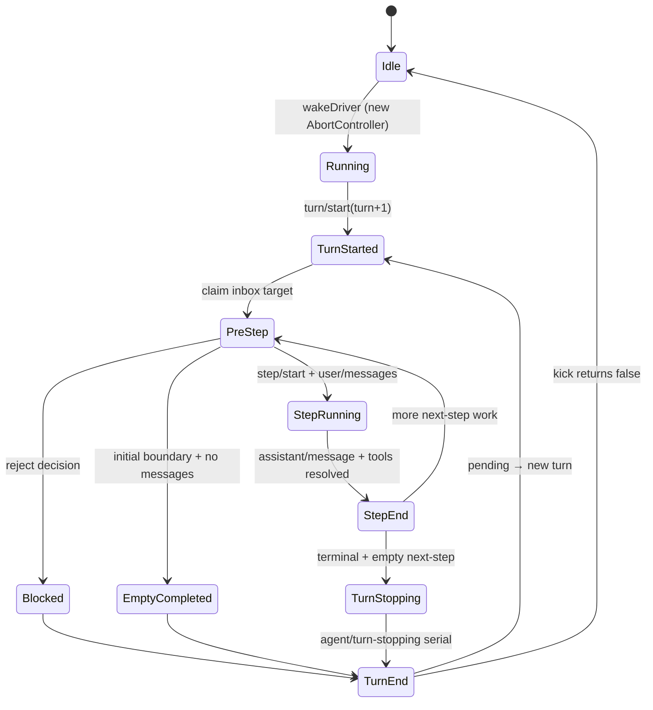
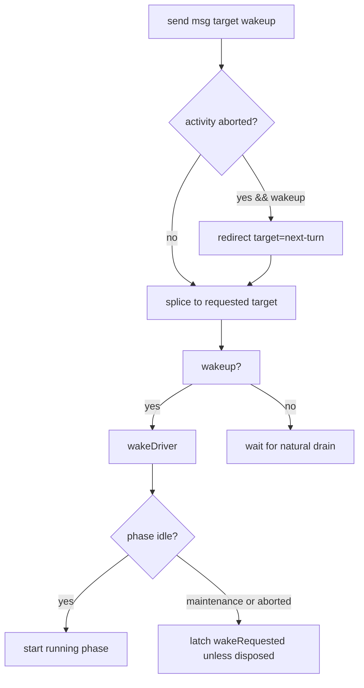

# DeepSeek Harness Run 生命周期

## 一句话结论

ReactLoopAgent 是一个以“持久边界 + 粘性终态”为核心的状态机：Inbox 输入唤醒 driver，turn() 写入 turn/start 后循环 preStep、user/message、step；任何一步触顶 max-tokens 后，本回合一律不得降级为 completed；abort/error 也都映射成结构化 turn/end reason。chunk 在流式过程中逐条 append 成事件，完整 message 只是它们的聚合投影——中断后稳定前缀天然可重放。

## 上一章遗留问题

F-D1 给出了组件地图。F-D2 回答：phase 与 Inbox 如何配合？为什么 max-tokens 必须 sticky？取消后新输入去哪？错误如何既上报又不丢事实？

## 本章解决什么矛盾

简单 while 循环无法回答四个问题：中途输入属于本步还是下回合？部分输出算不算完成？取消后队列里的工作去哪？多个失败叠加时终态是什么？DeepSeek Harness 的答案是把这些问题编码为状态机规则：

1. **边界规则**：follow-up 排 next-turn，steer/inject 排 next-step；
2. **粘性规则**：max-tokens 一旦出现就是本回合终态；
3. **重定向规则**：aborted 活动上的 waking input 自动归 next-turn；
4. **合成规则**：每种异常都有唯一 turnEnds reason。

## 核心不变量

1. **每回合必有 start/end**：即使空输入也写 completed 的 turn/end，不浪费模型请求但保留边界。
2. **终态粘性**：turnEnds.kind === 'max-tokens' 后，后续正常完成的 step 不能改写终态。
3. **chunk 先落盘**：流式过程中每个 chunk 都 append 为事件；message 聚合它们并携带 sourceEventSeqs。
4. **取消重定向**：aborted 活动上提交的 waking input 归入 next-turn，且在 splice 前捕获判定，防 reentrant cancel 改分类。
5. **结构化错误**：LlmError 保留 failure facts；其他错误 flatten 为 errorChain 文本加 UNKNOWN code。
6. **turn/end 必达**：finally 中写入；即使 append 本身抛错也要先尝试。

失效边界在于 signal.reason 的类型：若调用方传入非 AgentCancelCause 的 reason，审计只能拿到原始值。宿主应约束 cause 词表。

## 理想状态图



| Phase 字段 | 含义 |
| --- | --- |
| idle | 保留 lastTurn；可接受 maintenance 或 wake |
| running | AbortController + 当前 turn/step + wakeRequested |
| maintenance | 可取消任务；公共 status 保持 idle |



## 初学者主线

把 ReactLoopAgent 当流水线工头：

1. 工单进料口分两条线：整件新活排下一回合（next-turn），加急补充排当前工序后（next-step）；
2. 开工先打卡（turn/start），收工再打一次（turn/end）；
3. 每道工序独立记录（step/start、step/end）；
4. 材料截断过一次，这单就不能标记完美交付（sticky max-tokens）；
5. 被叫停时手头半成品封存（interrupted message），门口新来的活转下一班（waking-after-abort）。

### send 的重定向细节

send() 在 splice 之前捕获 wakingAfterAbort = wakeup 且 phase 非 idle 且 signal.aborted。注释解释了两点：Waking input cannot join an aborted activity, so it starts the next turn；Captured before the insertion so a reentrant cancel from a splice observer cannot reclassify it（`external/deepseek-harness/packages/core/agent-loop/src/agent.ts:113-118`）。也就是说，分类依据是插入瞬间的快照，而不是插入后可能被观察者改变的状态。

### wakeDriver 的 latch 规则

非 idle 时收到 wake 不是丢弃：

1. maintenance 或 aborted 驱动：latch wakeRequested = true，收敛后重放；
2. disposed 驱动：不 latch，teardown 不等待模型轮；
3. live running：自己认领排队工作。

这保证维护任务期间到达的新输入不会丢，也不会打断正在收尾的活动。

## 机制深拆

### 1. turn() 的骨架与粘性实现

turn() 的关键序列（`external/deepseek-harness/packages/core/agent-loop/src/agent.ts:245-301`）：

```text
append turn/start {turn}
loop:
  step = phase.step + 1
  preStep(target) -> reject 即 blocked / return false
  turnEnds 且 messages.length===0 即 break
  phase.step===0 且空 即 completed / break
  append step/start
  append user/message*
  stepEnd = step(assembly)
  若 turnEnds?.kind !== 'max-tokens' 则 turnEnds = stepEnd   # 粘性
  finally: append step/end
  turnEnds 且 next-step 空 即 dispatch.serial('agent/turn-stopping')
  同条件 break
  target = 'next-step'
catch aborted: turnEnds={aborted,reason}; rethrow
catch other: turnEnds={error, LlmError.failure | UNKNOWN errorChain}; throwError
finally: append turn/end {turn, reason: turnEnds!}
```

两个注释值得背下来：

- A removed waking message or an enter decision rewritten to empty still owns the initial turn boundary, but it spends no model call——空回合也有边界；
- max-tokens is sticky: once any step hits the ceiling, later steps that complete normally must not downgrade the turn outcome（`external/deepseek-harness/packages/core/agent-loop/src/agent.ts:285-290`）。

### 2. preStep：claim、assembly 与瀑布

preStep 先 claim inbox 目标，然后 systemPrompt.assemble(assembleContextFor(this, signal)) 组装 PromptAssembly；renderContextSections 得到动态上下文，经 runtimeContext.project 后作为可选 context message 加入 claimed messages；最后走 agent/pre-step waterfall，监听器可返回 reject 阻止进入或重写 messages（`external/deepseek-harness/packages/core/agent-loop/src/agent.ts:225-243`）。reject 映射为 blocked 终态——这是策略拒绝进入回合状态的出口。

### 3. step()：chunk 溯源与错误瀑布

buildRequest 用 session.deriveMessages() 冻结消息边界并记录 request header/context 变化（`external/deepseek-harness/packages/core/agent-loop/src/agent.ts:339-341,477-512`）。流式循环中每个 chunk 都 append 为 assistant/chunk 并收集 seq 到 chunkSeqs（`external/deepseek-harness/packages/core/agent-loop/src/agent.ts:348-352`）。

正常结束：assembler.finish 后生成完整 message，append 时带 surfaceOp append 与 sourceEventSeqs chunkSeqs（`external/deepseek-harness/packages/core/agent-loop/src/agent.ts:392-408`）。中断分支：若已有部分 blocks，append assistant/message 带 interrupted true 与同款 sourceEventSeqs（`external/deepseek-harness/packages/core/agent-loop/src/agent.ts:354-368`）。

finish 为 error 或 aborted 时进入 agent/request-error waterfall，携带 turn/step/provider/failure/retryPolicy/signal；只有 action.kind === 'retry' 才 continue，否则抛 LlmError（`external/deepseek-harness/packages/core/agent-loop/src/agent.ts:372-389`）。这使重试成为显式策略决定，而非循环默认。

### 4. 错误的结构化与必达终态

turn() 的 catch 分两路：

1. signal.aborted：turnEnds={kind:'aborted', reason:signal.reason}，rethrow 让上层收敛；
2. 其他错误：LlmError 保留 failure 对象，否则以 message 加 errorChain 文本和 UNKNOWN code 合成 failure；throwError 先 emit agent/error 再抛出。

finally 无条件尝试 append turn/end——注释用非空断言表达 every exit assigns a turn ending 这一不变量（`external/deepseek-harness/packages/core/agent-loop/src/agent.ts:302-320`）。

### 5. kick 收敛与 wake 重放

kick 循环反复执行 turn()；结束的 finally 中若仍 running 则 setPhase 回 idle，并检查 wakeRequested 与 inbox.hasPending 决定是否再次 wakeDriver（`external/deepseek-harness/packages/core/agent-loop/src/agent.ts:210-222`）。这与 wakeDriver 的 latch 配合，保证维护或中止期间到达的工作在收敛后被处理，而不是丢失或立即打断。

## 反例与故障模式

1. **空输入不开回合**
   - 触发：宿主判断无消息就不调 turn。
   - 因果：turn 编号跳变，审计无法区分没发生与发生了但为空。
   - 正确边界：initial boundary 空消息也写 completed turn/end。
2. **max-tokens 被后续步骤覆盖**
   - 触发：直接无条件赋值 turnEnds = stepEnd。
   - 因果：截断后的成功步骤让 UI 显示 completed，用户以为答案完整。
   - 正确边界：仅当当前终态不是 max-tokens 时才更新。
3. **step/end 缺失**
   - 触发：异常路径忘记 finally。
   - 因果：日志出现悬空 step/start，恢复器无法配对。
   - 正确边界：finally 无条件 append step/end。
4. **chunk 不落盘**
   - 触发：只在内存 assembler 累积。
   - 因果：崩溃后无法证明哪些增量曾到达，也无法精确复原 UI。
   - 正确边界：chunk 即事件，message 聚合并引用 seqs。
5. **aborted 活动接收 waking input**
   - 触发：cancel 后立刻 send(wakeup) 且目标仍是 next-step。
   - 因果：新消息加入已死活动的队列，永不执行或被误清。
   - 正确边界：wakingAfterAbort 重定向 next-turn。
6. **retry 由循环默认开启**
   - 触发：request-error 未注册监听器却自动重试。
   - 因果：费用失控且策略不可审计。
   - 正确边界：action 不是 retry 即抛错。
7. **错误吞掉事实**
   - 触发：catch 里只 log 不设 turnEnds。
   - 因果：turn/end 缺失或 reason 为 null，恢复器无从分类。
   - 正确边界：两路 catch 都赋结构化 turnEnds。
8. **maintenance 期间强插 turn**
   - 触发：绕过 runMaintenance 直接驱动。
   - 因果：公共 status 与真实活动不一致，whenIdle 失义。
   - 正确边界：maintenance 占用 true idle phase，唤醒只 latch。

## 一条完整因果链

用户发送长代码评审任务，随后在中途追加补充说明：

1. 初始 prompt 经 send(next-turn, wakeup) 进入 Inbox；wakeDriver 建立 running phase。
2. turn() 写入 turn/start；preStep claim 并通过 pre-step 瀑布；user/message append；step/start 落盘。
3. 流式过程中 12 个 chunk 逐条 append，BlockAssembler 组装出含 tool call 的 message；sourceEventSeqs 记录全部 chunk seqs。
4. executeToolCalls 返回结果上下文并 splice 进 next-step inbox；step/end 落盘。
5. 用户追加补充说明，send 以 steer 目标排入 next-step——它将在下一步 user/message 前被 preStep 取出，成为同一回合内的新输入。
6. 下一步模型因长度触发 max-tokens：turnEnds={kind:'max-tokens'}。此后即使某步正常完成，粘性检查阻止降级。
7. next-step 清空后触发 agent/turn-stopping 串行瀑布（外部可做最后清理）；break 出循环。
8. finally append turn/end，reason=max-tokens。重启后审计可精确回答：这一回合为何结束、哪些 chunk 组成了哪条消息、补充说明在哪一步生效。

## 设计取舍

| 方案 | 收益 | 代价 | 适用 |
| --- | --- | --- | --- |
| chunk 持久化 + sourceEventSeqs | 完整溯源、UI 精确复原 | 存储放大 | 服务化长会话 |
| 只存最终 message | 存储小 | 丢失流式证据 | 极简 CLI |
| 单层循环无 turn 边界 | 实现简单 | 无法回答这轮为何结束 | 原型 |
| turn/step 双边界 + 粘性终态 | 语义精确 | 状态字段多 | 生产 |
| request-error 显式 retry | 策略可控 | 宿主必须注册策略 | 企业部署 |
| 默认自动重试 | 开箱即用 | 不可审计、易失控 | 本地玩具 |
| abort 重定向 next-turn | 语义清晰 | 分类需小心竞态 | 有 inbox 抽象的系统 |
| maintenance 占用 idle | 公共状态诚实 | 需要 latch 机制 | 有后台任务的运行时 |

迁移启示：给现有循环补生命周期的顺序建议是先加 turn/start-end 边界，再加结构化 turnEnds，然后引入 chunk 事件，最后做 inbox 分区与粘性规则。反过来做会在没有事实基础时引入复杂状态。

## 框架实现对照

| 理想概念 | 实现 | 关键锚点 |
| --- | --- | --- |
| phase/status | setPhase 仅在状态变化时发 agent/status | `packages/core/agent-loop/src/agent.ts:104-111` |
| send 重定向 | wakingAfterAbort 快照判定于 splice 前 | `packages/core/agent-loop/src/agent.ts:113-119` |
| wake latch | maintenance/aborted latch，disposed 不 latch | `packages/core/agent-loop/src/agent.ts:172-181` |
| driver 启动 | 新 AbortController 加 withInitiator(kick) | `packages/core/agent-loop/src/agent.ts:182-192,210-222` |
| turn 边界 | turn/start 到 finally turn/end | `packages/core/agent-loop/src/agent.ts:245-258,316-320` |
| 粘性 max-tokens | 条件赋值 turnEnds | `packages/core/agent-loop/src/agent.ts:285-290` |
| turn-stopping | terminal 且空 next-step 时 serial dispatch | `packages/core/agent-loop/src/agent.ts:294-299` |
| 结构化错误 | aborted reason、LlmError、UNKNOWN chain | `packages/core/agent-loop/src/agent.ts:302-315` |
| preStep | assemble、project、waterfall | `packages/core/agent-loop/src/agent.ts:225-243` |
| buildRequest | deriveMessages 加 header/context 记录 | `packages/core/agent-loop/src/agent.ts:332-341,477-512` |
| chunk/message 提交 | chunkSeqs 收集加 sourceEventSeqs | `packages/core/agent-loop/src/agent.ts:343-368,400-408` |
| 错误重试门 | request-error waterfall，非 retry 即 LlmError | `packages/core/agent-loop/src/agent.ts:372-389` |

## 实现精妙之处

1. **wakingAfterAbort 在 splice 前捕获**：把分类时点显式化，杜绝观察者副作用改变路由。
2. **disposed 不 latch**：teardown 语义优先于工作保存，避免关闭进程被模型轮拖住。
3. **空回合也写 completed 边界**：用一条廉价事件换取编号连续性与审计完整性。
4. **粘性终态的条件赋值**：一行条件承载了部分失败不可被后续成功洗白的产品语义。
5. **turn-stopping 作为串行瀑布**：终态前给扩展最后一次同步清理机会，且不被并发监听器乱序。
6. **LlmError 与 UNKNOWN 二分**：已知错误保留结构，未知错误至少有稳定 code 和链式文本。
7. **interrupted message 带 usage**：中断前缀不仅可见，还携带已估算用量供计费对账。

## 自检与面试追问

1. 为什么 turnEnds 的更新要用条件而非直接覆盖？举一个会被覆盖破坏的用户场景。
2. 如果 preStep 的 waterfall 抛异常而非返回 reject，终态是什么？这个行为合理吗？
3. 设计测试矩阵验证 send() 的组合：idle 或 running、wakeup 真假、aborted 前后。
4. chunk 事件包含敏感正文时，如何在保留 sourceEventSeqs 溯源能力的同时脱敏存储？
5. turn-stopping 瀑布中的监听器抛错会发生什么？turn/end 还能保证吗？
6. 对照你自己的循环：哪一类终态目前是隐式的？补齐它的最小改动是什么？

## 交给下一章的问题

本章把输入到模型到工具到终态的状态机钉进了持久边界。F-D3《DeepSeek Harness 工具与沙箱》将深入 executeToolCalls 的调度细节：exclusive 屏障、parallel rolling pool、审批 ask 与 sandbox confine 如何协作。

## 相关页面

- [教材目录](../../TOC.md)
- [DeepSeek Harness 架构总览](./overview.md)
- [Timeout 与取消](../../02-harness-mechanics/timeout-cancellation.md)
- [Retry 与幂等](../../02-harness-mechanics/retry-idempotency.md)
- [术语表](../../09-glossary/glossary.md)
