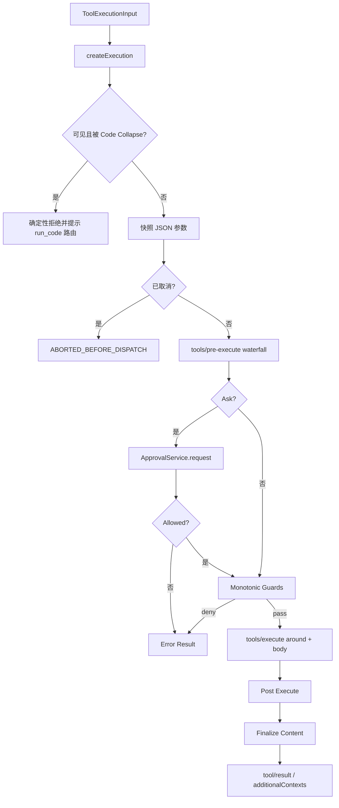

# DeepSeek Harness 工具与沙箱

## 一句话结论

DeepSeek Harness 把工具执行组织成创建上下文 → pre-execute 策略 → approval ask → monotonic guard → around/body → post-execute → 结果规范化的管线。调度器只把 `isConcurrencySafe === true` 的调用放进并行池；任何分类失败都退回 exclusive。审批依赖可注入的 approval 服务，缺失或不可用时失败关闭；Linux 命令可通过 landlock-run 在允许清单内执行。

## 定位与核心类型

`@deepseek-ai/dsh-tools` 是 Cordis Service，同时承担注册表、模型投影和执行管线。工具通过 `defineTool` 声明名称、描述、参数 Schema、execute body、展示视图和可选能力：

| 能力 / 字段 | 用途 |
| --- | --- |
| `parameters` | JSON Schema；注册前要求 lossless JSON，执行前校验参数。 |
| `isConcurrencySafe(args)` | 只有精确返回 `true` 才能进入 parallel；未知、隐藏、无效或抛错一律 exclusive。 |
| `presentCall` / `presentResult` | 为 UI 声明 diff、terminal、search、read、web 等视图。 |
| `finalizeContent` | 定义拥有最终内容规范化回调。 |
| scope 层 | global 与 agent scope 分层注册，支持 restrict allow/deny。 |
| guards | 在 pre-execute 后做单调拒绝；任何 guard 可拒绝，但没有 guard 能强制放行。 |

Registry 还支持 Code Mode。非 native 模式下模型直接调用 `run_code`，程序内部再桥接 SDK 声明的工具；每个子调用记录 `tool/code-dispatch-start` 和 `tool/code-dispatch`，但派生模型消息时不让子调用重新进入上下文。

## 工具链路图



## 执行管线

### 准备阶段

`createExecution` 先区分三类情况：真正未知工具走 dispatch-stage `UNKNOWN_TOOL`；可见但被 Code collapse 的调用在策略前确定性拒绝；正常调用则快照参数并冻结 execution context。参数必须可无损序列化为 JSON，避免后续日志与重放失真。

随后运行 `tools/pre-execute` waterfall，监听器可以放行、拒绝或返回 ask。ask 交给 `serviceAsk`：

- `allowed-once` 放行。
- `rejected` 返回用户拒绝原因。
- `cancelled` 返回取消并标记 approvalCancelled。
- `unavailable` 或没有 approval service 时失败关闭。
- 没有 agent 可路由时也拒绝，而不是静默放行。

pre-execute 后执行单调 guard。guard 只能追加拒绝理由，不能覆盖其他层级的 deny；这保证多个安全扩展组合时不会互相解锁。

### 调度模式

`executionMode(exec)` 只认精确 `true`：

```text
isConcurrencySafe(args) === true -> parallel
unknown / hidden / invalid / throw -> exclusive
```

Agent loop 先按第一个 call 分类；parallel 组使用 rolling pool，默认上限为 10。后续 call 在启动前重新分类，若变成 exclusive 就等待当前池 drain。Dispatch 可以重叠，但 policy、result 和 result context 最终按模型顺序提交。

### Body 与结果

`tools/execute` waterfall 可以包装 body；Registry 会融合 caller signal 与 wrapper signal，取消不会放弃已经开始的 promise，而是等它静止后标记 `ABORTED`。工具是否真正启动决定结果是 `aborted` 还是 `aborted-before-dispatch`。

成功结果经过 post-execute：监听器可 accept 并替换 content，也可 block 并给出 corrective feedback；两者都可附加上下文。最后应用定义级 finalizer、物化内容并发布结果。所有错误也转成带 `isError` 的结构化结果，供 Session、UI 和下一轮模型消费。

## 沙箱边界

Shell 工具按平台选择后端。Linux 使用 `landlock-run`：一个先用 Landlock 规则集限制自身、再 `exec` 目标命令的静态启动器。规则跨 `execve` 继承，因此子进程也被约束。它的 API 很小：

| API | 语义 |
| --- | --- |
| `launcherPath()` | 解析平台包中的启动器路径。 |
| `probe()` | 功能性探测，返回 `full`、`partial` 或 `unusable`。 |
| `grantArgs({ readOnly, readWrite })` | 生成允许清单参数；未授予路径默认拒绝。 |
| exit `125` | 启动器失败的约定信号；消费方必须结合致命诊断判断，不能只看退出码。 |

该设计是失败闭合：内核无法强制执行时不运行命令。macOS、Windows 或不支持 Landlock 的内核使用各自后端；具体 shell escalation、persistent shell 状态和 sandbox denial 渲染保留给统一审查。文件工具则依赖 workspace root 和路径校验；跨包行为属于待审范围。

## 扩展点与设计取舍

| 扩展点 | 说明 |
| --- | --- |
| `tools/pre-execute` | 自定义策略、动态分类、风险评分或 ask。 |
| `tools.guard()` | 全局或 agent scope 的单调拒绝。 |
| `tools/execute` | 包装真实 body，替换 signal 或注入环境。 |
| `tools/post-execute` | 阻断危险输出、补充上下文或规范化结果。 |
| ApprovalService | 由宿主提供 CLI/API/UI 审批通道。 |
| Code Runtime | 提供 TypeScript 或 Python bridge，把多工具编排折叠进一个模型调用。 |

优点是治理点清晰：策略、审批、guard、body 和后处理分离；Code Mode 降低多次往返成本；Landlock 提供内核级文件系统兜底。代价是概念层次多，宿主必须正确提供 approval、sandbox 和 code runtime；Code collapse 还会改变模型的直接工具面，调试时要同时看父调用与子 dispatch。

## 自检问题

1. 为什么 Code collapse 的调用必须在 approval 和 guard 前确定性拒绝？
2. `isConcurrencySafe` 抛错时应并行还是串行？为什么？
3. ApprovalService 缺失时的安全默认是什么？
4. Landlock 启动器为什么不能只靠退出码 125 判断自身失败？

## 相关页面

- [教材目录](../../TOC.md)
- [DeepSeek Harness Run 生命周期](./run-lifecycle.md)
- [Sandbox 与权限](../../02-harness-mechanics/sandbox.md)
- [术语表](../../09-glossary/glossary.md)
